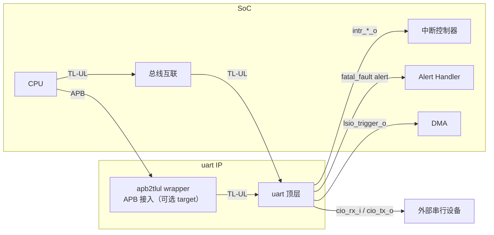

# HLD 总体架构设计 - UART

## 4. 总体架构设计

### 4.1 系统上下文 / System Context



### 4.2 顶层框图 / Top-level Block Diagram

```mermaid
graph TB
    subgraph uart [uart (TL-UL 顶层)]
        REG[uart_reg_top]
        CORE[uart_core]
        TX[uart_tx]
        RX[uart_rx]
        ALERT[prim_alert_sender]
    end
    TL[TL-UL 主机] --> REG
    REG -->|reg2hw/hw2reg| CORE
    CORE --> TX
    CORE --> RX
    CORE -->|intr_*_o| IRQ[中断]
    REG -->|intg_err| ALERT
```

### 4.3 模块划分 / Module Decomposition

HLD 层定义一级模块（L1）。每个子模块独立为 L1 模块，层级关系见 parent 说明。

#### uart_top 顶层模块

<!-- HLD_META
# === 模块定义 ===
id: HLD.MOD.L1.UART.TOP
name: uart_top
level: 1
parent_id: null
responsibility: 顶层集成：实例化寄存器堆、核心逻辑、alert 发送器，连接 TL-UL 总线、中断、串行 IO、alert 与 RACL 接口

# === 域定义 ===
clock_domain: CLK_SYS
reset_domain: RST_SYS_N
power_domain: PD_ALWAYS_ON

# === 接口定义 ===
interfaces:
  - name: tlul_if
    type: input
    width: N
    description: TL-UL 从接口（tl_i/tl_o）
    source: bus_interconnect
  - name: serial_if
    type: bidirectional
    width: 1
    description: 串行收发（cio_rx_i/cio_tx_o/cio_tx_en_o）
  - name: irq_if
    type: output
    width: 9
    description: 9 个中断输出
    target: interrupt_controller
  - name: alert_if
    type: output
    width: 1
    description: fatal_fault alert（prim_alert 接口）
    target: alert_handler
  - name: lsio_if
    type: output
    width: 1
    description: lsio_trigger DMA 触发
    target: dma

# === 追溯定义 ===
req_ref:
  - LRS.INTF.UART.01.001
  - LRS.INTF.UART.01.002
  - LRS.INTF.UART.01.004
  - LRS.INTF.UART.01.005
  - LRS.INTF.UART.01.006
  - LRS.INTF.UART.01.007
  - LRS.INTF.UART.01.008
  - LRS.CONS.UART.01.001
  - LRS.CONS.UART.01.005
  - LRS.CONS.UART.01.006
END_HLD_META -->

#### uart_reg_top 寄存器堆模块

<!-- HLD_META
# === 模块定义 ===
id: HLD.MOD.L1.UART.REG_TOP
name: uart_reg_top
level: 1
parent_id: HLD.MOD.L1.UART.TOP
responsibility: 寄存器堆：TL-UL 从接口译码、14 个寄存器、中断逻辑、BUS.INTEGRITY 检测、reg2hw/hw2reg 接口

# === 域定义 ===
clock_domain: CLK_SYS
reset_domain: RST_SYS_N
power_domain: PD_ALWAYS_ON

# === 接口定义 ===
interfaces:
  - name: tlul_slv
    type: input
    width: N
    description: TL-UL 从接口
    source: bus_interconnect
  - name: reg2hw
    type: output
    width: N
    description: 寄存器到硬件接口（reg2hw）
    target: HLD.MOD.L1.UART.CORE
  - name: hw2reg
    type: input
    width: N
    description: 硬件到寄存器接口（hw2reg）
    source: HLD.MOD.L1.UART.CORE

# === 追溯定义 ===
req_ref:
  - LRS.REG.UART.01.001
  - LRS.REG.UART.01.002
  - LRS.REG.UART.01.003
  - LRS.REG.UART.01.004
  - LRS.REG.UART.01.005
  - LRS.REG.UART.01.006
  - LRS.REG.UART.01.007
  - LRS.FUNC.UART.01.013
  - LRS.SAFE.UART.01.001
  - LRS.SAFE.UART.01.002
END_HLD_META -->

#### uart_core 核心逻辑模块

<!-- HLD_META
# === 模块定义 ===
id: HLD.MOD.L1.UART.CORE
name: uart_core
level: 1
parent_id: HLD.MOD.L1.UART.TOP
responsibility: 核心逻辑：TX/RX FIFO 控制、波特率分频（NCO）、中断事件产生、回环/噪声滤波/中断检测/超时/覆盖控制

# === 域定义 ===
clock_domain: CLK_SYS
reset_domain: RST_SYS_N
power_domain: PD_ALWAYS_ON

# === 接口定义 ===
interfaces:
  - name: reg2hw
    type: input
    width: N
    description: 寄存器到硬件接口（reg2hw）
    source: HLD.MOD.L1.UART.REG_TOP
  - name: hw2reg
    type: output
    width: N
    description: 硬件到寄存器接口（hw2reg）
    target: HLD.MOD.L1.UART.REG_TOP
  - name: tx_if
    type: output
    width: 1
    description: 到 uart_tx 的发送控制
    target: HLD.MOD.L1.UART.TX
  - name: rx_if
    type: input
    width: 1
    description: 来自 uart_rx 的接收控制
    source: HLD.MOD.L1.UART.RX

# === 追溯定义 ===
req_ref:
  - LRS.FUNC.UART.01.001
  - LRS.FUNC.UART.01.002
  - LRS.FUNC.UART.01.003
  - LRS.FUNC.UART.01.004
  - LRS.FUNC.UART.01.005
  - LRS.FUNC.UART.01.006
  - LRS.FUNC.UART.01.007
  - LRS.FUNC.UART.01.008
  - LRS.FUNC.UART.01.009
  - LRS.FUNC.UART.01.010
  - LRS.FUNC.UART.01.011
  - LRS.FUNC.UART.01.012
  - LRS.FUNC.UART.01.014
  - LRS.FUNC.UART.01.015
  - LRS.PERF.UART.01.001
  - LRS.PERF.UART.01.002
  - LRS.PERF.UART.01.003
  - LRS.PERF.UART.01.004
  - LRS.CONS.UART.01.003
  - LRS.CONS.UART.01.004
END_HLD_META -->

#### uart_tx 发送模块

<!-- HLD_META
# === 模块定义 ===
id: HLD.MOD.L1.UART.TX
name: uart_tx
level: 1
parent_id: HLD.MOD.L1.UART.TOP
responsibility: 发送模块：按波特率从核心接收数据，逐位移位输出到 TX 引脚

# === 域定义 ===
clock_domain: CLK_SYS
reset_domain: RST_SYS_N
power_domain: PD_ALWAYS_ON

# === 接口定义 ===
interfaces:
  - name: tx_ctrl
    type: input
    width: N
    description: 来自 uart_core 的发送控制与数据
    source: HLD.MOD.L1.UART.CORE

# === 追溯定义 ===
req_ref:
  - LRS.FUNC.UART.01.003
END_HLD_META -->

#### uart_rx 接收模块

<!-- HLD_META
# === 模块定义 ===
id: HLD.MOD.L1.UART.RX
name: uart_rx
level: 1
parent_id: HLD.MOD.L1.UART.TOP
responsibility: 接收模块：16x 过采样、中点采样、帧/奇偶错误检测，输出接收数据

# === 域定义 ===
clock_domain: CLK_SYS
reset_domain: RST_SYS_N
power_domain: PD_ALWAYS_ON

# === 接口定义 ===
interfaces:
  - name: rx_ctrl
    type: output
    width: N
    description: 到 uart_core 的接收数据与控制
    target: HLD.MOD.L1.UART.CORE

# === 追溯定义 ===
req_ref:
  - LRS.FUNC.UART.01.004
  - LRS.FUNC.UART.01.005
END_HLD_META -->

#### apb2tlul APB 桥接模块

<!-- HLD_META
# === 模块定义 ===
id: HLD.MOD.L1.UART.APB2TLUL
name: apb2tlul
level: 1
parent_id: HLD.MOD.L1.UART.TOP
responsibility: APB4 从 → TL-UL 主机协议转换 wrapper（新增，不改核心），提供 APB 接入能力

# === 域定义 ===
clock_domain: CLK_SYS
reset_domain: RST_SYS_N
power_domain: PD_ALWAYS_ON

# === 接口定义 ===
interfaces:
  - name: apb_slv
    type: input
    width: N
    description: APB4 从接口（psel/penable/pwrite/paddr/pwdata/prdata/pready/pslverr）
    source: apb_master
  - name: tlul_mst
    type: output
    width: N
    description: TL-UL 主机接口（驱动 uart_reg_top）
    target: HLD.MOD.L1.UART.REG_TOP

# === 追溯定义 ===
req_ref:
  - LRS.INTF.UART.01.003
  - LRS.CONS.UART.01.002
END_HLD_META -->

### 4.4 接口汇总 / Interface Summary

| 接口 | 类型 | 源/目标 | 说明 |
|---|---|---|---|
| tl_i/tl_o | TL-UL | 总线互联 | 寄存器访问（TL-UL target） |
| apb_i/apb_o | APB4 | APB 主机（经 apb2tlul） | 寄存器访问（APB target，互斥） |
| cio_rx_i/cio_tx_o/cio_tx_en_o | UART | 外部 | 串行收发 |
| intr_*_o ×9 | 中断 | 中断控制器 | 中断输出 |
| alert_rx_i/alert_tx_o | prim_alert | Alert handler | fatal_fault |
| lsio_trigger_o | custom | DMA | 水位触发 |
| racl_policies_i/racl_error_o | top_racl | RACL 控制器 | RACL（默认关闭） |

### 4.5 架构分层 / Architecture Layers

- **寄存器层**：uart_reg_top（TL-UL 从）+ apb2tlul（APB 桥）
- **控制层**：uart_core（FIFO/中断/分频）
- **物理层**：uart_tx / uart_rx（串行收发）

---

*文档版本: v0.1*
*创建日期: 2026-08-11*
*创建者: IP Development Suite - 03-hld-architect*
