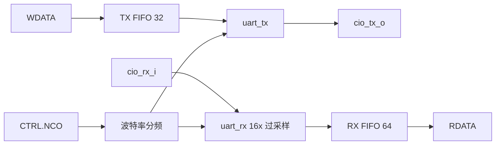

# HLD 功能/控制/数据通路设计 - UART

## 5. 功能分解

### 5.1 功能模块与职责

| 功能 | 承担模块 | 关键输入 | 关键输出 | LRS 引用 |
|---|---|---|---|---|
| 串行帧收发 | uart_rx / uart_tx | rx / tx 控制 | 数据/状态 | FUNC.01.001/003/004 |
| 波特率分频 | uart_core | CTRL.NCO | tick_baud_x16 | FUNC.01.002 |
| 奇偶校验 | uart_rx / uart_tx | PARITY_EN/ODD | parity 位 | FUNC.01.005 |
| 系统/线路回环 | uart_core | SLPBK/LLPBK | 回环数据 | FUNC.01.006/007 |
| 中断检测 | uart_core | RXBLVL | rx_break_err | FUNC.01.008 |
| RX 超时 | uart_core | TIMEOUT_CTRL | rx_timeout | FUNC.01.009 |
| 噪声滤波 | uart_core | NF | 滤波后 RX | FUNC.01.010 |
| FIFO 控制 | uart_core | FIFO_CTRL | 水位/状态 | FUNC.01.011/012 |
| 中断管理 | uart_reg_top | 事件/使能 | intr_*_o | FUNC.01.013 |
| TX 覆盖 | uart_core | OVRD | TX 引脚 | FUNC.01.014 |
| 过采样观测 | uart_core | RX | VAL | FUNC.01.015 |

### 5.2 数据通路 / Data Path

### 5.3 控制流概述 / Control Flow

- **发送**：SW 写 WDATA → TX FIFO 入队 → uart_tx 出队逐位移位 → TX 引脚。
- **接收**：RX 引脚 → uart_rx 采样 → RX FIFO 入队 → SW 读 RDATA。
- **中断**：FIFO 水位/事件 → uart_core 产生事件 → uart_reg_top 中断逻辑 → intr_*_o。

## 8. 状态机概览

- **uart_rx**：接收状态机（idle → 采样 START → 采样数据/停止位 → 校验），详见 LLD。
- **uart_tx**：发送状态机（idle → 移位输出），详见 LLD。
- **uart_core**：break 检测状态机（BRK_CHK/BRK_WAIT），详见 LLD。

## 9. 正常/异常流程

### 9.1 正常流程

1. 初始化：配置 NCO/CTRL/FIFO_CTRL/TIMEOUT_CTRL。
2. 发送：写 WDATA，数据经 FIFO 串行发出。
3. 接收：RX 数据经采样入 FIFO，读 RDATA。

### 9.2 异常流程

| 异常 | 检测 | 上报 |
|---|---|---|
| RX FIFO 溢出 | FIFO 满 + 新字符 | rx_overflow 中断，丢弃字符 |
| 帧错误 | 停止位不为 1 | rx_frame_err 中断 |
| 奇偶错误 | 奇偶位极性错 | rx_parity_err 中断 |
| 中断 | RX 低超阈值 | rx_break_err 中断 |
| RX 超时 | FIFO 未及时取走 | rx_timeout 中断 |
| 总线完整性 | TL-UL 完整性错误 | fatal_fault alert |

---

*文档版本: v0.1*
*创建日期: 2026-08-11*
*创建者: IP Development Suite - 03-hld-architect*
