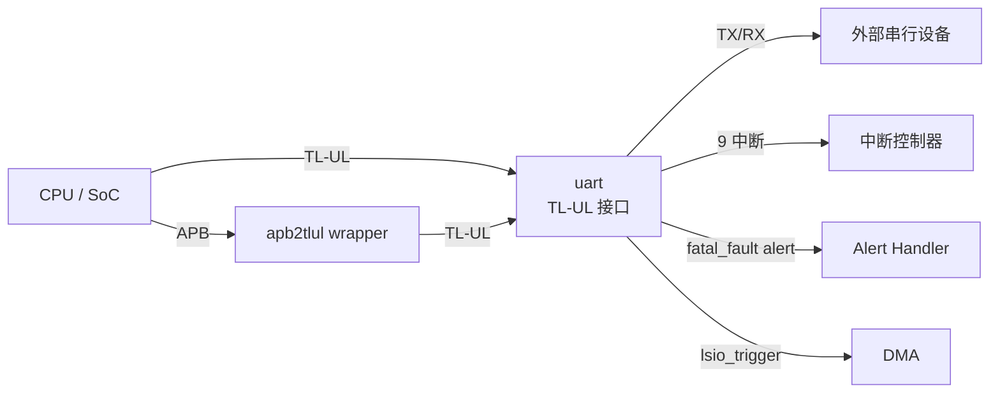
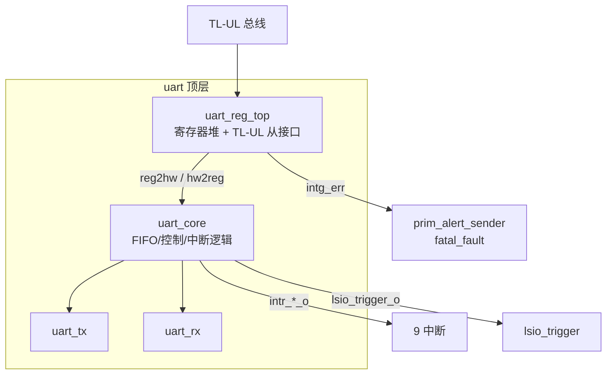

# IP 概述 - UART (uart)
# Overview - UART (uart)

> 本文档是 LRS 文档的一部分，请参阅 [主索引文件](index.md) 获取完整结构。
> 本概述参考 OpenTitan UART 文档（`reference/opentitan/hw/ip/uart/doc/`）与寄存器定义（`data/uart.hjson`）编写。

---

## 1. 应用背景 / Background

UART（Universal Asynchronous Receiver/Transmitter）通过两根串行线（TX/RX）以可编程波特率与外部设备进行标准串行通信，提供全双工同时收发能力。流量控制可通过软件握手实现。

为降低软件负载，UART 内置硬件 FIFO（TX 32 字节、RX 64 字节），并在 FIFO 水位达到软件可编程阈值时产生中断。波特率软件可编程，最高支持 1 Mbit/s。数据格式固定为 8 位，可选奇偶校验以增强抗传输错误能力。

本 IP 在保留 OpenTitan UART 核心 RTL（`uart.sv`/`uart_core.sv`/`uart_rx.sv`/`uart_tx.sv`/`uart_reg_top.sv`/`uart_reg_pkg.sv`）不变的前提下，通过新增 APB wrapper（`apb2tlul` 桥接）提供 APB 总线接入能力，并通过 FuseSoC `.core` 隔离 tlul 与 apb 两种接入方式。

## 2. 系统位置 / System Position

## 3. 架构框图 / Block Diagram

## 4. 子模块划分 / Sub-modules

| 子模块 | 文件 | 说明 |
|---|---|---|
| uart（顶层） | `rtl/uart.sv` | 顶层封装：寄存器堆实例化、alert 发送器、中断/输出连接（OpenTitan 原版） |
| uart_reg_top | `rtl/uart_reg_top.sv` | 寄存器堆（TL-UL 从接口，含 BUS.INTEGRITY 检测）（OpenTitan 生成版） |
| uart_reg_pkg | `rtl/uart_reg_pkg.sv` | 寄存器包：reg2hw/hw2reg 结构、参数、地址定义（OpenTitan 生成版） |
| uart_core | `rtl/uart_core.sv` | 核心逻辑：TX/RX FIFO 控制、波特率分频、中断事件产生、回环/噪声滤波/中断检测（OpenTitan 原版） |
| uart_rx | `rtl/uart_rx.sv` | 接收模块：16x 过采样、中点采样、帧/奇偶错误检测（OpenTitan 原版） |
| uart_tx | `rtl/uart_tx.sv` | 发送模块：位级移位输出（OpenTitan 原版） |
| apb2tlul（新增） | `rtl/apb2tlul.sv` | APB4 → TL-UL 桥接 wrapper，仅做协议转换，不改动核心（新增） |

## 5. 配置参数 / Configuration Parameters

| 参数 | 默认值 | 说明 | 来源 |
|---|---|---|---|
| RxFifoDepth | 64 | RX FIFO 深度（字节） | uart.hjson / uart_reg_pkg |
| TxFifoDepth | 32 | TX FIFO 深度（字节） | uart.hjson / uart_reg_pkg |
| NumAlerts | 1 | Alert 数量（fatal_fault） | uart.hjson / uart_reg_pkg |
| BlockAw | 6 | 块内地址宽度（64B） | uart_reg_pkg |
| EnableRacl | 0 | RACL 使能（默认关闭） | uart.sv |
| AlertAsyncOn | 全 1 | Alert 异步处理 | uart.sv |

## 6. 数据流概述 / Data Flow

- **TX 路径**：软件写 `WDATA` → TX FIFO（32 字节）→ `uart_tx` 按波特率移位 → `cio_tx_o` 串行输出。
- **RX 路径**：`cio_rx_i` 串行输入 → `uart_rx` 16x 过采样中点采样 → RX FIFO（64 字节）→ 软件读 `RDATA`。
- **中断路径**：FIFO 水位/事件 → `uart_core` 产生事件 → `uart_reg_top` 中断逻辑 → `intr_*_o`。

## 7. 关键功能清单 / Key Features

| 功能 | 描述 | 参考 |
|---|---|---|
| 全双工串行通信 | TX/RX 独立 FIFO，8 位数据 | theory_of_operation |
| 波特率可编程 | NCO 分频，最高 1 Mbit/s | theory_of_operation |
| 可选奇偶校验 | 奇/偶可配置，RX 检测错误 | theory_of_operation |
| FIFO 中断 | TX/RX watermark、TX empty/done | theory_of_operation |
| 错误检测 | overflow、frame、break、timeout、parity | theory_of_operation |
| 回环模式 | 系统回环 SLPBK、线路回环 LLPBK | theory_of_operation |
| 噪声滤波 | 3-tap 重复码，忽略单周期毛刺 | uart.hjson |
| 中断检测 | RXBLVL 可编程 2/4/8/16 字符 | theory_of_operation |
| TX 覆盖 | OVRD 直接控制 TX 引脚 | uart.hjson |
| 过采样观测 | VAL 寄存器读取最近 16 次采样 | uart.hjson |
| 总线完整性 | TL-UL BUS.INTEGRITY，fatal_fault alert | uart.hjson |

---

*文档版本: v1.0*
*创建日期: 2026-08-11*
*创建者: IP Development Suite - 01-lrs-author*
