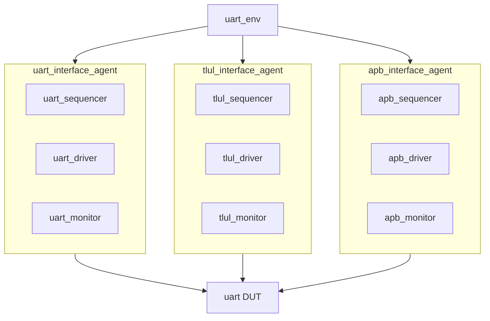

# Agent 规划 - UART 验证方案

> 本文档是 [verification_plan.md](verification_plan.md) 第 4 章的详细展开（Agent 规划）。
> Agent 命名与 `templates/verification_template` 一致（占位符替换为协议名）。

## 1. Agent 架构

## 2. Agent 列表

| Agent | 目录 | 模式 | 职责 |
|---|---|---|---|
| uart_interface_agent | verification/env/utils/uart_utils/ | MASTER/MONITOR | 串行帧收发激励与观测（TX/RX） |
| tlul_interface_agent | verification/env/utils/tlul_utils/ | MASTER/MONITOR | TL-UL 寄存器访问（总线 master） |
| apb_interface_agent | verification/env/utils/apb_utils/ | MASTER/MONITOR | APB4 寄存器访问（APB 接入验证） |

## 3. 组件职责

| 组件 | 职责 |
|---|---|
| uart_driver | 将 uart_xaction 按波特率逐位驱动到 DUT RX/TX 引脚（含奇偶/帧格式） |
| uart_monitor | 采样 DUT TX/RX 引脚，组装为 uart_xaction 并广播 |
| uart_sequencer | 仲裁 uart sequence 的发送 |
| uart_xaction | 串行帧事务（数据、波特率、奇偶、回环模式、错误注入标志） |
| tlul_driver | 发起 TL-UL 读写请求 |
| tlul_monitor | 观测 TL-UL 总线事务 |
| apb_driver | 发起 APB4 读写事务 |
| apb_monitor | 观测 APB 事务与 pslverr |

## 4. Transaction 字段（uart_xaction）

| 字段 | 类型 | 说明 |
|---|---|---|
| data | byte | 串行数据字节 |
| baud_div | int | 波特率分频/NCO 配置 |
| parity_en / parity_odd | bit | 奇偶配置 |
| mode | enum | 正常/系统回环/线路回环/噪声滤波 |
| error_type | enum | none/frame/parity/break/overflow/timeout |
| rx / tx | bit | 方向标识 |

## 5. Sequence 列表

| Sequence | 说明 |
|---|---|
| uart_smoke_seq | 基本寄存器配置 + 一字节收发 |
| uart_tx_rx_seq | 参数化多字节收发 + 回环 |
| uart_error_seq | 错误注入场景 |
| uart_fifo_seq | FIFO 水位场景 |
| uart_csr_seq | 寄存器访问（配合 RAL） |
| uart_perf_seq | 性能/误差容限 |
| uart_alert_seq | ALERT_TEST 注入 |

## 6. TLM 连接

- uart_monitor 分析口 → scoreboard（收发比对）。
- tlul_monitor/apb_monitor 分析口 → scoreboard（寄存器访问比对）。
- sequencer → driver（sequence item 驱动）。

---

*文档版本: v1.0*
*创建日期: 2026-08-11*
*创建者: IP Development Suite - 06-verification-plan*
