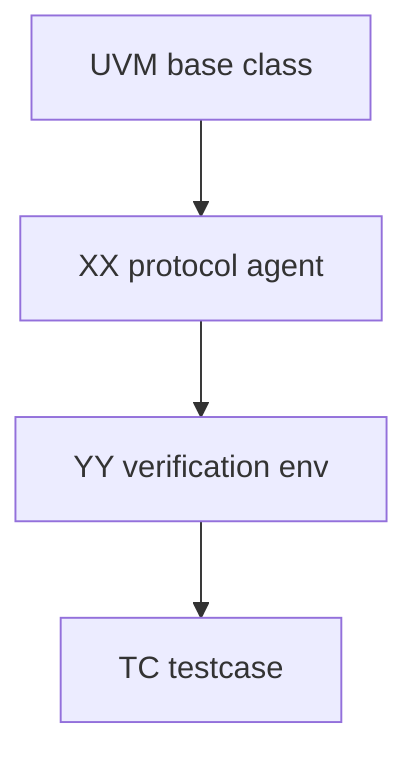
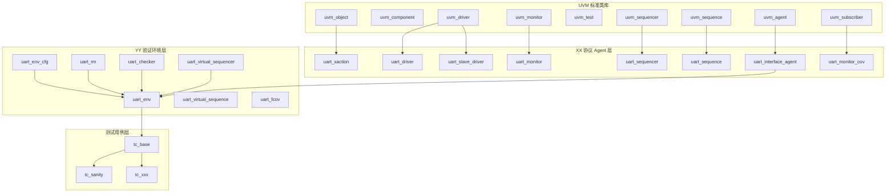

# verification_template

## 1. 目录说明

本目录为通用 UVM 验证环境模板，所有组件直接继承自 UVM 标准类库。

```text
verification_template/
├── env/                        # 验证环境目录
│   ├── uart_env.sv               # 环境顶层组件
│   ├── uart_env_cfg.sv           # 环境配置
│   ├── uart_env_dec.sv           # 环境声明（枚举、参数）
│   ├── uart_rm.sv                # 参考模型
│   ├── uart_rm_cfg.sv            # 参考模型配置
│   ├── uart_checker.sv           # 检查器/Scoreboard
│   ├── uart_checker_cfg.sv       # 检查器配置
│   ├── uart_dut_cfg.sv           # DUT 配置
│   ├── uart_virtual_sequencer.sv # 虚拟序列器
│   ├── uart_virtual_sequence.sv  # 虚拟序列
│   ├── uart_fcov.sv              # 功能覆盖率事务
│   ├── uart_env.list             # 环境编译文件列表
│   └── utils/
│       └── uart_utils/           # 协议 Agent 目录
│           ├── src/
│           │   ├── uart_dec.sv              # 协议声明（参数、枚举）
│           │   ├── uart_interface.sv        # 协议接口
│           │   ├── uart_xaction.sv          # 事务类
│           │   ├── uart_driver.sv           # 主驱动
│           │   ├── uart_driver_cfg.sv       # 主驱动配置
│           │   ├── uart_slave_driver.sv     # 从驱动
│           │   ├── uart_slave_driver_cfg.sv # 从驱动配置
│           │   ├── uart_monitor.sv          # 监控器
│           │   ├── uart_monitor_cfg.sv      # 监控器配置
│           │   ├── uart_monitor_cov.sv      # 监控器覆盖率
│           │   ├── uart_sequencer.sv        # 序列器
│           │   ├── uart_interface_agent.sv  # Agent 顶层
│           │   ├── uart_interface_agent_cfg.sv # Agent 配置
│           │   ├── uart_sequence_library.svp   # 序列库
│           │   └── uart_package.sv          # 协议包
│           ├── unit_test/        # Agent 单元测试
│           └── uart_interface_agent.list  # Agent 编译文件列表
├── tc/                         # 测试用例目录
│   ├── tc_base.sv              # 基础测试类
│   ├── tc_sanity.sv            # Sanity 测试用例
│   ├── tc_define.sv            # 测试宏定义
│   ├── tc_undef.sv             # 宏清理
│   └── tc.list                 # 测试编译文件列表
├── th/                         # 测试 harness 目录
│   └── harness.sv              # 顶层测试平台
├── verification.list           # 主编译文件列表
└── README.md                   # 本文档
```

## 2. 命名约定

| 占位符 | 含义 | 示例 |
|---|---|---|
| xx | interface / agent 名称 | apb, axi, irq |
| yy | DUT / subsystem 名称 | dma, sram_ctrl, sysctrl |
| tc | testcase | tc_sanity |

## 3. 分层结构



### 3.1 继承关系图



## 4. 主要组件

### 4.1 env/utils/uart_utils - 协议 Agent

协议 Agent 提供完整的总线协议验证组件。

#### 4.1.1 uart_dec.sv - 协议声明

定义协议参数和枚举类型：

```systemverilog
// 协议参数
parameter int UART_ADDR_WIDTH = 32;
parameter int UART_DATA_WIDTH = 32;

// Agent 模式常量
parameter bit UART_MASTER_MODE = 1'b0;
parameter bit UART_SLAVE_MODE  = 1'b1;
parameter bit UART_AGENT_ACTIVE  = 1'b1;
parameter bit UART_AGENT_PASSIVE = 1'b0;

// 命令类型枚举
typedef enum bit {
  UART_READ  = 1'b0,
  UART_WRITE = 1'b1
} uart_cmd_e;

// 响应类型枚举
typedef enum bit [1:0] {
  UART_RESP_OKAY  = 2'b00,
  UART_RESP_ERROR = 2'b01
} uart_resp_e;
```

#### 4.1.2 uart_interface.sv - 协议接口

定义协议信号和 clocking block：

```systemverilog
interface uart_interface(input logic clk, input logic rst_n);
  logic valid, ready, write;
  logic [UART_ADDR_WIDTH-1:0] addr;
  logic [UART_DATA_WIDTH-1:0] wdata, rdata;
  
  clocking drv_cb @(posedge clk);  // 主驱动 clocking block
  clocking slv_cb @(posedge clk);  // 从驱动 clocking block
  clocking mon_cb @(posedge clk);  // 监控 clocking block
  
  modport master  (clocking drv_cb, input clk, input rst_n);
  modport slave   (clocking slv_cb, input clk, input rst_n);
  modport monitor (clocking mon_cb, input clk, input rst_n);
endinterface
```

#### 4.1.3 uart_xaction.sv - 事务类

```systemverilog
class uart_xaction extends uvm_sequence_item;
  rand uart_cmd_e cmd;
  rand bit [UART_ADDR_WIDTH-1:0] addr;
  rand bit [UART_DATA_WIDTH-1:0] data;
  uart_resp_e resp;
  
  `uvm_object_utils_begin(uart_xaction)
    `uvm_field_enum(uart_cmd_e, cmd, UVM_ALL_ON)
    `uvm_field_int(addr, UVM_ALL_ON)
    `uvm_field_int(data, UVM_ALL_ON)
    `uvm_field_enum(uart_resp_e, resp, UVM_ALL_ON)
  `uvm_object_utils_end
endclass
```

#### 4.1.4 uart_driver.sv - 主驱动

```systemverilog
class uart_driver extends uvm_driver #(uart_xaction);
  virtual uart_interface bus;
  uart_driver_cfg cfg;
  
  // 从 config_db 获取虚拟接口
  // 实现 send_stimulus_data() 驱动事务
endclass
```

#### 4.1.5 uart_monitor.sv - 监控器

```systemverilog
class uart_monitor extends uvm_monitor;
  virtual uart_interface bus;
  uart_monitor_cfg cfg;
  uvm_analysis_port #(uart_xaction) ap;
  
  // 监控总线事务并通过 ap 广播
endclass
```

#### 4.1.6 uart_interface_agent.sv - Agent 顶层

```systemverilog
class uart_interface_agent extends uvm_agent;
  uart_interface_agent_cfg cfg;
  virtual uart_interface vif;
  
  uart_sequencer    sqr;
  uart_driver       mst_drv;
  uart_slave_driver slv_drv;
  uart_monitor      mon;
  uart_monitor_cov  cov;
  uvm_analysis_port #(uart_xaction) ap;
  
  // build_phase: 根据 cfg.active/mode 创建子组件
  // connect_phase: 连接 driver-sequencer, monitor-coverage
endclass
```

### 4.2 env - 验证环境

#### 4.2.1 uart_env.sv - 环境顶层

```systemverilog
class uart_env extends uvm_env;
  uart_env_cfg cfg;
  uart_interface_agent uart_agent;
  uart_rm rm;
  uart_checker checker;
  uart_virtual_sequencer v_sqr;
  
  // build_phase: 创建 agent, rm, checker, v_sqr
  // connect_phase: 连接 TLM 端口
endclass
```

#### 4.2.2 uart_rm.sv - 参考模型

```systemverilog
class uart_rm extends uvm_component;
  uvm_analysis_imp #(uart_xaction, uart_rm) in_export;
  uvm_analysis_port #(uart_xaction) exp_ap;
  
  // 接收输入事务，生成期望输出
  virtual function uart_xaction process_transaction(uart_xaction tr);
endclass
```

#### 4.2.3 uart_checker.sv - 检查器

```systemverilog
class uart_checker extends uvm_component;
  uvm_analysis_imp_act #(uart_xaction, uart_checker) act_export;
  uvm_analysis_imp_exp #(uart_xaction, uart_checker) exp_export;
  
  // FIFO 匹配比较 actual 和 expected 事务
endclass
```

### 4.3 tc - 测试用例

#### 4.3.1 tc_base.sv - 基础测试类

```systemverilog
class tc_base extends uvm_test;
  uart_env env;
  uart_env_cfg env_cfg;
  
  virtual function void configure_env();
    env_cfg.uart_agent_cfg.active = UART_AGENT_ACTIVE;
    env_cfg.uart_agent_cfg.mode   = UART_MASTER_MODE;
    env_cfg.enable_rm           = 1;
    env_cfg.enable_checker      = 1;
    env_cfg.enable_cov          = 1;
  endfunction
endclass
```

#### 4.3.2 tc_sanity.sv - Sanity 测试

```systemverilog
class tc_sanity extends tc_base;
  virtual task run_phase(uvm_phase phase);
    uart_sanity_vseq vseq;
    phase.raise_objection(this);
    vseq = uart_sanity_vseq::type_id::create("vseq");
    vseq.start(env.v_sqr);
    phase.drop_objection(this);
  endtask
endclass
```

### 4.4 th - 测试 Harness

#### 4.4.1 harness.sv - 顶层测试平台

```systemverilog
module harness;
  logic clk, rst_n;
  uart_interface uart_if (.clk(clk), .rst_n(rst_n));
  
  // 时钟生成：100MHz
  initial begin
    clk = 1'b0;
    forever #5ns clk = ~clk;
  end
  
  // 复位生成：10 个时钟周期
  initial begin
    rst_n = 1'b0;
    repeat (10) @(posedge clk);
    rst_n = 1'b1;
  end
  
  // UVM 配置
  initial begin
    uvm_config_db #(virtual uart_interface)::set(
      null, "uvm_test_top.env.uart_agent", "vif", uart_if
    );
    run_test();
  end
endmodule
```

## 5. 编译方式

### 5.1 VCS 编译

```bash
vcs -sverilog -ntb_opts uvm -f verification.list
```

### 5.2 Xcelium 编译

```bash
xrun -sv -uvm -f verification.list
```

### 5.3 编译文件结构

`verification.list` 内容：

```text
+incdir+./env
+incdir+./env/utils/uart_utils/src
+incdir+./tc
+incdir+./th

-f ./env/utils/uart_utils/uart_interface_agent.list
-f ./env/uart_env.list
-f ./tc/tc.list

./th/harness.sv
```

## 6. 运行方式

### 6.1 基本运行

```bash
./simv +UVM_TESTNAME=tc_sanity
```

### 6.2 指定波形输出

```bash
./simv +UVM_TESTNAME=tc_sanity -l sim.log +vcd+all
```

### 6.3 指定 UVM 详细度

```bash
./simv +UVM_TESTNAME=tc_sanity +UVM_VERBOSITY=UVM_HIGH
```

## 7. Agent 替换方法

### 7.1 协议 Agent 替换

将模板中的 `xx` 替换为具体协议名，例如：

```text
uart_driver.sv        -> apb_driver.sv
uart_xaction.sv       -> apb_xaction.sv
uart_interface_agent.sv -> apb_interface_agent.sv
uart_interface.sv     -> apb_interface.sv
uart_package.sv       -> apb_package.sv
```

### 7.2 DUT 环境替换

将模板中的 `yy` 替换为 DUT 名称，例如：

```text
uart_env.sv           -> dma_env.sv
uart_env_cfg.sv       -> dma_env_cfg.sv
uart_checker.sv       -> dma_checker.sv
uart_rm.sv            -> dma_rm.sv
uart_virtual_sequence.sv -> dma_virtual_sequence.sv
```

### 7.3 替换步骤

1. **复制模板文件**
   ```bash
   cp -r verification_template my_verification
   cd my_verification
   ```

2. **替换协议名称 (xx -> apb)**
   ```bash
   find . -name "uart_*" -exec rename 's/uart_/apb_/' {} \;
   find . -type f -name "*.sv" -exec sed -i 's/uart_/apb_/g' {} \;
   ```

3. **替换 DUT 名称 (yy -> dma)**
   ```bash
   find . -name "uart_*" -exec rename 's/uart_/dma_/' {} \;
   find . -type f -name "*.sv" -exec sed -i 's/uart_/dma_/g' {} \;
   ```

4. **修改协议定义**
   - 修改 `apb_dec.sv` 中的协议参数和枚举
   - 修改 `apb_interface.sv` 中的信号定义
   - 修改 `apb_xaction.sv` 中的事务字段
   - 实现 `apb_driver.sv` 的驱动逻辑
   - 实现 `apb_monitor.sv` 的监控逻辑

5. **修改 harness.sv**
   - 取消注释 DUT 实例化
   - 修改端口连接
   - 添加更多接口实例化

6. **编译验证**
   ```bash
   vcs -sverilog -ntb_opts uvm -f verification.list
   ./simv +UVM_TESTNAME=tc_sanity
   ```

## 8. 使用示例

### 8.1 创建 APB Agent

```systemverilog
// apb_dec.sv
parameter int APB_ADDR_WIDTH = 32;
parameter int APB_DATA_WIDTH = 32;

typedef enum bit { APB_READ = 1'b0, APB_WRITE = 1'b1 } apb_cmd_e;

// apb_interface.sv
interface apb_interface(input logic clk, input logic rst_n);
  logic [APB_ADDR_WIDTH-1:0] paddr;
  logic [APB_DATA_WIDTH-1:0] pwdata, prdata;
  logic                      psel, penable, pwrite, pready;
  // ...
endinterface

// apb_xaction.sv
class apb_xaction extends uvm_sequence_item;
  rand apb_cmd_e cmd;
  rand bit [APB_ADDR_WIDTH-1:0] addr;
  rand bit [APB_DATA_WIDTH-1:0] data;
  // ...
endclass

// apb_driver.sv
class apb_driver extends uvm_driver #(apb_xaction);
  virtual apb_interface bus;
  
  task send_stimulus_data(apb_xaction tr);
    bus.drv_cb.paddr  <= tr.addr;
    bus.drv_cb.pwrite <= (tr.cmd == APB_WRITE);
    bus.drv_cb.psel   <= 1'b1;
    bus.drv_cb.penable <= 1'b0;
    @(bus.drv_cb);
    bus.drv_cb.penable <= 1'b1;
    if (tr.cmd == APB_WRITE) bus.drv_cb.pwdata <= tr.data;
    wait(bus.drv_cb.pready);
    bus.drv_cb.psel   <= 1'b0;
    bus.drv_cb.penable <= 1'b0;
  endtask
endclass
```

### 8.2 创建自定义测试

```systemverilog
// tc_mytest.sv
class tc_mytest extends tc_base;
  `uvm_component_utils(tc_mytest)
  
  virtual function void configure_env();
    super.configure_env();
    env_cfg.enable_cov = 0;  // 关闭覆盖率
  endfunction
  
  virtual task run_phase(uvm_phase phase);
    my_vseq vseq;
    phase.raise_objection(this);
    vseq = my_vseq::type_id::create("vseq");
    vseq.start(env.v_sqr);
    phase.drop_objection(this);
  endtask
endclass
```

## 9. 最佳实践

### 9.1 命名规范

- 文件名使用小写下划线：`apb_driver.sv`
- 类名使用小写下划线：`apb_driver`
- 宏使用大写下划线：`APB_DRIVER__SV`
- 实例名使用小写下划线：`u_apb_agent`

### 9.2 代码组织

- 每个文件只包含一个类
- 使用 `ifndef/define/endif` 防止重复包含
- 使用 Doxygen 风格注释
- 参数化类提高复用性

### 9.3 配置管理

- 使用 `uvm_config_db` 传递配置
- 在 `build_phase` 中获取配置
- 配置对象继承自 `uvm_object`

### 9.4 事务处理

- 事务类继承自 `uvm_sequence_item`
- 使用 `uvm_field_*` 宏实现自动化
- 在 sequence 中使用 `start_item()` / `finish_item()`

## 10. 常见问题

### Q1: 如何添加新的协议 Agent？

1. 在 `env/utils/uart_utils` 基础上创建新 Agent
2. 修改 `uart_dec.sv` 定义协议参数和枚举
3. 修改 `uart_interface.sv` 定义协议信号
4. 修改 `uart_xaction.sv` 定义事务字段
5. 实现 `uart_driver.sv` 的驱动逻辑
6. 实现 `uart_monitor.sv` 的监控逻辑
7. 在 `harness.sv` 中配置虚拟接口

### Q2: 如何添加新的测试用例？

1. 继承 `tc_base` 创建新测试类
2. 重写 `configure_env()` 自定义配置
3. 重写 `run_phase()` 执行测试序列
4. 在 `tc.list` 中包含新测试文件

### Q3: 如何调试 UVM 环境问题？

1. 使用 `+UVM_VERBOSITY=UVM_HIGH` 查看详细日志
2. 使用 `+UVM_CONFIG_DB_TRACE` 跟踪配置
3. 检查虚拟接口是否正确配置

## 11. 版本历史

| 版本 | 日期 | 说明 |
|---|---|---|
| 3.0 | 2025 | 合并入 ip-development-suite；升级 UVM 1.2（`-ntb_opts uvm-1.2`）；统一 `verification/` 目录布局 |
| 2.0 | 2025 | 移除 stb 基类依赖，直接使用 UVM 标准类 |
| 1.0 | 2024 | 初始版本 |

## 12. 联系方式

如有问题或建议，请联系验证团队。
