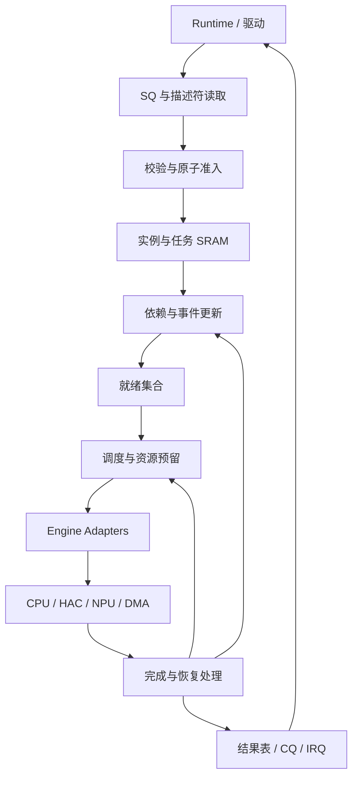

# AIXSILICON 异构任务调度器 HTS — 完整 IP 规划

文档标识：`aixsilicon:ip:hts:planning`  
目标 IP：`heterogeneous_task_scheduler`；建议 VLNV：`aixsilicon:ip:hts:1.0.0`  
文档版本：1.0-draft；日期：2026-09-11  
状态：架构与软硬件接口规划草案，可作为 LRS/HLD/LLD 与验证方案输入；尚未经 RTL、综合或系统性能验证。

## 1. 定位、依据与设计结论

HTS 是面向 CPU、DSP、NPU、HAC、DMA 的硬件任务调度 IP，负责提交排队、DAG 依赖、资源分配、执行派发、完成回收、错误传播与恢复协调。HAC 在本文指具有任务启动及完成反馈能力的硬件加速单元，不假定已有统一命令协议。

推荐形态：参数化 SystemVerilog Scheduler Core + Engine Adapter + C Runtime/驱动。图和任务由运行时描述符表达，不为每张 DAG 生成 RTL。Python 可生成集成包装、配置检查与软件定义；FuseSoC 管理构建。

### 1.1 业界参考与适用边界

| 资料 | 已公开机制 | 本设计采用的思路 |
|---|---|---|
| Linux DRM GPU Scheduler [R1] | 软件任务队列、优先级、任务依赖及按 job credit 控制在途容量 | 提交、就绪、派发分层；独立管理引擎容量 |
| NVIDIA CUDA Graphs [R2] | 节点与依赖边；定义、实例化、执行分离；执行图重复启动 | 冻结拓扑、独立实例状态、批量提交与图复用 |
| NVDLA 硬件架构 [R3] | 管理处理器配置硬件层并启动；配置双缓冲；完成中断；独立与融合执行模式 | 寄存器型 Adapter；配置槽与执行槽分开；融合流水线封装为一个可调度引擎 |

上述分别是软件框架、编程模型与具体加速器架构，不等于通用 Scheduler RTL 标准。本文所有 HTS opcode、描述符布局、CSR 地址、引擎信号和默认规模均为项目建议，**不宣称兼容 CUDA、HSA/AQL 或 Linux ABI**。参考事实仅限表中与引用段落；后续章节为本项目设计。

### 1.2 V1.0 核心决定

1. 多 SQ/CQ，单生产者 SQ，多个生产者用独立 SQ 或由软件锁串行化。
2. 静态 DAG 拓扑、动态执行实例；允许运行期间继续提交新图和独立任务。
3. 图控制元数据整图准入后启动；超限图返回容量错误，由软件分图。
4. 依赖采用 AND-success、拓扑序节点编号、后继邻接表；前驱失败使后继失败。
5. 统一 ready/valid 引擎接口，多引擎并发、引擎内可乱序完成。
6. 默认非抢占；取消和超时必须等待引擎及访存收敛后才允许资源复用。
7. 描述符和 CQ 全部小端；固定 64B SQE、128B 图头、128B 任务节点、64B 参数绑定、64B CQE。
8. 普通 AXI4 访存，不假定 cache 一致性；数据发布顺序由驱动、互联与 Adapter 契约共同保证。
9. 每个被接受的提交固定两条 CQE：接受与最终结果；被拒绝提交一条 CQE。逐任务结果写入实例结果表。
10. 完成记录额度在接受前预留，避免运行后无法报告完成。

## 2. 系统职责与功能范围

| 能力 | HTS 范围 | 系统配套 |
|---|---|---|
| 加任务 | 读取并验证最终任务表 | Runtime 的 ADD_TASK/ADD_EDGE 构建可编辑对象 |
| 提交 | 校验 SQE、分配实例、返回接受/拒绝 | Runtime 发布不可变描述符 |
| DAG | 计数、事件、唤醒、失败传播 | Runtime 拓扑排序、去重、图分段 |
| 算力调度 | 类别/能力/亲和性、credit、优先级 | Adapter 实际启动执行 |
| Buffer | 引用参数与资源 profile | BMU/Runtime 分配、地址绑定、生命周期 |
| 访存权限 | 控制面窗口与上下文校验 | 防火墙/IOMMU 限制各执行引擎的数据访问 |
| 数据搬运 | 派发 DMA 任务 | DMA IP 执行搬运 |
| CPU 工作 | 发送 work_id 和参数 | 注册过的 CPU worker 执行 |
| 安全诊断 | 错误日志、可选 ECC/parity、超时 | 系统安全分析决定诊断覆盖率与复位策略 |

V1.0 支持：链、Fork/Join、多根多叶、多实例、跨图单次事件、任务取消、图取消、两种失败策略、CSR/AXI/引擎错误管理、性能计数、低功耗排空。

后续扩展：运行图加边、条件分支、ANY-of、循环、硬件抢占、任意任务动态生成、虚拟内存缺页重放、硬实时 EDF、硬件关键路径计算、大图换入换出、timeline event。V1.0 遇到对应未知编码必须拒绝，不可静默当作基础功能。

任务粒度为 kernel、算子、tile group、DMA 操作或 CPU work item；需通过负载评估确保调度开销相对执行时间足够小。

## 3. 总体架构与存储

| 模块 | 实现职责 |
|---|---|
| CSR Frontend | APB4 32-bit；可选外部 AXI4-Lite 包装；权限与 W1C |
| SQ Manager | tail 校验、轮询仲裁、Doorbell、每 SQ 独立状态 |
| AXI Fetch/Writeback | 描述符 burst、读响应重组、结果与 CQ 顺序提交 |
| Admission | 准备资源、复制并检查全部元数据、成功后统一提交；失败回滚 |
| Task State RAM | 可变状态、依赖计数、任务标签、时间戳、错误与结果 |
| Graph Instance RAM | 所属 context、SQ、CQ、任务范围、终态计数、失败策略 |
| Edge RAM | 源节点后继列表；目的节点索引 |
| Event Table | 单次事件状态、generation、引用数、写入者绑定 |
| Ready Manager | 每类/优先级的就绪位图或索引队列，不复制描述符 |
| Scheduler | 按 context 权重和优先级选任务；按能力和 credit 选引擎 |
| Resource Manager | 引擎 credit + 原子获取有限 token 集合 |
| Completion Engine | 去重、核对标签、任务终态、传播队列、资源释放 |
| Recovery Controller | 取消、隔离、quiesce、复位 epoch 与故障记录 |
| DFX | 快照、计数器、可选 trace、受控故障注入 |

控制元数据保存在片上 SRAM；命令、参数和任务数据可在外部 SRAM/DDR。SQ 消费释放的是 SQ 槽，任务状态独立存在，不能用 SQ slot 充当运行任务 slot。

V1.0 每次提交复制图节点、边及 binding 到实例专属空间，不实现硬件模板缓存。软件模板可反复提交；重复执行减少软件构图开销，但每次仍有硬件读取校验成本。后续模板缓存需增加注册、版本、权限和引用计数协议，不能与 V1.0 混为一谈。

## 4. 对象、生命周期与 Runtime

### 4.1 API 与所有权

| API | 功能与所有权 |
|---|---|
| graph_create() | 创建软件图对象 |
| graph_add_task() | 增加任务；返回软件节点句柄 |
| graph_add_edge() | 添加依赖；不得重复 |
| graph_finalize() | 检查 DAG，拓扑排序，生成本文定义的表 |
| submit_graph() | 发布 SQE，返回软件 submission_id；尚不代表硬件接受 |
| submit_task() | 等价于单节点、零图内边提交，支持节点外部等待事件 |
| poll_cq()/wait() | 读取接受、拒绝、最终结果 |
| cancel_instance()/cancel_task() | 通过管理命令口提交取消请求 |
| event_create()/signal()/destroy() | 创建、置终态、引用清零后销毁单次事件 |
| graph_destroy() | 释放软件模板；必须无仍使用该内存的提交 |

每个 SQ 的 submission_id 由软件分配 64-bit 非零值；在对应 queue_epoch 中不得复用。硬件不保存无限历史去重表，因此软件把相同工作重新发布到新 SQ slot 会构成新的执行请求。Doorbell 重复写相同 tail 不会重复提交。API 不允许把超时自动当作提交失败后重试。

### 4.2 内存生命周期

- SQE 在 SQ_HEAD 前进后可复用；被引用元数据在 ACCEPT 或 REJECT CQE 可见后可复用，因为硬件完成快照或已放弃读取。
- 引擎 command/argument 及输入输出 buffer 保留到 FINAL 可见；仅 ACCEPT 不代表可释放。
- result table、CQ 与页映射保留到 FINAL 或受控设备恢复完成。CQ 消费前不能重用 CQ slot。
- FINAL 成功发布前，逐节点结果已完成写回；图失败但安全排空后同样遵守该顺序。
- 致命写回错误可能无法生成 FINAL；驱动须通过 CSR fault 和系统恢复确认后回收，不能无限等待一个已无法写入的 CQE。

### 4.3 任务状态

管理快照中任务状态编码依次为0 LOADING、1 WAIT_DEP、2 READY、3 DISPATCH、4 INFLIGHT、5 RECOVERING、6 TERMINAL；终态原因使用CQ状态码。实例状态编码0 LOADING、1 ACTIVE、2 CANCELLING、3 RECOVERING、4 TERMINAL、5 WRITEBACK；释放后句柄无效。管理QUERY_INSTANCE的RESP2为低16首错状态码、高32首错node，中间16位0；无错误node为0xFFFFFFFF。QUERY_EVENT的RESP2为诊断producer标识，软件事件为0，节点为task_tag，实例为instance_handle；事件引用存在期间保留该诊断值，即使对象已完成。

| 状态 | 进入条件 | 离开条件 |
|---|---|---|
| LOADING | 准入暂存中 | 全图接受或回滚 |
| WAIT_DEP | 已接受，图内或事件依赖未满足 | 全成功进入 READY；失败进入安全终态 |
| READY | 可执行，等待资源 | 原子预留成功进入 DISPATCH |
| DISPATCH | 向 Adapter 保持 valid 和 payload | 握手进入 INFLIGHT |
| INFLIGHT | Adapter 已接收，可能正在排队或执行 | 可信完成；取消/超时进入 RECOVERING |
| RECOVERING | 需要终止与排空 | Adapter/系统确认无后续副作用后进入终态 |
| TERMINAL | SUCCESS/FAILED/CANCELLED/DEPENDENCY_FAILED/TIMEOUT 等 | 写回、传播和引用释放后回收 |

DISPATCH 的 valid 在未握手时不能因取消而随意撤销。若取消与握手竞争，记录 cancel_pending；保持协议完成握手，再按在途取消处理。超时发生在握手前则隔离该端口并通过 quiesce/reset 协议撤销，不可单方面清掉已承诺的协议状态。

## 5. 二进制 ABI 通用规则

所有 offset 为字节；所有多字节整数小端；地址为 64-bit 系统 DMA 地址。V1.0 不接受虚拟地址/PASID。未实现高地址位必须为零。Reserved 必须写零，读到非零返回 BAD_RESERVED。硬件使用显式位切片，软件使用固定宽度类型与静态 offset/sizeof 检查，禁止依赖编译器位域布局。

SQ/CQ base 按 4KiB 对齐；SQE/CQE 为 64B；图头和任务表 base 按 128B 对齐；binding base 按 64B；edge base 按 4B；result base 按 32B。所有范围检查用扩展位运算检查 base+size 溢出。节点索引 32-bit；实际上限由 CAP 给出。事件句柄 0 表示不存在；其余句柄为 `{generation[31:0], index[31:0]}`，索引从 1 开始。

### 5.1 SQE：64B，ADD 与 SUBMIT 分离

| Offset | Bytes | 字段 | 语义 |
|---|---:|---|---|
| 0x00 | 4 | HEADER | [7:0] opcode；[15:8] ABI_MAJOR=1；[23:16] SIZE_DW=16；[31:24] flags=0 |
| 0x04 | 4 | QUEUE_EPOCH | 必须等于 SQ 当前 epoch |
| 0x08 | 8 | SUBMISSION_ID | 当前 SQ epoch 内唯一的非零软件标识 |
| 0x10 | 8 | OBJECT_PTR | 图头指针 |
| 0x18 | 8 | BINDING_PTR | node_count 个 64B binding，必需 |
| 0x20 | 8 | RESULT_PTR | node_count 个 32B result，必需 |
| 0x28 | 8 | USER_COOKIE | 原样回传 |
| 0x30 | 8 | COMPLETION_EVENT | 0 或单写入者事件，提交最终结果置该事件终态 |
| 0x38 | 8 | RESERVED | 0 |

opcode：0x01 SUBMIT_GRAPH；0x02 SUBMIT_TASK（图头必须 node_count=1、edge_count=0）；其他拒绝。context、CQ 与权限从可信 SQ 配置取得，不能由 SQE 自报升级。

SQE 不设 valid/phase：以经过验证的 SQ_TAIL_PUBLISH 为唯一发布边界；硬件不得预读边界以外的 slot。不同生产者不能先推进 tail 再补写空洞。

### 5.2 图头 Graph Header：128B

| Offset | Bytes | 字段 | 规则 |
|---|---:|---|---|
| 0x00 | 4 | MAGIC | 0x31535448，小端字节为 HTS1 |
| 0x04 | 4 | FORMAT | [15:0] header_bytes=128；[23:16] major=1；[31:24] minor=0 |
| 0x08 | 8 | TEMPLATE_ID | 软件诊断 ID，不构成硬件缓存句柄 |
| 0x10 | 4 | NODE_COUNT | 1..CAP_TASKS 且符合 context 配额 |
| 0x14 | 4 | EDGE_COUNT | 0..CAP_EDGES |
| 0x18 | 8 | NODE_TABLE_PTR | N×128B |
| 0x20 | 8 | EDGE_TABLE_PTR | E×4B；E=0 时为0 |
| 0x28 | 4 | GRAPH_FLAGS | bit0 FAIL_FAST；0 为 CANCEL_DESCENDANTS；其余0 |
| 0x2C | 4 | RESERVED | 0 |
| 0x30 | 8 | GRAPH_TIMEOUT_TICKS | 0=禁用；从 ACCEPT 起算，超限触发整图取消/恢复 |
| 0x38 | 8 | RESERVED | 0 |
| 0x40 | 64 | RESERVED | 全0 |

ABI minor 未知同样拒绝；后续兼容策略在新 ABI 中明确，不自行猜测。

### 5.3 任务节点 Node Descriptor：128B

| Offset | Bytes | 字段 | 语义 |
|---|---:|---|---|
| 0x00 | 4 | NODE_INDEX | 必须等于表索引0..N-1 |
| 0x04 | 4 | TYPE_FLAGS | [7:0] task_type；[15:8] flags=0；[31:16] reserved=0 |
| 0x08 | 4 | ENGINE_SELECT | [15:0] engine_class；[23:16] priority 0..3（3最高）；[31:24] reserved |
| 0x0C | 4 | RESOURCE_PROFILE | context 内资源 profile 索引 |
| 0x10 | 8 | AFFINITY_MASK | bit i 对应 engine i；外部执行任务不可为0 |
| 0x18 | 8 | CAPABILITY_REQ | 必须为选中引擎 capability 的子集 |
| 0x20 | 4 | SUCC_START | 全局 edge 表起始元素索引 |
| 0x24 | 4 | SUCC_COUNT | 后继数量 |
| 0x28 | 4 | INDEGREE_HINT | 软件计算入度；硬件重算并比较 |
| 0x2C | 4 | WAIT_COUNT | 0..4 |
| 0x30 | 8 | EXEC_TIMEOUT_TICKS | 从 dispatch 握手起，包含引擎内部排队；0继承context默认 |
| 0x38 | 8 | READY_TIMEOUT_TICKS | READY起算；0禁用 |
| 0x40 | 32 | WAIT_EVENT[4] | 单次事件句柄；未使用项0；必须去重 |
| 0x60 | 8 | SIGNAL_EVENT | 0或本节点终态写入事件；每并发实例使用不同事件 |
| 0x68 | 8 | NODE_COOKIE | 软件诊断标识，快照保留 |
| 0x70 | 16 | RESERVED | 0 |

Task type：0x00 NOP；0x01 ENGINE_EXEC；0x02 DMA_COPY；0x03 CPU_WORK；0x04 BARRIER；0x05 EVENT_WAIT；0x06 EVENT_SIGNAL。

NOP/BARRIER/EVENT_WAIT/EVENT_SIGNAL 由内部执行，ENGINE_SELECT、AFFINITY、CAPABILITY、RESOURCE_PROFILE 和 binding 命令字段必须0；EVENT_WAIT 要求 WAIT_COUNT>0；EVENT_SIGNAL 要求 SIGNAL_EVENT非0。内部节点不占外部引擎 credit，但仍占任务槽与结果空间。

ENGINE_EXEC/DMA_COPY/CPU_WORK 必须存在允许的匹配引擎；不存在则准入拒绝，暂时离线则允许等待，由超时控制。class 编码：1 CPU、2 DSP、3 NPU、4 HAC、5 DMA；0为内部；0x8000..0xFFFF为项目私有类别。

### 5.4 后继 Edge Table

每项为一个 u32 目的 NODE_INDEX。节点按拓扑序存放，所有边必须满足 dst>src 且 dst<N；每个源节点后继按升序且严格去重。要求节点0的 SUCC_START=0，后续节点的 SUCC_START 等于前节点 start+count，最后结束值等于 E。硬件据此检查无重叠、无空洞，并重算每个节点入度后与 hint 比较。

这同时拒绝自环、反向边与循环，无需运行时复杂环检测。图加载成本为 O(N+E)，在 ACCEPT 前完成。禁止信任软件给出的入度直接执行。

### 5.5 实例参数 Binding：每节点64B

| Offset | Bytes | 字段 | 语义 |
|---|---:|---|---|
| 0x00 | 8 | COMMAND_PTR | 引擎命令地址；内部任务为0 |
| 0x08 | 8 | ARGUMENT_PTR | 引擎参数地址或0 |
| 0x10 | 4 | COMMAND_BYTES | 命令字节数 |
| 0x14 | 4 | ARGUMENT_BYTES | 参数字节数 |
| 0x18 | 8 | WORK_ID | CPU 注册工作ID；其他类型由对应Adapter ABI定义 |
| 0x20 | 8 | RESULT_COOKIE | 原样写入节点结果 |
| 0x28 | 24 | RESERVED | 0 |

命令指针与长度的内容格式属于 Adapter ABI。Scheduler 校验整数溢出和控制内存窗口，Adapter 校验命令语义及数据权限。同一个节点 command/arg 不可在执行中被软件修改。没有通用的“任意寄存器写”任务可绕过 Adapter 白名单。

### 5.6 DMA_COPY 标准命令：64B

| Offset | Bytes | 字段 |
|---|---:|---|
| 0x00 | 4 | format：低16 version=1，高16 bytes=64 |
| 0x04 | 4 | flags=0 |
| 0x08 | 8 | src_addr |
| 0x10 | 8 | dst_addr |
| 0x18 | 8 | length_bytes |
| 0x20 | 32 | reserved=0 |

V1.0 为1D copy，length>0；源目的重叠禁止，非对齐访问能力由DMA capability声明，不支持时拒绝。ARGUMENT_PTR/BYTES和WORK_ID为0。DMA Adapter负责范围、对齐、传输长度能力校验和错误处理。2D/stride/SG后续另定命令版本，不挤占reserved私用。

### 5.7 节点结果：32B

| Offset | Bytes | 字段 |
|---|---:|---|
| 0x00 | 4 | NODE_INDEX |
| 0x04 | 4 | STATUS：低16状态码，高16引擎ID；内部为0xFFFF |
| 0x08 | 8 | RESULT_COOKIE |
| 0x10 | 8 | START_TICK：未派发为0 |
| 0x18 | 8 | END_TICK：安全终态时间 |

V1.0 不允许软件在 FINAL 前轮询节点结果作为完成标志，因为它没有逐项发布协议；运行时查询使用管理快照。节点详细 Adapter 错误保存在错误日志，FINAL 的 error_detail 提供首错。

### 5.8 CQE：64B

| Offset | Bytes | 字段 |
|---|---:|---|
| 0x00 | 4 | PUBLISH_SEQ：该CQE在CQ中的32-bit逻辑序号 |
| 0x04 | 4 | TYPE_STATUS：[7:0]类型；[15:8]reserved；[31:16]状态码 |
| 0x08 | 8 | SUBMISSION_ID |
| 0x10 | 8 | INSTANCE_HANDLE：{generation32, slot32}，拒绝为0 |
| 0x18 | 8 | USER_COOKIE |
| 0x20 | 4 | ERROR_NODE：无节点错误为0xFFFFFFFF |
| 0x24 | 4 | ERROR_DETAIL：Adapter或校验细节码 |
| 0x28 | 8 | TIMESTAMP |
| 0x30 | 4 | SQ_ID |
| 0x34 | 4 | SQ_EPOCH |
| 0x38 | 8 | RESERVED=0 |

CQE类型1 ACCEPT、2 REJECT、3 FINAL。ACCEPT仅表示元数据快照与资源准入成功；该记录先于对应FINAL发布。任务可在ACCEPT记录尚未被软件读取时执行。

状态码：0 SUCCESS；1 BAD_OPCODE；2 BAD_VERSION；3 BAD_ALIGN；4 BAD_RESERVED；5 BAD_GRAPH；6 CAPACITY；7 PERMISSION；8 BAD_EVENT；9 NO_ENGINE；10 AXI_READ_ERROR；11 ENGINE_ERROR；12 CANCELLED；13 DEPENDENCY_FAILED；14 EXEC_TIMEOUT；15 READY_TIMEOUT；16 GRAPH_TIMEOUT；17 RESET_ABORT；18 AXI_WRITE_ERROR；19 INTERNAL_ERROR；20 INVALID_STATE；21 STALE_HANDLE；22 UNSUPPORTED。

CQ写回错误可能不能通过CQ报告，应转CSR。ACCEPT状态为SUCCESS；FINAL为聚合结果：先前已锁存的执行/超时错误优先于之后的取消请求；全成功才SUCCESS。

## 6. SQ/CQ 发布、准入与反压

### 6.1 环形队列协议

SQ/CQ 深度为2的幂，建议16..4096，且小于2^31。指针为32-bit逻辑计数；slot=ptr & (depth-1)，差值使用u32模运算。软件不能一次发布超过可用空间，硬件验证tail-new与head的差值不超过depth且tail不非法倒退。重复写现有tail是合法no-op。

SQ发布：写SQE及所有引用对象 → 执行平台cache clean/release → 写SQ_TAIL_PUBLISH。后者同时充当Doorbell。硬件读取已发布范围，完成该项接受或拒绝处理后才推进HEAD。HEAD前进并不代表执行完成。

CQ发布：先写CQE的0x04..0x3F → 完成平台规定的写入排序 → 最后以单个32-bit写发布PUBLISH_SEQ → 等待发布写响应 → 更新CQ_PROD_SEQ并产生通知。CQ消费者检查预期序号并执行acquire/cache维护后读取其余字段，消费后写CQ_HEAD_PUBLISH。实际总线需保证单个32-bit发布字段不撕裂；不能把AXI B响应自动当作所有CPU cache均已一致。

初始化所有CQ slot的PUBLISH_SEQ=0xFFFFFFFF；初始head/prod为0。一个slot在软件确认消费前不得复写；无须每次消费清零。队列复位后必须重新初始化slot，并确认旧写回已排空。

### 6.2 原子准入

1. 基于可信SQ配置确认context、绑定CQ及权限。
2. 校验SQE固定字段与所有范围。
3. 读取图头，检查永久容量上限；永久超限立即REJECT(CAPACITY)。
4. 为该提交预留任务槽、边槽、实例槽、事件引用及2个CQ记录额度；各项要么全部成功，要么保持原状。
5. 复制全部元数据，验证节点/边/binding和事件写入者；不派发任何节点。
6. 成功后锁定实例、初始化状态、发布ACCEPT；此后任务可进入调度。
7. 校验失败则回滚资源，发布一条REJECT并归还多预留的CQ额度。

临时容量不足时本SQ暂停准入，其他SQ继续。若连一条REJECT记录空间都没有则不能消费该SQE。`ADMIT_TIMEOUT_TICKS`可配置临时准入等待上限，超时且CQ有空间时返回CAPACITY；管理口不依赖SQ容量。

### 6.3 CQ 额度不变量

对每个CQ：`occupied + reserved <= depth`。occupied=已发布未消费；reserved=尚未发布但已承诺的ACCEPT/FINAL/REJECT记录。接受前保留2；发布一个记录时reserved减1且occupied加1；软件消费才减少occupied。已接受提交的FINAL额度不可被新提交占用。

这样CQ满会停止新准入，但不会挤掉已接受实例的最终结果。节点结果写回可与内部唤醒解耦；图实例须保留到所有节点结果写回和FINAL发布完成。结果通道拥堵允许反压，禁止丢弃状态。

### 6.4 活性边界

有界SRAM不能无条件支持无限DAG或未来依赖。V1.0保证同一个已准入图的前驱不会因图内元数据未驻留而死锁。跨图/外部事件可能形成软件层循环或资源依赖，硬件不宣称自动识别所有死锁。

Runtime必须先接受生产者图再提交消费者图，或确保由独立CPU/事件入口产生事件；不能让所有task额度被等待尚未准入生产者的图占满。context配额隔离、图/事件超时以及独立管理取消口提供恢复途径。软件图构建器应检查跨图可见依赖，不能仅凭“每张图无环”声称系统无死锁。

## 7. DAG、事件与失败传播细节

### 7.1 依赖记账

维护remaining_predecessors、remaining_events、dependency_failed、ready_enqueued与terminal_processed。只有两类remaining均为0且无失败且无取消时才能就绪。前驱每个终态只处理一次，其每条出边只产生一次消息；成功递减，失败置后继失败标志并递减。建议待所有前驱终态后将后继置DEPENDENCY_FAILED；这样所有边都自然完成记账，避免提前回收的复杂性。

后继不会在任一前驱失败后运行。两个完成同时指向同一节点时，使用单写端口串行化或同地址合并，禁止读改写丢失。计数器下溢、重复入队和非法转态属于INTERNAL_ERROR并隔离实例。

取消图时未派发节点可直接安全终态；其终态传播仍经统一去重逻辑。图完成条件为：全部N节点安全终态、所有边/事件更新完成、引擎资源回收、节点结果写回完成，而非某个叶节点done。

### 7.2 事件

事件为单次对象，状态编码0=PENDING、1=SUCCESS、2=FAILED、3=CANCELLED。事件状态编码与CQ状态码是不同枚举。由受信任管理命令创建，分配index+generation；所属context和producer类型创建时确定。producer类型为SOFTWARE或NODE/INSTANCE保留绑定；绑定在准入时原子完成，同一事件禁止多个并发生产者。

等待者在准入时获取引用并观察已存在状态；若已经SUCCESS立即满足，若失败立即标记依赖失败。观察和订阅必须原子序列化，避免先检查后挂链之间漏事件。允许先signal后wait，终态保留直到软件销毁且引用归零。

- 等待列表最多4项且无重复；单节点不得等待自身signal事件。
- SIGNAL_EVENT随节点安全终态传播对应成功/失败/取消，不能失败却发送成功。
- COMPLETION_EVENT在整个实例安全收敛、结果写回完成后置终态，且顺序先于对应FINAL的发布。
- 软件只能signal SOFTWARE事件；不能伪造NODE/INSTANCE事件。
- V1.0事件限制在同一context；跨context使用受信任软件代理，不共享可写事件ID。
- 活跃图、等待者和生产者引用未清零时禁止销毁；generation回绕前要求全系统引用与输入通道排空。
- 外部硬件事件入口必须有可信source绑定、event handle、status和ready/valid；不支持裸脉冲跨域。

## 8. 调度算法、资源与公平性

候选任务条件：READY、context允许运行、引擎类别匹配、capability子集匹配、affinity和context引擎mask均允许、engine在线、credit充足、token可一次获取、派发缓存有空间。

建议先按context加权轮询，再在选定context内按有效优先级选择可派发任务；同优先级按就绪年龄和轮询公平；多匹配引擎按轮询。默认weight=1。每次成功派发扣一个轮询额度，不能派发不扣且跳过，轮次结束重装权重。内部节点使用独立小型公平仲裁，不消耗外部派发credit。

priority为0..3，3最高；有效优先级=min(context允许上限, base+floor(ready_age/AGING_QUANTUM))。AGING_QUANTUM=0禁用aging。权重衡量派发机会，不保证执行时间/带宽公平；高优先级也不代表抢占已运行任务。Runtime可沿依赖向前驱传播优先级，V1.0无硬件优先级继承承诺。

就绪表实现应能够跳过暂时无资源的任务，不能只检查一个队头导致同类其他任务永久阻塞。可采用按class/priority分组位图和分段扫描，具体流水级根据规模综合选择。

资源profile每context最多16项；profile0=engine_credit_cost1、无token。profile1..15含credit_cost与64-bit独占token_mask。所需token在派发预留时一次获取，全满足才成功；不边占边等。token用于互斥bank/group/channel等逻辑资源，V1.0不实现复杂容量向量。credit_cost>=1且不得超过至少一个合法候选引擎上限，否则准入拒绝。

预留发生在DISPATCH valid建立前；握手前由Scheduler持有资源，握手后由任务占有。完成处理只释放一次。profile只允许context完全排空时修改。调度所持token必须涵盖任务整个副作用周期；无显式依赖的共享buffer访问由软件保证合法，Scheduler不会自动做地址冲突分析。

## 9. 核/HAC 接口及 Adapter 规划

### 9.1 统一接口

接口是项目自定义事务接口，建议封装为hwif。每engine有独立dispatch与completion通道；复位和管理通道另设，不能共用被堵塞的completion队列。

| Dispatch字段 | 位数 | 定义 |
|---|---:|---|
| task_tag | 64 | {slot_generation32, global_task_slot32} |
| engine_epoch | 32 | engine恢复代次 |
| context_id | 16 | 来自可信SQ |
| task_type | 8 | 同节点类型 |
| priority | 8 | 有效优先级 |
| command_ptr / argument_ptr | 各64 | binding地址 |
| command_bytes / argument_bytes | 各32 | binding长度 |
| work_id | 64 | binding工作标识 |
| memory_domain | 16 | 来自context配置的可信访存域 |
| reserved | 112 | 0 |

总payload为512bit。信号disp_valid、disp_ready；等待期间payload稳定。Adapter不允许先接收再无声丢弃；若命令语义错误必须返回失败completion。

| Completion字段 | 位数 | 定义 |
|---|---:|---|
| task_tag | 64 | 原样返回 |
| engine_epoch | 32 | 原样返回 |
| status | 16 | 0成功，其他定义为Adapter错误/取消 |
| flags | 16 | bit0 QUIESCENT必须1；其余0 |
| error_detail | 32 | Adapter专有子码 |
| reserved | 32 | 0 |

总payload为192bit；cmp_valid/cmp_ready。completion表示该任务没有未来写入或其他副作用，并达到约定的结果可见性域。引擎内部started/progress只是可选遥测，不作为V1.0完成或超时计时基准。

管理信号包括：quiesce_req/ack、abort_req_valid/ready与task_tag/epoch、reset_req/ack、engine_online。abort请求本身不释放资源；最终仍通过QUIESCENT completion或完整端口排空确认收敛。无abort能力则等待完成或上升到engine reset。

### 9.2 Adapter类型

| Adapter | 实现要求 |
|---|---|
| Native Command | 将512bit命令转原生包；建立tag对应；支持乱序完成 |
| Register HAC | 使用受控寄存器模板或白名单脚本写配置、启动、读取状态和清中断；默认执行credit=1 |
| CPU Worker | 通过受保护工作队列交付work_id、args、tag；worker返回完成，驱动校验执行身份 |
| DMA | 解析64B copy命令，调用DMA并汇聚传输错误 |
| Fused Pipeline | 多个流式单元内部协调，作为一个任务执行域；不能用完成依赖边替代流式启动握手 |

NVDLA公开说明了配置双缓冲和完成中断[R3]。因此对有双配置bank的HAC，可选“预装下一任务配置”；配置bank数量与执行credit是两个参数，不能把两个bank当作两项并行计算能力。涉及多寄存器的配置在START前必须全部提交成功；部分配置失败不能继续启动。

CPU Worker仅允许注册work_id，不接受不可信函数指针。软件任务、HAC命令处理均可能访问任务数据，必须通过系统内存保护与可信runtime约束，HTS控制描述符窗口不能替代数据面保护。

### 9.3 CDC与复位

Scheduler内部一个主时钟域；每Adapter可独立时钟/复位，通过异步FIFO传递完整事务。复位异步置位、同步释放按平台规范处理。复位前阻止新派发，保留在途记录，确认Adapter及AXI在途访问排空；仅FIFO清空不代表数据面已停止。

epoch隔离迟到completion，但不能阻止旧AXI写入。系统若无法证明排空，需隔离引擎主端口并保持相关buffer不复用，直到受控复位/互联恢复完成。generation/epoch回绕须执行排空，不以“32bit很大”替代正确性约定。

## 10. 寄存器架构与地址映射

### 10.1 通用访问规则

CSR aperture为1MiB，APB地址宽度至少20；数据32bit，4字节对齐。APB4 PSTRB支持字节写；命令触发、tail/head发布、CTRL和doorbell寄存器要求PSTRB=0xF，否则PSLVERR且无副作用。普通RW按字节更新，W1C按有效byte清位。RO写、未定义地址/不存在实例访问、非对齐、非法保留位写返回PSLVERR；读数据为0。不产生外部任务副作用。

PPROT用于权限属性但不提供唯一身份；需要上游防火墙/可信master_id旁带实现owner身份校验。普通APB4没有标准master_id，集成时必须明确来源。reset后任务执行关闭，所有SQ/CQ/context关闭，所有pending清零，engine由平台重新登记上线。

所有64-bit配置寄存器LO/HI可分别写，但仅DISABLED或IDLE时允许；ENABLE一次锁存完整配置并验证。活跃状态读取64-bit时间/计数使用SNAPSHOT快照，不能拼接两次不同时间的LO/HI。

### 10.2 地址分区

| 地址范围 | 分组 | 索引规则 |
|---|---|---|
| 0x00000..0x00FFF | Global | 固定 |
| 0x01000..0x01FFF | 管理命令与响应 | 特权访问，软件锁串行化 |
| 0x10000..0x13FFF | Context | base=0x10000+c×0x100；最多64 |
| 0x20000..0x5FFFF | SQ | base=0x20000+q×0x1000；最多64 |
| 0x60000..0x9FFFF | CQ | base=0x60000+q×0x1000；最多64 |
| 0xA0000..0xDFFFF | Engine | base=0xA0000+e×0x1000；最多64 |
| 0xE0000..0xE0FFF | Event只读诊断窗口 | index选择后快照 |
| 0xE1000..0xE1FFF | Resource Profile窗口 | 特权配置 |
| 0xF0000..0xF0FFF | DFX/性能 | 特权或只读授权 |

未列范围保留。SQ/CQ独立4KiB页便于MMU页级隔离，但平台需只授权对应owner页的运行寄存器写，base/owner等配置仍仅驱动可改。

### 10.3 Global寄存器

| Offset | Name | Access | Reset | 定义 |
|---|---|---|---|---|
| 0x000 | IP_ID | RO | 0x31535448 | HTS1 |
| 0x004 | IP_VERSION | RO | 0x00010000 | major[31:16]=1，minor[15:0]=0 |
| 0x008 | CAP_CONTEXT_SQ | RO | 参数 | [15:0]context数，[31:16]SQ数 |
| 0x00C | CAP_CQ_ENGINE | RO | 参数 | [15:0]CQ数，[31:16]engine数 |
| 0x010 | CAP_TASKS | RO | 参数 | 驻留任务数 |
| 0x014 | CAP_EDGES | RO | 参数 | 驻留边数 |
| 0x018 | CAP_INSTANCES | RO | 参数 | 驻留实例数 |
| 0x01C | CAP_EVENTS | RO | 参数 | 事件数，不含0号 |
| 0x020 | CAP_FEATURES | RO | 参数 | bit0 DAG；1EVENT；2TOKEN；3TRACE；4ECC；5EXT_EVENT |
| 0x024 | CAP_BUS | RO | 参数 | [7:0]AXI地址位数；[23:8]AXI数据位数；[31:24]reserved |
| 0x028 | CAP_QUEUE_LOG2 | RO | 参数 | [7:0]最小log2；[15:8]最大log2 |
| 0x02C | CAP_RESOURCE | RO | 参数 | [7:0]token数；[15:8]profile数=16；[23:16]wait上限=4；[31:24]0 |
| 0x030 | GLOBAL_CTRL | RW | 0 | bit0 ENABLE；1 QUIESCE_REQ；其他0 |
| 0x034 | GLOBAL_STATUS | RO | 0 | bit0 ENABLED；1 IDLE；2 QUIESCED；3 FATAL；4 AXI_OUTSTANDING |
| 0x038 | IRQ_STATUS | W1C | 0 | bit0 CQ_PENDING；1ERROR；2MGMT_RESPONSE；3QUIESCE_DONE |
| 0x03C | IRQ_ENABLE | RW | 0 | 同位掩码 |
| 0x040 | ERROR_STATUS | W1C | 0 | 校验/AXI/engine/timeout/internal/security分类粘滞位 |
| 0x044 | FIRST_ERROR_CODE | RO | 0 | 首错状态码 |
| 0x048 | FIRST_ERROR_SQ | RO | 0 | SQ index，未知0xFFFFFFFF |
| 0x04C | FIRST_ERROR_NODE | RO | 0 | 节点index，未知0xFFFFFFFF |
| 0x050/054 | FIRST_ERROR_ADDR_LO/HI | RO | 0 | 相关地址 |
| 0x058/05C | FIRST_ERROR_INSTANCE_LO/HI | RO | 0 | 实例句柄 |
| 0x060 | FIRST_ERROR_CLEAR | WO | — | 写1清快照；不解除故障隔离 |
| 0x064 | TIMEBASE_HZ | RO | 参数 | 调度tick频率，独立于DVFS变化 |
| 0x068 | SNAPSHOT | WO | — | 写1原子快照TIME和性能计数 |
| 0x06C/070 | TIME_SNAP_LO/HI | RO | 0 | 64bit tick |
| 0x074 | AGING_QUANTUM | RW | 0 | tick，0禁用；仅全局idle可改 |
| 0x078 | RESET_REQUEST | WO | — | 写0x48545352；仅QUIESCED且AXI为空时接受 |

ERROR_STATUS分类：bit0 DESC；1 AXI_RD；2 AXI_WR；3 ENGINE；4 TIMEOUT；5 INTERNAL；6 ACCESS；7 STALE_COMPLETION；8 COUNTER_OVERFLOW。硬件新置位与W1C同拍时置位优先。CQ_PENDING是派生电平，未消费CQ仍有项时清除后重新置位；错误清位不自动恢复engine或重启任务。

GLOBAL_CTRL.ENABLE只能在IDLE改变；QUIESCE_REQ停止新准入及新派发，已有派发协议/执行继续收敛。存在WAIT/READY任务时不能达到销毁意义的IDLE，软件应先取消或完成它们；QUIESCED表示接口安全静止，RESET还要求所有实例已结算或受控RESET_ABORT。

### 10.4 Context寄存器，stride0x100

| Offset | Name | Access | Reset | 定义 |
|---|---|---|---|---|
| 0x00 | CTRL | RW | 0 | bit0 ENABLE；1 STOP_ADMISSION；2 STOP_DISPATCH |
| 0x04 | STATUS | RO | 0 | bit0 IDLE；1 FAULT |
| 0x08 | OWNER_ID | RW | 0 | 可信owner标识 |
| 0x0C | POLICY | RW | 0 | [1:0]MAX_PRIORITY；[15:8]WEIGHT（启用时1..255）；其余0 |
| 0x10 | TASK_QUOTA | RW | 0 | 驻留任务上限 |
| 0x14 | EDGE_QUOTA | RW | 0 | 驻留边上限 |
| 0x18 | INSTANCE_QUOTA | RW | 0 | 实例上限 |
| 0x1C | EVENT_QUOTA | RW | 0 | 事件上限 |
| 0x20/24 | ENGINE_MASK_LO/HI | RW | 0 | 允许引擎 |
| 0x28/2C | CTRL_MEM_BASE_LO/HI | RW | 0 | 控制内存窗口起点inclusive |
| 0x30/34 | CTRL_MEM_LIMIT_LO/HI | RW | 0 | 终点exclusive |
| 0x38/3C | EXEC_TIMEOUT_LO/HI | RW | 0 | 默认执行超时tick；0禁用 |
| 0x40/44 | ADMIT_TIMEOUT_LO/HI | RW | 0 | 准入等待超时tick；0禁用 |
| 0x48 | MEMORY_DOMAIN | RW | 0 | 低16可信域编号 |
| 0x4C | TASK_USED | RO | 0 | 使用数 |
| 0x50 | EDGE_USED | RO | 0 | 使用数 |
| 0x54 | INSTANCE_USED | RO | 0 | 使用数 |
| 0x58 | EVENT_USED | RO | 0 | 使用数 |
| 0x5C | ERROR_STATUS | W1C | 0 | context错误分类 |

配置仅context禁用且无活跃SQ/实例/事件时修改，STOP位允许运行时写。控制窗口覆盖SQ、CQ、图、binding、result及command/arg外层字节范围；数据指针隐藏在引擎命令中，必须由Adapter与数据面保护检查。不同context窗口默认不重叠，由驱动验证；硬件每次访问仍检查归属范围。

### 10.5 SQ寄存器，stride0x1000

| Offset | Name | Access | Reset | 定义 |
|---|---|---|---|---|
| 0x00/04 | BASE_LO/HI | RW | 0 | SQ内存base |
| 0x08 | SIZE_LOG2 | RW | 0 | 环深度log2 |
| 0x0C | CONFIG | RW | 0 | [15:0]context_id；[31:16]cq_id |
| 0x10 | CTRL | RW | 0 | bit0 ENABLE；1 STOP_ADMISSION |
| 0x14 | STATUS | RO | 0 | bit0 EMPTY；1 ADMIT_BUSY；2 BLOCKED_RESOURCE；3 FAULT |
| 0x18 | HEAD | RO | 0 | 已消费逻辑计数 |
| 0x1C | TAIL_PUBLISH | RW | 0 | 写入发布tail；读当前已接受tail |
| 0x20 | QUEUE_EPOCH | RO | 1 | reset/reinitialize时增加 |
| 0x24 | ERROR | W1C | 0 | 格式、指针、读取错误分类 |
| 0x28 | REINITIALIZE | WO | — | 写1，仅禁用且无该SQ活跃实例/AXI请求时重置指针并递增epoch |

SQ启用校验CQ已启用、同context、窗口合法、queue size合法。HEAD只释放SQ项，关联实例仍可能运行。V1.0无硬件ORDERED位：需要顺序完成的任务由Runtime构建依赖链，跨提交用事件；避免一个含糊的“有序”同时指代派发和完成。

### 10.6 CQ寄存器，stride0x1000

| Offset | Name | Access | Reset | 定义 |
|---|---|---|---|---|
| 0x00/04 | BASE_LO/HI | RW | 0 | CQ base |
| 0x08 | SIZE_LOG2 | RW | 0 | 深度log2 |
| 0x0C | CONTEXT_ID | RW | 0 | 归属context |
| 0x10 | CTRL | RW | 0 | bit0 ENABLE；1 IRQ_ENABLE |
| 0x14 | STATUS | RO | 0 | bit0 EMPTY；1 FULL；2 WRITE_FAULT |
| 0x18 | PROD_SEQ | RO | 0 | 已完整发布记录后的下一逻辑序号 |
| 0x1C | HEAD_PUBLISH | RW | 0 | 软件消费计数，必须在旧head..prod范围内 |
| 0x20 | RESERVED_COUNT | RO | 0 | 承诺未发布记录数 |
| 0x24 | IRQ_THRESHOLD | RW | 1 | 未消费记录数阈值，1..depth |
| 0x28 | IRQ_TIMEOUT_TICKS | RW | 0 | 第一条未通知记录起计时，0禁用 |
| 0x2C | IRQ_STATUS | W1C | 0 | bit0 pending；条件仍存在则重新触发 |
| 0x30 | ERROR | W1C | 0 | 指针/写回错误 |
| 0x34 | REINITIALIZE | WO | — | 禁用、occupied=reserved=0、AXI排空后写1 |

阈值达到或定时器到期触发中断，异常可绕过合并立即触发全局ERROR。pending清除后，若仍达到阈值应保持/重置pending；少于阈值但非空则重新启动超时，防止漏通知。V1.0输出电平IRQ，MSI由系统中断模块包装。

### 10.7 Engine寄存器，stride0x1000

| Offset | Name | Access | Reset | 定义 |
|---|---|---|---|---|
| 0x00 | CLASS | RO | 参数 | 低16引擎类别 |
| 0x04 | FEATURES | RO | 参数 | bit0 ABORT；1 MULTI_INFLIGHT；2 REG_PREFETCH |
| 0x08/0C | CAPABILITY_LO/HI | RO | 参数 | 能力位图，由Adapter ABI解释 |
| 0x10 | CTRL | RW | 0 | bit0 ENABLE；1 QUIESCE_REQ |
| 0x14 | STATUS | RO | 0 | bit0 ONLINE；1 IDLE；2 QUIESCED；3 FAULT |
| 0x18 | CREDIT_MAX | RW | 参数 | 不得超过硬连线上限；idle修改 |
| 0x1C | CREDIT_USED | RO | 0 | 含dispatch预留和inflight占用 |
| 0x20 | EPOCH | RO | 1 | 受控恢复时增加 |
| 0x24 | INFLIGHT | RO | 0 | 已握手未安全终态任务数 |
| 0x28 | ERROR | W1C | 0 | 引擎错误分类 |
| 0x2C | RESET_REQUEST | WO | — | 写0x48545352，必须已quiesce/隔离，执行恢复流程而非直接抹计数 |
| 0x30 | DISPATCH_TIMEOUT | RW | 0 | valid到ready最长tick，0禁用 |
| 0x34 | RECOVERY_TIMEOUT | RW | 0 | 超限置fatal，不能强行假定排空 |

engine ENABLE只能offline/idle配置；运行时停机用QUIESCE_REQ。reset成功由平台ack并确认访存收敛后才更新epoch和释放credit。没有ack则保持隔离及任务RECOVERING。

### 10.8 管理命令口：独立于 SQ/CQ 的恢复与事件控制

全局共享、特权访问、单命令在途；驱动锁保护。写参数暂存后写GO；BUSY或上个响应未ACK时GO返回PSLVERR。响应不占CQ，避免CQ满时无法取消或signal软件事件。

| Offset | Name | Access | Reset | 定义 |
|---|---|---|---|---|
| 0x00 | CMD | RW | 0 | [7:0]opcode；[23:8]context；其余0 |
| 0x04 | SEQ | RW | 0 | 软件请求序号 |
| 0x08..0x24 | ARG0..ARG3_LO/HI | RW | 0 | 四个u64参数 |
| 0x28 | GO | WO | — | 写1原子捕获 |
| 0x2C | STATUS | RO | 0 | bit0 BUSY；1 RESP_VALID |
| 0x30 | RESP_SEQ | RO | 0 | 回传 |
| 0x34 | RESP_CODE | RO | 0 | 状态码 |
| 0x38..0x54 | RESP0..RESP3_LO/HI | RO | 0 | 四个u64结果 |
| 0x58 | RESP_ACK | WO | — | 写1释放响应 |

| Opcode | 操作 | 参数/响应 |
|---|---|---|
| 1 | CANCEL_INSTANCE | ARG0 instance handle；响应仅表示取消已记录，最终仍由FINAL确认 |
| 2 | CANCEL_TASK | ARG0 instance；ARG1低32 node；同上 |
| 3 | QUERY_INSTANCE | ARG0 handle；RESP0状态；RESP1低32终态数/高32总数；RESP2首错；RESP3接受tick |
| 4 | QUERY_TASK | ARG0 instance，ARG1 node；RESP0低32状态/高32状态码；RESP1 task_tag；RESP2 start；RESP3 end |
| 5 | EVENT_CREATE | ARG0低8 producer类型（0软件、1节点、2实例）；RESP0 handle |
| 6 | EVENT_SIGNAL | ARG0 handle；ARG1低16事件终态编码1/2/3；仅软件producer |
| 7 | EVENT_DESTROY | ARG0 handle；有引用返回INVALID_STATE |
| 8 | QUERY_EVENT | ARG0 handle；RESP0状态；RESP1引用数；RESP2 producer绑定标识 |

保留参数写0；QUERY只在快照时有效，读后状态可能继续变化。硬件回收实例后返回STALE_HANDLE，驱动以已收到的FINAL作为历史记录。取消与完成同拍时统一状态机仲裁：已安全完成者保持原结果，取消不追溯修改成功结果。

### 10.9 Event、Resource与DFX窗口

Event窗口：0x00 EVENT_INDEX RW；0x04 SNAPSHOT WO1；0x08 HANDLE_LO、0x0C HANDLE_HI、0x10 OWNER、0x14 STATE、0x18 REFCOUNT均RO快照。只读诊断不改变事件；生产使用管理命令。

Resource窗口：0x00 SELECT RW（低16context、高16profile）；0x04 CREDIT_COST RW；0x08/0C TOKEN_MASK LO/HI RW；0x10 COMMIT WO1。COMMIT验证context禁用且idle，profile1..15；profile0只读固定。未配置profile拒绝使用。token总数由CAP_RESOURCE报告，V1.0最多64，未实现token位必须0；不同context默认分配互不重叠token权限，驱动负责配置，HTS仅接受可信profile。

DFX窗口：0x00 CTRL RW(bit0 counter_enable、1 trace_enable)；0x04 SNAPSHOT WO1；0x08 CLEAR WO1（仅idle）；0x0C OVERFLOW W1C；0x10 COUNTER_SELECT RW；0x14/18 COUNTER_SNAP LO/HI RO。COUNTER_SELECT格式[7:0]metric、[15:8]scope(0global/1context/2engine)、[31:16]index。不支持组合返回PSLVERR。

metric：0 accepted、1 rejected、2 dispatched、3 completed_success、4 completed_failure、5 dependency_wait_ticks、6 ready_wait_ticks、7 engine_credit_stall_ticks、8 token_stall_ticks、9 cq_stall_ticks、10 axi_read_bytes、11 axi_write_bytes、12 max_ready_latency、13 graph_completed。64bit计数饱和并置OVERFLOW；各指标统计口径必须在驱动文档保持一致，等待ticks为各任务等待时长求和，允许大于墙钟时间。

Trace可选片上循环buffer，记录tick、instance、node、事件类型；读出经特权窗口，由配置静态确定深度。V1.0基础配置CAP_TRACE=0，不承诺未定义trace二进制ABI。ECC故障注入同样仅安全扩展配置定义，量产可熔丝/权限关闭。

## 11. AXI、内存可见性与保护

### 11.1 AXI Master

采用AXI4，地址64bit ABI，物理实现可32/40/48/64bit；数据64/128/256bit参数化，默认128bit。支持INCR burst，最大burst由参数决定，建议16 beats；不得跨4KiB。描述符读取与结果写回分离队列，ID映射表关联请求对象；多个读请求可在途并按ID重组，RID/BID非法返回为协议故障。

所有元数据必须按已经复制的快照校验，不能校验外存一次后再次读取未保护内容执行。驱动必须禁止或隔离提交后并发修改；硬件快照保证接受后拓扑稳定，但命令和数据仍依赖所有权约定与内存保护。

RRESP/BRESP错误记录首次地址及对象；AXI读取故障在准入前导致REJECT，执行期间命令错误由Adapter报错。AXI请求发出后超时不允许重用其ID或撤销协议；停止发新请求，排空或系统互联恢复。不得通过清AXI状态机伪造完成。

结果表与CQ writer维持发布顺序：节点结果全部写回 → completion event（实例级）→ FINAL CQE主体 → PUBLISH_SEQ → IRQ。节点成功到图内后继派发仅要求数据面release/acquire契约，不必等待软件CQ往返。

### 11.2 一致性约定

三种支持的集成方式必须由SoC选择并写进集成配置：

1. 一致性系统：内存标记与互联支持相应共享域，生产者release、消费者acquire。
2. 非一致性系统：SQ/CQ/结果使用不可缓存映射，任务数据由Runtime/Adapter在交接时clean/invalidate。
3. 显式DMA staging：CPU与加速器使用不同缓存域，通过DMA任务与边界维护建立可见性。

普通AXI接口本身不保证CPU cache snoop。QUIESCENT completion必须同时保证任务不再修改数据且结果达到规定可见域；仅计算pipeline空或START位清零不够。跨引擎接口文档必须写清谁执行cache维护，不能留给调度算法猜测。

### 11.3 权限与不可信描述符

- SQ/CQ owner来自可信寄存器，上游身份不可由请求payload伪造。
- IRQ、资源profile、engine mask、priority上限由驱动配置；用户不能提升自身权限。
- 所有控制内存范围、乘法size、地址加法、索引加法均防溢出。
- 相邻context不可读取对方图、结果或完成事件；默认window隔离。
- COMMAND_PTR合法不说明命令内部地址合法；Adapter需校验数据访问，或主端口通过MPU/IOMMU强制限制。
- 任务只允许声明capability需求，不允许改engine实际能力。
- 恶意图反复占资源由配额、准入速率、取消与超时控制；不能因“合法DAG”忽略拒绝服务。
- 跨context内存共享只由系统显式授权，V1.0 HTS事件不直接跨context共享。

## 12. 超时、取消与故障恢复

### 12.1 超时分类

| 类型 | 起点 | 动作 |
|---|---|---|
| 准入等待 | SQE成为当前候选且因容量阻塞 | 有报告额度后REJECT(CAPACITY) |
| READY等待 | 进入READY | 安全取消该未派发任务，READY_TIMEOUT |
| DISPATCH握手 | valid首次置1 | engine隔离并quiesce/reset，不能直接撤销valid |
| EXEC | dispatch握手 | 进入RECOVERING并请求abort，记录EXEC_TIMEOUT |
| GRAPH | 原子ACCEPT时刻 | 停止实例新派发，未派发取消，在途恢复 |
| RECOVERY | 发出abort/quiesce | 超限升级fatal，继续禁止buffer复用 |

所有tick超时使用64bit差值，配置必须<2^63，0语义依各字段定义。TIMEBASE频率固定；全局时钟门控暂停前确保无计时任务，或使用always-on计时源。不能DVFS改变tick含义却不更新软件契约。

### 12.2 故障流程

1. 锁存首次错误与instance/node/engine/address；停止受影响实例或engine的后续派发。
2. 未派发任务进入安全终态；处理取消/失败传播。
3. 对在途任务请求abort；不支持时等待原任务完成或执行engine reset。
4. Adapter确认所有副作用与访存排空，再将任务置安全终态。
5. 归还credit/token，写结果；整个图收敛后FINAL。
6. engine恢复由特权软件重新启用，清ERROR不等于恢复。

普通任务失败默认CANCEL_DESCENDANTS；FAIL_FAST停止整个实例后续派发。未受依赖影响的分支可在默认模式继续。某节点已产生失败后，后续cancel不把结果覆盖为成功或普通取消。

ECC不可纠正、未知AXI响应、状态机非法编码等内部失配进入FATAL，保持首错。系统复位可中断CQ报告，驱动将所有未确认实例标为设备丢失，并在硬件确定隔离后处理buffer；不承诺跨掉电exactly-once执行。

### 12.3 去重和竞态

- task_tag、engine_epoch、所属engine三者匹配且当前任务确在INFLIGHT/RECOVERING才接受completion。
- 重复completion不再扣计数或释放资源；记STALE_COMPLETION，严重协议错误隔离engine。
- cancel与正常完成竞争：已完成结果不回滚；尚未握手的取消必须遵守dispatch握手协议。
- EVENT_SIGNAL重复相同终态返回INVALID_STATE，不再次唤醒；旧generation返回STALE_HANDLE。
- 每条提交的ACCEPT/REJECT互斥；ACCEPT之后恰有一条FINAL（排除破坏报告通道的设备故障）。
- 资源释放必须发生在安全终态后，不能把watchdog中断当作停止证据。

## 13. 参数规模、PPA与低功耗

### 13.1 参数基线

| 参数 | 默认建议 | 合法范围/说明 |
|---|---:|---|
| NUM_CONTEXT | 8 | 1..64 |
| NUM_SQ | 16 | 1..64 |
| NUM_CQ | 8 | 1..64 |
| NUM_ENGINE | 8 | 1..64，受64bit affinity限制 |
| NUM_TASK | 256 | 由SRAM/索引检查决定，ABI索引32bit |
| NUM_EDGE | 1024 | 由SRAM决定 |
| NUM_INSTANCE | 16 | >=1 |
| NUM_EVENT | 256 | 不含index0 |
| NUM_PRIORITY | 4 | V1.0 ABI固定4 |
| MAX_WAIT_EVENT | 4 | V1.0固定 |
| NUM_TOKEN | 64 | 可裁剪，未实现位拒绝 |
| DISPATCH_WIDTH | 1 | V1.0基线单派发，多engine仍可并行执行 |
| EDGE_UPDATE_WIDTH | 1 | 同目的节点冲突必须处理 |
| AXI_DATA_WIDTH | 128 | 64/128/256 |
| AXI_MAX_BURST | 16 | beats，满足AXI与4KiB约束 |
| ASYNC_ADAPTER | 每端口选择 | CDC FIFO与reset握手 |
| ENABLE_ECC | 0 | 可选安全profile |

NUM_TASK等理论ABI范围不等于实现支持任意大参数；发布版应列出经过elaboration、仿真与综合验证的配置集合，例如64/256/1024 tasks。未验证组合应由配置检查脚本拒绝或标为experimental，不能声称全参数覆盖。

### 13.2 容量估算

按直接存储节点128B+binding64B+约64B运行状态粗估：256任务约64KiB；1024条边约4KiB；256事件若32B约8KiB；16实例若128B约2KiB。合计约78KiB，再加就绪表、结果暂存、CQ/SQ缓存、ECC与端口开销。该数是架构估算，不是综合网表面积。优化时可只保留运行需要的字段，降低节点快照占用。

建议任务状态与只读字段分bank；就绪队列只放索引；依赖更新采用SRAM多周期流水，避免全任务CAM比较和每周期全表扫描。高fan-out处理必须公平穿插多个完成源，防止一张图独占edge walker。

单周期更新1条边、每任务平均d条边时，依赖传播吞吐上界约f_sched/d；完整任务吞吐还受dispatch、CQ、AXI、事件与结果写回限制。d=0由其他瓶颈决定，不套除零公式。每图N任务、E边，未缓存最低控制读取量约64+128+192N+4E字节，结果写回32N+128字节（接受与最终CQ主体总128B，发布字段额外事务开销另计）。因此小任务应批量成图，避免每任务提交一图。

### 13.3 低功耗

空闲子模块支持clock gating；有任务等待外部事件时保留task/event SRAM与always-on唤醒路径，不能简单关掉事件入口。V1.0深睡眠要求context/engine排空，不支持运行状态自动迁移。低功耗进入顺序：停止生产 → 停准入 → 完成或取消 → engine/AXI排空 → 保存必要软件配置 → 门控/掉电。恢复后重新初始化队列epoch和CQ发布标记。

## 14. 软件执行示例

### 14.1 驱动初始化

1. 读取ID/CAP、验证ABI及可用容量，配置timebase约定。
2. 系统配置控制窗口、主端口访存权限和Adapter内存域。
3. 分配SQ/CQ DMA内存并初始化CQ序号，配置context配额与policy。
4. 配置engine credit/profile；登记Adapter能力；启用可用engine。
5. 先启用context与CQ，再启用SQ，最后GLOBAL_ENABLE；允许顺序必须在寄存器验证逻辑保持一致。
6. 开启IRQ；Runtime开始发布任务。

### 14.2 五节点菱形图

节点0 DMA输入；节点1 NPU计算；节点2 HAC处理；节点3 DSP融合；节点4 DMA输出。

| Node | Type | 前驱 | SUCC_START | SUCC_COUNT | INDEGREE_HINT |
|---:|---|---|---:|---:|---:|
| 0 | DMA_COPY | 无 | 0 | 2 | 0 |
| 1 | ENGINE_EXEC/NPU | 0 | 2 | 1 | 1 |
| 2 | ENGINE_EXEC/HAC | 0 | 3 | 1 | 1 |
| 3 | ENGINE_EXEC/DSP | 1,2 | 4 | 1 | 2 |
| 4 | DMA_COPY | 3 | 5 | 0 | 1 |

Edge Table为u32数组 `[1,2,3,3,4]`；相同目的3来自不同源，合法；同一源的重复边非法。

每节点有独立binding。软件写图头N=5/E=5、任务表、边表与binding；预分配160B result；写SQE并发布。ACCEPT后0就绪；0完成唤醒1/2；1/2均成功后3就绪；3完成后4执行；所有结果写回后FINAL。

若1失败，3在前驱终态收齐后成为DEPENDENCY_FAILED并传播至4；2默认仍可完成。FAIL_FAST则对2等在途任务发起收敛。只要任一在途任务尚未安全停止就不能FINAL并释放全部buffer。

### 14.3 重复执行与运行时加任务

同一无事件句柄变化的只读模板可反复提交，binding/result/instance handle独立。若节点WAIT_EVENT/SIGNAL_EVENT需要每轮新句柄，Runtime生成该轮节点表副本并替换句柄；V1.0 binding不覆盖事件字段，因此不能错误地复用已终态的事件。

运行时增加工作采用新SUBMIT_TASK/GRAPH；通过等待此前实例的COMPLETION_EVENT串联。它不改变旧图NODE_COUNT与完成条件。若应用要“动态子任务也算父任务完成条件”，需软件提前增加join/event结构，或使用后续版本专门的spawn/join协议，V1.0不隐式支持。

## 15. 验证规划与需求追踪

测试平台包含APB master、AXI memory model/VIP、多个可控engine agent、external event agent、独立抽象DAG参考模型。参考模型根据依赖与资源判定合法行为，不镜像RTL周期实现；对并行合法调度顺序使用偏序检查，而非固定唯一次序。

| 需求ID | 必须满足 | 关键验证 |
|---|---|---|
| HTS-SUB-001 | 发布前不读，发布后不重复消费 | 半写、重复Doorbell、回绕、非法tail |
| HTS-ADM-001 | 全图接受或回滚，无部分启动 | 各阶段读取错误/容量不足/非法节点 |
| HTS-DAG-001 | 依赖成功后才能派发 | 链、菱形、多根、失败前驱 |
| HTS-DAG-002 | 入度与边更新精确一次 | 同周期fan-in、重复completion、高fan-out |
| HTS-EVT-001 | 事件无丢失、无跨代污染 | signal早到、订阅竞态、旧generation |
| HTS-SCH-001 | 类别/能力/亲和性均满足 | 多引擎差异能力、离线、无候选 |
| HTS-RES-001 | credit/token不超分、不重复释放 | 反压、取消、reset与completion竞争 |
| HTS-CQ-001 | 承诺记录不丢失、不覆盖 | CQ满、consumer停顿、写回延迟 |
| HTS-MEM-001 | 结果可见性先于后继/通知 | 内存延迟、重排、cache维护系统场景 |
| HTS-CAN-001 | 取消遵守接口与安全收敛 | DISPATCH等待期间取消、abort不支持 |
| HTS-RST-001 | 旧反馈不命中新任务 | 部分复位、旧AXI写、迟到completion |
| HTS-SEC-001 | 不能伪造context和事件producer | 非法owner、地址溢出、权限窗口越界 |
| HTS-CSR-001 | CSR副作用与位语义一致 | PSTRB、保留位、W1C并发、未实现索引 |
| HTS-LIVE-001 | 合法有界条件下持续进展 | 多context满负载、aging、边更新公平 |
| HTS-DFX-001 | 错误和计数口径正确 | 首错不覆盖、溢出、快照一致 |

建议SVA/形式性质：

- disp_valid且非ready时payload稳定。
- 任一成功派发必须此前READY且已预留资源。
- 每task_tag最多一次正常派发与一次终态处理。
- CREDIT_USED<=CREDIT_MAX；reserved+occupied<=CQ_depth。
- free_task+allocated_task=NUM_TASK，其他资源同理。
- 存在失败前驱的节点从不产生执行握手。
- event处于终态后除销毁重建不得变回PENDING。
- reset恢复前不复用旧任务标识/未排空buffer。

活性证明必须写明公平仲裁、引擎最终响应、AXI最终响应、软件消费CQ、外部事件最终到达等环境假设；不能在环境永久停顿时要求硬件无条件完成。

验证门槛：协议断言无失败；需求追踪闭环；关键竞态覆盖；代码覆盖的不可达项有审查说明；CDC/RDC与lint无未解释高风险项；至少小/默认/大三档综合并分析关键路径；真实Adapter系统用例通过。具体覆盖百分比与频率目标由项目门禁统一设定，本文不伪造验收结果。

## 16. 交付件与实施顺序

| 阶段 | 交付内容 | 阶段出口 |
|---|---|---|
| 0 接口冻结 | ABI表、CSR YAML、hwif、内存/取消契约、C struct | 字段无歧义，软件与RTL评审一致 |
| 1 基础闭环 | 单SQ/CQ、单engine、独立任务、AXI读写回 | 发布→接受→派发→完成可运行 |
| 2 DAG | 全图准入、边检查、fan-in/out、事件 | 菱形图、多实例、失败传播通过 |
| 3 多引擎资源 | 多context、priority、aging、credit/token | 无越权、无资源超分、竞争可进展 |
| 4 完整恢复 | timeout、cancel、quiesce、部分reset | buffer与credit安全回收可证明 |
| 5 集成优化 | CPU/HAC/DMA Adapter、CDC、DFX、PPA | 系统场景与参数配置集验证通过 |

阶段是实现顺序，不削减V1.0承诺。发布源码建议包括rtl、hwif、dv、sw、examples、docs及FuseSoC core文件；开发规范保留在Skill Suite，IP仓库只维护该IP实现与相关交付。

必须交付：requirement.md、architecture.md、接口/寄存器ABI文档、verification_plan.md、RTM、用户指南；SystemVerilog RTL；CSR YAML单一事实来源及生成器；C驱动/Runtime与结构体静态检查；DAG离线检查器；至少一个Native mock、一个寄存器HAC、一个DMA、一个CPU worker示例；性能基准与PPA报告。

本规划固定了通用核心的描述符、寄存器和行为。进入RTL前需要项目具体确认的集成项只有：HAC实际寄存器/命令格式与abort能力、CPU worker运行环境、系统内存一致性域、主端口权限机制、目标工艺/频率及规模。这些影响Adapter和实现配置，不应通过猜测填成已验证事实。

## 17. 参考资料

以下为本次查阅的主要一手资料，查阅日期2026-09-11。

- [R1 Linux Kernel — GPU Scheduler：队列、任务依赖与credit流控](https://docs.kernel.org/gpu/drm-mm.html#gpu-scheduler)
- [R2 NVIDIA — CUDA Graphs：图结构、节点类型、定义/实例化/执行](https://docs.nvidia.com/cuda/cuda-programming-guide/04-special-topics/cuda-graphs.html)
- [R3 NVDLA — Hardware Architectural Specification：配置、激活、双缓冲与完成中断](https://nvdla.org/hw/v1/hwarch.html)

本文未使用这些软件接口的二进制布局冒充HTS标准接口。后续若要求HSA/AQL兼容，应作为独立profile，重新核对包布局、signal和内存模型，并开展符合性验证。
