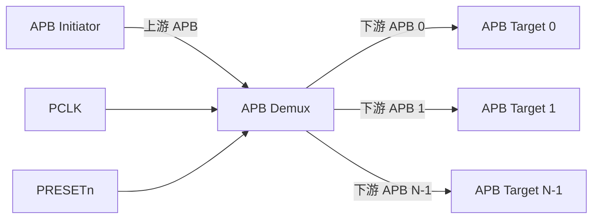

<!-- HLD_DOC_META
schema_version: 2.0

ip_name: apb_demux
ip_display_name: APB Demux (1-to-N APB Router)

delivery_model: parameterized

lrs_baseline: LRS-APB_DEMUX-V100
document_version: 1.0.0
status: draft

architecture_baseline: HLD-APB_DEMUX-V100
END_HLD_DOC_META -->

# APB Demux 架构概述 - 00 Overview

> 本文档是 HLD 文档的一部分，请参阅 [主索引文件](index.md)。

---

## 1. 设计输入与架构目标

### 1.1 输入 Baseline

| 输入 | Baseline / Version | 状态 |
|------|--------------------|------|
| LRS | `LRS-APB_DEMUX-V100` | Frozen |
| AMBA APB Protocol | APB3 / APB4 | Approved |
| Register Requirement | N/A（register_model=none） | N/A |
| Safety Requirement | N/A | N/A |
| Integration Constraint | INF-005 registry 条目 | Approved |

### 1.2 Requirement Summary

| LRS Category | Requirement Count | Architecture Impact |
|--------------|------------------:|---------------------|
| FUNC | 22 | 地址译码/路由/响应/错误/remap/timeout/response register |
| INTF | 6 | 1 上游 APB + N 下游 APB + APB3/APB4 |
| CFG | 9 | NUM_SLAVES/ADDR_WIDTH/DATA_WIDTH/地址映射/可选特性 |
| PERF | 3 | 低延迟/PPA/规模 |
| RESET | 3 | 单时钟 + PRESETn |
| DFX | 3 | 协议断言 |
| CONS | 8 | 配置校验 + 实现约束 |

### 1.3 Architecture Goals

| ID | Architecture Goal | Requirement Source |
|----|-------------------|--------------------|
| HLD.GOAL.APB_DEMUX.001 | 功能闭环：地址译码 + PSEL 生成 + 响应 mux | LRS.FUNC.* |
| HLD.GOAL.APB_DEMUX.002 | 低延迟组合响应路径 | LRS.PERF.APB_DEMUX.01.001 |
| HLD.GOAL.APB_DEMUX.003 | 参数化交付，单套 SV 覆盖所有合法参数组合 | LRS.CONS.APB_DEMUX.02.002 |
| HLD.GOAL.APB_DEMUX.004 | 易验证：确定性译码 + 协议断言 | LRS.DFX.* |
| HLD.GOAL.APB_DEMUX.005 | PPA 友好：decoder 有效位比较 + 平衡 mux | LRS.PERF.APB_DEMUX.02.001 |

### 1.4 Architecture Principles

1. **Requirement Traceable**：关键架构对象可追踪到 LRS；
2. **Clear Ownership**：每项核心功能有明确责任模块；
3. **Configuration Aware**：参数化能力在架构层显式建模；
4. **No Silent Decision**：关键架构取舍记录 ADR；
5. **Performance by Design**：默认组合路径保证低延迟；
6. **Error Path First-Class**：Decode Miss / Timeout 为一级错误路径；
7. **Verification Friendly**：译码确定、状态可观察；
8. **LLD Freedom**：HLD 只冻结必要架构约束。

---

## 2. 系统上下文

### 2.1 System Position

| Item | Description |
|------|-------------|
| Parent Subsystem | SoC Peripheral Bus / APB 子系统 |
| Upstream | APB Initiator（或 X2P Bridge 后级） |
| Downstream | N 个 APB Target |
| Configuration Path | 编译期参数（BASE_ADDR/ADDR_MASK 数组） |
| Data Path | 上游 APB → 译码 + fanout → 下游 APB → mux → 上游 |
| Clock Source | PCLK（单时钟域） |
| Reset Source | PRESETn |

### 2.2 System Context Diagram

---

## 3. 架构边界

### Inside HLD Scope

- 地址译码、PSEL 生成、请求 fanout、响应 mux；
- Decode Miss 错误处理、PSLVERR 透传、wait-state；
- 可选 remap / timeout / response register。

### Outside HLD Scope

- Multiple upstream masters / arbitration；
- CDC / Async APB（独立 APB CDC Bridge 承担）；
- QoS / Security / MPU / Firewall；
- 动态地址重映射 / runtime programmable address map；
- 大规模 Hierarchical APB Interconnect。

---

*文档版本: v1.0*
*创建日期: 2026-09-09*
*创建者: IP Development Suite - 03-hld-architect*
