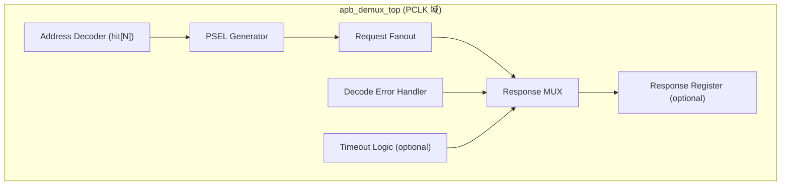

# APB Demux — HLD 架构与模块分解

> 本文档是 HLD 文档的一部分，请参阅 [主索引文件](index.md)。

---

## 1. 系统架构

## 2. L1 模块分解

### 2.0 顶层模块

#### HLD.MOD.L1.APB_DEMUX.TOP 顶层参数化与集成模块

<!-- HLD_MODULE_META
id: HLD.MOD.L1.APB_DEMUX.TOP
name: apb_demux_top
level: 1
parent_id: null
responsibility: 参数化接口、地址译码、PSEL 生成、请求路由、响应 mux、Decode Miss 处理、可选 timeout/response register、单时钟域集成
clock_domains:
  - CLK_APB
reset_domains:
  - RST_APB_N
power_domain: PD_ALWAYS_ON
interfaces:
  - HLD.IF.EXT.APB_DEMUX.UPSTREAM
  - HLD.IF.EXT.APB_DEMUX.DOWNSTREAM
req_ref:
  - LRS.CFG.APB_DEMUX.01.001
  - LRS.CFG.APB_DEMUX.01.002
  - LRS.CFG.APB_DEMUX.01.003
  - LRS.CFG.APB_DEMUX.02.001
  - LRS.CFG.APB_DEMUX.02.002
  - LRS.CFG.APB_DEMUX.04.001
  - LRS.CONS.APB_DEMUX.01.001
  - LRS.CONS.APB_DEMUX.01.002
  - LRS.CONS.APB_DEMUX.01.003
  - LRS.CONS.APB_DEMUX.01.005
  - LRS.CONS.APB_DEMUX.02.001
  - LRS.CONS.APB_DEMUX.02.002
  - LRS.FUNC.APB_DEMUX.01.002
  - LRS.FUNC.APB_DEMUX.01.003
  - LRS.FUNC.APB_DEMUX.02.002
  - LRS.FUNC.APB_DEMUX.03.001
  - LRS.FUNC.APB_DEMUX.03.002
  - LRS.FUNC.APB_DEMUX.04.001
  - LRS.FUNC.APB_DEMUX.04.002
  - LRS.FUNC.APB_DEMUX.05.001
  - LRS.FUNC.APB_DEMUX.05.002
  - LRS.FUNC.APB_DEMUX.05.003
  - LRS.INTF.APB_DEMUX.01.001
  - LRS.INTF.APB_DEMUX.02.001
  - LRS.INTF.APB_DEMUX.03.001
  - LRS.INTF.APB_DEMUX.03.002
  - LRS.PERF.APB_DEMUX.01.001
  - LRS.RESET.APB_DEMUX.01.001
  - LRS.RESET.APB_DEMUX.02.001
  - LRS.RESET.APB_DEMUX.02.002
applicability:
  expr: "true"
END_HLD_MODULE_META -->

##### 需求描述

1. 顶层承载全部编译期参数（`NUM_SLAVES`/`ADDR_WIDTH`/`DATA_WIDTH`/
   `BASE_ADDR[N]`/`ADDR_MASK[N]`/`APB_PROFILE`/`ADDR_REMAP_ENABLE`/
   `TIMEOUT_ENABLE`/`TIMEOUT_CYCLES`/`OUTPUT_REGISTER`）。
2. 组合地址译码（不 latch slave selection），保证 wait-state 期间 selection 不变。
3. 单一 `PCLK` 域，所有下游共享同一时钟。

---

### 2.1 地址译码与 PSEL 生成

#### HLD.MOD.L1.APB_DEMUX.DECODE 地址译码与 PSEL 生成模块

<!-- HLD_MODULE_META
id: HLD.MOD.L1.APB_DEMUX.DECODE
name: apb_demux_decode
level: 1
parent_id: HLD.MOD.L1.APB_DEMUX.TOP
responsibility: 基于 PADDR 与 BASE_ADDR/ADDR_MASK 产生 hit[N] 向量与 one-hot M_PSEL[N]，Decode Miss 检测
clock_domains:
  - CLK_APB
reset_domains:
  - RST_APB_N
power_domain: PD_ALWAYS_ON
interfaces:
  - HLD.IF.EXT.APB_DEMUX.UPSTREAM
req_ref:
  - LRS.FUNC.APB_DEMUX.01.001
  - LRS.FUNC.APB_DEMUX.01.002
  - LRS.FUNC.APB_DEMUX.01.003
  - LRS.FUNC.APB_DEMUX.01.004
  - LRS.FUNC.APB_DEMUX.01.005
  - LRS.FUNC.APB_DEMUX.02.002
  - LRS.FUNC.APB_DEMUX.05.001
  - LRS.DFX.APB_DEMUX.01.001
  - LRS.DFX.APB_DEMUX.01.003
applicability:
  expr: "true"
END_HLD_MODULE_META -->

##### 需求描述

1. `hit[i] = (PADDR & ADDR_MASK[i]) == (BASE_ADDR[i] & ADDR_MASK[i])`。
2. `M_PSEL[i] = upstream_PSEL & hit[i]`，保证 onehot0。
3. 未命中时产生 decode_miss 指示。

---

### 2.2 请求路由与响应 mux

#### HLD.MOD.L1.APB_DEMUX.ROUTE 请求路由与响应 mux 模块

<!-- HLD_MODULE_META
id: HLD.MOD.L1.APB_DEMUX.ROUTE
name: apb_demux_route
level: 1
parent_id: HLD.MOD.L1.APB_DEMUX.TOP
responsibility: 请求信号 fanout、响应信号 mux、PSLVERR 透传、wait-state 保持
clock_domains:
  - CLK_APB
reset_domains:
  - RST_APB_N
power_domain: PD_ALWAYS_ON
interfaces:
  - HLD.IF.EXT.APB_DEMUX.DOWNSTREAM
req_ref:
  - LRS.FUNC.APB_DEMUX.02.001
  - LRS.FUNC.APB_DEMUX.02.003
  - LRS.FUNC.APB_DEMUX.03.002
  - LRS.FUNC.APB_DEMUX.04.001
  - LRS.FUNC.APB_DEMUX.04.002
  - LRS.DFX.APB_DEMUX.01.002
applicability:
  expr: "true"
END_HLD_MODULE_META -->

##### 需求描述

1. `PADDR`/`PENABLE`/`PWRITE`/`PWDATA`/`PSTRB`/`PPROT` 广播至所有下游。
2. 选中端口 `PRDATA`/`PREADY`/`PSLVERR` 返回上游，未选中端口被屏蔽。
3. `PREADY=0` 期间 selection 与 response source 保持稳定。

---

### 2.3 Decode 错误处理

#### HLD.MOD.L1.APB_DEMUX.ERR 错误处理模块

<!-- HLD_MODULE_META
id: HLD.MOD.L1.APB_DEMUX.ERR
name: apb_demux_err
level: 1
parent_id: HLD.MOD.L1.APB_DEMUX.TOP
responsibility: Decode Miss 立即 error 响应、可选 Timeout 终止、可选 Response Register 插入
clock_domains:
  - CLK_APB
reset_domains:
  - RST_APB_N
power_domain: PD_ALWAYS_ON
interfaces:
  - HLD.IF.INT.APB_DEMUX.ERROR_PATH
req_ref:
  - LRS.FUNC.APB_DEMUX.05.002
  - LRS.FUNC.APB_DEMUX.05.003
  - LRS.FUNC.APB_DEMUX.07.001
  - LRS.FUNC.APB_DEMUX.07.002
  - LRS.FUNC.APB_DEMUX.08.001
  - LRS.FUNC.APB_DEMUX.08.002
  - LRS.RESET.APB_DEMUX.02.003
applicability:
  expr: "true"
END_HLD_MODULE_META -->

##### 需求描述

1. Decode Miss 时返回 `PREADY=1, PSLVERR=1, PRDATA=0`，立即结束。
2. `TIMEOUT_ENABLE=1` 时，ACCESS phase 且 `PREADY=0` 达到 `TIMEOUT_CYCLES`
   周期后终止事务并返回 error。
3. `OUTPUT_REGISTER=1` 时插入响应寄存器（不违反 APB 协议）。

---

## 3. 架构分层

| 层 | 模块 | 职责 |
|----|------|------|
| L1 顶层 | `apb_demux_top` | 参数化 + 集成 |
| L1 译码 | `apb_demux_decode` | 地址译码 + PSEL + Decode Miss |
| L1 路由 | `apb_demux_route` | fanout + mux + 透传 |
| L1 错误 | `apb_demux_err` | 错误响应 + timeout + register |

---

*文档版本: v1.0*
*创建日期: 2026-09-09*
*创建者: IP Development Suite - 03-hld-architect*
