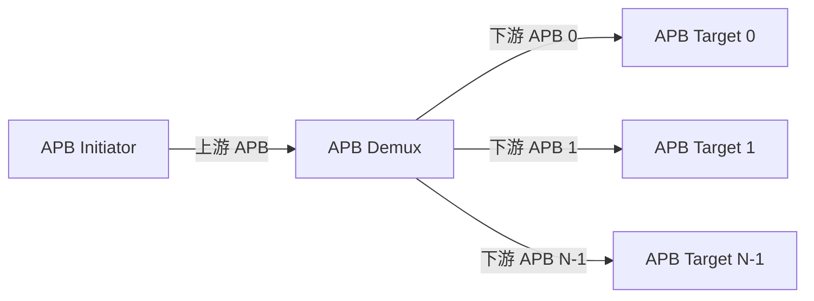

<!-- LRS_DOC_META
schema_version: 2.0

ip_name: apb_demux
ip_display_name: APB Demux (1-to-N APB Router)

delivery_model: parameterized
register_model: none
ppa_signoff: none
ppa_signoff_reason: 本 IP 为轻量级纯逻辑互联（地址译码 + 响应 mux），无存储/时序关键路径，PPA 优化通过综合约束达成，不设独立 PPA signoff 门禁。
document_version: 1.0.0
status: draft

requirement_baseline: LRS-APB_DEMUX-V100
END_LRS_DOC_META -->

# APB Demux IP 概述 - 00 Overview

> 本文档是 LRS 文档的一部分，请参阅 [主索引文件](index.md)。

---

## 1. 应用背景 / Context

APB Demux（1→N APB Router）用于将一个上游 APB 访问端口按照地址空间路由至
多个下游 APB Slave。IP 根据上游 `PADDR` 完成地址译码，产生对应下游端口的
`PSEL`，并将被选中下游端口的 `PRDATA / PREADY / PSLVERR` 返回上游。

典型应用包括：

- SoC Peripheral Bus；
- X2P Bridge 后级 APB fanout；
- 多个低速 Peripheral 的 APB 地址空间组织；
- APB 子系统分层互联。

系统位置：

本 IP 定位为 **简单、确定、参数化的地址译码 + PSEL 生成 + 响应 MUX**，
本质上是 Address Decoder + PSEL Generator + Response MUX 的组合，不演进为
复杂 APB Interconnect。

## 2. 功能简介 / Feature Overview

- 1 个上游 APB Slave-facing interface；
- N 个下游 APB Master-facing interfaces；
- APB3 / APB4 协议支持；
- 可参数化下游端口数量、地址宽度、数据宽度；
- 每个下游端口独立地址区间；
- 地址译码（`PADDR` 与 `BASE_ADDR/ADDR_MASK` 比较）；
- `PSEL` one-hot 生成；
- 请求信号 fanout；
- 返回信号 mux；
- Decode Miss 错误响应（`PREADY=1, PSLVERR=1, PRDATA=0`）；
- APB wait-state 支持；
- PSLVERR 透传；
- 可选地址 offset/remap（`ADDR_REMAP_ENABLE`）；
- 可选 transaction timeout（`TIMEOUT_ENABLE/TIMEOUT_CYCLES`）；
- 可选 response register（`OUTPUT_REGISTER`）；
- 配置合法性检查脚本。

## 3. 配置参数 / Parameters

| 参数 | 默认值 | 说明 |
|------|--------|------|
| `NUM_SLAVES` | 4 | 下游端口数量（1/2/4/8/16，建议 ≤ 32） |
| `ADDR_WIDTH` | 32 | 地址位宽 |
| `DATA_WIDTH` | 32 | 数据位宽 |
| `BASE_ADDR[N]` | - | 每个下游端口基地址 |
| `ADDR_MASK[N]` | - | 每个下游端口地址掩码 |
| `APB_PROFILE` | APB4 | APB3 / APB4 |
| `ADDR_REMAP_ENABLE` | 0 | 是否使能地址 offset/remap |
| `TIMEOUT_ENABLE` | 0 | 是否使能 transaction timeout |
| `TIMEOUT_CYCLES` | 16 | timeout 周期数（`TIMEOUT_ENABLE=1` 时有效） |
| `OUTPUT_REGISTER` | 0 | 是否插入 response register |

默认配置应优先实现：**最小面积 + 最低 transaction latency**。

## 4. 关键设计原则 / Key Principles

1. **协议正确性第一**：不得改变标准 APB transaction semantics（SETUP/ACCESS）。
2. **最小延迟**：默认组合响应路径（`OUTPUT_REGISTER=0`）。
3. **地址译码确定**：`hit[i] = (PADDR & ADDR_MASK[i]) == (BASE_ADDR[i] & ADDR_MASK[i])`。
4. **简单性**：该 IP 保持为 Address Decoder + PSEL Generator + Response MUX，
   不引入多 Master 仲裁 / CDC / 动态重映射 / 可编程地址映射。
5. **参数化**：参数变化不重新生成 RTL，所有合法参数组合复用同一套 SV 实现。

## 5. 不支持范围 / Out of Scope

- Multiple upstream masters；
- Arbitration；
- Outstanding transaction；
- Transaction reordering；
- AXI/APB protocol conversion；
- Clock Domain Crossing（跨时钟访问应通过独立 APB CDC Bridge 完成）；
- Async APB；
- QoS；
- Security / MPU / Firewall；
- Dynamic address remapping；
- Runtime programmable address map。

---

*文档版本: v1.0*
*创建日期: 2026-09-09*
*创建者: IP Development Suite - 01-lrs-author*
