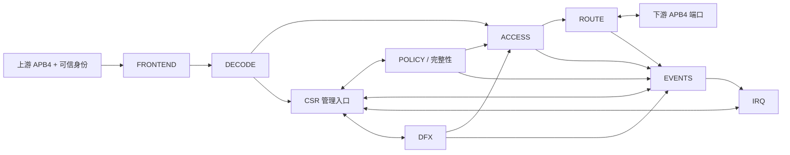

# 架构总览

下游响应和本地响应只有在对应事务上下文有效时才能到达上游。错误产生者输出候选事件；日志选择端口和 IRQ 捕获路径分开，未获记录的事件仍产生对应通知。

## 复用决策

parity_gen_check 0.1.0 为已实现 CBB，PERM 使用 8 bit 偶校验，CFG 补零至 4 bit；校验位比较与故障位置属于 POLICY。
现有 sync_fifo 深度下界为 2 且无同步清空接口，不能直接满足深度 1 和 clear+push；EVENTS 自研合同所需队列。
DECODE/计数相关候选资产为 planned，不能充当实现依赖。具体读取证据见 docs/reuse_plan.md。
