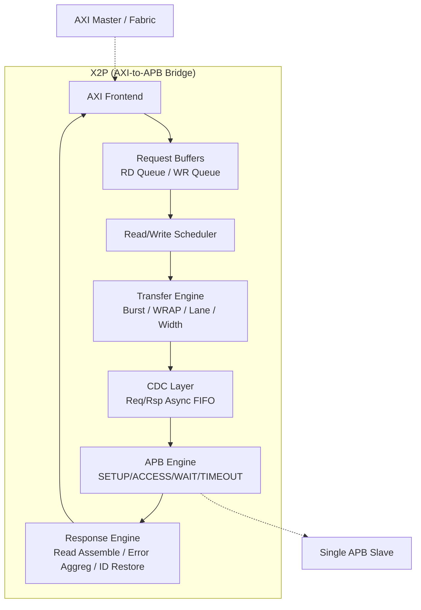

# 01. 总体架构设计 `[必填]`

> 对应原章节：4. 总体架构设计

---

## 4. 总体架构设计

### 4.1 系统上下文

| 外部模块 | 交互方向 | 交互内容 | 接口类型 | 对应 LRS |
|---|---|---|---|---|
| AXI Master / Fabric | AXI → X2P | AXI 读写请求 | AXI4 / AXI4-Lite | LRS.INTF.X2P.01.001 |
| Single APB Slave | X2P → APB Slave | APB 单次传输 | APB3 / APB4 | LRS.INTF.X2P.02.001 |

### 4.2 顶层架构框图

### 4.3 IP 复杂度评估

| 指标 | 当前值 | Simple（≤） | Medium（≤） | Complex（>） |
|------|--------|------------|------------|-------------|
| LRS 需求数量 | 42 | 10 | 30 | 30 |
| 外部接口数量 | 3 | 2 | 5 | 5 |
| 时钟域数量 | 1/2（SYNC/ASYNC 参数化） | 1 | 3 | 3 |
| 寄存器数量 | 0 | 5 | 20 | 20 |
| FSM 数量 | 3 | 1 | 3 | 3 |
| 是否包含 CDC | 是（ASYNC 模式） | 否 | ≤ 3 路径 | > 3 路径 |
| 是否包含安全机制 | 否 | 否 | 基础 | 完整 |

**评估结果**：LRS 需求 > 30 + CDC 路径 ≤3 → **Complex（复杂）**。
采用 L1 模块划分（6 个 L1 模块），LLD 阶段细化 FSM/时序。

### 4.4 动态模块划分

#### 4.4.1 一级模块划分

| 模块 ID | 模块名称 | 主要职责 | 时钟域 | 复位域 | 对应 LRS |
|---|---|---|---|---|---|
| HLD.MOD.L1.X2P.FE | AXI Frontend | AW/W/AR 捕获、AXI 协议状态、B/R 响应握手 | clk_axi | rst_axi_n | INTF.01 / FUNC.01 |
| HLD.MOD.L1.X2P.QB | Request Buffers | 读写请求队列、AW/W 配对、Backpressure | clk_axi | rst_axi_n | FUNC.04 |
| HLD.MOD.L1.X2P.SCH | Scheduler | R/W 仲裁（策略 + 粒度） | clk_axi | rst_axi_n | FUNC.05 |
| HLD.MOD.L1.X2P.TE | Transfer Engine | Burst 跟踪、WRAP 地址、Narrow/宽度转换、APB 子传输生成 | clk_axi | rst_axi_n | FUNC.02/03 |
| HLD.MOD.L1.X2P.CDC | CDC Layer | 请求/响应异步 FIFO（仅 ASYNC） | clk_axi/clk_apb | rst_axi_n/rst_apb_n | FUNC.10 |
| HLD.MOD.L1.X2P.APB | APB Engine | APB FSM、Wait-State、Timeout、响应输出 | clk_apb | rst_apb_n | FUNC.07/08 |
| HLD.MOD.L1.X2P.RSP | Response Engine | 读数据组装、错误聚合、ID 还原、R/B 输出 | clk_axi | rst_axi_n | FUNC.06 |

##### 4.4.1.1 FE AXI Frontend 模块

AXI Frontend 负责 AXI 通道捕获与协议状态管理，不直接接触 APB/CDC。

<!-- HLD_META
id: HLD.MOD.L1.X2P.FE
name: AXI Frontend
level: 1
parent_id: null
responsibility: AW/W/AR 通道 VALID/READY 捕获、AXI 协议状态、B/R 响应握手与 ID 捕获
clock_domain: clk_axi
reset_domain: rst_axi_n
power_domain: PD_ALWAYS_ON
interfaces:
  - name: axi_slave_if
    type: input
    width: N
    description: AXI Slave 接口（AW/W/B/AR/R 五通道）
    source: external
req_ref:
  - LRS.INTF.X2P.01.001
  - LRS.INTF.X2P.01.002
  - LRS.FUNC.X2P.01.001
  - LRS.FUNC.X2P.01.002
END_HLD_META -->

##### 4.4.1.2 QB Request Buffers 模块

Request Buffers 提供读写请求队列与背压，实现 AXI 接受与 APB 执行解耦。

<!-- HLD_META
id: HLD.MOD.L1.X2P.QB
name: Request Buffers
level: 1
parent_id: null
responsibility: 读请求队列、写请求队列、AW/W 配对、Backpressure（READY 控制）、无溢出/下溢
clock_domain: clk_axi
reset_domain: rst_axi_n
power_domain: PD_ALWAYS_ON
interfaces:
  - name: rd_queue_if
    type: output
    width: N
    description: 读请求队列输出（含地址/元数据）
    target: SCH
  - name: wr_queue_if
    type: output
    width: N
    description: 写请求队列输出（含地址/数据/元数据）
    target: SCH
req_ref:
  - LRS.FUNC.X2P.04.001
  - LRS.FUNC.X2P.04.002
  - LRS.PERF.X2P.01.002
END_HLD_META -->

##### 4.4.1.3 SCH Scheduler 模块

Scheduler 负责读写仲裁，支持三种策略与两种粒度。

<!-- HLD_META
id: HLD.MOD.L1.X2P.SCH
name: Scheduler
level: 1
parent_id: null
responsibility: R/W 仲裁（ROUND_ROBIN/READ_PRIORITY/WRITE_PRIORITY）、粒度（BEAT/TRANSACTION）、Beat 原子性维护
clock_domain: clk_axi
reset_domain: rst_axi_n
power_domain: PD_ALWAYS_ON
interfaces:
  - name: sched_if
    type: output
    width: N
    description: 调度出的请求（读写选择）
    target: TE
req_ref:
  - LRS.FUNC.X2P.05.001
  - LRS.FUNC.X2P.05.002
END_HLD_META -->

##### 4.4.1.4 TE Transfer Engine 模块

Transfer Engine 是核心，负责把 AXI transaction 语义转换为 APB transfer 序列。

<!-- HLD_META
id: HLD.MOD.L1.X2P.TE
name: Transfer Engine
level: 1
parent_id: null
responsibility: Burst 跟踪、INCR/FIXED/WRAP 地址生成、4KB 边界、Narrow Lane 计算、数据宽度转换、APB 子传输生成
clock_domain: clk_axi
reset_domain: rst_axi_n
power_domain: PD_ALWAYS_ON
interfaces:
  - name: apb_req_out_if
    type: output
    width: N
    description: APB-sized request 输出（cmd 接口）
    target: CDC
req_ref:
  - LRS.FUNC.X2P.02.001
  - LRS.FUNC.X2P.02.002
  - LRS.FUNC.X2P.02.003
  - LRS.FUNC.X2P.02.004
  - LRS.FUNC.X2P.03.001
  - LRS.FUNC.X2P.03.002
  - LRS.FUNC.X2P.03.003
  - LRS.FUNC.X2P.03.005
  - LRS.FUNC.X2P.03.006
  - LRS.FUNC.X2P.06.005
  - LRS.PERF.X2P.02.001
  - LRS.PERF.X2P.03.001
  - LRS.CONS.X2P.01.001
  - LRS.CONS.X2P.02.001
  - LRS.CONS.X2P.03.001
END_HLD_META -->

##### 4.4.1.5 CDC CDC Layer 模块

CDC Layer 只在 ASYNC 模式下实例化，SYNC 模式下 generate-out。

<!-- HLD_META
id: HLD.MOD.L1.X2P.CDC
name: CDC Layer
level: 1
parent_id: null
responsibility: 请求/响应异步 FIFO CDC（Transaction Level）、FIFO 深度配置、reset 安全
clock_domain: clk_axi
reset_domain: rst_axi_n
power_domain: PD_ALWAYS_ON
interfaces:
  - name: req_cdc_if
    type: output
    width: N
    description: APB request 跨域（ASYNC）
    target: APB
  - name: rsp_cdc_if
    type: output
    width: N
    description: APB response 跨域回 AXI（ASYNC）
    target: RSP
req_ref:
  - LRS.FUNC.X2P.10.001
  - LRS.FUNC.X2P.10.002
  - LRS.FUNC.X2P.10.003
  - LRS.INTF.X2P.03.001
  - LRS.INTF.X2P.03.002
END_HLD_META -->

##### 4.4.1.6 APB APB Engine 模块

APB Engine 输入为单个完整 APB Transfer Descriptor，FSM 纯净。

<!-- HLD_META
id: HLD.MOD.L1.X2P.APB
name: APB Engine
level: 1
parent_id: null
responsibility: APB FSM（SETUP/ACCESS/WAIT/COMPLETE）、Wait-State 保持、Timeout 计数与恢复、back-to-back 传输
clock_domain: clk_apb
reset_domain: rst_apb_n
power_domain: PD_ALWAYS_ON
interfaces:
  - name: apb_master_if
    type: output
    width: N
    description: APB Master 接口（PADDR/PSEL/PENABLE/PWRITE/PWDATA/PRDATA/PREADY/PSLVERR/PSTRB/PPROT）
    target: external
req_ref:
  - LRS.FUNC.X2P.07.001
  - LRS.FUNC.X2P.08.001
  - LRS.FUNC.X2P.08.002
  - LRS.PERF.X2P.01.001
  - LRS.INTF.X2P.02.001
  - LRS.INTF.X2P.02.002
  - LRS.INTF.X2P.03.002
END_HLD_META -->

##### 4.4.1.7 RSP Response Engine 模块

Response Engine 负责 read assembly、error aggregation、ID 还原与 AXI R/B 输出。

<!-- HLD_META
id: HLD.MOD.L1.X2P.RSP
name: Response Engine
level: 1
parent_id: null
responsibility: 读数据组装、写/读错误聚合、BID/RID 还原、R/B 响应 backpressure 稳定性、Ordering 保证
clock_domain: clk_axi
reset_domain: rst_axi_n
power_domain: PD_ALWAYS_ON
interfaces:
  - name: axi_rsp_if
    type: output
    width: N
    description: AXI R/B 响应输出
    target: external
req_ref:
  - LRS.FUNC.X2P.03.004
  - LRS.FUNC.X2P.06.001
  - LRS.FUNC.X2P.06.002
  - LRS.FUNC.X2P.06.003
  - LRS.FUNC.X2P.06.004
  - LRS.FUNC.X2P.09.001
  - LRS.FUNC.X2P.09.002
END_HLD_META -->

#### 4.4.4 模块接口组汇总

| 模块 ID | 接口组名称 | 方向 | 说明 |
|---|---|---|---|
| HLD.MOD.L1.X2P.FE | axi_slave_if | input | AXI Slave 接口 |
| HLD.MOD.L1.X2P.QB | rd_queue_if / wr_queue_if | output | 读/写队列输出 |
| HLD.MOD.L1.X2P.SCH | sched_if | output | 调度输出 |
| HLD.MOD.L1.X2P.TE | apb_req_out_if | output | APB request 输出 |
| HLD.MOD.L1.X2P.CDC | req_cdc_if / rsp_cdc_if | output | CDC 跨域 |
| HLD.MOD.L1.X2P.APB | apb_master_if | output | APB Master |
| HLD.MOD.L1.X2P.RSP | axi_rsp_if | output | AXI 响应 |

### 4.5 架构分层

| 层级 | 内容 | 设计说明 |
|---|---|---|
| 接口层 | AXI Frontend / APB Engine | 协议转换与边界保护 |
| 控制层 | Scheduler / Transfer Engine | 仲裁、burst 引擎、宽度转换 |
| 数据层 | Request Buffers / Response Engine | 缓冲、读组装、错误聚合 |
| 跨域层 | CDC Layer | 异步 FIFO（仅 ASYNC） |