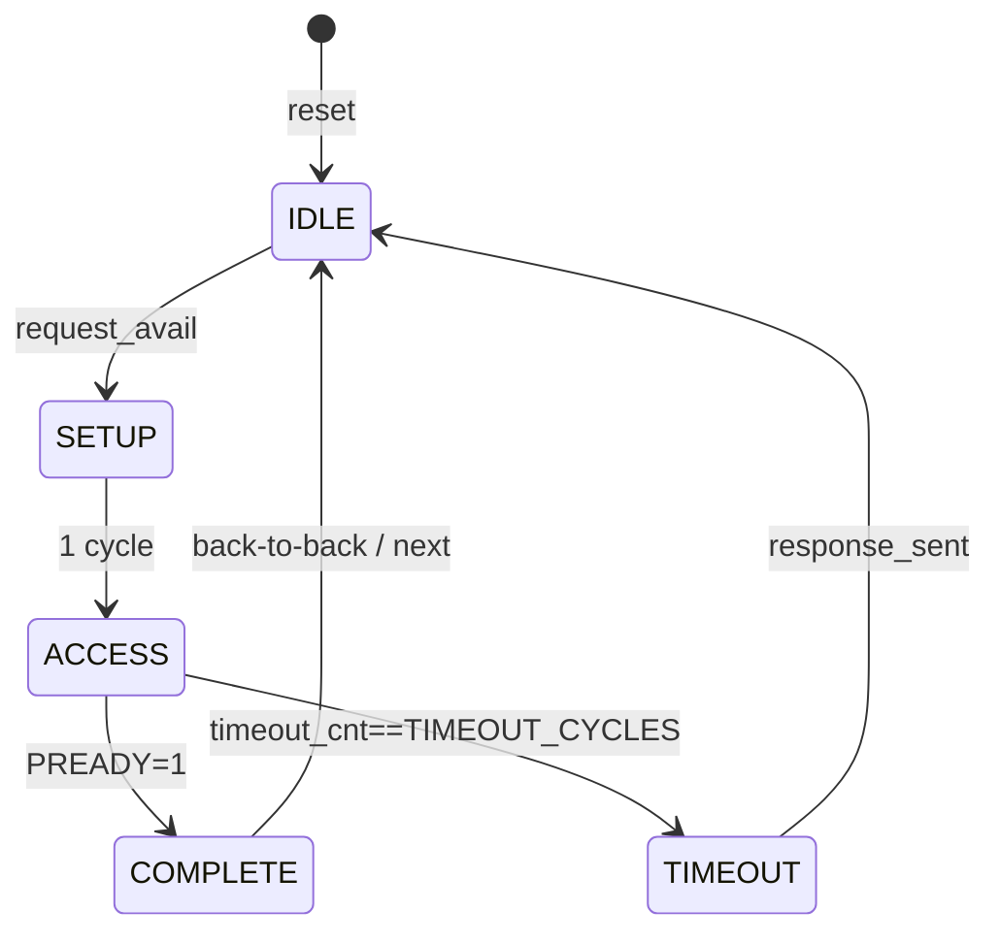
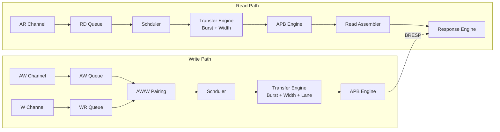

# 02. 功能/控制/数据通路设计 `[必填]`

> 对应原章节：5. 功能分解、8. 控制设计（状态机概览）、9. 数据路径设计

---

## 5. 功能分解

X2P 功能按流水线分解为：接收（AXI Frontend）→ 缓冲（Request Buffers）→ 仲裁
（Scheduler）→ 转换（Transfer Engine）→ 跨域（CDC）→ 执行（APB Engine）→
响应（Response Engine）。

## 8. 控制设计（状态机概览）

### 8.1 主状态机概览

X2P 内部包含三个状态机：

1. **APB Engine FSM**：`IDLE → SETUP → ACCESS → COMPLETE`，ACCESS 期间遇
   PREADY=0 保持，遇 timeout 转 `TIMEOUT` 后回 IDLE。
2. **Read Path FSM**（Transfer Engine 内）：按 AXI Beat 推进，管理拆解子传输。
3. **Write Path FSM**（Transfer Engine 内）：管理 W data 到 APB 子传输的映射。

### 8.2 异常路径

- Timeout 路径：`ACCESS → TIMEOUT → IDLE`，不锁死 FSM。
- 错误聚合：Write 任一子传输出错，BRESP=SLVERR。
- 非法事务：APB3 partial write 或 width 不支持 → 直接返回 SLVERR，不发起 APB access。

## 9. 数据路径设计

- **Write 数据路径**：AXI WDATA → 队列 → 仲裁 → burst/width 拆解 → APB PWDATA/PSTRB。
- **Read 数据路径**：APB PRDATA → 子传输收集 → 组装 AXI RDATA → R 通道。
- **跨域**：在 Transfer Engine 输出处（APB-sized request）跨域，响应在 APB 完成后回传。