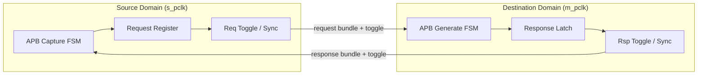

# APB CDC Bridge — HLD 概述

> 本文档是 HLD 文档的一部分，请参阅 [主索引文件](index.md)。

---

## 1. 架构概述

APB CDC Bridge 是一个双时钟域、单事务、协议保持型 APB 跨时钟桥。

## 2. 数据流

**写事务**：上游 SETUP→ACCESS → 捕获 {PADDR,PWRITE,PWDATA,PSTRB,PPROT} → 跨域 →
下游 SETUP→ACCESS（PREADY 等待）→ PSLVERR 捕获 → 跨域返回 → 上游 PREADY。

**读事务**：同上，下游返回 PRDATA 与 PSLVERR 一并跨域返回。

## 3. 设计权衡

| 权衡 | 选择 | 理由 |
|------|------|------|
| CDC 架构 | HANDSHAKE 默认 / ASYNC_FIFO 可选 | APB 单事务低带宽，握手最低面积功耗 |
| 数据同步 | Bundled-data + 单 toggle 握手 | 避免 multi-bit 逐 bit 同步、降低同步器数 |
| 复位 | reset-abort | 避免 timeout/error reconstruction，PPA 优先 |
| FIFO depth | 1/2 | 不引入人工 outstanding |

## 4. IP 复杂度等级

**IP 复杂度等级** | medium

---

*文档版本: v1.0* | *创建日期: 2026-09-07* | *创建者: IP Development Suite - 03-hld-architect*
