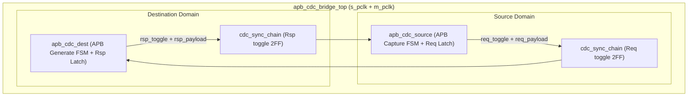

# APB CDC Bridge — HLD 架构与模块分解

> 本文档是 HLD 文档的一部分，请参阅 [主索引文件](index.md)。

---

## 1. 系统架构

## 2. L1 模块分解

### 2.0 顶层模块

#### HLD.MOD.L1.APB_CDC_BRIDGE.TOP 顶层参数化与集成模块

<!-- HLD_META
id: HLD.MOD.L1.APB_CDC_BRIDGE.TOP
name: apb_cdc_bridge_top
level: 1
parent_id: null
responsibility: 参数化接口、非法配置校验、集成约束、CDC 模式策略（ASYNC_SAFE 默认）
clock_domain: SRC_CLK
reset_domain: SRC_RST
power_domain: PD_ALWAYS_ON
interfaces:
  - name: cfg_params
    type: input
    width: N
    description: 编译期参数（ADDR_WIDTH/DATA_WIDTH/CDC_IMPL/SYNC_STAGES 等）
    source: external
req_ref:
  - LRS.CONS.APB_CDC_BRIDGE.01.001
  - LRS.CONS.APB_CDC_BRIDGE.03.001
  - LRS.FUNC.APB_CDC_BRIDGE.04.002
  - LRS.FUNC.APB_CDC_BRIDGE.07.001
  - LRS.INTF.APB_CDC_BRIDGE.03.001
  - LRS.INTF.APB_CDC_BRIDGE.03.002
END_HLD_META -->

##### 需求描述

1. 顶层承载全部编译期参数并执行非法配置 assertion（`ADDR_WIDTH<=0`、`DATA_WIDTH%8!=0`、`SYNC_STAGES<2`、非法 CDC_IMPL/FIFO depth/APB profile）。
2. 承载 CDC_MODE=ASYNC_SAFE 默认策略，不自动判断时钟同步关系。
3. 集成约束（地址空间由外部互连保证、reset 各自同步）在顶层文档固化。

---

### 2.1 源域模块

#### HLD.MOD.L1.APB_CDC_BRIDGE.SOURCE 源域 APB 捕获模块

<!-- HLD_META
id: HLD.MOD.L1.APB_CDC_BRIDGE.SOURCE
name: apb_cdc_source
level: 1
parent_id: HLD.MOD.L1.APB_CDC_BRIDGE.TOP
responsibility: 上游 APB 事务捕获与锁存、请求握手发起、响应返回
clock_domain: SRC_CLK
reset_domain: SRC_RST
power_domain: PD_ALWAYS_ON
interfaces:
  - name: s_apb
    type: input
    width: N
    description: 上游 APB Slave 接口
    source: external
  - name: req_channel
    type: output
    width: N
    description: Request bundle + req_toggle 输出（跨域）
    target: apb_cdc_dest
req_ref:
  - LRS.INTF.APB_CDC_BRIDGE.01.001
  - LRS.INTF.APB_CDC_BRIDGE.01.002
  - LRS.INTF.APB_CDC_BRIDGE.03.001
  - LRS.INTF.APB_CDC_BRIDGE.03.002
  - LRS.FUNC.APB_CDC_BRIDGE.01.001
  - LRS.FUNC.APB_CDC_BRIDGE.01.002
  - LRS.FUNC.APB_CDC_BRIDGE.01.003
  - LRS.FUNC.APB_CDC_BRIDGE.03.001
  - LRS.FUNC.APB_CDC_BRIDGE.05.001
  - LRS.FUNC.APB_CDC_BRIDGE.08.001
  - LRS.FUNC.APB_CDC_BRIDGE.09.001
  - LRS.LP.APB_CDC_BRIDGE.01.001
  - LRS.LP.APB_CDC_BRIDGE.02.001
  - LRS.PERF.APB_CDC_BRIDGE.01.001
  - LRS.CONS.APB_CDC_BRIDGE.02.001
  - LRS.DFX.APB_CDC_BRIDGE.01.001
END_HLD_META -->

##### 需求描述

1. 在 `s_psel && s_penable` 时捕获 Request bundle {PADDR, PWRITE, PWDATA, PSTRB, PPROT}。
2. 锁存请求，发起 Req Toggle 握手，等待目的域 ack。
3. 收到 Rsp Toggle 后返回 `s_pready`/`s_prdata`/`s_pslverr`。
4. 单事务语义：任一时刻最多一个跨桥事务；`s_pready` 仅在跨桥完成或本地确定错误时拉高。
5. 负载寄存器仅在接受新事务时更新（低翻转）。

---

### 2.2 目的域模块

#### HLD.MOD.L1.APB_CDC_BRIDGE.DEST 目的域 APB 重新生成模块

<!-- HLD_META
id: HLD.MOD.L1.APB_CDC_BRIDGE.DEST
name: apb_cdc_dest
level: 1
parent_id: HLD.MOD.L1.APB_CDC_BRIDGE.TOP
responsibility: 请求检测、下游 APB 事务重新生成、响应锁存与返回握手
clock_domain: DST_CLK
reset_domain: DST_RST
power_domain: PD_ALWAYS_ON
interfaces:
  - name: m_apb
    type: output
    width: N
    description: 下游 APB Master 接口
    target: external
  - name: req_channel
    type: input
    width: N
    description: Request bundle + req_toggle 输入（跨域）
    source: apb_cdc_source
  - name: rsp_channel
    type: output
    width: N
    description: Response bundle + rsp_toggle 输出（跨域）
    target: apb_cdc_source
req_ref:
  - LRS.INTF.APB_CDC_BRIDGE.02.001
  - LRS.INTF.APB_CDC_BRIDGE.02.002
  - LRS.INTF.APB_CDC_BRIDGE.03.001
  - LRS.INTF.APB_CDC_BRIDGE.03.002
  - LRS.FUNC.APB_CDC_BRIDGE.02.001
  - LRS.FUNC.APB_CDC_BRIDGE.02.002
  - LRS.FUNC.APB_CDC_BRIDGE.02.003
  - LRS.FUNC.APB_CDC_BRIDGE.03.001
  - LRS.FUNC.APB_CDC_BRIDGE.04.001
  - LRS.FUNC.APB_CDC_BRIDGE.04.002
  - LRS.FUNC.APB_CDC_BRIDGE.06.001
  - LRS.FUNC.APB_CDC_BRIDGE.08.001
  - LRS.FUNC.APB_CDC_BRIDGE.09.001
  - LRS.LP.APB_CDC_BRIDGE.02.001
  - LRS.PERF.APB_CDC_BRIDGE.01.001
  - LRS.CONS.APB_CDC_BRIDGE.02.001
  - LRS.DFX.APB_CDC_BRIDGE.01.001
END_HLD_META -->

##### 需求描述

1. 检测 Req Toggle 变化后，在 m_pclk 域执行 IDLE→SETUP→ACCESS→COMPLETE。
2. 保持 wait-state 输出稳定直到 `m_pready`。
3. 捕获 `m_prdata`/`m_pslverr`，发起 Rsp Toggle 返回源域。
4. ASYNC_FIFO profile 时承载 Request/Response CDC FIFO（深度 1/2），保持单事务语义。

---

### 2.3 CDC 同步链

#### HLD.MOD.L1.APB_CDC_BRIDGE.SYNC CDC 同步器模块

<!-- HLD_META
id: HLD.MOD.L1.APB_CDC_BRIDGE.SYNC
name: cdc_sync_chain
level: 1
parent_id: HLD.MOD.L1.APB_CDC_BRIDGE.TOP
responsibility: 提供 SYNC_STAGES 级 2FF synchronizer，同步 req/rsp toggle 控制
clock_domain: DST_CLK
reset_domain: DST_RST
power_domain: PD_ALWAYS_ON
interfaces:
  - name: sync_in
    type: input
    width: 1
    description: 异步 toggle 输入
    source: apb_cdc_source
  - name: sync_out
    type: output
    width: 1
    description: 同步后 toggle 输出
    target: apb_cdc_dest
req_ref:
  - LRS.FUNC.APB_CDC_BRIDGE.03.001
  - LRS.FUNC.APB_CDC_BRIDGE.03.002
  - LRS.PERF.APB_CDC_BRIDGE.01.002
  - LRS.PERF.APB_CDC_BRIDGE.02.001
  - LRS.CONS.APB_CDC_BRIDGE.02.001
END_HLD_META -->

##### 需求描述

1. 提供可配置 `SYNC_STAGES >= 2` 级同步器链。
2. 仅同步 req/rsp toggle 控制信号，payload 通过 bundled-data 保护。
3. 同步器 FF 随 SYNC_STAGES 线性增长；仅同步必要 control（最少同步器）。

---

## 3. 模块汇总

| module_id | name | responsibility | req_ref |
|-----------|------|----------------|---------|
| HLD.MOD.L1.APB_CDC_BRIDGE.TOP | apb_cdc_bridge_top | 参数化/配置校验/集成约束 | LRS.CONS.APB_CDC_BRIDGE.01.001 |
| HLD.MOD.L1.APB_CDC_BRIDGE.SOURCE | apb_cdc_source | 上游捕获与响应返回 | LRS.FUNC.APB_CDC_BRIDGE.01.001 |
| HLD.MOD.L1.APB_CDC_BRIDGE.DEST | apb_cdc_dest | 下游重新生成与响应锁存 | LRS.FUNC.APB_CDC_BRIDGE.02.001 |
| HLD.MOD.L1.APB_CDC_BRIDGE.SYNC | cdc_sync_chain | CDC 同步器链 | LRS.FUNC.APB_CDC_BRIDGE.03.001 |

## 4. 内部接口（HLD_INT_IF_META）

### 4.1 Request 通道

#### HLD.IF.INT.APB_CDC_BRIDGE.REQ_CH Request 跨域通道

<!-- HLD_INT_IF_META
id: HLD.IF.INT.APB_CDC_BRIDGE.REQ_CH
name: req_channel
type: bundled-data handshake
source_module: HLD.MOD.L1.APB_CDC_BRIDGE.SOURCE
target_module: HLD.MOD.L1.APB_CDC_BRIDGE.DEST
description: 源域到目的域的 Request payload + toggle 握手通道
signals:
  - name: req_payload
    width: PACKED_BUNDLE
    direction: from_source
    clock_domain: SRC_CLK
  - name: req_toggle
    width: 1
    direction: from_source
    clock_domain: SRC_CLK
  - name: req_ack_toggle
    width: 1
    direction: to_source
    clock_domain: DST_CLK
timing:
  protocol: handshake
  ack: toggle-echo
req_ref:
  - LRS.FUNC.APB_CDC_BRIDGE.03.001
END_HLD_INT_IF_META -->

##### 需求描述

1. 源域发起 `req_toggle`，payload 保持稳定，等待目的域 `req_ack_toggle` 同步回源。

---

### 4.2 Response 通道

#### HLD.IF.INT.APB_CDC_BRIDGE.RSP_CH Response 跨域通道

<!-- HLD_INT_IF_META
id: HLD.IF.INT.APB_CDC_BRIDGE.RSP_CH
name: rsp_channel
type: bundled-data handshake
source_module: HLD.MOD.L1.APB_CDC_BRIDGE.DEST
target_module: HLD.MOD.L1.APB_CDC_BRIDGE.SOURCE
description: 目的域到源域的 Response payload + toggle 握手通道
signals:
  - name: rsp_payload
    width: PACKED_BUNDLE
    direction: from_source
    clock_domain: DST_CLK
  - name: rsp_toggle
    width: 1
    direction: from_source
    clock_domain: DST_CLK
  - name: rsp_ack_toggle
    width: 1
    direction: to_source
    clock_domain: SRC_CLK
timing:
  protocol: handshake
  ack: toggle-echo
req_ref:
  - LRS.FUNC.APB_CDC_BRIDGE.03.001
END_HLD_INT_IF_META -->

##### 需求描述

1. 目的域发起 `rsp_toggle`，payload 保持稳定，等待源域 `rsp_ack_toggle` 同步回目的。

---

*文档版本: v1.0* | *创建日期: 2026-09-07* | *创建者: IP Development Suite - 03-hld-architect*
