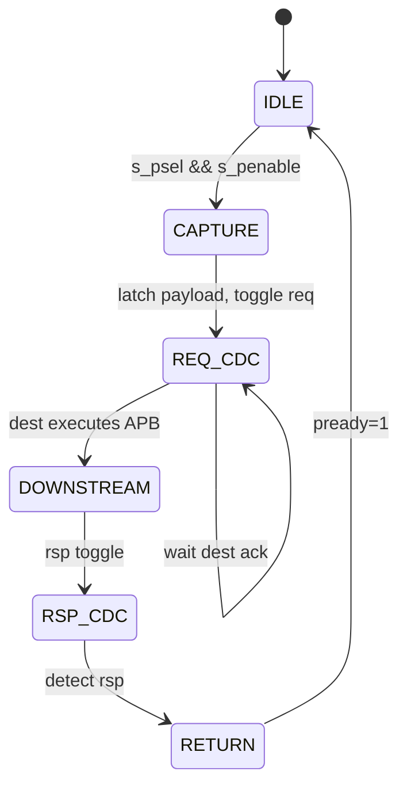

# APB CDC Bridge — HLD 功能行为

> 本文档是 HLD 文档的一部分，请参阅 [主索引文件](index.md)。

---

## 1. 上游捕获流程

1. 上游 APB Initiator 发起 SETUP（`s_psel=1, s_penable=0`）→ ACCESS（`s_penable=1`）。
2. 源域 Capture FSM 在 ACCESS 且无 pending 事务时锁存 Request payload。
3. 若已有 pending 事务（未返回），`s_pready` 保持 0，等待。
4. 锁存后发起 Req Toggle，进入等待目的域 ack 状态。

## 2. 下游重新生成流程

1. 目的域检测 Req Toggle 变化，读入 Request payload。
2. FSM：IDLE → SETUP（`m_psel=1, m_penable=0`）→ ACCESS（`m_penable=1`）。
3. ACCESS 期间保持输出稳定直到 `m_pready=1`。
4. 完成时捕获 `m_prdata`（读）与 `m_pslverr`，锁存 Response payload，发起 Rsp Toggle。

## 3. 响应返回流程

1. 源域检测 Rsp Toggle 变化，读入 Response payload。
2. 返回 `s_pready=1`、`s_prdata`、`s_pslverr` 一个周期。
3. 清除 pending，准备下一个事务。

## 4. 事务状态机（顶层视角）

## 5. Wait-State 行为

- 上游 wait：`s_pready=0` 保持到跨桥完成（快→慢关键）。
- 下游 wait：`m_pready=0` 保持输出稳定（任意 wait 数）。

## 6. 时钟暂停行为

- `m_pclk` 暂停：事务保持 pending，恢复后继续。
- `s_pclk` 暂停：目的域可完成事务，响应保持至源时钟恢复。

---

*文档版本: v1.0* | *创建日期: 2026-09-07* | *创建者: IP Development Suite - 03-hld-architect*
