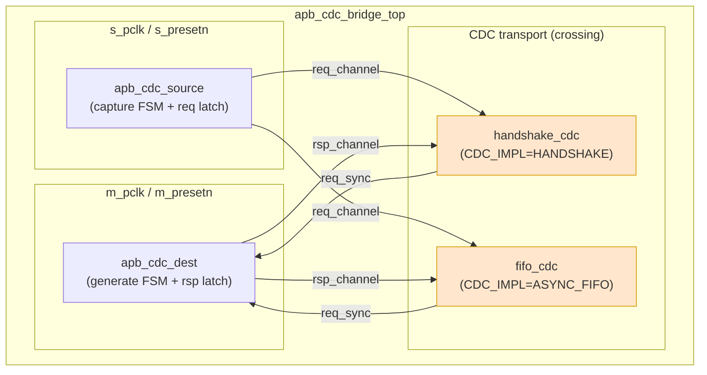

# APB CDC Bridge — LLD 微架构概述

> 本文档是 LLD 文档的一部分，请参阅 [主索引文件](index.md)。

---

## 1. 微架构概览

## 2. CDC 实现隔离策略

- **统一接口契约**：所有 CDC 实现对外暴露一致的 `req_channel`/`rsp_channel`
  （payload + toggle + ack），源/目的 FSM 不感知底层实现。
- **参数选择**：`CDC_IMPL` 决定例化哪个实现；两种实现不会同时例化。
- **语义一致**：两种实现均保持单事务、bundled-data、SYNC_STAGES 语义。

## 3. 关键信号

| 信号 | 位宽 | 说明 |
|------|------|------|
| `req_payload` | `{PADDR,PWRITE,PWDATA,PSTRB,PPROT}` | 请求包 |
| `req_toggle` | 1 | 请求 toggle（源→目的） |
| `req_ack_toggle` | 1 | 请求 ack（目的→源） |
| `rsp_payload` | `{PRDATA,PSLVERR}` | 响应包 |
| `rsp_toggle` | 1 | 响应 toggle（目的→源） |
| `rsp_ack_toggle` | 1 | 响应 ack（源→目的） |

---

*文档版本: v1.0* | *创建日期: 2026-09-07* | *创建者: IP Development Suite - 05-lld-microdesign*
