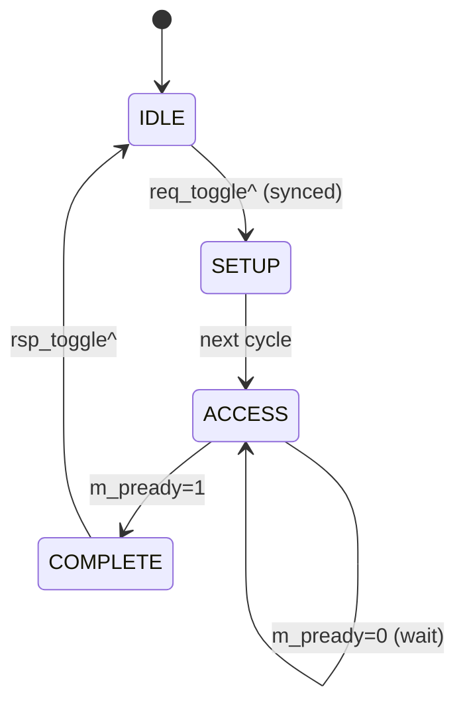

# APB CDC Bridge — LLD DEST 模块微设计

> 本文档是 LLD 文档的一部分，请参阅 [主索引文件](index.md)。

---

## 1. 模块定义

### 1.1 目的域生成模块

#### LLD.MOD.APB_CDC_BRIDGE.DEST 目的域 APB 生成模块

<!-- LLD_META
module_id: LLD.MOD.APB_CDC_BRIDGE.DEST
hld_ref: HLD.MOD.L1.APB_CDC_BRIDGE.DEST
fsm:
  - id: LLD.FSM.APB_CDC_BRIDGE.DEST_GENERATE
    name: dest_generate_fsm
    encoding_style: one_hot
    reset_state: IDLE
    states:
      - name: IDLE
      - name: SETUP
      - name: ACCESS
      - name: COMPLETE
    transitions:
      - from: IDLE
        to: SETUP
        condition: req_toggle 变化（同步后）
      - from: SETUP
        to: ACCESS
        condition: 下一 m_pclk 周期
      - from: ACCESS
        to: COMPLETE
        condition: m_pready=1
      - from: COMPLETE
        to: IDLE
        condition: rsp_toggle 翻转（发起响应）
    illegal_state_handling: return_to_reset
cdc:
  - signal: rsp_toggle
    source_domain: DST_CLK
    target_domain: SRC_CLK
    strategy: two_flop
  - signal: rsp_payload
    source_domain: DST_CLK
    target_domain: SRC_CLK
    strategy: bundled_data_handshake
reset:
  - signal: m_presetn
    polarity: active_low
    reset_value: "0"
    reset_type: async
datapath:
  pipeline_stages:
    - stage: "1"
      name: regenerate
      operation: "IDLE→SETUP→ACCESS→COMPLETE 重新生成 APB 事务"
  backpressure:
    type: wait_state
    mechanism: "m_pready=0 保持输出稳定"
ppa:
  performance:
    target_frequency: ">=800MHz"
    throughput: "1 事务/往返"
    max_latency: "SETUP 1 + ACCESS wait + COMPLETE 1"
    critical_path: "request detect → APB FSM → m_psel/m_penable"
  area:
    budget: "响应寄存器 1 组"
    optimization: "无多余 FSM 状态"
  power:
    budget: "idle 输出稳定"
    techniques: "SETUP/ACCESS 输出仅在事务期翻转"
  tradeoffs:
    - option: "独立 SETUP/ACCESS 状态 vs 合并"
      choice: "独立 SETUP/ACCESS（符合 APB 协议）"
      rationale: "满足 LRS.FUNC.02.001 下游 SETUP 先于 ACCESS"
END_LLD_META -->

##### 需求描述

1. 检测 Req Toggle 变化后执行 IDLE→SETUP→ACCESS→COMPLETE。
2. wait-state 期间保持 `m_psel/m_penable/m_paddr/m_pwrite/m_pwdata/m_pstrb/m_pprot` 稳定。
3. `m_psel && m_penable && m_pready` 时完成，捕获 `m_prdata`/`m_pslverr`，发起 Rsp Toggle。

---

## 2. FSM 时序

## 3. 信号定义

| 信号 | 方向 | 位宽 | 说明 |
|------|------|------|------|
| `req_toggle` | in | 1 | 请求 toggle（同步后） |
| `req_payload` | in | bundle | 请求包 |
| `req_ack_toggle` | out | 1 | 请求 ack toggle |
| `m_psel/m_penable/m_pwrite` | out | 1 | 下游 APB 控制 |
| `m_paddr/m_pwdata/m_pstrb/m_pprot` | out | N | 下游 APB 数据 |
| `m_prdata/m_pready/m_pslverr` | in | N | 下游响应 |
| `rsp_payload` | out | bundle | 响应包（保持稳定直到 ack） |
| `rsp_toggle` | out | 1 | 响应 toggle |
| `rsp_ack_toggle` | in | 1 | 源域 ack（同步后） |

## 4. 关键行为

- **wait-state**：`m_pready=0` 保持输出稳定（任意 wait 数）。
- **复位**：`m_presetn` 复位 FSM 与响应寄存器；复位中止进行中事务。
- **时钟暂停**：`m_pclk` 暂停时状态保持，恢复后继续。

---

*文档版本: v1.0* | *创建日期: 2026-09-07* | *创建者: IP Development Suite - 05-lld-microdesign*
