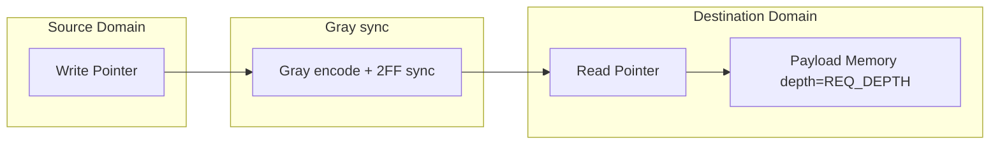

# APB CDC Bridge — LLD ASYNC_FIFO CDC 实现微设计

> 本文档是 LLD 文档的一部分，请参阅 [主索引文件](index.md)。

---

## 1. 模块定义

### 1.1 ASYNC_FIFO CDC 实现模块

#### LLD.MOD.APB_CDC_BRIDGE.FIFO_CDC ASYNC_FIFO CDC 实现模块

<!-- LLD_META
module_id: LLD.MOD.APB_CDC_BRIDGE.FIFO_CDC
hld_ref: HLD.MOD.L1.APB_CDC_BRIDGE.DEST
fsm:
  - id: LLD.FSM.APB_CDC_BRIDGE.FIFO_PUSH
    name: fifo_push_fsm
    encoding_style: auto
    reset_state: IDLE
    states:
      - name: IDLE
      - name: PUSH
    transitions:
      - from: IDLE
        to: PUSH
        condition: "req_toggle 有效且 FIFO 非满"
      - from: PUSH
        to: IDLE
        condition: "写入完成"
    illegal_state_handling: return_to_reset
cdc:
  - signal: wptr
    source_domain: SRC_CLK
    target_domain: DST_CLK
    strategy: gray_pointer
  - signal: rptr
    source_domain: DST_CLK
    target_domain: SRC_CLK
    strategy: gray_pointer
  - signal: req_payload
    source_domain: SRC_CLK
    target_domain: DST_CLK
    strategy: async_fifo
  - signal: rsp_payload
    source_domain: DST_CLK
    target_domain: SRC_CLK
    strategy: async_fifo
reset:
  - signal: s_presetn
    polarity: active_low
    reset_value: "0"
    reset_type: async
  - signal: m_presetn
    polarity: active_low
    reset_value: "0"
    reset_type: async
datapath:
  pipeline_stages:
    - stage: "1"
      name: req_fifo
      operation: "request payload FIFO（REQ_DEPTH）"
    - stage: "2"
      name: rsp_fifo
      operation: "response payload FIFO（RSP_DEPTH）"
  backpressure:
    type: fifo_full
    mechanism: "满则暂缓写入，保持单事务"
ppa:
  performance:
    target_frequency: ">=800MHz"
    throughput: "1 事务/往返（无人工 outstanding）"
    max_latency: "类似握手 + FIFO 深度"
    critical_path: "指针 → 灰度同步 → 比较"
  area:
    budget: "FIFO 存储（depth*payload_width）"
    optimization: "REQ_DEPTH/RSP_DEPTH 1/2"
  power:
    budget: "略高（FIFO 指针翻转）"
    techniques: "idle 指针不变化"
  tradeoffs:
    - option: "FIFO vs 握手"
      choice: "ASYNC_FIFO 仅按需（BUFFERED profile）"
      rationale: "满足 LRS.FUNC.04.001；不引入人工 outstanding（LRS.FUNC.04.001#4）"
END_LLD_META -->

##### 需求描述

1. Request payload 打包为 `{PADDR, PWRITE, PWDATA, PSTRB, PPROT}` 进入 CDC FIFO；Response payload 打包为 `{PRDATA, PSLVERR}`。
2. 推荐 `REQ_DEPTH = 1/2`、`RSP_DEPTH = 1/2`。
3. 即使 FIFO depth > 1，保持单事务完成语义（No Artificial Outstanding）。
4. 仅实现 `CDC_IMPL = ASYNC_FIFO` 时例化。

---

## 2. FIFO 结构

## 3. 隔离声明

- `CDC_IMPL=ASYNC_FIFO` 时 TOP 仅例化 `fifo_cdc`，不例化 `handshake_cdc`。
- FIFO 的写指针、读指针、灰度同步、memory 为独立单元，与握手实现无共享数据通路。
- 单事务语义由源/目的 FSM 保证，FIFO depth 不改变该语义。

## 4. PPA 特性

- 提供更强 decoupling（深度 1/2）。
- 面积随 depth 与 payload 宽度线性增长。

---

*文档版本: v1.0* | *创建日期: 2026-09-07* | *创建者: IP Development Suite - 05-lld-microdesign*
