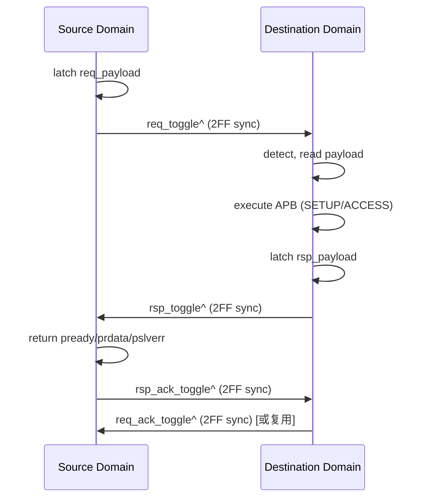

# APB CDC Bridge — LLD HANDSHAKE CDC 实现微设计

> 本文档是 LLD 文档的一部分，请参阅 [主索引文件](index.md)。

---

## 1. 模块定义

### 1.1 HANDSHAKE CDC 实现模块

#### LLD.MOD.APB_CDC_BRIDGE.HS_CDC HANDSHAKE CDC 实现模块

<!-- LLD_META
module_id: LLD.MOD.APB_CDC_BRIDGE.HS_CDC
hld_ref: HLD.MOD.L1.APB_CDC_BRIDGE.DEST
fsm:
  - id: LLD.FSM.APB_CDC_BRIDGE.HS_REQ
    name: hs_req_handshake
    encoding_style: auto
    reset_state: IDLE
    states:
      - name: IDLE
      - name: REQ_ISSUED
      - name: WAIT_ACK
    transitions:
      - from: IDLE
        to: REQ_ISSUED
        condition: "req_toggle 翻转"
      - from: REQ_ISSUED
        to: WAIT_ACK
        condition: "req 到达目的域（toggle 同步）"
      - from: WAIT_ACK
        to: IDLE
        condition: "req_ack_toggle 同步回源"
    illegal_state_handling: return_to_reset
cdc:
  - signal: req_toggle
    source_domain: SRC_CLK
    target_domain: DST_CLK
    strategy: two_flop
  - signal: req_ack_toggle
    source_domain: DST_CLK
    target_domain: SRC_CLK
    strategy: two_flop
  - signal: rsp_toggle
    source_domain: DST_CLK
    target_domain: SRC_CLK
    strategy: two_flop
  - signal: rsp_ack_toggle
    source_domain: SRC_CLK
    target_domain: DST_CLK
    strategy: two_flop
  - signal: req_payload
    source_domain: SRC_CLK
    target_domain: DST_CLK
    strategy: bundled_data_handshake
  - signal: rsp_payload
    source_domain: DST_CLK
    target_domain: SRC_CLK
    strategy: bundled_data_handshake
reset:
  - signal: s_presetn
    polarity: active_low
    reset_value: "0"
    reset_type: async
  - signal: m_presetn
    polarity: active_low
    reset_value: "0"
    reset_type: async
datapath:
  pipeline_stages:
    - stage: "1"
      name: req_latch
      operation: "request 寄存器（源域）"
    - stage: "2"
      name: rsp_latch
      operation: "response 寄存器（目的域）"
  backpressure:
    type: wait_state
    mechanism: "ack 前 payload 保持稳定"
ppa:
  performance:
    target_frequency: ">=800MHz"
    throughput: "1 事务/握手往返"
    max_latency: "约 2*SYNC_STAGES + 2 周期"
    critical_path: "toggle → 2FF → FSM"
  area:
    budget: "最小（1 req reg + 1 rsp reg + 4 toggle sync）"
    optimization: "最少同步器、最少 FIFO 指针逻辑"
  power:
    budget: "最低"
    techniques: "idle 无翻转；payload 按需更新"
  tradeoffs:
    - option: "握手 vs FIFO"
      choice: "HANDSHAKE 默认（LOW_AREA/BALANCED/HIGH_RELIABILITY）"
      rationale: "满足 LRS.FUNC.03.001 与 PPA 优先，面积显著低于 full async FIFO"
END_LLD_META -->

##### 需求描述

1. 采用 bundled-data handshake：request/response payload 打包后由单一 toggle 经 SYNC_STAGES 级同步器跨域。
2. Request payload 在 destination acknowledgement 前不得变化；Response payload 在 source acknowledgement 前不得变化。
3. 仅实现 `CDC_IMPL = HANDSHAKE` 时例化。

---

## 2. 握手结构

## 3. 隔离声明

- `CDC_IMPL=HANDSHAKE` 时 TOP 仅例化 `handshake_cdc`，不例化 `fifo_cdc`。
- 握手实现的 payload 寄存器、toggle 同步器、ack 逻辑为独立单元，与 FIFO 实现无共享数据通路。

## 4. PPA 特性

- 单 Request payload register、单 Response payload register、最少 toggle control、最少 synchronizer、最少 FIFO pointer logic。
- 典型面积显著低于 full async FIFO。

---

*文档版本: v1.0* | *创建日期: 2026-09-07* | *创建者: IP Development Suite - 05-lld-microdesign*
