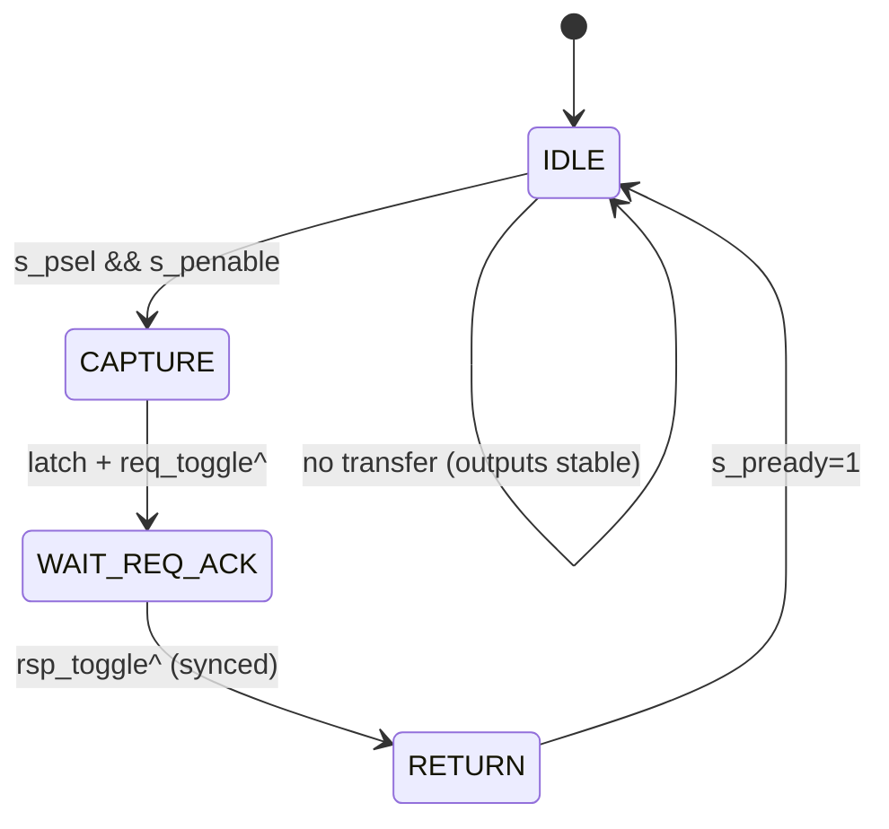

# APB CDC Bridge — LLD SOURCE 模块微设计

> 本文档是 LLD 文档的一部分，请参阅 [主索引文件](index.md)。

---

## 1. 模块定义

### 1.1 源域捕获模块

#### LLD.MOD.APB_CDC_BRIDGE.SOURCE 源域 APB 捕获模块

<!-- LLD_META
module_id: LLD.MOD.APB_CDC_BRIDGE.SOURCE
hld_ref: HLD.MOD.L1.APB_CDC_BRIDGE.SOURCE
fsm:
  - id: LLD.FSM.APB_CDC_BRIDGE.SOURCE_CAPTURE
    name: source_capture_fsm
    encoding_style: one_hot
    reset_state: IDLE
    states:
      - name: IDLE
      - name: CAPTURE
      - name: WAIT_REQ_ACK
      - name: RETURN
    transitions:
      - from: IDLE
        to: CAPTURE
        condition: s_psel && s_penable
      - from: CAPTURE
        to: WAIT_REQ_ACK
        condition: "捕获完成，req_toggle 翻转"
      - from: WAIT_REQ_ACK
        to: RETURN
        condition: rsp_toggle 变化（同步后）
      - from: RETURN
        to: IDLE
        condition: s_pready=1 一个周期
    illegal_state_handling: return_to_reset
cdc:
  - signal: req_toggle
    source_domain: SRC_CLK
    target_domain: DST_CLK
    strategy: two_flop
  - signal: rsp_toggle
    source_domain: DST_CLK
    target_domain: SRC_CLK
    strategy: two_flop
  - signal: req_payload
    source_domain: SRC_CLK
    target_domain: DST_CLK
    strategy: bundled_data_handshake
  - signal: rsp_payload
    source_domain: DST_CLK
    target_domain: SRC_CLK
    strategy: bundled_data_handshake
reset:
  - signal: s_presetn
    polarity: active_low
    reset_value: "0"
    reset_type: async
datapath:
  pipeline_stages:
    - stage: "1"
      name: capture
      operation: "锁存 {PADDR,PWRITE,PWDATA,PSTRB,PPROT}"
  backpressure:
    type: wait_state
    mechanism: "s_pready=0 until cross-bridge complete"
ppa:
  performance:
    target_frequency: ">=800MHz"
    throughput: "1 事务/往返"
    max_latency: "捕获 1 周期 + 等待跨域"
    critical_path: "s_psel/s_penable → req_toggle → s_pready"
  area:
    budget: "payload 寄存器 1 组"
    optimization: "仅接受新事务时更新"
  power:
    budget: "idle 无翻转"
    techniques: "payload 使能写；输出稳定"
  tradeoffs:
    - option: "单请求寄存器 vs FIFO"
      choice: "HANDSHAKE 单寄存器；FIFO 由 dest 侧提供"
      rationale: "最小面积，满足 LRS.LP.01.001"
END_LLD_META -->

##### 需求描述

1. 在 `s_psel && s_penable` 时捕获 Request bundle。
2. 单事务语义：任一时刻一个跨桥事务，`s_pready` 仅跨桥完成或本地错误时拉高。
3. 收到 Rsp Toggle 变化后返回 `s_prdata`/`s_pslverr`。

---

## 2. FSM 时序

## 3. 信号定义

| 信号 | 方向 | 位宽 | 说明 |
|------|------|------|------|
| `s_psel/s_penable` | in | 1 | 上游 APB 控制 |
| `s_paddr/s_pwdata/s_pwrite/s_pstrb/s_pprot` | in | N | 捕获 payload |
| `s_prdata/s_pready/s_pslverr` | out | N | 返回响应 |
| `req_payload` | out | bundle | 请求包（保持稳定直到 ack） |
| `req_toggle` | out | 1 | 请求 toggle |
| `req_ack_toggle` | in | 1 | 目的域 ack（同步后） |
| `rsp_payload` | in | bundle | 响应包 |
| `rsp_toggle` | in | 1 | 响应 toggle（同步后） |

## 4. 关键行为

- **等待**：WAIT_REQ_ACK 期间 `s_pready=0`（快→慢合法 wait-state）。
- **复位**：`s_presetn` 复位源域 FSM 与 payload 寄存器，无 stale transfer。
- **时钟暂停**：`s_pclk` 暂停时状态保持，恢复后继续。

---

*文档版本: v1.0* | *创建日期: 2026-09-07* | *创建者: IP Development Suite - 05-lld-microdesign*
