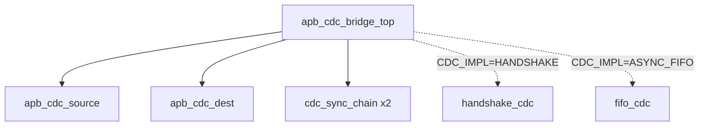

# APB CDC Bridge — LLD TOP 模块微设计

> 本文档是 LLD 文档的一部分，请参阅 [主索引文件](index.md)。

---

## 1. 模块定义

### 1.1 顶层模块

#### LLD.MOD.APB_CDC_BRIDGE.TOP 顶层集成模块

<!-- LLD_META
module_id: LLD.MOD.APB_CDC_BRIDGE.TOP
hld_ref: HLD.MOD.L1.APB_CDC_BRIDGE.TOP
params:
  - name: ADDR_WIDTH
    default: 32
    range: 16-64
  - name: DATA_WIDTH
    default: 32
    range: 8-128
  - name: USER_WIDTH
    default: 0
    range: ">=0"
  - name: CDC_IMPL
    default: HANDSHAKE
    range: HANDSHAKE|ASYNC_FIFO
  - name: SYNC_STAGES
    default: 2
    range: ">=2"
  - name: REQ_DEPTH
    default: 1
    range: 1-2
  - name: RSP_DEPTH
    default: 1
    range: 1-2
  - name: RESET_MODE
    default: ASYNC
    range: ASYNC
  - name: APB_PROFILE
    default: APB4
    range: APB3|APB4
  - name: CDC_MODE
    default: ASYNC_SAFE
    range: ASYNC_SAFE
reset:
  - signal: s_presetn
    polarity: active_low
    reset_value: "0"
    reset_type: async
  - signal: m_presetn
    polarity: active_low
    reset_value: "0"
    reset_type: async
datapath:
  pipeline_stages:
    - stage: "1"
      name: capture
      operation: "上游 APB 事务锁存到 request 寄存器"
    - stage: "2"
      name: cdc
      operation: "request/response 跨域（CDC_IMPL 选择实现）"
    - stage: "3"
      name: regenerate
      operation: "下游 APB 事务重新生成"
  backpressure:
    type: wait_state
    mechanism: "s_pready=0 直到跨桥完成"
ppa:
  performance:
    target_frequency: ">=800MHz (源/目的)"
    throughput: "1 事务/跨桥往返"
    max_latency: "约 2*SYNC_STAGES + 2 周期 + 下游 ACCESS"
    critical_path: "s_psel/s_penable → request capture → s_pready"
  area:
    budget: "HANDSHAKE 最小；FIFO 按深度线性增加"
    optimization: "仅例化所选 CDC_IMPL；未选实现无数据通路"
  power:
    budget: "idle 无翻转"
    techniques: "payload 寄存器按需更新；输出稳定"
  tradeoffs:
    - option: "HANDSHAKE vs ASYNC_FIFO"
      choice: "CDC_IMPL 参数二选一，不同时例化"
      rationale: "满足 LRS.FUNC.04.002 隔离需求，避免冗余面积"
END_LLD_META -->

##### 需求描述

1. TOP 例化 SOURCE/DEST/SYNC 以及由 `CDC_IMPL` 选择的 HANDSHAKE 或 FIFO CDC 实现。
2. 承载编译期参数与非法配置断言。

---

## 2. 实例化结构

## 3. 配置断言

- `ADDR_WIDTH > 0 && DATA_WIDTH > 0 && DATA_WIDTH % 8 == 0`
- `SYNC_STAGES >= 2`
- `CDC_IMPL in {HANDSHAKE, ASYNC_FIFO}`（generate 分支，非法值编译错误）
- `REQ_DEPTH/RSP_DEPTH in {1,2}`
- `APB_PROFILE in {APB3, APB4}`

## 4. CDC 实现隔离

| CDC_IMPL | 例化 | 说明 |
|----------|------|------|
| HANDSHAKE | `handshake_cdc` | 单 request/response 寄存器 + toggle 握手 |
| ASYNC_FIFO | `fifo_cdc` | 灰度指针异步 FIFO（深度 1/2） |

两种实现共享同一 `req_channel`/`rsp_channel` 端口契约，SOURCE/DEST 不感知实现差异。

---

*文档版本: v1.0* | *创建日期: 2026-09-07* | *创建者: IP Development Suite - 05-lld-microdesign*
