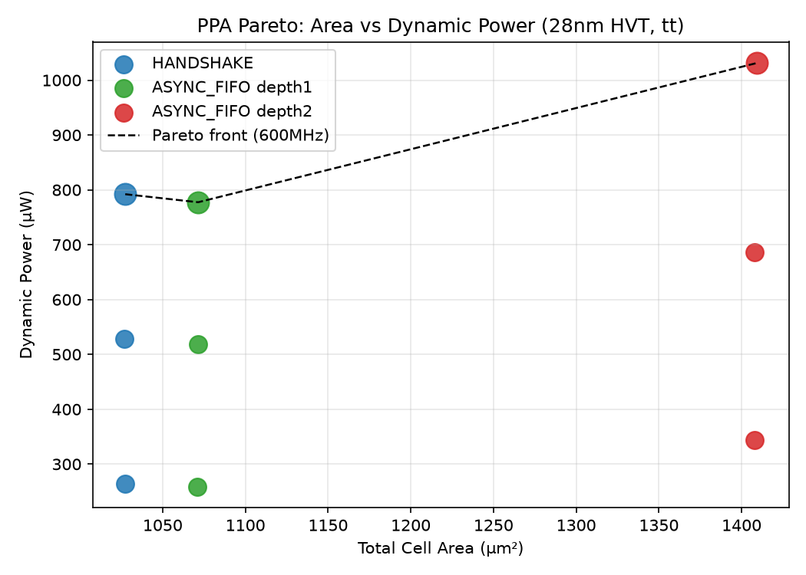
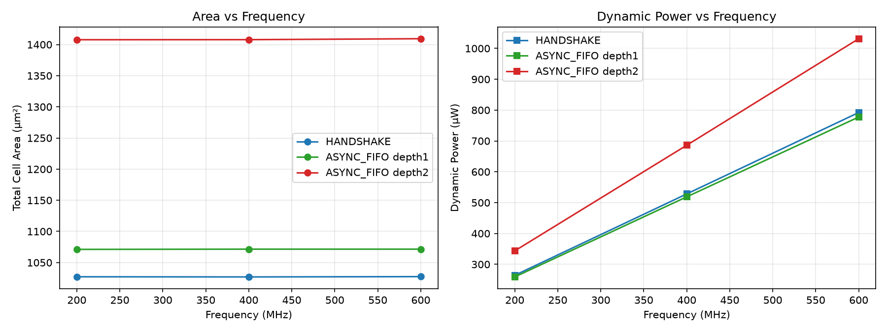

# PPA 分析报告 — apb_cdc_bridge

> **IP**: `apb_cdc_bridge` | **日期**: 2026-09-07 | **Gate**: G5 | **Report schema**: 2.0
> **run_id**: `ppa_20260907_085738` | **证据等级**: E2（功能完成后正式 28nm 综合）

## REPORT_META
<!-- REPORT_META
ip_name: apb_cdc_bridge
report_type: ppa
status: pass
eda_profile: commercial-systemverilog
schema_version: "2.0"
evidence_level: E2
run_id: ppa_20260907_085738
pdk_status: PDK_READY
target_library: sc9_cmos28lp_base_hvt_tt_nominal_max_1p00v_25c.db
operating_conditions: tt_nominal_max_1p00v_25c
tool: dc_shell
tool_version: "V-2023.12-SP3"
END_REPORT_META -->

## 1. 实验上下文

| 项 | 值 |
|---|---|
| 工艺 | GF CMOS28LP 28nm（ARM SC9 HVT） |
| 库 / corner | `sc9_cmos28lp_base_hvt_tt_nominal_max_1p00v_25c.db`（tt, 1.00V / 25C） |
| 工具 | Synopsys DC `V-2023.12-SP3`（compile_ultra） |
| RTL | `rtl/*.sv`（7 文件，SHA 见 gate_report） |
| 时钟 | `s_pclk` / `m_pclk` 双 200/400/600MHz，异步域（`set_clock_groups -asynchronous`） |
| IO delay | in/out 0.2–0.5ns；uncertainty 0.10ns；load 0.01pf；drive `BUFH_X4M_A9TH(Y)` |
| activity | DC 默认概率传播估计（无 SAIF，注明 E2） |
| 综合选项 | compile_ultra；`check_design` 无 latch/组合环；unmapped=0 |

**Sweep 维度**：`CDC_IMPL × REQ/RSP_DEPTH × 频率` = 3 配置 × 3 频率 = 9 点。

## 2. Sweep 结果（9/9 点全部收敛，WNS=0）

| run_tag | freq(MHz) | impl | depth | area(µm²) | dyn_power(µW) | slack(ns) | violating |
|---|---|---|---|---|---|---|---|
| hs_50ns | 200 | HANDSHAKE | - | 1027.14 | 264.34 | 3.07 | 0 |
| hs_25ns | 400 | HANDSHAKE | - | 1026.91 | 528.18 | 0.93 | 0 |
| **hs_1667ns** | **600** | **HANDSHAKE** | **-** | **1027.38** | **792.12** | **0.10** | **0** |
| fifo_d1_50ns | 200 | ASYNC_FIFO | 1/1 | 1071.13 | 259.09 | 3.24 | 0 |
| fifo_d1_25ns | 400 | ASYNC_FIFO | 1/1 | 1071.49 | 518.72 | 1.07 | 0 |
| fifo_d1_1667ns | 600 | ASYNC_FIFO | 1/1 | 1071.49 | 777.49 | 0.24 | 0 |
| fifo_d2_50ns | 200 | ASYNC_FIFO | 2/2 | 1407.74 | 343.57 | 2.63 | 0 |
| fifo_d2_25ns | 400 | ASYNC_FIFO | 2/2 | 1407.86 | 686.00 | 0.37 | 0 |
| fifo_d2_1667ns | 600 | ASYNC_FIFO | 2/2 | 1409.38 | 1031.40 | 0.04 | 0 |

## 3. PPA 趋势

- **面积**：HANDSHAKE（~1027 µm²）最省；FIFO depth1 +4.3%（~1071）；FIFO depth2 +37%（~1408）。
  面积几乎不随频率变化（组合逻辑重定时微调）。
- **功耗**：随频率近似线性（每配置 200→600MHz 约 3 倍）；HANDSHAKE 与 FIFO depth1 相当
  （600MHz ≈ 780–792 µW），FIFO depth2 高 ~30%（1031 µW，双 FIFO 存储 + 指针逻辑）。
- **时序**：3 配置均达 600MHz（slack>0）；HANDSHAKE 余量最大（0.10ns @600MHz）。

## 4. Pareto 前沿（600MHz）

| 配置 | 面积(µm²) | 功耗(µW) | 备注 |
|---|---|---|---|
| **HANDSHAKE** | 1027.38 | 792.12 | 最省面积+功耗，600MHz 余量 0.10ns |
| ASYNC_FIFO d1 | 1071.49 | 777.49 | 面积 +4.3%，功耗略低（多流水） |
| ASYNC_FIFO d2 | 1409.38 | 1031.40 | 面积/功耗均最差，仅保吞吐 |

## 5. 推荐配置

按 LRS/Use Case（APB 单事务、无并发 outstanding、快慢桥）：
- **默认（HANDSHAKE, `CDC_IMPL=0`）**：面积/功耗最优，600MHz 收敛，满足所有 LRS；V1.0 默认
- **多并发/流水（ASYNC_FIFO depth1, `CDC_IMPL=1,REQ_DEPTH=1,RSP_DEPTH=1`）**：需 FIFO 语义时，
  面积+4.3% 换取背压解耦；600MHz 收敛
- **不推荐 depth2**（面积 +37%、功耗 +30%），除非 LRS 明确要求深缓冲

## 6. 证据

- `evidence/ppa/ppa_20260907_085738/sweep_summary.csv`（9 点原始指标）
- `build/synth/<tag>/reports/{area,timing,power,qor}.rpt`（每点 DC 原始报告）
- `build/synth/<tag>/outputs/apb_cdc_bridge_top_synth.v`（每点门级网表）
- `reports/ppa/*.png`（Pareto/对比图）
- 工艺上下文：`model/pdk.yaml`（PDK_READY）

## 7. 结论

**PPA 表征完成（E2）** — 3 配置 × 3 频率 9 点全部 28nm 收敛（WNS=0、无 violating）；
HANDSHAKE 为 Pareto 最优默认配置；FIFO 支持 600MHz；推荐按 LRS 选择 HANDSHAKE（默认）或
ASYNC_FIFO depth1。多 corner / 签核级 STA（E3，pt_shell）留待后续。