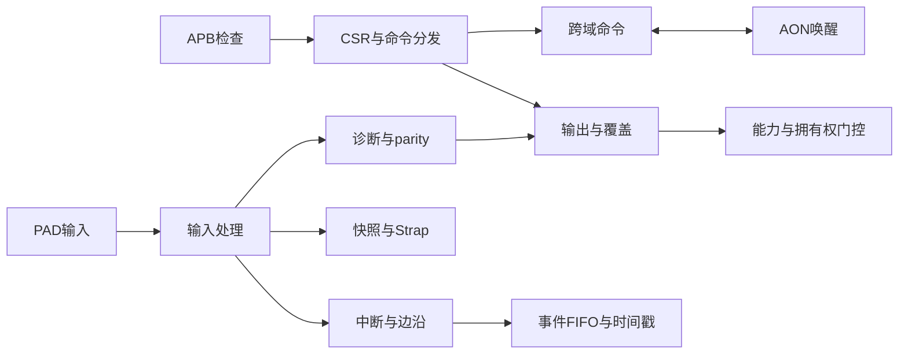

# GPIO 高层数据流

## 输入到中断与捕获

输入物理值先经过同步、有效性/滤波/去抖资格，再生成逻辑数据。IRQ使用有效逻辑值检测；Strap与诊断使用物理同步视图。

<!-- HLD_FLOW_META
id: HLD.FLOW.GPIO.INPUT
name: 输入到中断与捕获
participants:
- HLD.MOD.GPIO.INPUT
- HLD.MOD.GPIO.IRQ
- HLD.MOD.GPIO.CAPTURE
req_ref:
- LRS.FUNC.GPIO.CAP001.001
- LRS.FUNC.GPIO.CAP001.002
- LRS.FUNC.GPIO.CAP002.001
- LRS.FUNC.GPIO.CAP002.002
- LRS.FUNC.GPIO.CAP003.001
- LRS.FUNC.GPIO.CAP003.002
- LRS.FUNC.GPIO.FLT001.001
- LRS.FUNC.GPIO.FLT001.002
- LRS.FUNC.GPIO.FLT002.001
- LRS.FUNC.GPIO.FLT002.002
- LRS.FUNC.GPIO.FLT002.003
- LRS.FUNC.GPIO.FLT003.001
- LRS.FUNC.GPIO.FLT004.001
- LRS.FUNC.GPIO.FLT004.002
- LRS.FUNC.GPIO.FLT005.001
- LRS.FUNC.GPIO.FLT006.001
- LRS.FUNC.GPIO.FLT007.001
- LRS.FUNC.GPIO.IN001.001
- LRS.FUNC.GPIO.IN002.001
- LRS.FUNC.GPIO.IN002.002
- LRS.FUNC.GPIO.IN003.001
- LRS.FUNC.GPIO.IN004.001
- LRS.FUNC.GPIO.IN005.001
- LRS.FUNC.GPIO.IRQ001.001
- LRS.FUNC.GPIO.IRQ002.001
- LRS.FUNC.GPIO.IRQ002.002
- LRS.FUNC.GPIO.IRQ003.001
- LRS.FUNC.GPIO.IRQ003.002
- LRS.FUNC.GPIO.IRQ004.001
- LRS.FUNC.GPIO.IRQ005.001
- LRS.FUNC.GPIO.IRQ006.001
- LRS.FUNC.GPIO.IRQ007.001
- LRS.FUNC.GPIO.IRQ007.002
- LRS.FUNC.GPIO.IRQ008.001
- LRS.FUNC.GPIO.IRQ008.002
- LRS.FUNC.GPIO.IRQ008.003
- LRS.FUNC.GPIO.IRQ009.001
- LRS.FUNC.GPIO.IRQ009.002
- LRS.CONS.GPIO.INSTANCEPAD.001
- LRS.CONS.GPIO.INSTANCEDEFAULTS.002
- LRS.CONS.GPIO.INSTANCECLOCK.003
- LRS.CONS.GPIO.INSTANCERESET.004
- LRS.CONS.GPIO.INSTANCEPOWER.005
- LRS.CONS.GPIO.INSTANCEELECTRIC.006
- LRS.CONS.GPIO.INSTANCEBUS.007
- LRS.CONS.GPIO.INSTANCEIRQDMA.008
- LRS.CONS.GPIO.INSTANCESAFETY.009
applicability:
  expr: 'true'
END_HLD_FLOW_META -->

## 软件输出到PAD

合法软件写更新正常值；输出优先级为复位、安全、休眠、正常。所有分支最后应用 capability/ownership。

<!-- HLD_FLOW_META
id: HLD.FLOW.GPIO.OUTPUT
name: 软件输出到PAD
participants:
- HLD.MOD.GPIO.APB
- HLD.MOD.GPIO.REG
- HLD.MOD.GPIO.OUTPUT
req_ref:
- LRS.FUNC.GPIO.OUT001.001
- LRS.FUNC.GPIO.OUT001.002
- LRS.FUNC.GPIO.OUT002.001
- LRS.FUNC.GPIO.OUT002.002
- LRS.FUNC.GPIO.OUT002.003
- LRS.FUNC.GPIO.OUT003.001
- LRS.FUNC.GPIO.OUT004.001
- LRS.FUNC.GPIO.OUT004.002
- LRS.FUNC.GPIO.OUT005.001
- LRS.FUNC.GPIO.OUT005.002
- LRS.FUNC.GPIO.OUT005.003
- LRS.FUNC.GPIO.OUT006.001
- LRS.FUNC.GPIO.OUT006.002
- LRS.FUNC.GPIO.OUT007.001
- LRS.LP.GPIO.LP001.001
- LRS.LP.GPIO.LP001.002
- LRS.LP.GPIO.LP001.003
- LRS.LP.GPIO.LP002.001
- LRS.LP.GPIO.LP003.001
- LRS.LP.GPIO.LP003.002
- LRS.LP.GPIO.LP003.003
- LRS.LP.GPIO.LP004.001
- LRS.LP.GPIO.LP004.002
- LRS.LP.GPIO.LP005.001
- LRS.LP.GPIO.LP005.002
- LRS.LP.GPIO.LP006.001
- LRS.LP.GPIO.LP006.002
applicability:
  expr: 'true'
END_HLD_FLOW_META -->

## 边沿记录到DMA

合格边沿按 EVENT_ENABLE 和 FIFO_CTRL.EN 筛选，仲裁选最小脚，打包时间戳；软件/DMA读四字HEAD再POP。

<!-- HLD_FLOW_META
id: HLD.FLOW.GPIO.EVENT
name: 边沿记录到DMA
participants:
- HLD.MOD.GPIO.IRQ
- HLD.MOD.GPIO.FIFO
- HLD.MOD.GPIO.REG
req_ref:
- LRS.FUNC.GPIO.EVT001.001
- LRS.FUNC.GPIO.EVT001.002
- LRS.FUNC.GPIO.EVT002.001
- LRS.FUNC.GPIO.EVT003.001
- LRS.FUNC.GPIO.EVT003.002
- LRS.FUNC.GPIO.EVT004.001
- LRS.FUNC.GPIO.EVT004.002
- LRS.FUNC.GPIO.EVT004.003
- LRS.FUNC.GPIO.EVT005.001
- LRS.FUNC.GPIO.EVT005.002
- LRS.FUNC.GPIO.EVT005.003
- LRS.FUNC.GPIO.EVT006.001
- LRS.FUNC.GPIO.EVT006.002
- LRS.FUNC.GPIO.EVT007.001
- LRS.FUNC.GPIO.EVT007.002
- LRS.FUNC.GPIO.EVT007.003
applicability:
  expr: 'true'
END_HLD_FLOW_META -->

## 主域命令到AON

主域冻结载荷后发送唯一请求；AON校验/执行，稳定返回状态；主域接受ACK后更新整组缓存并释放BUSY。

<!-- HLD_FLOW_META
id: HLD.FLOW.GPIO.AON
name: 主域命令到AON
participants:
- HLD.MOD.GPIO.REG
- HLD.MOD.GPIO.MAILBOX
- HLD.MOD.GPIO.AON
req_ref:
- LRS.LP.GPIO.WAK001.001
- LRS.LP.GPIO.WAK001.002
- LRS.LP.GPIO.WAK001.003
- LRS.LP.GPIO.WAK002.001
- LRS.LP.GPIO.WAK002.002
- LRS.LP.GPIO.WAK003.001
- LRS.LP.GPIO.WAK004.001
- LRS.LP.GPIO.WAK004.002
- LRS.LP.GPIO.WAK005.001
- LRS.LP.GPIO.WAK005.002
- LRS.LP.GPIO.WAK005.003
- LRS.LP.GPIO.WAK006.001
- LRS.LP.GPIO.WAK007.001
- LRS.LP.GPIO.WAK007.002
- LRS.LP.GPIO.WAK007.003
- LRS.LP.GPIO.WAK008.001
- LRS.LP.GPIO.WAK008.002
- LRS.LP.GPIO.WAK009.001
- LRS.LP.GPIO.WAK009.002
- LRS.LP.GPIO.WAK010.001
- LRS.LP.GPIO.WAK010.002
- LRS.LP.GPIO.WAK010A.001
- LRS.LP.GPIO.WAK010A.002
- LRS.LP.GPIO.WAK011.001
- LRS.LP.GPIO.WAK012.001
- LRS.LP.GPIO.WAK012.002
applicability:
  expr: AON_WAKE_EN == 1
END_HLD_FLOW_META -->

## 故障到安全输出

访问、FIFO、AON与诊断状态汇总到FAULT。仅parity故障产生保持型内部安全请求；DIAG报警不自动进入safe。

<!-- HLD_FLOW_META
id: HLD.FLOW.GPIO.FAULT
name: 故障到安全输出
participants:
- HLD.MOD.GPIO.SECURITY
- HLD.MOD.GPIO.DIAG
- HLD.MOD.GPIO.FIFO
- HLD.MOD.GPIO.MAILBOX
- HLD.MOD.GPIO.OUTPUT
req_ref:
- LRS.SAFE.GPIO.DIAG001.001
- LRS.SAFE.GPIO.DIAG001.002
- LRS.SAFE.GPIO.DIAG002.001
- LRS.SAFE.GPIO.DIAG002.002
- LRS.SAFE.GPIO.DIAG002.003
- LRS.SAFE.GPIO.DIAG002.004
- LRS.SAFE.GPIO.DIAG003.001
- LRS.SAFE.GPIO.DIAG003.002
- LRS.SAFE.GPIO.DIAG004.001
- LRS.SAFE.GPIO.DIAG004.002
- LRS.SAFE.GPIO.DIAG005.001
- LRS.SAFE.GPIO.DIAG005.002
- LRS.SAFE.GPIO.DIAG006.001
- LRS.SAFE.GPIO.DIAG007.001
- LRS.SAFE.GPIO.DIAG007.002
- LRS.SEC.GPIO.SEC001.001
- LRS.SEC.GPIO.SEC002.001
- LRS.SEC.GPIO.SEC002.002
- LRS.SEC.GPIO.SEC002A.001
- LRS.SEC.GPIO.SEC002A.002
- LRS.SEC.GPIO.SEC002A.003
- LRS.SEC.GPIO.SEC003.001
- LRS.SEC.GPIO.SEC003.002
- LRS.SEC.GPIO.SEC004.001
- LRS.SEC.GPIO.SEC005.001
- LRS.SEC.GPIO.SEC005.002
- LRS.SEC.GPIO.SEC006.001
- LRS.SEC.GPIO.SEC006.002
applicability:
  expr: 'true'
END_HLD_FLOW_META -->

