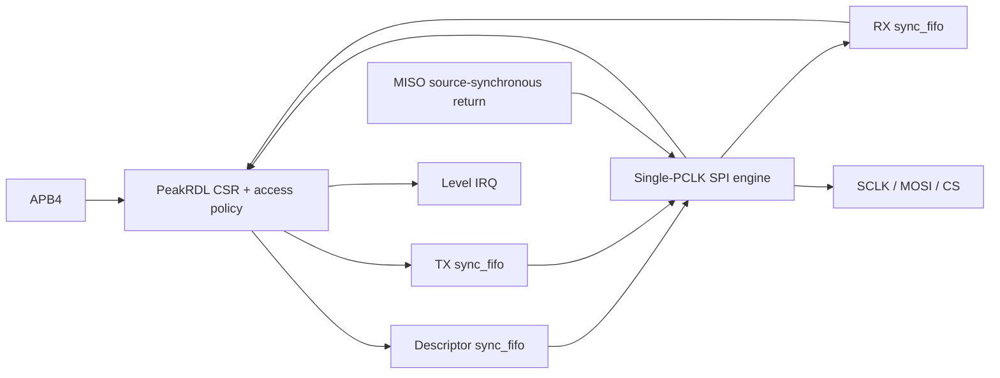

# 架构入口

APB 包装器在成功 ACCESS 上升沿提交寄存器、FIFO 和命令操作。SystemRDL 生成原生 CSR，包装器只处理合同额外的运行态/字节写合法性；没有手写第二套寄存器存储。

引擎每帧启动前原子取得 TX 并保留一个 RX 槽，只在帧边界等待资源。所有 SPI 变化为 PCLK 时钟使能；完成必须包含最后 trailing edge。ABORT 高于正常完成，完整当前帧后释放 CS 并清 TX/CMD、保留 RX。

详细设计与实现映射见 [HLD](hld/index.md)、[LLD](lld/index.md) 和 [RTM](../reports/quality/trace_matrix.md)。
