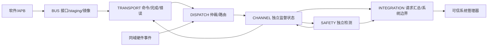

# Watchdog：L1 模块划分

六个模块是架构责任边界，既有候选 RTL 的组织不构成冻结要求。

## INTEGRATION — 时钟复位与系统连接

<!-- HLD_MODULE_META
id: HLD.MOD.WATCHDOG.INTEGRATION
name: integration
level: 1
responsibility: 负责时钟/复位域建立、通道实例数量、系统输入边界、故障/唤醒/复位请求汇总与交付约束；不执行软件服务或替代外部复位管理器。
req_ref:
- LRS.CFG.WATCHDOG.NUM_CHANNELS.001
- LRS.CFG.WATCHDOG.COUNTER_WIDTH.001
- LRS.CFG.WATCHDOG.PRESCALE_WIDTH.001
- LRS.CFG.WATCHDOG.NUM_CLIENTS.001
- LRS.CFG.WATCHDOG.SOURCE_WIDTH.001
- LRS.CFG.WATCHDOG.SYNC_STAGES.001
- LRS.CFG.WATCHDOG.SUPPORT_TOKEN_QA.001
- LRS.CFG.WATCHDOG.SUPPORT_SUPERVISION.001
- LRS.CFG.WATCHDOG.SUPPORT_HW_EVENT.001
- LRS.CFG.WATCHDOG.SAFETY_EN.001
- LRS.CFG.WATCHDOG.ALLOW_RUNTIME_UPDATE.001
- LRS.CFG.WATCHDOG.DIAG_INJECT_EN.001
- LRS.CFG.WATCHDOG.AUTO_START_MASK.001
- LRS.CFG.WATCHDOG.NO_STOP_MASK.001
- LRS.CFG.WATCHDOG.HARD_CFG_LOCK_MASK.001
- LRS.CFG.WATCHDOG.DEFAULT_CFG.001
- LRS.CFG.WATCHDOG.PROFILE.001
- LRS.CFG.WATCHDOG.PROFILE.002
- LRS.CFG.WATCHDOG.PROFILE.003
- LRS.CFG.WATCHDOG.PAR.001
- LRS.CFG.WATCHDOG.PAR.002
- LRS.CFG.WATCHDOG.PAR.003
- LRS.INTF.WATCHDOG.PORTS.001
- LRS.INTF.WATCHDOG.IF.001
- LRS.INTF.WATCHDOG.IF.002
- LRS.INTF.WATCHDOG.IF.003
- LRS.INTF.WATCHDOG.IF.004
- LRS.PERF.WATCHDOG.SAFETY.001
- LRS.RESET.WATCHDOG.RST.001
- LRS.RESET.WATCHDOG.RST.002
- LRS.RESET.WATCHDOG.RST.003
- LRS.RESET.WATCHDOG.RST.004
- LRS.SAFE.WATCHDOG.SAF.001
- LRS.SAFE.WATCHDOG.SAF.002
- LRS.SAFE.WATCHDOG.SAF.003
- LRS.SAFE.WATCHDOG.SAF.004
- LRS.SAFE.WATCHDOG.SAF.005
- LRS.SAFE.WATCHDOG.SAF.006
- LRS.CONS.WATCHDOG.NFR.001
- LRS.CONS.WATCHDOG.NFR.002
- LRS.CONS.WATCHDOG.NFR.003
- LRS.CONS.WATCHDOG.NFR.004
- LRS.CONS.WATCHDOG.NFR.005
- LRS.CONS.WATCHDOG.NFR.006
- LRS.CONS.WATCHDOG.VER.001
- LRS.CONS.WATCHDOG.VER.002
- LRS.CONS.WATCHDOG.VER.003
- LRS.CONS.WATCHDOG.VER.004
- LRS.CONS.WATCHDOG.VER.005
- LRS.CONS.WATCHDOG.VER.006
- LRS.CONS.WATCHDOG.DELIVERY.001
applicability:
  expr: 'true'
clock_domains:
- HLD.DOM.CLK.WATCHDOG.APB
- HLD.DOM.CLK.WATCHDOG.WDT
reset_domains:
- HLD.DOM.RST.WATCHDOG.POR_APB
- HLD.DOM.RST.WATCHDOG.POR_WDT
- HLD.DOM.RST.WATCHDOG.APB_INTERFACE
power_domain: HLD.DOM.PWR.WATCHDOG.AON
interfaces:
- HLD.IF.EXT.WATCHDOG.APB_CLOCK_RESET
- HLD.IF.EXT.WATCHDOG.WDT_CLOCK_RESET
- HLD.IF.EXT.WATCHDOG.REQUESTS
- HLD.IF.EXT.WATCHDOG.IRQ
- HLD.IF.INT.WATCHDOG.CHANNEL_OUTPUT
- HLD.IF.INT.WATCHDOG.SAFETY_FAULT
- HLD.IF.INT.WATCHDOG.RESET_APB
- HLD.IF.INT.WATCHDOG.RESET_WDT
END_HLD_MODULE_META -->

负责时钟/复位域建立、通道实例数量、系统输入边界、故障/唤醒/复位请求汇总与交付约束；不执行软件服务或替代外部复位管理器。

## BUS — APB 接口与软件可见存储

<!-- HLD_MODULE_META
id: HLD.MOD.WATCHDOG.BUS
name: bus
level: 1
responsibility: 负责 APB4 对齐/权限/属性检查、寄存器解码、每通道/客户端 staging 和选择器、本地命令记录及保持镜像；不直接修改活动监督状态。
req_ref:
- LRS.INTF.WATCHDOG.BUS.001
- LRS.INTF.WATCHDOG.BUS.002
- LRS.INTF.WATCHDOG.BUS.003
- LRS.FUNC.WATCHDOG.SRV.001
- LRS.FUNC.WATCHDOG.SRV.002
- LRS.FUNC.WATCHDOG.SRV.003
- LRS.FUNC.WATCHDOG.SRV.004
- LRS.FUNC.WATCHDOG.SRV.005
- LRS.FUNC.WATCHDOG.SRV.006
- LRS.FUNC.WATCHDOG.SRV.007
- LRS.FUNC.WATCHDOG.SRV.008
- LRS.FUNC.WATCHDOG.SRV.009
- LRS.FUNC.WATCHDOG.SRV.010
- LRS.FUNC.WATCHDOG.SRV.011
- LRS.REG.WATCHDOG.ACCESS.001
- LRS.REG.WATCHDOG.IDENTITY.001
- LRS.REG.WATCHDOG.CLIENT_WINDOW.001
- LRS.REG.WATCHDOG.CFG.001
- LRS.REG.WATCHDOG.CFG.002
- LRS.REG.WATCHDOG.CFG.003
- LRS.REG.WATCHDOG.CFG.004
- LRS.REG.WATCHDOG.CFG.005
- LRS.REG.WATCHDOG.CFG.006
- LRS.REG.WATCHDOG.CFG.007
- LRS.REG.WATCHDOG.SNP.001
- LRS.REG.WATCHDOG.SNP.002
- LRS.REG.WATCHDOG.SNP.003
- LRS.REG.WATCHDOG.REG.001
- LRS.REG.WATCHDOG.REG.002
- LRS.REG.WATCHDOG.REG.003
- LRS.REG.WATCHDOG.REG.004
- LRS.PERF.WATCHDOG.COMMAND.001
- LRS.SEC.WATCHDOG.AUTH.001
- LRS.DFX.WATCHDOG.TST.001
- LRS.DFX.WATCHDOG.TST.002
- LRS.DFX.WATCHDOG.TST.003
- LRS.DFX.WATCHDOG.TST.004
- LRS.DFX.WATCHDOG.TST.005
- LRS.DFX.WATCHDOG.DIA.001
- LRS.DFX.WATCHDOG.DIA.002
- LRS.DFX.WATCHDOG.DIA.003
- LRS.DFX.WATCHDOG.DIA.004
- LRS.DFX.WATCHDOG.DIA.005
- LRS.DFX.WATCHDOG.DIA.006
- LRS.CONS.WATCHDOG.SOFTWARE.001
applicability:
  expr: 'true'
clock_domains:
- HLD.DOM.CLK.WATCHDOG.APB
reset_domains:
- HLD.DOM.RST.WATCHDOG.POR_APB
- HLD.DOM.RST.WATCHDOG.APB_INTERFACE
power_domain: HLD.DOM.PWR.WATCHDOG.AON
interfaces:
- HLD.IF.EXT.WATCHDOG.APB
- HLD.IF.EXT.WATCHDOG.AUTH
- HLD.IF.INT.WATCHDOG.BUS_COMMAND
- HLD.IF.INT.WATCHDOG.APB_REPLY
- HLD.IF.INT.WATCHDOG.RESET_APB
END_HLD_MODULE_META -->

负责 APB4 对齐/权限/属性检查、寄存器解码、每通道/客户端 staging 和选择器、本地命令记录及保持镜像；不直接修改活动监督状态。

## TRANSPORT — 跨域命令与完成传输

<!-- HLD_MODULE_META
id: HLD.MOD.WATCHDOG.TRANSPORT
name: transport
level: 1
responsibility: 负责 POR 保持的单在途邮箱、返回记录、暖复位取消和合并访问错误握手；保证事务有序/最多一次、负载稳定和异步复位交错安全。
req_ref:
- LRS.INTF.WATCHDOG.BUS.001
- LRS.INTF.WATCHDOG.BUS.002
- LRS.INTF.WATCHDOG.BUS.003
- LRS.INTF.WATCHDOG.CDC.001
- LRS.INTF.WATCHDOG.CDC.002
- LRS.INTF.WATCHDOG.CDC.003
- LRS.INTF.WATCHDOG.CDC.004
- LRS.INTF.WATCHDOG.CDC.005
- LRS.REG.WATCHDOG.ACCESS.001
- LRS.REG.WATCHDOG.IDENTITY.001
- LRS.REG.WATCHDOG.CLIENT_WINDOW.001
- LRS.PERF.WATCHDOG.COMMAND.001
- LRS.RESET.WATCHDOG.RST.001
- LRS.RESET.WATCHDOG.RST.002
- LRS.RESET.WATCHDOG.RST.003
- LRS.RESET.WATCHDOG.RST.004
- LRS.SEC.WATCHDOG.AUTH.001
- LRS.CONS.WATCHDOG.SOFTWARE.001
applicability:
  expr: 'true'
clock_domains:
- HLD.DOM.CLK.WATCHDOG.APB
- HLD.DOM.CLK.WATCHDOG.WDT
reset_domains:
- HLD.DOM.RST.WATCHDOG.POR_APB
- HLD.DOM.RST.WATCHDOG.POR_WDT
power_domain: HLD.DOM.PWR.WATCHDOG.AON
interfaces:
- HLD.IF.INT.WATCHDOG.BUS_COMMAND
- HLD.IF.INT.WATCHDOG.WDT_MAILBOX
- HLD.IF.INT.WATCHDOG.CHANNEL_REPLY
- HLD.IF.INT.WATCHDOG.APB_REPLY
- HLD.IF.INT.WATCHDOG.ACCESS_ERROR
- HLD.IF.INT.WATCHDOG.RESET_APB
- HLD.IF.INT.WATCHDOG.RESET_WDT
END_HLD_MODULE_META -->

负责 POR 保持的单在途邮箱、返回记录、暖复位取消和合并访问错误握手；保证事务有序/最多一次、负载稳定和异步复位交错安全。

