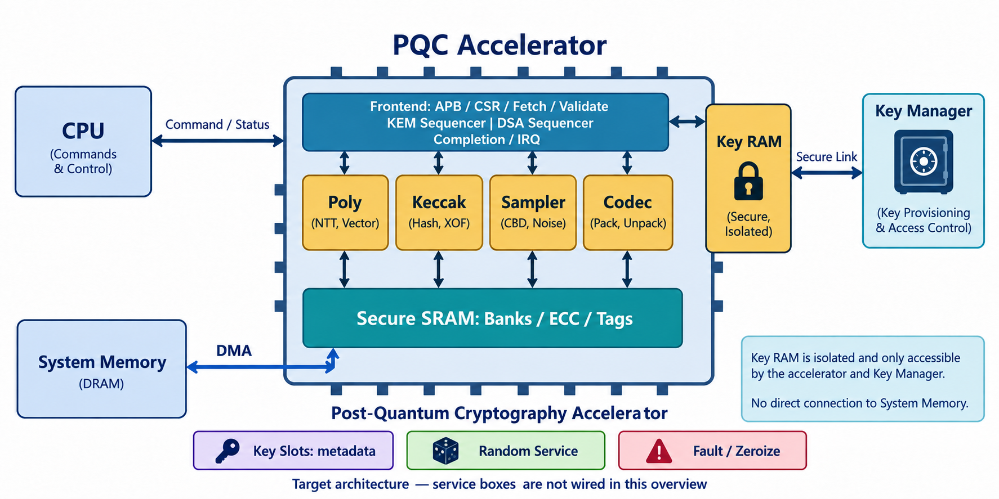

# 1 · 架构、配置与 RTL 实现

[手册首页](index.md) · [下一章](02-interfaces-programming.md)

## 1.1 IP 的职责和外部依赖

PQC IP 负责执行 ML-KEM 与 ML-DSA 运算、管理工作态中间数据、按授权使用密钥材料，并通过命令完成接口交付结果。外部 CPU/驱动准备命令和公开缓冲区，系统内存提供数据，可信 TRNG/DRBG 提供随机量，Key Manager 负责长期密钥所有权和可信授权。

本 IP 不负责网络协议、公钥证书验证、业务大数据对称加密、SoC IOMMU 或外部随机源健康测试的完整实现。集成方需要把这些职责接在正确边界上。

## 1.2 分层与共享资源

图 7：上方控制块为前端与序列器的功能分组，下面四个计算块共享工作存储。右侧 Key RAM 是 IP 安全边界内的独立存储，不是片外普通 RAM；Key Manager 才是外部长期所有者。底部 Key Slots、Random Service、Fault/Zeroize 是 IP 内部服务，图为可读性省略其扇出连线，不代表它们在芯片外或没有连接。具体关系见下表与源码地图。

| 服务 | 为哪些模块提供什么 |
|---|---|
| Key Slots | 为命令/材料使用提供句柄、用途和身份元数据 |
| Random Service | 为算法及受保护计算提供按身份/用途分配的新鲜随机量 |
| Fault / Zeroize | 向前端、引擎、存储和密钥路径发出清除/锁定，并汇总确认 |

控制层包括 APB、生成的 CSR、前端、描述符抓取/检查和算法序列控制；计算层包括 Poly、Keccak、Sampler、Codec；存储层包括安全 SRAM、ECC、Key Slots 元数据和独立 Work Key RAM；安全服务包括随机量管理、故障与清零、受保护运算单元。

两个算法家族共享底层引擎，运行时目标为单执行上下文。序列器必须等所属原语真正完成后才能消费输出；同一 engine 的多次调用还需要区分请求身份。两个 Keccak context 用于保存不同任务的状态，不是两套独立置换硬件。

Poly 在 q=3329 和 q=8380417 两个域间选择。参数选择同时控制层数、根表和乘法模式，不能只替换模数。KEM 需要二项式块乘法，DSA 可使用完整变换后的逐点乘法。

## 1.3 主要综合配置

以下结合顶层默认值和 LRS；“允许值”不表示每个组合均已完成验证。

| 参数 | 默认 | 允许值/含义 | 影响 |
|---|---:|---|---|
| `NTT_LANES` | 2 | 1/2/4 | 并行资源与银行带宽需求 |
| `KECCAK_ROUNDS_PER_CYCLE` | 2 | 1/2 | 未掩码置换的组合/流水安排 |
| `LOCAL_SRAM_KIB` | 64 | 32/64/96 | 逻辑工作存储容量 |
| `DMA_DATA_WIDTH` | 128 | 64/128/256 | AXI 数据宽度 |
| `KEY_SLOT_NUM` | 8 | 8..32 | 授权元数据槽数量 |
| `SCA_LEVEL` | 1 | 0/1/2 | 目标防护等级；Level 2 全链路尚未闭环 |
| `ENABLE_ALGO_MASK` | 0x3f | bit0..5 对应六参数集 | 算法参数集裁剪 |
| `ENABLE_HASH_ML_DSA` | 0 | 布尔 | HashML-DSA 能力开关，默认关闭 |
| `ENABLE_PIO` | 1 | 布尔 | 目标小数据通路能力，需查真实连通状态 |
| `ECC_ENABLED` | 1 | 布尔 | 存储完整性配置 |
| `ZEROIZE_MAX_CYCLES` | `LOCAL_SRAM_KIB*256+16` | 顶层默认公式 | 清除超时预算，不是系统总线完成保证 |

构建时非法参数检查目前部分使用仿真 `initial/$fatal`，报告仍将其作为工程待处理项；不能当成综合后芯片的运行时防御机制。

## 1.4 按源码阅读实现

完整常驻模块表见[教材第 8 章](../learning/08-hardware-architecture.md)。当前顶层已出现专用算法程序与托管程序；它们与旧 `pqc_kem_seq`、`pqc_dsa_seq` 并存，因此必须从顶层实际 mux 和 start 连线追踪路径。

| 实现入口 | 可从当前源码确认的职责 | 证据边界 |
|---|---|---|
| [pqc_kem_encaps.sv](../../rtl/pqc_kem_encaps.sv) | 公钥处理、采样、共享引擎控制和密文/秘密结果 | 现有报告有选定 Encaps KAT |
| [pqc_kem_decaps.sv](../../rtl/pqc_kem_decaps.sv) | 解密、G、重加密、J、比较/选择 | 现有报告有三参数正常/篡改/背压子集 |
| [pqc_kem_keygen.sv](../../rtl/pqc_kem_keygen.sv) | 熵、派生、采样、矩阵行运算、公私钥编码、generated 流 | 本次复核看到新增候选；不据文件存在声明完整验收 |
| [pqc_dsa_verify.sv](../../rtl/pqc_dsa_verify.sv) | 公钥/签名解码、分段消息、挑战与矩阵关系检查 | 本次复核看到新增候选；不能沿用旧 DSA 单测代替算法验收 |
| [pqc_dsa_keygen.sv](../../rtl/pqc_dsa_keygen.sv) | 熵派生、s1/s2 采样、矩阵运算、Power2Round 分解、公私钥编码与 generated 流 | 最终复核新增可见候选；尚未据新报告确认其验收范围 |
| [pqc_dsa_sign.sv](../../rtl/pqc_dsa_sign.sv) | 工作态材料读取、μ、y/w/c/z、范数与 hint、尝试边界及候选编码 | 最终复核新增可见候选；其 MAX_ATTEMPTS/ATTEMPT_CYCLES 是实现配置，不是已测时延证明 |
| [pqc_key_custody.sv](../../rtl/pqc_key_custody.sv) | 新生成私钥专用 header/data/ACK 事务 | 候选接口已可见，需独立绑定托管验证 |
| [pqc_top.sv](../../rtl/pqc_top.sv) | 根据命令选择专用程序，共享 Keccak/Poly/Codec/Sampler/SRAM | 阅读 `tx_state` 和 `algo_is_*`，不要只看实例列表 |

编写期间其他开发活动在修改工作区；新增候选实现与最后正式报告可能不同步。手册保留“代码存在”和“报告验收”两种状态，而不把新代码断言为尚不存在或已验证完成。

## 1.5 数据表示和地址单位

| 边界 | 形式 | 核对要求 |
|---|---|---|
| 外部密钥/密文/签名 | 紧凑字节串 | 长度、位序、规范编码 |
| Poly 工作页 | 256 个 32-bit word | q、NTT/系数域、规范余数范围 |
| 描述符地址和长度 | 字节语义，字段可达 64 bit | 完整位宽范围检查，不能静默截断 |
| 顶层 AXI 地址 | 40 bit | 与 SoC 地址映射一致 |
| 专用程序 SRAM 游标 | 常见为 word 索引 | byte→word 转换和 byte lane 必须明确 |
| Key RAM 接口 | 按定义的 word 流与逻辑字节长度 | 最后一项、编码段偏移与实际长度一致 |

新 POLY LLD 使用普通规范 residue；Python NTT 同样不隐含 Montgomery 因子。不能根据旧枚举名 `NTT_MONT` 给结果额外乘/除 R。更多解释见[NTT 章节](../learning/03-ntt-and-modular.md)。

## 1.6 时钟、复位和实现边界

当前顶层使用一个 `clk` 与低有效 `rst_n`，APB、AXI、熵和 Key Manager 端口按本 IP 的同域接口合同连接。SoC 若提供异步域信号，必须在明确边界使用经过验证的 CDC/复位同步，不可直接把异步 valid 当同步握手。

目标流水与局部数学模型不是时序签核。NTT lane/bank 详细调度、Keccak rate 接口加宽、Level 2 两域端口与随机流量，都需要真实 RTL 和时序实现支撑。400 MHz 仅用于架构预算换算。
