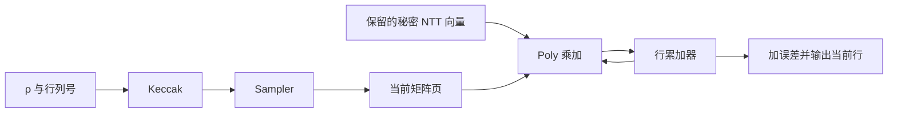

# 3 · 跟踪计算流程与存储生命周期

[上一章](02-interfaces-programming.md) · [教学手册首页](index.md) · [下一章](04-security-errors.md)

这一章的学习目标是：给定一次算法操作，能说清楚“下一个模块为什么能开始”“输入在哪里”“哪块存储还不能复用”。先看算法数据依赖，再看调度，最后看状态机。

## 3.1 一条矩阵乘法怎样落到共享电路

以 `t[i]=Σ A[i,j]·s[j]+e[i]` 为例，一行需要反复执行：

1. Keccak 根据 ρ 和行列编号展开字节流。
2. Sampler 从流中得到当前矩阵多项式 A[i,j]。
3. Poly 读取保留的秘密向量项 ŝ[j]，执行对应变换域乘法。
4. Poly 将结果加到当前行 accumulator。
5. 当前 A[i,j] 的最后一次读取完成，页面才能复用给下一项。
6. 全部列完成后加 ê[i]，将这一行结果编码或保留。

这里 A、s、e 的元素都是 256 系数多项式，不是单个整数。j 循环决定列项，i 循环决定输出行，stage 循环则在一次 NTT 内部；三种循环不能混为一个计数器。



## 3.2 KEM KeyGen：算法结束后还有托管

流程是种子输入 → 派生 ρ/σ → 采样 s/e → NTT → 逐行矩阵乘法 → 编码公钥/私钥。公钥可以进入公开 staging，私钥应进入专用 Work Key RAM。

当前可见候选 [pqc_kem_keygen](../../rtl/pqc_kem_keygen.sv) 输出 generated word 流；顶层选择该流写入工作态材料 RAM，并调用 [pqc_key_custody](../../rtl/pqc_key_custody.sv)。后者先发送包含身份的 header，再逐 word 输出本次新生成材料，最后等匹配 ACK。

学习这里的关键是：密码数学完成与安全交付完成不同。没有接收方可信确认，不能把公钥/句柄成功发布给软件，造成“句柄存在但外部长期私钥未保存”的状态。

## 3.3 KEM Encaps：转置与 nonce 都有意义

输入公钥 ek 和授权随机 m，哈希派生 K、r；从 r 采样 y、e1、e2；用 A 的转置和 y 计算 u，用公钥向量与 y 计算 v；压缩编码得到 c，输出 c 和受保护的 K。

硬件常只保留 ŷ 向量和当前矩阵项，避免整矩阵常驻。读取 A[j,i] 和 A[i,j] 时，SHAKE 后缀行列顺序不同；不要因为二者都叫 ExpandA 就复用同一索引顺序。PRF nonce 也要按每条命令重新初始化。

## 3.4 KEM Decaps：两份密文与两份候选秘密


读图时不要把步骤箭头当作唯一数据输入：第 5 步还要 ek、m′、r′，第 7 步要私钥 z 和最初收到的 c。下面的生命周期表解释这些跨步骤保留的数据。

先从 c 解码 u/v，用秘密 ŝ 完成解密，得到 m′；再通过 G 得 K′/r′，重加密得到 c′；与此同时原始 c 必须保留，用于全长比较和 `J(z||c)`。

| 对象 | 产生者 | 最后消费者 | 为什么不能过早覆盖 |
|---|---|---|---|
| 原始 c | DMA 输入 | 全长比较和 J | c′ 不能替代收到的密文 |
| m′ | 解密路径 | G 与重加密 | 是秘密中间消息 |
| c′ | 重加密 | 比较器 | 选择前不能公开其是否匹配 |
| K′ | G | 选择器 | 正常结果候选 |
| Kbar | J | 选择器 | 隐式拒绝结果候选 |
| diff | 全长比较 | 选择器 | 不能直接暴露到 CSR/IRQ |

最新报告描述的 Decaps 候选用原密文页 16–17 与重加密页 20–21 隔离。这个具体页号是当前实现例子，不是标准算法要求或整个 IP 永久固定 ABI。更换调度时要重新证明页面生命周期，不只检查容量总和。

假设某次比较在第 10 字节发现失配：正常动作是记入累计 diff，继续到最后字节，然后从 K′/Kbar 中选择 32 B 结果。提前退出会把失配位置变成外部可观察的时间信息。

## 3.5 DSA Sign：固定尝试调度和可变次数


橙色重试线返回采样 y，不直接返回计算 z。第 1 步是可复用的消息预处理；第 2 步使用由密钥和签名策略派生的采样种子。将本图对照 DSA 序列器的 attempt counter 与独立检查结果，更容易看出状态机为何要等待多类结果。

签名预处理得到 μ 和采样种子；每次尝试生成 y，算 w=A·y 和 w1；哈希得到 c_tilde，再采样挑战 c；依次计算 z、r0、ct0、hint 和各项检查。

目标设计在统一尝试边界决定接受或重试。检查结果应分别有 done/ok 与身份，不是共享一个会被后续运算覆盖的状态位。即使 z 范数已失败，正常路径仍继续完成规定检查；异常取消则走独立安全路径。

接受后编码 `(c_tilde,z,h)` 并提交；拒绝后擦除候选、推进 nonce、重新开始。硬件状态机必须防止“检查 done 还没来，旧 ok 已经是 1”的误接受。

## 3.6 DSA Verify：输出是判决，不是消息

Verify 读公钥和签名，检查规范编码、z 范数及 hint；从公钥、消息与 context 得到 μ，从 c_tilde 重建 c；计算 `A·z-c·t1·2^d`，通过 hint 恢复 w1′，再哈希并比较完整挑战。

当前可见 [pqc_dsa_verify](../../rtl/pqc_dsa_verify.sv) 将消息分段搬入，专门维护 message offset 和 DMA 请求。分段只是搬运安排，不能改变 μ 的字节输入顺序。出现这个候选模块不代表完整 Sign 也已经实现。

## 3.7 为什么存储设计决定性能

HLD 按一个多项式 1 KiB 逻辑页预算；32 KiB SKU 只有 32 页。密钥材料 RAM 另有 8 KiB，不计入这 32 页。

| 操作/阶段 | HLD 页预算上界 | 主要空间策略 |
|---|---:|---|
| KEM | 24 | 两组向量与少量矩阵/累加/编码页 |
| DSA KeyGen | 20 | 秘密逐项处理，矩阵按行展开 |
| DSA Sign 矩阵阶段 | 23 | 保留 ŷ 与 w，不保留完整 A |
| DSA Sign 检查/编码 | 28 | 重放 y，私钥逐多项式解码，保留候选 staging |
| DSA Verify | 23 | 保留 ẑ，逐行计算验证关系 |

这些是目标预算，不是当前 RTL 实测最高占用。Level 2 两 share 物理存储加倍，ECC、标签和随机缓存另计。对每个页应问四件事：谁分配、什么表示、谁最后读取、何时清除和复用。

## 3.8 周期预算不能只数乘法

可以先用下面的分解建立直觉：

```text
总周期 ≈ 哈希 + NTT + 乘加 + 采样/编码 + DMA + 控制/等待 - 合法重叠
```

减去重叠之前，要证明资源和数据依赖允许并行。单个 SRAM 端口不能同时无条件服务所有引擎；外部随机服务不足也会让受保护计算等待。

目标 400 MHz 下，1 周期相当于 2.5 ns；40,000 周期换算成 100 μs。这只是换算，不证明实际频率或周期已达到。DSA Sign 还要分别报告每次尝试周期与尝试次数分布。

## 练习

画一张表跟踪 Decaps 的原始 c、c′、K′、Kbar：分别标出公开/秘密、生成时间、最后读取时间、清除时机。再解释为什么原始 c 页与重加密累加器页不能提前别名。答案的重点是依赖与权限，不是背诵页号。
