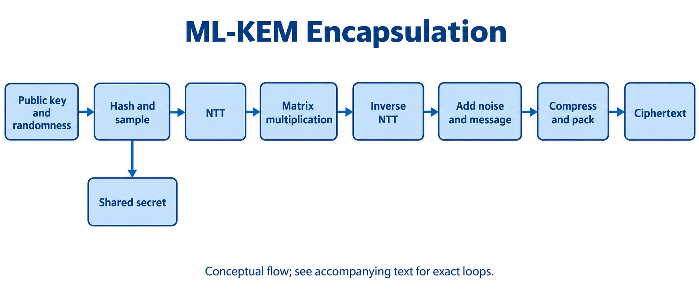

# 6. 跟完一次 ML-KEM-768 Encaps

[教学手册目录](index.md) · 下一章：[算法、模型、RTL 与测试对照](07-cross-layer-map.md)

本章把同一次封装写成数学步骤、字节大小和 RTL 状态。先读[ML-KEM](../learning/05-ml-kem.md)。算法依据是 [FIPS 203](https://csrc.nist.gov/pubs/fips/203/final)；该页面另列有潜在勘误，正式实现需一起核对。下面的地址是当前 [pqc_kem_encaps.sv](../../rtl/pqc_kem_encaps.sv) 的内部工作区约定，不是软件传入的 AXI 地址。

## 从输入到结果

本例参数为 `n=256, q=3329, k=3, eta1=eta2=2, du=10, dv=4`。输入公钥 `ek=ByteEncode12(t_hat)||rho`，长度 `3×384+32=1184 B`；封装方新生成随机 `m`，长度 32 B。输出是密文 `c`（1088 B）和共享秘密 `K`（32 B）。Encaps 不需要接收方的私钥。

先算 `H(ek)=SHA3-256(ek)`，再算 `(K,r)=SHA3-512(m||H(ek))`，各取 32 B。`K` 是待输出的秘密，`r` 驱动本次加密的噪声采样。这里没有额外的 `KDF(K||H(c))` 步骤；不要把其他版本 Kyber 的流程直接搬过来。

加密的数学主线为：

```text
y_j = CBD_eta1(PRF(r, j)), j=0..2
e1_i = CBD_eta2(PRF(r, 3+i)), i=0..2
e2 = CBD_eta2(PRF(r, 6))
u = A^T y + e1
v = t^T y + e2 + Decompress_1(ByteDecode_1(m))
c = ByteEncode_10(Compress_10(u)) || ByteEncode_4(Compress_4(v))
```

`A` 与 `t` 的乘法实际借助 NTT 实现。矩阵采样直接产生 NTT 域元素，不需要对矩阵再做一次前向 NTT。读代码时尤其注意下标：当前封装循环以 `SHAKE128(rho||row||col)` 生成所需的转置矩阵元素；这里的 row/col 是封装循环的索引，不能据此把公式改写成 `Ay`。

## 按 RTL 状态追踪



图 8：ChatGPT 原生生成的计算概览。主线依次是哈希与采样、NTT、乘法、逆 NTT、加噪声/消息、压缩打包。图里的前向 NTT 作用于 y；公开矩阵采样直接得到 NTT 域表示。实际先循环计算三行 u，再计算 v；消息只加入 v。K 从哈希派生结果分出，不从密文反推。下表给出图中省略的循环与具体状态。

| 步骤 / 状态 | 数据与动作 | 为什么需要这一步 |
|---|---|---|
| `COPY → UNPACK → CHECK` | 每次复制 384 B 公钥分量至页 11，解包成页 0、1、2 的 256 个系数；逐个检查 `<3329` | 12 bit 容得下 4095，但合法系数只有 0..3328 |
| `RHO` | 从公钥末尾读 32 B 至寄存器数组 | 后面重复展开公开矩阵 |
| `ENTROPY` | 接受 4 个 64-bit 有效熵拍，组成 m | 只有握手成功的拍才算接收；健康及 tag 也要匹配 |
| `HASH_PK → DERIVE` | 1184 B 经 SHA3-256；64 B 经 SHA3-512 | 将本次随机性与接收方公钥绑定 |
| `Y_SAMPLE → Y_NTT → Y_NEXT` | nonce 0、1、2；每次 SHAKE256 输出 128 B，CBD 得到一个 y，再原地 NTT | 页 4、5、6 保存 y_hat，供多次乘法复用 |
| `U_BEGIN → ZERO_ACC` | 页 8 的 256 个累加系数清零 | 新一行不能继承上一行的和 |
| `MATRIX → MATRIX_MAC → MATRIX_NEXT` | 页 10 流式生成一个矩阵元素，与页 4+col 做乘累加到页 8；每行 3 次 | 不必存下整个 3×3 矩阵 |
| `INV → NOISE → ADD_NOISE` | 页 8 逆 NTT；页 9 生成 e1_i，相加 | 回到系数域再加入噪声 |
| `COMPRESS → PACK → COPY_OUT` | 256 个系数压至 10 bit，再打包为 320 B；共做 3 行 | u 的密文部分合计 960 B |
| `V_BEGIN → V_MAC → V_NEXT` | 页 0..2 的 t_hat 与页 4..6 的 y_hat 做点积 | 得到 v 的乘法部分 |
| `INV → NOISE → ADD_NOISE → MESSAGE` | 逆 NTT，加 e2；消息位 1 对应加 1665，位 0 对应加 0，结果模 q | 把 256 个消息位嵌入多项式 |
| `COMPRESS → PACK → COPY_OUT` | v 压至 4 bit，打包为 128 B | `960+128=1088 B` |
| `SS → FINISH` | K 写到页 22；清理局部 message/digest 数组并结束序列器 | 序列器完成后还有顶层输出和命令完成流程 |

`PW_MAC` 对 KEM 必须实现配对的基乘法语义，不能把 KEM 的不完全 NTT 输出当作 256 个独立标量逐点相乘。详见[NTT 章节](../learning/03-ntt-and-modular.md)。

矩阵 SHAKE 请求的输出上限是 4096 B。采样器可能早已取够 256 个系数，当前序列器仍等待 hash 完成；`sample_seen` 后继续接收并丢弃剩余字节。4096 B 是这个实现的请求长度，不代表数学算法每个元素平均需要这么多随机字节。若到上限仍未取够，必须报错，不能继续使用半个多项式。

## 把地址换成看得懂的对象

一个工作页是 256 个 32-bit word，即 1024 B。内部 word 地址 `a` 对应字节偏移 `4a`。

| 对象 | 内部位置 | 实际有效长度 |
|---|---|---|
| 输入 ek 编码 | word 4096，即页 16 起 | 1184 B，占页 16 和 17 的一部分 |
| t_hat | 页 0、1、2 | 每页一个展开多项式，1024 B |
| y_hat | 页 4、5、6 | 每页一个展开多项式，1024 B |
| 累加器、噪声、矩阵元素、打包暂存 | 页 8、9、10、11 | 按上述阶段反复复用 |
| 输出 c 编码 | word 5120，即页 20 起 | 1088 B，占页 20 和 21 的一部分 |
| 输出 K | word 5632，即页 22 起 | 32 B；属于秘密 |

软件描述符的 `src0_addr/dst0_addr/dst1_addr` 指向系统内存；顶层负责搬入/搬出，不能把表里的 4096 直接写进描述符当作同一个地址空间。

## 用冻结向量核对完整结果

在工作区根目录运行：

```bash
uv run --no-sync python repos/aixsilicon_ip_repo/ips/security/crypto/pqc/docs/examples/bridge_demo.py
```

实验读取已存在的 ML-KEM-768 case 2，调用项目[独立环乘法 oracle](../../scripts/encaps_algebra_oracle.py)，逐字节比较 c 和 K。它不生成或覆盖向量，不打印秘密；这些是公开固定测试输入。它验证代数路径与冻结向量的一致性，不代表 RTL 跑过同一测试。

检查题：为什么只需要一页矩阵暂存？因为每个矩阵元素完成乘累加后就没有下一位读者，可以被下一个元素覆盖。为什么 `FINISH` 后软件还不能直接使用输出？因为还需要 DMA 写响应和 completion 提交，参见[时序章节](08-timing-waveforms.md)。
