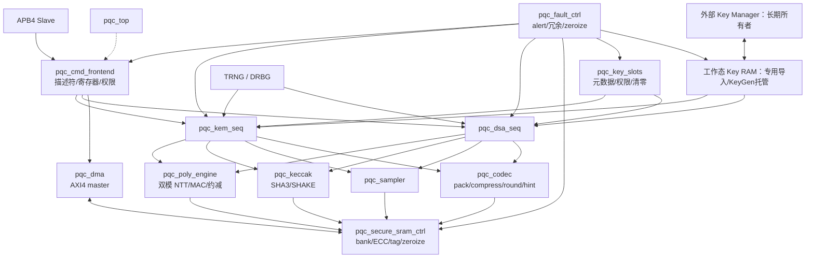

# PQC 加速器高层设计：顶层架构与 L1 模块划分

## 顶层架构

`pqc_top` 为集成与安全边界层，不承担数据通路计算。

## L1 模块划分

| Module ID | Name | 职责 | Applicability |
|---|---|---|---|
| HLD.MOD.PQC.TOP | `pqc_top` | 总线、安全边界、L1 集成 | true |
| HLD.MOD.PQC.FE | `pqc_cmd_frontend` | descriptor、寄存器、权限、门铃 | true |
| HLD.MOD.PQC.KEMSEQ | `pqc_kem_seq` | ML-KEM 全流程序列控制 | `ENABLE_ALGO_MASK & 0x7` |
| HLD.MOD.PQC.DSASEQ | `pqc_dsa_seq` | ML-DSA 全流程序列控制含拒绝循环 | `ENABLE_ALGO_MASK & 0x38` |
| HLD.MOD.PQC.POLY | `pqc_poly_engine` | 双模 NTT/INTT/MAC/约减/rounding | true |
| HLD.MOD.PQC.KECCAK | `pqc_keccak` | Keccak-f[1600]、SHA3-256/512、SHAKE128/256 | true |
| HLD.MOD.PQC.SAMPLER | `pqc_sampler` | rejection/CBD/ExpandA/ExpandS/ExpandMask/SampleInBall | true |
| HLD.MOD.PQC.CODEC | `pqc_codec` | bit pack/unpack、Compress/Decompress、hint、norm check | true |
| HLD.MOD.PQC.SRAM | `pqc_secure_sram_ctrl` | bank/ECC/page tag/zeroize/仲裁 | true |
| HLD.MOD.PQC.WORKKEY | `pqc_work_key_ram` | 专用材料导入/授权读取/KeyGen 托管/擦除 | true |
| HLD.MOD.PQC.KEYSLOT | `pqc_key_slots` | key 元数据/权限/generation/清零 | true |
| HLD.MOD.PQC.DMA | `pqc_dma` | AXI4 搬运、范围检查、分段 | true |
| HLD.MOD.PQC.FAULT | `pqc_fault_ctrl` | alert、冗余检查、zeroize 控制 | true |

---

本章描述目标架构，并非当前 RTL 完成声明。控制、计算与安全存储模块分册保持原 ID。

复用决策见 [PQC 复用记录](../reuse_plan.md)，当前计划使用成熟 RR 与公开 FIFO；未实现的 ECC/CDC 通用资产作为 gap 处理。
