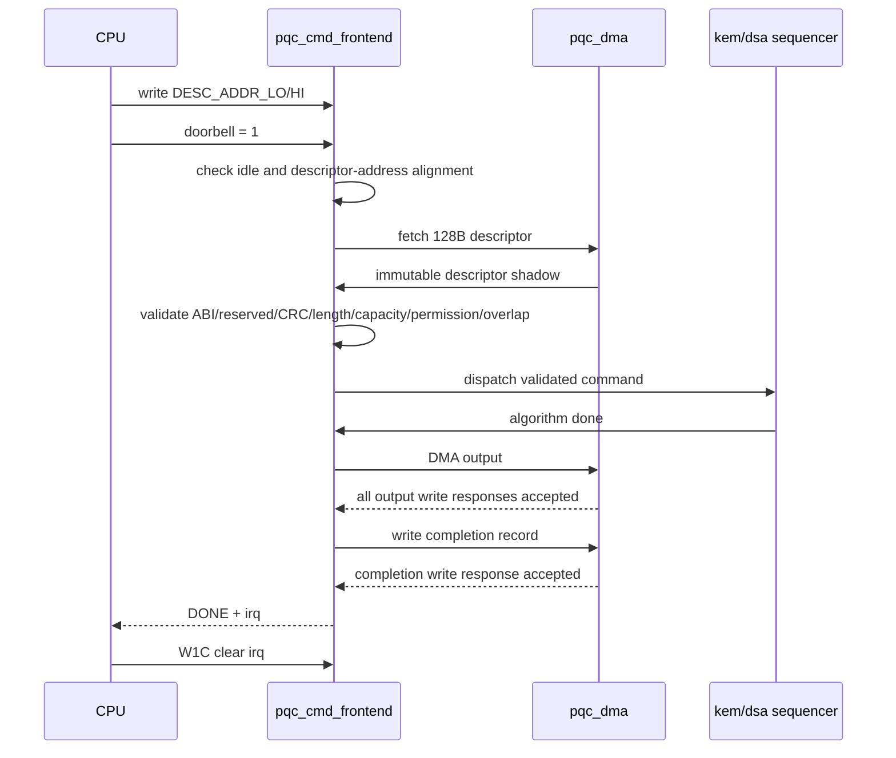
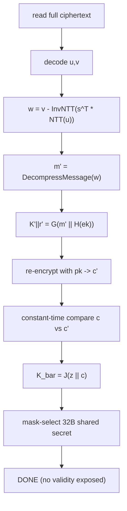
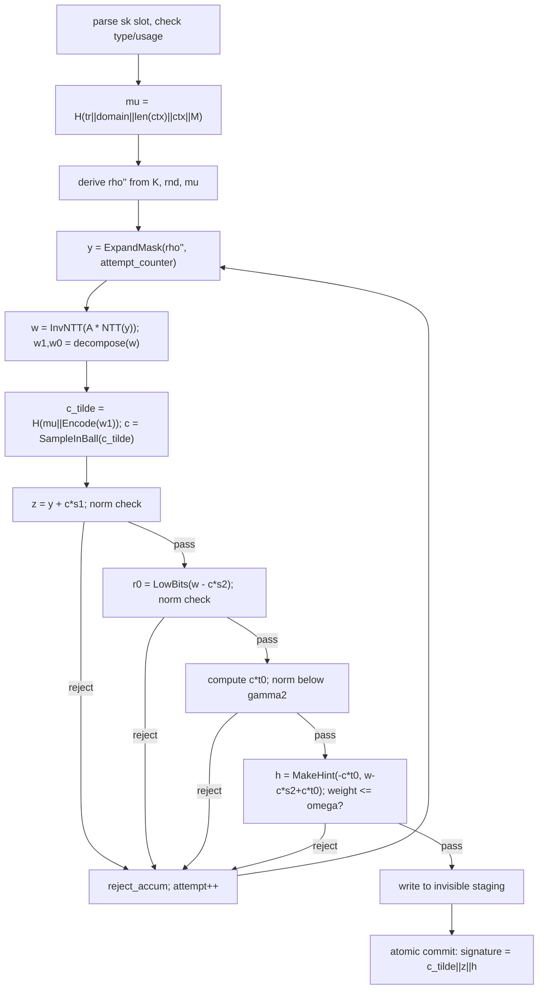

# PQC 加速器高层设计：功能流与控制架构

## HLD.FLOW.PQC.COMMAND

<!-- HLD_FLOW_META
id: HLD.FLOW.PQC.COMMAND
name: command_submit
req_ref:
- LRS.FUNC.PQC.CMD.002
- LRS.FUNC.PQC.CMD.003
- LRS.FUNC.PQC.CMD.006
participants:
- HLD.MOD.PQC.FE
- HLD.MOD.PQC.DMA
- HLD.MOD.PQC.KEMSEQ
- HLD.MOD.PQC.DSASEQ
applicability:
  expr: 'true'
END_HLD_FLOW_META -->

---

## HLD.FLOW.PQC.KEM_DECAPS

<!-- HLD_FLOW_META
id: HLD.FLOW.PQC.KEM_DECAPS
name: kem_decaps_implicit_reject
req_ref:
- LRS.FUNC.PQC.KEM_DECAPS.001
- LRS.FUNC.PQC.KEM_DECAPS.002
participants:
- HLD.MOD.PQC.KEMSEQ
- HLD.MOD.PQC.POLY
- HLD.MOD.PQC.KECCAK
- HLD.MOD.PQC.CODEC
- HLD.MOD.PQC.KEYSLOT
applicability:
  expr: 'true'
END_HLD_FLOW_META -->

关键架构约束：比较与 select 遍历全长度；无论密文是否合法都执行重加密与 `J(z||c)`；
不存在独立 invalid 错误路径；失配不得控制 clock gating 或 DMA 时刻。

---

## HLD.FLOW.PQC.DSA_SIGN

<!-- HLD_FLOW_META
id: HLD.FLOW.PQC.DSA_SIGN
name: dsa_sign_attempt_loop
req_ref:
- LRS.FUNC.PQC.DSA_SIGN.001
- LRS.FUNC.PQC.DSA_SIGN.002
- LRS.FUNC.PQC.DSA_SIGN.003
participants:
- HLD.MOD.PQC.DSASEQ
- HLD.MOD.PQC.POLY
- HLD.MOD.PQC.SAMPLER
- HLD.MOD.PQC.CODEC
- HLD.MOD.PQC.KEYSLOT
applicability:
  expr: 'true'
END_HLD_FLOW_META -->

每个 Sign attempt 汇总 z、r0、c*t0 的范数与 hint 权重结果，不能漏掉 c*t0 检查。
以标准算法的有界循环构建数据依赖；不向外暴露拒绝原因。参见 [FIPS 204 Algorithm 7](https://nvlpubs.nist.gov/nistpubs/FIPS/NIST.FIPS.204.pdf)。

## 提交与异常边界

- shadow 校验必须晚于描述符完整抓取；先检查所有公开长度、容量、地址加法溢出和别名重叠，再访问材料。
- 公开输入读取完成、私钥 READY/授权和熵健康满足后才发射依赖计算；primitive done 只解锁后继，不等于命令完成。
- 候选签名不对外可见。commit 表示授权后开始有序输出写入，并不声称 AXI 多 burst 在内存中瞬时原子。软件仅在成功 completion 后使用输出。
- 输出 DMA 中途失败可能已写入部分公开结果，必须返回失败且不发布成功长度；不能声称可回滚已被 AXI 接受的写。
- 输出全部 B 响应成功后才写 completion；completion 本身失败只能报告本地错误/告警，不能假报 DONE。KeyGen 还须先等托管确认。
- 取消阻止新发射并关闭秘密访问。对已呈现的 AR/AW/W 保持 AXI 稳定规则，排空 R/B；未发写拍使用安全策略处置并等待确认。
- ZEROIZE 命令进入同一独立清除汇聚；SELF_TEST 通过受控内部 KAT 检查后恢复命令资格，失败锁定。冷启动也使用此自检路径。

软件 abort 与 fatal 分开：软件 abort 仅在未开始输出 commit 的安全点接受；
commit 已开始则完成当前公开输出/完成记录后再退休并清除，不能向软件报告
“已中止且无输出”却已写入部分结果。fatal 可立即阻止后续敏感输出，部分公开写的
不可回滚性必须以失败状态暴露，不能当作软件 abort 成功。
