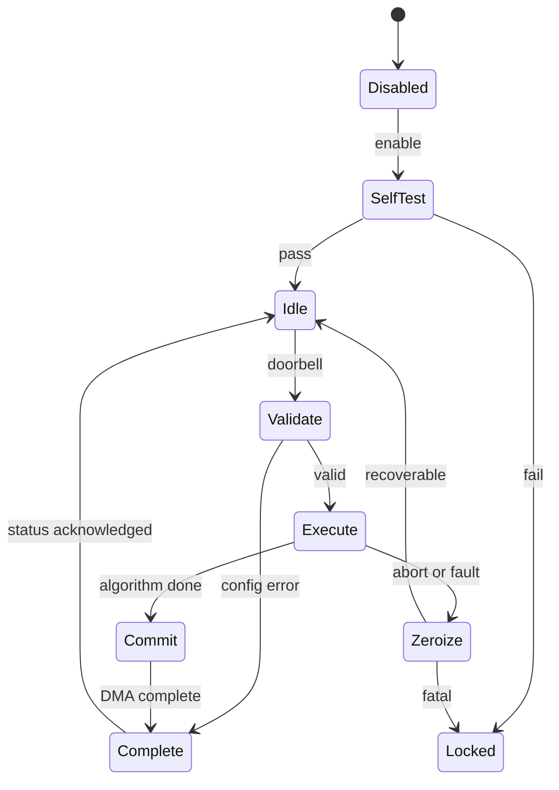

# PQC 加速器高层设计：控制与调度策略

## 控制职责

| Function | Responsible Module |
|---|---|
| command acceptance / validation | `pqc_cmd_frontend` |
| command dispatch | `pqc_cmd_frontend` |
| algorithm sequencing | `pqc_kem_seq` / `pqc_dsa_seq` |
| primitive resource scheduling | sequencers + scoreboard |
| completion & interrupt | `pqc_cmd_frontend` |
| fault arbitration & zeroize | `pqc_fault_ctrl` |

## 架构状态模型

状态编码需满足单 bit fault 不会从 Locked/Zeroize 跳到 Execute（由 `pqc_fault_ctrl`
的稀疏/冗余编码保证，具体编码属 LLD）。`Commit` 前输出不可见。

---

### HLD.POLICY.PQC.RES

<!-- HLD_POLICY_META
id: HLD.POLICY.PQC.RES
type: resource_scheduling
req_ref:
- LRS.PERF.PQC.OVERLAP.001
- LRS.FUNC.PQC.KEM_DATAFLOW.001
policy: static_audited_overlap
fairness_required: true
applicability:
  expr: 'true'
END_HLD_POLICY_META -->

#### Architecture Intent

scoreboard 管理 `KECCAK`、`NTT`、`SAMPLER/CODEC`、`DMA` 四类资源，仅允许静态已审计的
重叠：Keccak 生成下一 polynomial 同时 NTT 处理当前 polynomial；DMA 吸收下一消息块同时
Keccak permutation 当前块；codec pack 上一个结果同时 MAC 计算下一个结果。禁止
speculation 产生未授权 DMA，禁止 secret-dependent predicate 发射/取消 primitive。

---

### HLD.POLICY.PQC.KECCAK_PRIO

<!-- HLD_POLICY_META
id: HLD.POLICY.PQC.KECCAK_PRIO
type: priority
req_ref:
- LRS.SEC.PQC.ZEROIZE.001
- LRS.PERF.PQC.OVERLAP.001
policy: fixed
fairness_required: false
applicability:
  expr: 'true'
END_HLD_POLICY_META -->

#### Architecture Intent

Keccak context 占用优先级固定为：zeroize/fatal > 当前算法关键链 > message absorb >
预展开。同一 Keccak context 不允许被软件抢占；矩阵展开与 message absorb 通过双 context
在 block 边界切换。

---

### HLD.POLICY.PQC.ATTEMPT

<!-- HLD_POLICY_META
id: HLD.POLICY.PQC.ATTEMPT
type: retry_control
req_ref:
- LRS.FUNC.PQC.DSA_SIGN.002
policy: fixed
fairness_required: false
applicability:
  expr: 'true'
END_HLD_POLICY_META -->

#### Architecture Intent

ML-DSA Sign 每次尝试固定调度、总次数和总时延可变。所有拒绝条件先累积为内部
`reject_accum`，在唯一的尝试结束边界分支。z、r0、c*t0 与 hint 权重分别计算并锁存，
禁止将同一个 live norm 信号当成多个检查的完成结果。

采样/XOF 的可变字节消耗、存储等待和所有原语计算都纳入尝试预算。LLD 必须对每个
参数集/配置给出固定的预算和完成标记；早完成保持结果并填充至边界，预算耗尽进入
统一内部错误/清除路径，不在失败的中间检查点发出错误或可见数据。
本条不是用空转计数器冒充算法：所有 mandatory 完成标记必须属于当前 attempt。

尝试计数与 ExpandMask nonce 绑定，标准 nonce 空间不足时禁止回绕复用。
重试保留 mu 和本命令 rho''，清除候选 z/h/比较状态及旧完成标记。达到公开安全上限时
返回通用 `INTERNAL_RETRY_EXHAUSTED` 并清零，不能暴露失败原因/检查位置。
固定尝试调度需要仿真/形式检查，整体时延分布需要独立分析；P50/P95/P99 是性能指标。

---

### HLD.POLICY.PQC.ZEROIZE

<!-- HLD_POLICY_META
id: HLD.POLICY.PQC.ZEROIZE
type: fault_response
req_ref:
- LRS.SEC.PQC.ZEROIZE.001
- LRS.SEC.PQC.LOCK.001
- LRS.RESET.PQC.SAFE.001
policy: fixed
fairness_required: false
applicability:
  expr: 'true'
END_HLD_POLICY_META -->

#### Architecture Intent

tamper、fatal ECC、self-test fail、lifecycle 变化、DMA error、timeout 与 RNG health fail
汇聚为统一安全收尾：停止计算 → 清零工作 SRAM/Keccak/寄存器 → 置位告警/锁定。
`zeroize_req` 经独立同步进入核心域；内部存储清除不依赖主 FSM。必须分别收集
SRAM、Keccak、元数据、工作态 Key RAM 及 DMA/descriptor 排空确认。外部总线若永久
无响应，超时只触发锁定，不能伪造全部完成；有界完成证明须声明总线响应假设。

---

### HLD.POLICY.PQC.BANK

<!-- HLD_POLICY_META
id: HLD.POLICY.PQC.BANK
type: memory_banking
req_ref:
- LRS.FUNC.PQC.KEM_DATAFLOW.001
- LRS.PERF.PQC.LATENCY.001
policy: fixed
fairness_required: false
applicability:
  expr: 'true'
END_HLD_POLICY_META -->

#### Architecture Intent

采用 8 个逻辑 bank，32-bit 数据 word，容量随 LOCAL_SRAM_KIB 均分。每 bank 的物理端口预算
按 1R1W 定义；不把请求端口数误当成物理带宽。NTT_LANES 对应实际并行运算单元，但
每批操作数先按固定映射收集，再执行并写回；冲突按公开地址/轮转解决，不能看系数值。

page/系数到 bank 的映射在页生命周期内保持不变；改变 NTT stage 不能直接改变物理
bank 地址。若 LLD 采用重新排布，必须显式搬移并计入预算。lane 数增加不保证周期严格反比。
DMA 使用公开 packed 页；与计算是否并行由不同 bank/页及资源占用表决定。

---

### HLD.POLICY.PQC.OVERLAP_AUDIT

<!-- HLD_POLICY_META
id: HLD.POLICY.PQC.OVERLAP_AUDIT
type: overlap_whitelist
req_ref:
- LRS.SEC.PQC.CT.001
policy: static_audited_overlap
fairness_required: false
applicability:
  expr: 'true'
END_HLD_POLICY_META -->

#### Architecture Intent

重叠白名单是架构级承诺：只有列出的三类重叠被允许，任何由运行时条件决定的新重叠
需要回到 HLD 重新审计。该策略是"秘密不控制可观察调度"的架构保证。

## 页授权与退休

页分配绑定 command epoch、owner、算法、参数集、representation 与 secret 属性。
所有请求与授权逐次匹配，read 还需逐 word initialized；仅首 word 写入不能使旧整页有效。
页复用先撤销旧授权再完整写入；representation 转换需要原语明确完成，禁止直接修改标签
掩盖数据格式不符。secret→公开只允许完整算法结果 staging 或受控 shared-secret grant，
不允许任意 CSR 降密。异常清除不依赖页有效位，覆盖物理残留与读写暂存。
