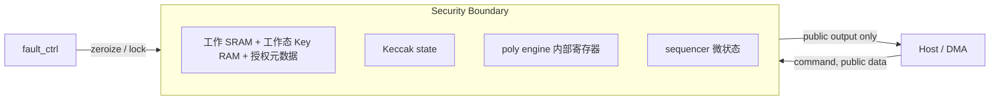

# PQC 加速器高层设计：安全、故障与可观测架构

## 安全边界

私钥材料只经专用 Key Manager 托管接口离开计算子边界；普通主机只看到命令、
公开结果与被策略允许的共享秘密。后者不是允许任意 secret 页读回的通用接口。

### HLD.SAFETY.PQC.ZEROIZE

<!-- HLD_SAFETY_META
id: HLD.SAFETY.PQC.ZEROIZE
name: unified_zeroize_and_lock
req_ref:
- LRS.SEC.PQC.ZEROIZE.001
- LRS.SEC.PQC.LOCK.001
- LRS.RESET.PQC.SAFE.001
mechanism: independent_zeroize_path
detects:
- tamper
- fatal_ecc
- self_test_fail
- lifecycle_change
- dma_bus_error
- timeout
- rng_health_fail
applicability:
  expr: 'true'
END_HLD_SAFETY_META -->

#### Architecture Intent

所有致命事件立即撤销授权、停止新发射，再清除工作 SRAM/Key RAM/Keccak/暂存并锁定。
已发 AXI 事务必须排空，已发托管事务必须取消且不能接受迟到成功确认。独立收集各完成，
完成汇聚覆盖 TOP 随机缓存/分配状态、所有 primitive/sequencer 的敏感寄存器及
Level 2 两份 share；不能仅沿用旧 RTL 的六项 done 向量。
超时进入锁定并保持清除请求，不把超时当作成功。内部擦除有界，外部排空上界依赖环境响应。

---

### HLD.SAFETY.PQC.INTEGRITY

<!-- HLD_SAFETY_META
id: HLD.SAFETY.PQC.INTEGRITY
name: control_and_counter_integrity
req_ref:
- LRS.SEC.PQC.INTEGRITY.001
- LRS.SEC.PQC.VERIFY.001
mechanism: redundant_encoding
detects:
- control_fsm_bit_flip
- opcode_param_keytype_perm_corruption
- loop_counter_nttstage_dmalen_pc_corruption
- verify_result_single_point_fault
applicability:
  expr: 'true'
END_HLD_SAFETY_META -->

#### Architecture Intent

控制 FSM 使用稀疏/冗余编码；opcode、参数集、key type、权限字段带完整性保护；
关键循环计数器、NTT stage、DMA 长度与 micro-PC 提供冗余/奇偶校验；KEM 重加密比较
与 shared-secret select 提供结果完整性；ML-DSA Verify 最终 valid 采用双轨/重复比较。
整体目标是单点故障不能把 invalid 变为 valid，也不能从 Locked/Zeroize 跳到 Execute。

---

### HLD.SAFETY.PQC.SCA

<!-- HLD_SAFETY_META
id: HLD.SAFETY.PQC.SCA
name: side_channel_countermeasures
req_ref:
- LRS.SEC.PQC.CT.001
- LRS.SEC.PQC.CT.002
- LRS.CFG.PQC.SCA_LEVEL.001
mechanism: constant_time_level1_and_two_share_level2
detects:
- secret_dependent_branch
- secret_dependent_gating
- secret_dependent_memory_pattern
applicability:
  expr: 'true'
END_HLD_SAFETY_META -->

#### Architecture Intent

Level 0：常数时间、固定访问、清零。Level 1：在 Level 0 基础上增加随机化、隐藏、
噪声/时序去相关与总线隔离。Level 2：Keccak 与秘密多项式关键路径的一阶 masking、
刷新与安全 RNG。产品化至少达到 Level 1；若声明 Level 2 必须明确 masking scheme、
share 数、fresh randomness 上界与 glitch 假设，并以 TVLA 与针对性 CPA/EMA 验证。

---

### HLD.SAFETY.PQC.KEMCT

<!-- HLD_SAFETY_META
id: HLD.SAFETY.PQC.KEMCT
name: kem_implicit_reject
req_ref:
- LRS.FUNC.PQC.KEM_DECAPS.001
- LRS.FUNC.PQC.KEM_DECAPS.002
mechanism: constant_time_compare_select
detects:
- ciphertext_mismatch
applicability:
  expr: 'true'
END_HLD_SAFETY_META -->

#### Architecture Intent

Decaps 无论密文是否合法都执行重加密、全长度常数时间比较与 constant-time select；
`K_bar = J(z||c)` 始终计算；对外只返回普通 DONE 与 32 B secret。

---

### HLD.SAFETY.PQC.DFXTEST

<!-- HLD_SAFETY_META
id: HLD.SAFETY.PQC.DFXTEST
name: observability_and_injection
req_ref:
- LRS.DFX.PQC.SCAN.001
- LRS.DFX.PQC.MBIST.001
- LRS.DFX.PQC.DEBUG.001
- LRS.DFX.PQC.FI.001
mechanism: secure_scan_and_gated_injection
detects:
- secret_in_scan_chain
- retained_key_in_mbist
- secret_in_debug_port
applicability:
  expr: 'true'
END_HLD_SAFETY_META -->

#### Architecture Intent

秘密寄存器与 key RAM 不进入普通 scan chain；生产生命周期不可旁路。SRAM MBIST
前后受控清零且不泄露 retained key。debug 仅可观察公开 command state、粗粒度进度与
错误类别。公开数据路径 ECC/DMA/控制完整性错误可注入；秘密相关 fault injection 端口
仅测试生命周期存在。trace 不记录 seed、randomness、secret coefficient、shared secret、
签名 nonce 或 KEM validity。

## 安全验证架构钩子

### HLD.VERIFY_HOOK.PQC.TAINT

<!-- HLD_VERIFY_HOOK_META
id: HLD.VERIFY_HOOK.PQC.TAINT
req_ref:
- LRS.SEC.PQC.CT.001
hook_type: formal_taint
description: 证明 secret-tainted 信号不控制外部错误码、DMA 地址与未授权可见状态
applicability:
  expr: 'true'
END_HLD_VERIFY_HOOK_META -->

### HLD.VERIFY_HOOK.PQC.FSM

<!-- HLD_VERIFY_HOOK_META
id: HLD.VERIFY_HOOK.PQC.FSM
req_ref:
- LRS.SEC.PQC.INTEGRITY.001
- LRS.SEC.PQC.ZEROIZE.001
hook_type: sva
description: 关键 FSM、zeroize、有界完成、无死锁、FIFO overflow/underflow 断言
applicability:
  expr: 'true'
END_HLD_VERIFY_HOOK_META -->

## 实现与证明的边界

SCA Level 1/2、控制完整性与自检是待落实的架构要求，不是由参数名或能力位自动成立的属性。
Level 2 本轮必须实现并验证；两 share 候选方案见 [Level 2 专卷](09_masking_level2.md)。
具体 gadget 组合/transition 证明、周期与随机预算以及物理验证证据保持开放，
不得在未证明的配置上声称具备对应防护。功能 KAT、常数时间分析和物理泄漏评估相互不能替代。
