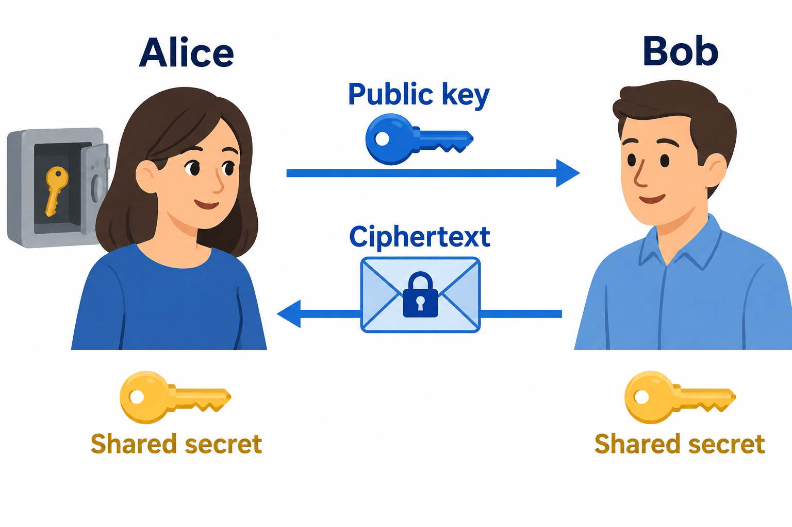

# 01 · PQC 是什么

[学习首页](../index.md) · [下一章：必要的数学](02-math.md)

## 先理解要解决的两个问题

假设 Alice 和 Bob 只能通过可能被旁观的网络通信。他们需要解决两个独立问题：一是建立只有双方知道的秘密，二是判断某条消息是否真的由声称的发送者发出、有没有被修改。

本项目用 **ML-KEM** 建立共享秘密，用 **ML-DSA** 生成和验证数字签名。它们分别由 NIST 的 [FIPS 203](https://csrc.nist.gov/pubs/fips/203/final) 和 [FIPS 204](https://csrc.nist.gov/pubs/fips/204/final) 定义。后量子密码使用普通计算机和普通数字电路运行，研究的是抵抗包括量子计算攻击在内的攻击者，不需要量子硬件。

PQC 不等于“所有密码都被替换”。大数据的保密传输仍通常使用对称密码；这里的加速器主要承担公钥密码中的密钥建立与签名工作。不要把“后量子”理解成已证明永远不可破解。

## KEM：双方得到同一个秘密

图 1：Public key=公钥，Ciphertext=密文，Shared secret=共享秘密。保险箱中的钥匙是 Alice 的私钥；人物下方相同的金色钥匙表示双方最终得到的共享秘密。图是通信用途示意，不把这些不同种类的钥匙视为同一个数据对象。

1. Alice 执行 `KeyGen`，得到公钥 `ek` 和私钥 `dk`；她公布 `ek`，保存 `dk`。
2. Bob 用 `ek` 执行 `Encaps`，得到密文 `c` 和共享秘密 `K_B`。
3. Bob 只把 `c` 发给 Alice，不发送 `K_B`。
4. Alice 用 `dk` 和 `c` 执行 `Decaps`，得到 `K_A`。正常情况下 `K_A=K_B`。

可以把密文想成“让持有对应私钥的人计算出同一秘密的公开材料”。它不是业务消息的密文；KEM 的接口没有“输入一段任意业务明文”的参数。协议随后可将共享秘密用于密钥派生，再用对称算法保护业务数据。

**KEM 本身也不证明公钥属于谁。** 公钥的身份绑定由证书、签名、预配置等上层机制解决；“双方拿到同一个秘密”不自动等于“确认了对方身份”。

## 签名：证明消息与私钥持有者有关

1. 签名方生成公钥 `pk` 和私钥 `sk`。
2. 输入消息 `M`、私钥 `sk`，执行 `Sign` 得到签名 `sig`。
3. 验证方输入 `pk`、`M`、`sig`，执行 `Verify`，得到有效或无效。

签名不隐藏消息。签名也不是“用私钥加密、用公钥解密”：ML-DSA 没有这种工作方式。验证方检查一个数学关系，而不是解出消息。

本项目的签名 API 还有 `context`：它让不同使用场景具有不同的签名输入域。例如同一消息在“固件更新”和“用户登录”场景中不应被混用。调用者与验证者必须使用一致的 context。

## 六个参数集

以下尺寸来自模型 [params.py](../../pqc_accel_model/src/pqc_hw_model/params.py)，单位均为 B。私钥长度指编码后的完整私钥；句柄不是这个长度。

| 参数集 | 模数 q | 矩阵尺寸 | 公钥 | 私钥 | 密文或签名 |
|---|---:|---|---:|---:|---:|
| ML-KEM-512 | 3329 | 2×2 | 800 | 1632 | 密文 768 |
| ML-KEM-768 | 3329 | 3×3 | 1184 | 2400 | 密文 1088 |
| ML-KEM-1024 | 3329 | 4×4 | 1568 | 3168 | 密文 1568 |
| ML-DSA-44 | 8380417 | 4×4 | 1312 | 2560 | 签名 2420 |
| ML-DSA-65 | 8380417 | 6×5 | 1952 | 4032 | 签名 3309 |
| ML-DSA-87 | 8380417 | 8×7 | 2592 | 4896 | 签名 4627 |

ML-KEM 的共享秘密固定为 32 B。“768”不是共享秘密位数，“65”也不是 65-bit 安全性；这些数字是参数集名称。所有参数集都使用 256 系数的多项式，变化的是矩阵/向量尺寸与采样、压缩等参数。

## 从算法走向芯片

一次算法会重复进行哈希、随机展开、采样、多项式乘法、编码。这些运算适合共享硬件：两个算法共用多项式引擎、Keccak、采样器和编码器，由不同控制器安排顺序。软件看到的是一次命令，硬件执行的是许多较小的原语。

本项目中要区分三类材料：

| 材料 | 作用 | 不代表什么 |
|---|---|---|
| Python 完整算法 API | 产生和检查完整密码结果 | 不代表全部底层算法由本仓自行实现 |
| Python 底层模型 | 研究表示、地址、编解码与权限 | 不代表逐时钟模拟 |
| RTL 与设计文档 | 实现并描述电路与协议 | 有文件不代表端到端已经验证 |

## 检查理解

1. KEM 中网络传输的是共享秘密还是密文？**密文；共享秘密留在双方本地。**
2. 签名能否让旁观者看不到消息？**不能，签名提供真实性和完整性检查。**
3. 8 个密钥槽是不是 8 个私钥材料 RAM？**不是，槽是授权元数据；本项目的工作态 Key RAM 另有独立设计。**
