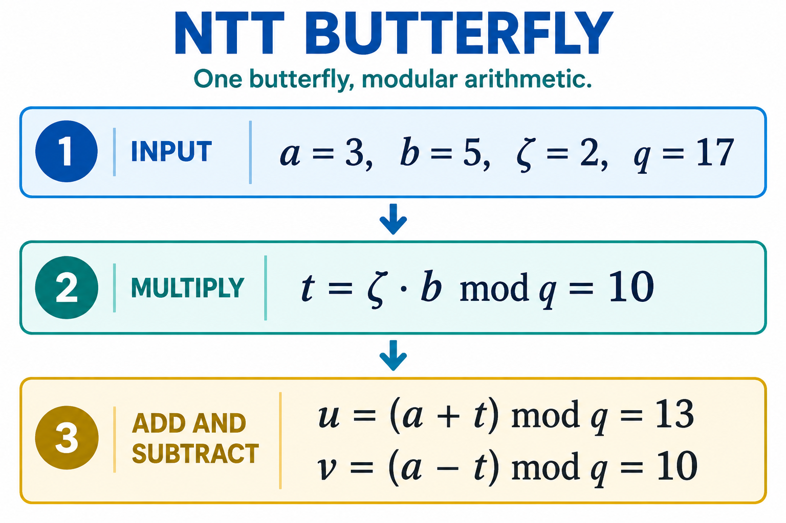

# 03 · NTT 与模运算：多项式乘法的计算核心

[上一章](02-math.md) · [学习首页](../index.md) · [下一章](04-hash-sampling-codec.md)

## 为什么要变换

直接计算两个 n 系数多项式的乘法，朴素方法需要 n² 对系数乘积。NTT（数论变换）将多项式换成更适合乘法的表示：先变换，再在变换域相乘，最后逆变换。它类似离散傅里叶变换的分治思路，但全部在有限域中进行，没有浮点误差。

```text
系数域 a,b → NTT → 变换域乘法 → INTT → 系数域结果
```

这条路线成立的前提是变换常量、排列、乘法定义和缩放都一致。“正变换后能逆回来”只证明两段程序互逆，不证明中间逐点相乘就等于正确的多项式乘法。

## 一组蝶形究竟算什么



图 2：INPUT=输入，MULTIPLY=模乘，ADD AND SUBTRACT=模加与模减；ζ 是 zeta 的数学记号。该图演示一个蝶形的计算步骤，不表示整个 NTT 的银行连线或周期安排。

本项目 [ntt.py](../../pqc_accel_model/src/pqc_hw_model/ntt.py) 的正向蝶形是：

```text
t = zeta · b mod q
u = a + t mod q
v = a - t mod q
```

`zeta` 是预先选定的旋转因子。硬件读取 a、b，从 ROM 取得 zeta，做一次模乘、一次模加和一次模减，再写回 u、v。

模 17 的教学例子：a=3、b=5、zeta=2，则 t=10、u=13、v=10。逆操作先求 `(u+v)/2 mod 17=3`，再求 `(u-v)/2·zeta⁻¹ mod 17=5`。这里 `/2` 是模二分，不是普通除法截断。

## stage、group、lane 和 bank

以 256 系数为例，第一 stage 配对 `(0,128)`、`(1,129)` 等；下一 stage 将跨度减半，直到目标层数。每层有 128 个蝶形。一次变换中，前一层结果是后一层输入，不能在依赖未写回时就直接读取。

| 名称 | 含义 | 本模型中的体现 |
|---|---|---|
| stage | 一层配对 | `length` 每次减半 |
| group | 共用同一 zeta 的一组蝶形 | `start` 与组内 j 循环 |
| lane | 并行计算资源数量 | `NttConfig.lanes` 为 1/2/4 |
| bank | 存储分银行，提供独立端口 | 模型用索引模 banks 统计冲突 |
| twiddle | 某组蝶形的常数因子 | `_zeta` 由位反转指数生成 |

模型每层只累加 `ceil(128/lanes)` 个理想计算周期；不计算完整 SRAM 读写、流水停顿和总线等待。两 lane 下 KEM 正变换的这个计数为 7×64=448，DSA 为 8×64=512，**不是 RTL 实测时延**。

模型 NTT 用 `i % banks` 判断一对地址是否冲突，`memory.py` 则用 `(byte_address//4)%banks`。按每系数一个 word 对齐时可以对应，但它们没有被整合为逐拍的共同存储模型。

## ML-KEM 的关键特殊性

KEM 的 q=3329，q-1=3328，含 256 阶单位根，但不能按 DSA 的方式使用 512 阶单位根。当前模型以根 17、阶 256，执行 7 层，到 `length=2` 停止。

变换结果要按二项式块理解。对某个由 γ 指定的二项式模因子，块乘法的形式为：

```text
(a0+a1·x)(b0+b1·x) mod (x²-γ)
c0 = a0·b0 + γ·a1·b1 mod q
c1 = a0·b1 + a1·b0 mod q
```

γ 随块和标准排列变化。不能把 256 个系数分别相乘，当作完整 ML-KEM 的 base multiplication。指定的 Python `HardwareNTT` 没有提供这个完整乘法链；[README](../../pqc_accel_model/README.md) 也明确指出中间排列与标准常量尚需冻结。

DSA 的 q=8380417 支持使用 512 阶根，本模型用 1753、8 层到 `length=1`。其完整变换后的乘法可以使用标量逐点乘法，再作一致的逆变换。

## 普通域、Montgomery 域不要混用

[modular.py](../../pqc_accel_model/src/pqc_hw_model/modular.py) 同时提供普通模运算与 Montgomery 运算。令 `R=2^w`，Montgomery 表示为 `aR mod q`；约减 REDC 把 T 变成 `TR⁻¹ mod q`，因此：

```text
REDC((aR)(bR)) = abR mod q
```

这让多次乘法始终停留在同一表示中，最后再转换回来。模型配置中 `montgomery_bits` 和 `coeff_width` 是不同字段；测试甚至给两种模数都使用 32-bit Montgomery radix。不要根据系数宽度自行推断 R。

模型约减的核心是 `m=(T·(-q⁻¹)) mod R`，随后 `(T+m·q)/R`，最后按范围减 q。其一次条件减法依赖合法输入范围，不能把任意大整数扔进去就当通用 `%q`。

需要特别区分当前设计：`HardwareNTT` 使用普通余数，不调用 `ModularALU.montgomery_mul`；新的 [POLY LLD](../lld/03_poly.md) 也选择普通 residue 和固定约减。包中出现 `REP_NTT_MONT` 名称，不足以证明真实数据都含 Montgomery 缩放因子。

## 从模型到硬件还差什么

详细设计为 DSA 利用 `q=2²³-8191` 折叠约减，为 KEM 使用固定常数商估计；同时规定流水、操作数收集、写回和银行映射。Python README 中提到 Barrett，但指定的 `ModularALU` 中没有独立 Barrett API。

LLD 的 XOR 银行映射比模型的低位取模更复杂，目的在于让蝶形两端分布到不同银行。它仍需要检查多 lane 同时读写的端口占用；“单组无冲突”不等于“全部并发无冲突”。参阅 [POLY 微架构](../lld/03_poly.md) 与 [bank 调度检查脚本](../../scripts/check_ntt_bank_schedule.py)。

## 检查理解

1. NTT round-trip 通过能证明标准乘法正确吗？**不能，还需与负循环乘法及标准 checkpoint 比较。**
2. `lanes=4` 能保证总命令加速四倍吗？**不能，存储、流水、哈希和控制仍有成本。**
3. KEM 与 DSA 能否复用模乘硬件？**可以，但模数、根表、层数和变换域乘法模式必须分别选择。**
