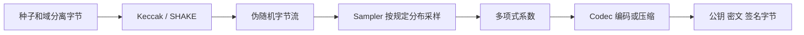

# 04 · 哈希、采样与编码：字节和系数之间的桥梁

[上一章](03-ntt-and-modular.md) · [学习首页](../index.md) · [下一章](05-ml-kem.md)

## 三类操作的分工



Keccak 不决定一个系数是否应该被接受；Sampler 不负责生成 SHAKE；Codec 不负责产生随机性。把职责分开，方便单独验证流、分布和格式。

## Keccak、SHA3 与 SHAKE

Keccak-f[1600] 的状态可视为 5×5 个 64-bit lane，共 1600 bit。这里的 Keccak lane 是状态的一条 64-bit 字，与 NTT 的并行计算 lane 不是同一含义。

一个 sponge（海绵结构）先吸收输入，完成域分离和 padding，再通过置换挤出输出。置换有 24 轮，每轮包含 θ、ρ、π、χ、ι：扩散、旋转、重排、非线性混合、注入轮常量。RTL 入口为 [pqc_keccak.sv](../../rtl/pqc_keccak.sv)，设计解释见 [Keccak LLD](../lld/03_keccak.md)。

| 函数 | 每块 rate | 输出 | 常见用途 |
|---|---:|---|---|
| SHA3-256 | 136 B | 固定 32 B | KEM 公钥哈希 |
| SHA3-512 | 72 B | 固定 64 B | KEM 派生两段 32 B 材料 |
| SHAKE128 | 168 B | 可变 | 矩阵扩展 |
| SHAKE256 | 136 B | 可变 | 噪声、消息摘要、挑战等 |

这些配置在 [keccak.py](../../pqc_accel_model/src/pqc_hw_model/keccak.py) 中通过 `hashlib` 实现接口模型。增量 `absorb(a); absorb(b)` 应与一次输入 `a||b` 相同。**该模型多次 `digest(n)` 会重复取前 n 字节，并不是从上次位置继续 squeeze。** 学习硬件续块时必须记住这个差异。

域分离意味着相同原始种子在不同用途下要形成不同的输入。矩阵的行列编号、采样 nonce、签名 context 的格式都不能随意交换，否则结果虽“像随机数”，却不是同一个标准对象。

## 为什么不能直接对随机整数取模

设只生成 4-bit 数，均匀范围 0..15，想得到模 5 的均匀结果。直接 `%5` 会让 0 出现 4 次，而 1..4 只各出现 3 次，产生偏差。拒绝采样可以只接受 0..14，再取模 5，使每个结果恰好对应 3 个输入。

本项目 [Sampler LLD](../lld/03_sampler.md) 的模式如下：

| 模式 | 字节如何映射 | 产物 |
|---|---|---|
| KEM uniform | 三字节拆成两个 12-bit 数，拒绝 ≥3329 | 均匀矩阵系数，直接是 NTT 表示的采样对象 |
| KEM CBD | 每 2η 个 bit 分成两组，各做 popcount，再相减 | 以 0 为中心的小噪声 |
| DSA ExpandA | 每 3 B 取低 23 bit，拒绝 ≥8380417 | 均匀矩阵系数 |
| DSA ExpandS | nibble 候选按 η=2/4 的规则拒绝、映射 | 短秘密向量 |
| DSA ExpandMask | 每个 18/20-bit 数 v 映射为 γ1-v | 签名候选向量 y |
| DSA SampleInBall | 符号位与位置选择 | 恰有 τ 个非零 ±1 系数的挑战 c |

CBD 的小例子：η=2，两组 bit 为 `11` 和 `01`，popcount 为 2 和 1，系数得到 +1。噪声并不是把 uniform 系数裁剪到一个小区间。

采样时必须处理被拒绝候选、跨块候选和输出背压。例如三个字节给出两个合法候选，第一项写入 SRAM 后第二项仍需保留；如果一共只差一项就凑齐 256 系数，则第二项应丢弃，不能越界。

指定的 `pqc_accel_model` **没有独立 sampler.py**。完整算法的采样在依赖库中，采样硬件的参考接口需读 RTL、LLD 和 `scripts/check_sampler_contract.py`。

## packing、压缩、舍入是三件事

**Packing** 把固定位宽整数紧凑排列，不改变数值。模型 `pack_lsb` 采用低位先行。例如 `[1,2,3]` 每项 3 bit：整数位串合成为 `1+(2<<3)+(3<<6)=209`，得到字节 `d1 00`。最后 7 个未使用 bit 应为零。

**压缩** 降低系数精度。KEM 的概念形式为：

```text
Compress_d(x)   = round(2^d · x / q) mod 2^d
Decompress_d(y) = round(q · y / 2^d)
```

精确整数舍入按规范实现，不能用浮点近似替代。压缩后再解压通常不等于原系数，这是算法允许的量化误差；位 packing 后再 unpack 则应相同。

**舍入与 hint** 用于 DSA：Power2Round 将 t 分为高、低位；Decompose/HighBits/LowBits 按另一组参数分解；hint 告诉验证方如何修正高位。它们不是同一个“移位”功能，q 边界处需要规定的特殊处理。

## 规范性检查为什么不可省略

12 bit 可以表示 0..4095，但 KEM 规范系数只允许 0..3328。`unpack_lsb(..., modulus=3329)` 会返回解码值和 `canonical=False`，不会自动把非法值模 q 再当合法。

模型会检查非零尾位，但允许额外全零字节；因此“canonical=True”不是完整算法格式长度已验证的证明。还需按参数集检查公钥、签名或密文的精确长度。模型 unpack 也没有与 pack 一样完整的 bits 参数防御性检查，应按有效接口使用。

RTL `pqc_codec` 的目标职责比这个 Python 文件广：还包括压缩、DSA rounding/hint、范数检查等。详见 [Codec LLD](../lld/03_codec.md)。

## 检查理解

1. 256 个 12-bit 系数紧凑编码多少字节？**384 B。**
2. SHAKE 产生了 256 B，是否就有 256 个系数？**不一定，取决于位宽、分布与拒绝次数。**
3. 模型 `digest(32)` 调用两次能得到前后两段吗？**不能，两次是相同前缀。**
