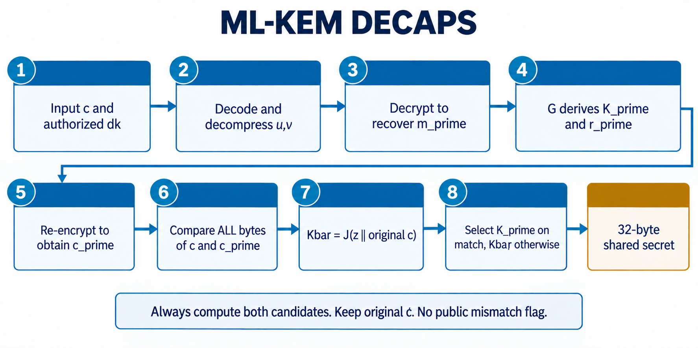
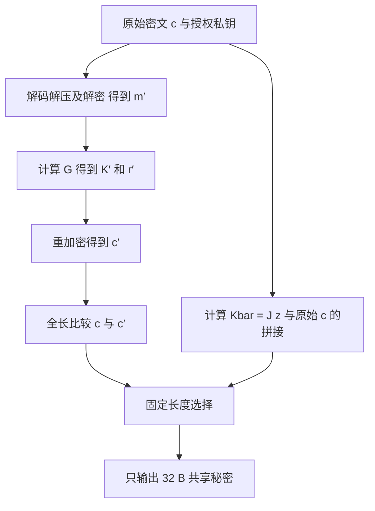

# 05 · ML-KEM：从密钥生成到隐式拒绝

[上一章](04-hash-sampling-codec.md) · [学习首页](../index.md) · [下一章](06-ml-dsa.md)

本章以 [KEM 流程详细设计](../lld/03_kemseq.md)、[Encaps 设计](../lld/03_kemseq_encaps.md)、[Decaps 设计](../lld/03_kemseq_decaps.md) 和模型 API 为工程依据；算法定义入口为 [FIPS 203](https://csrc.nist.gov/pubs/fips/203/final)。公式采用省略编码与表示转换的教学形式，实际实现必须遵循标准字节布局。

## 对象和参数

| 符号 | 含义 | 是否秘密 |
|---|---|---|
| ρ | 生成矩阵的种子 | 公钥的一部分 |
| A / Â | 多项式矩阵 / NTT 域矩阵 | 公开，可按需重建 |
| s、e | 私钥向量与误差向量 | 秘密 |
| t̂ | 变换域公钥向量 | 公开 |
| m、r | 封装内部消息、加密随机性 | 秘密 |
| y、e1、e2 | 一次加密的短随机向量/误差 | 秘密 |
| c=(u,v) 的编码 | 密文 | 公开 |
| K | 32 B 共享秘密 | 受输出策略保护 |
| z | 解封装失败时派生备用秘密的私钥材料 | 秘密 |

| 参数 | 512 | 768 | 1024 |
|---|---:|---:|---:|
| k | 2 | 3 | 4 |
| η1 | 3 | 2 | 2 |
| η2 | 2 | 2 | 2 |
| du | 10 | 10 | 11 |
| dv | 4 | 4 | 5 |

公钥编码为 `t̂ || ρ`，长度 `384k+32`；密文长度为 `32(k·du+dv)`。ML-KEM-768 因此得到公钥 1184 B、密文 1088 B。完整 dk 包括底层解密密钥、ek、公钥哈希和 z，总长 `768k+96`，768 参数集为 2400 B。

## 第一步：KeyGen

概念关系是 `t=A·s+e`。工程执行过程如下：

1. 从授权随机源取得种子 d、z，派生矩阵种子 ρ 与噪声种子 σ；种子派生包含参数集相关信息。
2. 用 SHAKE 和行列编号按需展开 Â；不必把整张矩阵常驻 SRAM。
3. 按 CBD 分布采样 s、e，并作 NTT 得到 ŝ、ê。
4. 对每一行累加 `t̂[i]=Σ Â[i,j]×ŝ[j]+ê[i]`，KEM 乘法采用 base multiplication。
5. 编码公钥与私钥；硬件目标方案将私钥写入工作态 Key RAM，经过外部 Key Manager 托管确认后发布句柄。

注意矩阵已按规定在 NTT 域采样，不要再对 ExpandA 的结果做一次多余的正变换。KeyGen 中 A[i,j] 的 XOF 后缀与 Encaps 使用转置时不同，行列次序要跟源码/标准核对。

模型 `PqcAccelerator.keygen` 返回 `(public_key, handle, trace)`，并将依赖库生成的私钥 bytes 保存到 Python 字典。它没有模拟硬件 Key Manager 的专用握手。

## 第二步：Encaps

对合法 ek，封装方产生 32 B 随机 m，计算：

```text
(K,r) = G(m || H(ek))
c = K-PKE.Encrypt(ek,m,r)
返回 c 与 K
```

这里 `H=SHA3-256`，`G=SHA3-512`，G 的 64 B 输出分成两段 32 B。内部 K-PKE 是整个 KEM 的组件，不能从中抽出一个未带完整变换的“公钥加密 API”作为本项目交付能力。

内部加密的直观形式为：

```text
u = Aᵀ·y + e1
v = tᵀ·y + e2 + EncodeMessage(m)
c = Pack(Compress_du(u)) || Pack(Compress_dv(v))
```

实际计算在 NTT 域做矩阵乘法，再 INTT 回系数域加误差与消息。m 的每个 bit 映射到模 q 的两个相隔较远的区间之一，使小噪声不容易改变判决。

## 第三步：Decaps



图 5：按上排 1→4、下排 5→8 阅读。`m_prime/K_prime/r_prime/c_prime` 分别是 m′/K′/r′/c′。这里画的是项目允许的一种串行执行顺序，蓝箭头表示步骤推进，不表示每一步只读取前一步输出；G 还需要公钥哈希，重加密还需要 ek，J 必须使用私钥 z 和**原始 c**。两份候选秘密均计算后才选择，不能从失配分支提前返回。

解密先从 c 解包、解压得到 u、v，再计算：

```text
v - sᵀ·u ≈ EncodeMessage(m) + 小误差
```

恢复 m′ 后，还必须继续完成完整 KEM 的检查与选择：



`J=SHAKE256` 输出 32 B。若 c=c′，输出 K′；否则输出 `Kbar=J(z||c)`。这叫**隐式拒绝**：长度正确但内容不匹配的密文仍产生 32 B 秘密，不暴露“密文校验失败”结果。

比较要累计全部字节的 XOR/OR，不在第一个失配处停止；Kbar 应始终计算。原始 c 必须保留，因为 J 使用原始收到的密文，不是重加密 c′。即使 c′ 形式上也是密文，在选择前仍属于敏感中间结果，不可经普通 DMA 发布。

## 两类错误不能混淆

| 情况 | 处理语义 |
|---|---|
| 密文长度不合法、参数集不支持、私钥授权失败 | 公开结构/权限错误，按合同拒绝执行 |
| 长度正确，但重加密不匹配 | 隐式拒绝，返回派生秘密，命令完成状态不泄露匹配位 |
| DMA/ECC/RNG 故障 | 系统失败，阻止结果发布并安全收尾 |

隐式拒绝不意味着“无论输入长度和私钥是否合法都返回成功”，也不意味着上层协议一定继续接受这个连接。持有不同共享秘密的双方通常会在后续协议的认证检查中无法建立有效会话。

## 运算到硬件的映射

| 阶段 | 控制器安排的资源 | 需要保留的关键对象 |
|---|---|---|
| 种子和哈希派生 | Keccak、随机源 | ρ、σ、r、哈希上下文 |
| 采样 | Keccak → Sampler | nonce、采样计数、当前多项式 |
| 矩阵乘法 | Poly、SRAM | 秘密 NTT 向量、当前矩阵项、累加器 |
| 消息和密文处理 | Codec、Poly | u、v、压缩位宽 |
| 解封装重加密与选择 | KEM 控制器、Keccak、比较/选择端点 | 原始 c、c′、K′、Kbar |
| 发布 | FE、DMA、授权路径 | 已完成且被允许发布的输出 |

顶层当前存在专门的 `pqc_kem_encaps`、`pqc_kem_decaps` 候选实现，也有 `pqc_kem_seq`。不能只读旧序列器就推断当前完整数据路径。2026-09-18 最新报告记录 Decaps 串行链修复和有限场景回归通过；完整 KeyGen、DSA 和安全义务仍未闭环，参阅[状态章](12-status-and-references.md)。

## 检查理解

1. 为什么解密恢复 m′ 后还要重加密？**完整 KEM 用它检查密文一致性，并作隐式拒绝选择。**
2. 密文失配后为何不能返回固定全零 K？**备用秘密必须按规定依赖私钥 z 和原始密文。**
3. ML-KEM-768 的密文怎么得到 1088 B？**32×(3×10+4)。**
