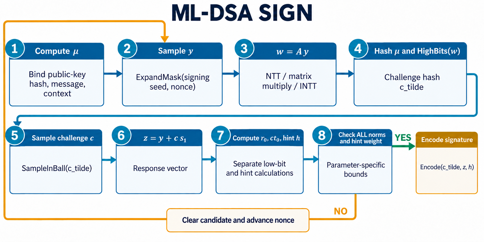
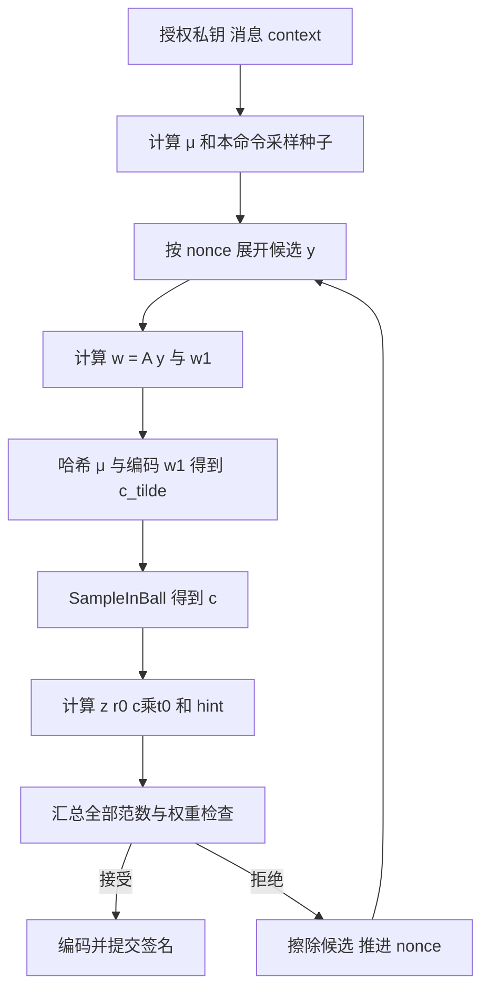

# 06 · ML-DSA：挑战、拒绝重试与 hint

[上一章](05-ml-kem.md) · [学习首页](../index.md) · [下一章](07-model-guide.md)

本章结合 [DSA 功能需求](../lrs/03_functional_dsa.md)、[DSA 序列器详细设计](../lld/03_dsaseq.md) 与模型的 `dsa_sign/dsa_verify` 阅读。算法规范入口为 [FIPS 204](https://csrc.nist.gov/pubs/fips/204/final)。下面强调数据关系；严格编码、分解边界和输入检查仍以标准为准。

## 先认识签名中的对象

| 对象 | 直观作用 |
|---|---|
| A，尺寸 k×l | 可从公开种子 ρ 重建的矩阵 |
| s1、s2 | 短秘密向量，分别有 l、k 个多项式 |
| t=A·s1+s2 | 与私钥相关的公开关系 |
| t1、t0 | t 的高、低位，满足 t=t1·2^d+t0 |
| μ | 绑定公钥、消息和 context 的消息代表 |
| y | 每次签名尝试的随机候选向量 |
| w=A·y，w1=HighBits(w) | 对 y 的承诺及其高位信息 |
| c_tilde、c | 挑战哈希字节串及其稀疏多项式 |
| z=y+c·s1 | 签名响应向量；不要与 KEM 私钥中的 z 混淆 |
| h | 验证方修正高位信息所需的 hint |

签名编码的三个主体是 `(c_tilde,z,h)`；并不把 y、s1、s2、t0 交给验证者。

| 参数 | ML-DSA-44 | ML-DSA-65 | ML-DSA-87 |
|---|---:|---:|---:|
| k、l | 4、4 | 6、5 | 8、7 |
| η | 2 | 4 | 2 |
| τ（挑战非零系数数） | 39 | 49 | 60 |
| β=τ·η | 78 | 196 | 120 |
| γ1 | 2^17 | 2^19 | 2^19 |
| γ2 | (q-1)/88 | (q-1)/32 | (q-1)/32 |
| ω（hint 权重上限） | 80 | 55 | 75 |
| c_tilde 字节数 | 32 | 48 | 64 |

三个参数集均 n=256、q=8380417、Power2Round 的 d=13。参数决定采样范围、检查阈值和编码长度，不由软件随意选择。

## KeyGen：保留可验证的公开关系

1. 从随机种子派生矩阵种子、秘密采样种子、签名派生所需的密钥材料。
2. 展开 A，采样短向量 s1、s2。
3. 通过 NTT 和矩阵乘法计算 `t=A·s1+s2`。
4. 用 Power2Round 分成 t1、t0。
5. 公钥包含 ρ、t1；私钥包含相应种子、公钥哈希、s1、s2、t0 等编码材料。

为什么公钥只保存 t1？它缩小公开数据；低位误差由签名结构和 hint 处理。公钥不是完整 t 的逐字复制。

## 消息与 context

纯 ML-DSA 的外层输入把 context 与消息作规定的域分离编码，再与公钥相关摘要计算 μ。空消息、空 context 也有明确意义，不能省略应该存在的前缀。模型限制 context 长度最多 255 B。

`deterministic=True` 与使用随机量的签名都应生成可验证签名；前者在相同密钥、消息与 context 下可复现，后者混入新随机性。测试复现用途不能代替生产随机策略。

HashML-DSA 是另一种有规定域分离与预哈希标识的接口，不等于“自己先把消息哈希，再把 digest 作为普通消息”。本项目 `ENABLE_HASH_ML_DSA` 默认关闭，指定的模型封装没有单独的 HashML-DSA API。

## Sign：先构造候选，再检查能否公开



图 6：蓝线是正常尝试，橙线只回到步骤 2；μ 属于预处理，可以在重试间复用。步骤 4 的 HighBits(w) 需要规定编码后才输入挑战哈希。步骤 7 的 r0、ct0、hint 是不同结果，步骤 8 使用本参数集的独立阈值。签名种子由私钥材料、μ 及所选随机策略派生，不是仅用 μ 采样 y。图中各运算的精确公式与检查条件见下文。



一次尝试的主要关系是：

```text
w = A·y
c_tilde = Hash(μ || Encode(w1))，其中 w1=HighBits(w)
c = SampleInBall(c_tilde)
z = y + c·s1
r0 = LowBits(w - c·s2)
ct0 = c·t0
h = MakeHint(-ct0, w - c·s2 + ct0)
```

需要分别检查 `||z||∞ < γ1-β`、`||r0||∞ < γ2-β`、`||ct0||∞ < γ2`，以及 hint 非零数量不超过 ω。不同检查对应不同中间对象，不能把一个通用 `norm_ok` 当成所有检查的结果。

拒绝机制限制公开响应的分布及高位恢复条件，避免候选中的秘密关系以不合适的方式暴露。它不是总线错误；失败候选需要销毁，再用新 nonce 生成下一次候选，不能只重复同一 y。

本项目的安全目标是：每次尝试按固定正常调度运行，在统一边界决定接受/重试；总尝试次数和总签名时延仍可变化。固定一次尝试的预算不等于全部签名固定时延。attempt 上限耗尽应明确报错，不能发布部分签名。

## Verify：不用私钥恢复高位关系

验证方先检查公钥和签名编码、z 范数、hint 格式及权重，再重建 c 并计算：

```text
w_approx = A·z - c·t1·2^d
w1′ = UseHint(h, w_approx)
c_tilde′ = Hash(μ || Encode(w1′))
接受当且仅当完整检查成立且 c_tilde′ = c_tilde
```

代入 `z=y+c·s1` 和 `t=t1·2^d+t0=A·s1+s2`，得到：

```text
A·z - c·t1·2^d = w - c·s2 + c·t0
```

这说明 hint 要修正的是高位信息的有限偏移，而不是恢复私钥。签名方的范数限制让这种恢复关系成立。挑战比对应覆盖 32/48/64 B 全部内容，不能只比较第一个 word。

## 计算与存储安排

矩阵乘法、NTT、挑战计算和多项式检查反复使用共享 Poly、Keccak、Sampler、Codec。大参数集若让 s1、s2、t0、y、w、z 和整个矩阵同时常驻，存储成本会很高。

当前 HLD 选择流式展开矩阵；挑战确定后释放 y 的 NTT 向量，稍后用同一采样种子/nonce 重放 y；私钥材料逐多项式读取和变换。这个方案以重算换空间，预算中应计入重放成本。签名先留在内部 staging，只有接受后才可向外提交。

## 检查理解

1. 签名重试能复用同一个失败 y 吗？**不能，应推进规定的 nonce。**
2. hint 包含私钥吗？**不包含，它辅助修正验证关系的高位信息。**
3. “固定每次尝试时间”能保证每个签名同样快吗？**不能，总尝试次数仍会变化。**
