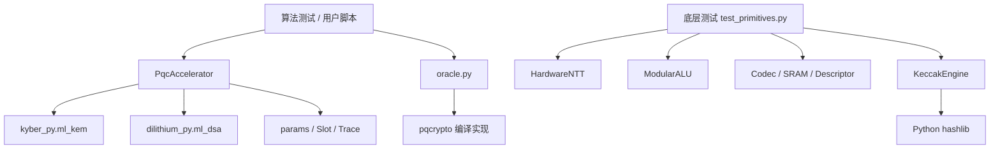

# 07 · Python 模型逐模块导读

[上一章](06-ml-dsa.md) · [学习首页](../index.md) · [下一章](08-hardware-architecture.md)

本章直接对应用户指定的 [pqc_accel_model](../../pqc_accel_model/README.md)。不要将旁边的 `pqc/model/*.yaml` 当成 Python 算法代码：它们是需求、架构、微设计和验证的机器可读视图。

## 先看真实调用关系

这里没有从 `PqcAccelerator` 到 `HardwareNTT` 的调用箭头。**完整算法没有由本仓这些底层模块串起来。** 算法 API 验证结果正确性，底层模块验证拟议接口与部分行为，未来逐 checkpoint 的整合验证需要额外工作。

## 文件地图

以下链接全部指向真实源码。建议先 params，再 accelerator，再沿兴趣阅读底层模块。

| 文件 | 主要对象 | 输入 → 输出 | 读代码时的重点 |
|---|---|---|---|
| [params.py](../../pqc_accel_model/src/pqc_hw_model/params.py) | `ParameterSet`、`Params`、`get_params` | 参数集 ID → 不可变参数记录 | ID 1..6，尺寸、rank、根与阶 |
| [accelerator.py](../../pqc_accel_model/src/pqc_hw_model/accelerator.py) | `PqcAccelerator`、`Slot` | 完整操作参数 → 结果、句柄、trace | 调用外部算法、存储私钥、公开事件 |
| [modular.py](../../pqc_accel_model/src/pqc_hw_model/modular.py) | `ModularConfig`、`ModularALU` | 整数 → 模运算结果 | 普通域/Montgomery 域、乘积位宽 |
| [ntt.py](../../pqc_accel_model/src/pqc_hw_model/ntt.py) | `NttConfig`、`HardwareNTT` | 256 系数 → 256 系数 | stage、zeta、配对和理想周期 |
| [codec.py](../../pqc_accel_model/src/pqc_hw_model/codec.py) | `pack_lsb`、`unpack_lsb` | 整数数组 ↔ 字节串 | 位序、截断、规范性标志 |
| [keccak.py](../../pqc_accel_model/src/pqc_hw_model/keccak.py) | `KeccakEngine` | 增量字节 → 摘要/XOF 前缀 | hashlib 包装，非置换电路仿真 |
| [memory.py](../../pqc_accel_model/src/pqc_hw_model/memory.py) | `PageTag`、`SecureBankedSRAM` | 地址/owner/字节 → 读写或异常 | 有效页、秘密页、访问权限与擦除 |
| [descriptor.py](../../pqc_accel_model/src/pqc_hw_model/descriptor.py) | `CommandDescriptor` | 字段 ↔ 128 B | little-endian、CRC 与 reserved |
| [trace.py](../../pqc_accel_model/src/pqc_hw_model/trace.py) | `Trace` | 事件 → 列表、周期合计、公开形状 | 摘要不是完整波形 |
| [oracle.py](../../pqc_accel_model/src/pqc_hw_model/oracle.py) | `oracle`、`MODULES` | 参数集 → 独立库模块 | 接口约定依赖锁定版本 |
| [__init__.py](../../pqc_accel_model/src/pqc_hw_model/__init__.py) | 包入口 | 导入包 | 算法逻辑应沿具体模块查找 |

### params：不要混用两个 rank

KEM 的 `rank_a=rank_b=k`；DSA 的 `rank_a=k`、`rank_b=l`。`output_bytes` 在 KEM 中是密文长度，在 DSA 中是签名长度，不是所有操作统一的输出长度，更不是 KEM 共享秘密长度。

### accelerator：完整接口与密钥句柄

| 方法 | 返回值 | 实际执行 |
|---|---|---|
| `keygen(ps)` | `(pk, handle, trace)` | 库生成 pk/sk；检查尺寸；保存 sk |
| `kem_encaps(ps, pk)` | `(ct, shared, trace)` | 库返回 shared/ct，封装层调整顺序 |
| `kem_decaps(ps, handle, ct)` | `(shared, trace)` | `_load` 取私钥；库解封装 |
| `dsa_sign(ps, handle, msg, context, deterministic)` | `(signature, trace)` | 库执行签名 |
| `dsa_verify(ps, pk, msg, sig, context)` | `(bool, trace)` | 库执行验签 |
| `destroy(handle)` | `None` | 从字典移除槽记录 |

`_store` 使用递增的 slot ID，并固定 `generation=1`，返回 `(generation<<16)|slot`。`_load` 检查槽存在、generation 和参数集一致。这个教学模型没有有限槽池、owner/domain、多用途授权或真实物理擦除。

`destroy` 仅使用低 16 bit 的 slot ID 弹出记录，没有先验证整个 handle 的 generation；slot ID 也未实现 16-bit 耗尽控制。因此不能把这个类用作产品级密钥管理器。Python 不可变 bytes 即使不再可达，也不保证从物理内存擦掉。

### modular：位宽检查不是全电路模型

`mul` 检查乘积 `bit_length` 是否超过 `product_width`；`canonical/add/sub` 用 Python `%q`。`coeff_width` 并没有对每个入口自动做完整定宽约束。NTT 也直接使用 Python 整数，不会自然产生 RTL 截位、符号扩展或溢出的全部问题。

`negacyclic_schoolbook` 可以接受相同长度的两个数组，适合做小规模手算和慢速乘法参考。本模型没有把该参考与标准 NTT base multiplication 全链路自动连接。

### memory：安全语义的最小演示

默认 64 KiB、8 banks、1 KiB 页。调用 `allocate_page` 设置 `{valid,secret,representation,owner}`，读写按覆盖到的全部页检查 owner；`debug=True` 拒绝读取秘密页。

`representation` 目前是标签记录，不是自动检查数值表示的完整类型系统。模型没有 ECC、真实多端口仲裁、算法/参数集标签、掩码域隔离或独立 Key RAM。

`zeroize(secret_only=True)` 擦除有效的秘密页并重置标签；即使传 False，也只处理 valid 页，不等同于硬件全容量 sweep。手动重标记页面、错误几何参数等行为不应拿来推断生产硬件的安全边界。

### descriptor：编解码与语义验证分开

`encode` 填写字段、保留区和 CRC；`decode` 检查长度、CRC、部分保留区并恢复字段。它不负责完整 opcode、ABI、flags、DMA 地址窗口、容量、重叠及权限检查；详见[命令章](09-command-flow.md)。

### trace：知道它省略了什么

`emit(kind, cycles=0, **fields)` 记录事件，同时给总周期加指定值。`public_shape()` 只保留 `(kind, stage, count)`，丢弃其他字段。完整 KEM 解封装 API 人工发出 decrypt、reencrypt、select 三个事件，因此有效/无效密文得到同样的公开形状。

这不说明依赖库的真实执行时间、cache、功耗或 RTL 总线轨迹一样。完整 API 的大多数 emit 没填 cycles，所以看到 `trace.cycles=0` 也不表示算法不要时钟。

### oracle 与测试

[test_algorithms.py](../../pqc_accel_model/tests/test_algorithms.py) 覆盖六参数集闭环、篡改、双向互操作和无效句柄。[test_primitives.py](../../pqc_accel_model/tests/test_primitives.py) 覆盖 NTT 往返、Montgomery、Codec 属性、Keccak、描述符与 SRAM。

锁定版本中的 `pqcrypto` 接口由测试用 `keygen/encaps/decaps/sign/verify` 调用，验签成功预期返回 None；不要凭另一版本的印象把它改为其他 API。实际运行前检查 [pyproject.toml](../../pqc_accel_model/pyproject.toml) 的依赖。

[run_validation.py](../../pqc_accel_model/scripts/run_validation.py) 会启动 pytest 并覆盖模型目录内的 `validation_report.json`。学习时先直接执行 pytest 或本教材 demo，以免将新环境失败覆盖历史报告。

## 推荐断点顺序

1. 在 `keygen` 看 pk/sk 长度与句柄，但不要在日志打印私钥。
2. 在 `kem_encaps` 看依赖库返回顺序如何调整。
3. 在 `kem_decaps` 看 `_load` 与 trace 是否调用了自研 NTT。
4. 单独进入 `HardwareNTT.forward`，跟踪第一 stage 的 `(j,j+length)`。
5. 在 `CommandDescriptor.encode` 看字节偏移，做一次 CRC 破坏实验。

检查题：完整算法测试全过，能否说明 `HardwareNTT._zeta` 与标准的中间排列完全一致？**不能，两个路径没有这种调用与比较关系。**
