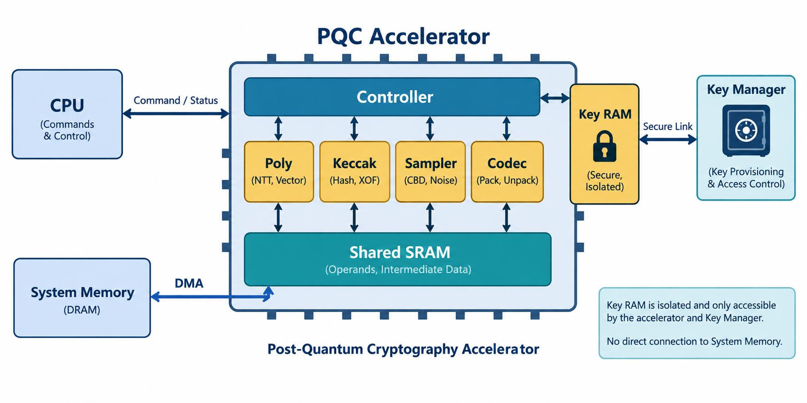
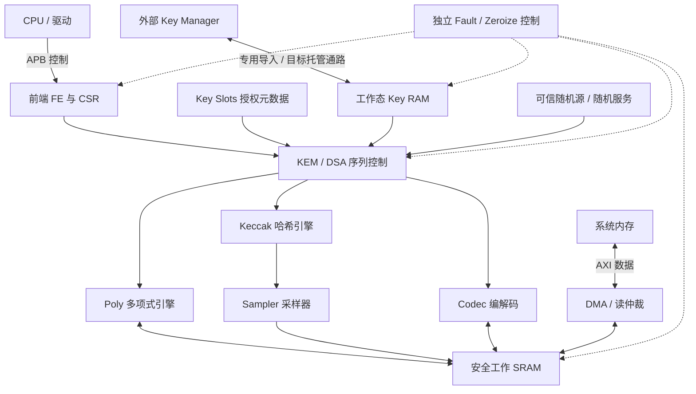

# 08 · 硬件架构：共享计算、明确存储与独立安全控制

[上一章](07-model-guide.md) · [学习首页](../index.md) · [下一章](09-command-flow.md)

本章首先讲[目标 HLD](../hld/01_architecture.md)，再指出与当前 RTL 的差异。模块表中的“职责”用于理解模块边界，不是所有功能已经验收的声明。

## 一张可沿箭头读的架构图

图 3：Controller=控制器，Shared SRAM=共享工作存储，System Memory=系统内存。Key RAM 表示 PQC 安全边界内的独立材料存储，图标位置不代表实际芯片布局。图中的双向线表示功能关系，不是逐端口连接；专用托管是目标能力，完整控制和安全关系见下方精确示意及 LLD。

从软件看，CPU 发出高层操作；从电路看，序列器发出许多 primitive。矩阵乘法需要依次调度 SHAKE、采样、NTT 域乘法、累加、SRAM 写回。硬件里的“完成”必须绑定具体请求，不能把任意一个 engine 的 done 当成当前步骤完成。

## 控制与总线模块

| 模块 / 源码 | 输入与输出 | 核心职责 | 配套设计 |
|---|---|---|---|
| [pqc_top](../../rtl/pqc_top.sv) | APB、AXI、熵、Key Manager、故障旁带 | 实例化、连接、安全边界和响应归属 | [TOP](../lld/03_top.md) |
| [pqc_pkg](../../rtl/pqc_pkg.sv) | 类型、枚举、常量 | 参数集、opcode、状态、原语类型的共享定义 | [寄存器架构](../hld/07_register_arch.md) |
| [pqc_apb_if](../../rtl/pqc_apb_if.sv) | APB 请求 → CSR 访问 | 对齐、访问属性与错误响应 | [APB](../lld/03_apb.md) |
| [pqc_csr](../../rtl/generated/pqc_csr.sv) / [CSR package](../../rtl/generated/pqc_csr_pkg.sv) | 软件字段与硬件事件 | 生成的寄存器实现，不手工维护 | [寄存器行为](../lld/03_register_behavior_1.md) |
| [pqc_cmd_frontend](../../rtl/pqc_cmd_frontend.sv) | 门铃、描述符、算法完成 → completion/IRQ | 快照、校验、命令生命周期与提交 | [FE](../lld/03_fe.md) |
| [pqc_desc_fetch](../../rtl/pqc_desc_fetch.sv) | 描述符地址 → 128 B 抓取流 | 读请求、拍顺序、抓取异常 | [抓取](../lld/03_fe_desc.md) |
| [pqc_desc_validate](../../rtl/pqc_desc_validate.sv) | shadow 与 CRC 状态 → 解码命令/错误 | 公开结构、长度、容量、ABI 检查 | [校验](../lld/03_fe_validate.md) |
| [pqc_axi_read_arb](../../rtl/pqc_axi_read_arb.sv) | 多读请求 → AXI 读通路 | 描述符/数据读共享与返回归属 | [读仲裁](../lld/03_top_read_arb.md) |
| [pqc_dma](../../rtl/pqc_dma.sv) | 搬运命令、系统内存、本地缓冲 | 范围、burst、尾字节、错误与取消排空 | [DMA](../lld/03_dma.md) |

APB 主要传控制字段，AXI 传较大的字节数据。描述符中保留 64-bit 地址，而当前顶层 AXI 地址为 40 bit；公开检查必须拒绝超范围值，不能截掉高位后访问错误内存。4 KiB 边界拆分与尾拍 strobe 影响数据正确性，不是可省略的外围细节。

## 算法控制与计算模块

| 模块 / 源码 | 处理对象 | 功能及边界 | 配套设计 |
|---|---|---|---|
| [pqc_kem_seq](../../rtl/pqc_kem_seq.sv) | KEM 操作、原语完成、比较数据 | 序列控制与比较/选择；需辨认旧骨架边界 | [KEM 序列器](../lld/03_kemseq.md) |
| [pqc_kem_encaps](../../rtl/pqc_kem_encaps.sv) | 公钥、熵、共享引擎 | Encaps 专用候选数据路径 | [Encaps](../lld/03_kemseq_encaps.md) |
| [pqc_kem_decaps](../../rtl/pqc_kem_decaps.sv) | 私钥材料、密文、共享引擎 | Decaps 串行数据路径，最新报告记载选定 KAT/背压通过 | [Decaps](../lld/03_kemseq_decaps.md) |
| [pqc_kem_keygen](../../rtl/pqc_kem_keygen.sv) | 熵、共享引擎、generated 私钥流 | 本次复核新增可见的串行 KeyGen 候选；不据代码存在声明验收 | [实现导读](../hardware_tutorial/01-architecture-implementation.md) |
| [pqc_dsa_verify](../../rtl/pqc_dsa_verify.sv) | 公钥、签名、消息/context | 本次复核新增可见的 pure Verify 候选，含分段消息搬运 | [执行导读](../hardware_tutorial/03-flows-memory.md) |
| [pqc_dsa_keygen](../../rtl/pqc_dsa_keygen.sv) | 熵、共享计算、generated 私钥流 | 本次最终复核新增可见的 DSA KeyGen 候选，含短向量采样、矩阵乘法、分解和编码 | [实现导读](../hardware_tutorial/01-architecture-implementation.md) |
| [pqc_dsa_sign](../../rtl/pqc_dsa_sign.sv) | 工作态私钥、消息/context、随机策略 | 最终复核新增可见的 Sign 候选，含采样、挑战、检查累积和尝试边界；不代表已验收 | [签名流程](06-ml-dsa.md) |
| [pqc_dsa_seq](../../rtl/pqc_dsa_seq.sv) | DSA 操作、候选、检查结果 | KeyGen/Sign/Verify 编排、尝试、判决与 staging | [DSA](../lld/03_dsaseq.md) |
| [pqc_poly_engine](../../rtl/pqc_poly_engine.sv) | 系数页、变换模式、参数域 | 双模 NTT/INTT、乘加、模加减 | [Poly](../lld/03_poly.md) |
| [pqc_keccak](../../rtl/pqc_keccak.sv) | 字节流、函数配置 | SHA3/SHAKE、吸收、padding、挤出 | [Keccak](../lld/03_keccak.md) |
| [pqc_sampler](../../rtl/pqc_sampler.sv) | SHAKE 字节流、采样模式 | 候选映射、拒绝、合法系数提交 | [Sampler](../lld/03_sampler.md) |
| [pqc_codec](../../rtl/pqc_codec.sv) | 系数或紧凑编码 | pack/unpack、压缩、DSA 舍入/hint、范数 | [Codec](../lld/03_codec.md) |

序列器像按程序顺序发任务的控制单元，计算引擎像执行具体运算的功能单元。共享架构节省面积，也要求互斥、仲裁和正确的完成归属；有两个算法序列器不表示支持两条算法命令同时运行。

## 存储、安全与辅助模块

| 模块 / 源码 | 输入 → 输出 | 职责 | 配套设计 |
|---|---|---|---|
| [pqc_secure_sram_ctrl](../../rtl/pqc_secure_sram_ctrl.sv) | 页读写、身份、清除 → 数据/状态 | 本地存储仲裁、有效性、tag、安全清除 | [SRAM](../lld/03_sram.md) |
| [pqc_ecc_sram](../../rtl/pqc_ecc_sram.sv) | word 访问 → 数据与 ECC 状态 | 带 SECDED 的存储封装 | [安全机制](../lld/04_safety_mechanisms.md) |
| [pqc_work_key_ram](../../rtl/pqc_work_key_ram.sv) | 专用导入/授权读取/撤销 | 8 KiB 工作态私钥副本，独立于工作 SRAM | [WorkKey](../lld/03_workkey.md) |
| [pqc_key_custody](../../rtl/pqc_key_custody.sv) | 本次新密钥、可信事务身份 → 专用流/ACK | 新增可见托管候选；header、word 流及匹配 ACK | [托管案例](../hardware_tutorial/04-security-errors.md) |
| [pqc_key_slots](../../rtl/pqc_key_slots.sv) | 可信授权元数据 → handle 校验/状态 | owner、用途、generation 与槽状态 | [KeySlot](../lld/03_keyslot.md) |
| [pqc_fault_ctrl](../../rtl/pqc_fault_ctrl.sv) | tamper、ECC、超时等 → 清零/锁定 | 独立安全收尾，收集完成确认 | [Fault](../lld/03_fault.md) |
| [pqc_random_service](../../rtl/pqc_random_service.sv) | 熵流、租约请求 → 有身份的随机块 | 配额、消费者隔离、取消和清除 | [TOP 随机服务](../lld/03_top.md) |
| [pqc_masked_and](../../rtl/pqc_masked_and.sv) | 两 share 与新鲜随机量 → 两 share | 掩码非线性 AND 基础单元 | [Masked AND](../lld/03_masked_and.md) |
| [pqc_keccak_masked_round](../../rtl/pqc_keccak_masked_round.sv) | 两 share 状态、随机量 → 轮结果 | 受保护的 Keccak 轮候选实现 | [Masked round](../lld/03_keccak_masked_round.md) |

辅助文件 [pqc_ntt_rom.svh](../../rtl/include/pqc_ntt_rom.svh) 提供变换常量；[pqc_secded_functions.svh](../../rtl/include/pqc_secded_functions.svh) 提供 ECC 函数；[filelist.f](../../rtl/filelist.f) 和 [IP Core](../../aixsilicon_ip_pqc.core) 描述构建文件集。存在这些文件不等于顶层已经连好所有功能。

## 三种“保存密钥”的地方不能混为一谈

外部 Key Manager 是长期所有者；Key Slots 保存授权元数据；Work Key RAM 保存一次工作所需的私钥材料。目标架构一次只保留一个工作态私钥，不能因为默认有 8 个逻辑槽就假定 8 个完整私钥同时常驻。普通工作 SRAM 保存多项式和中间结果，不作为长期私钥仓库。

## 配置与性能如何读

| 配置 | 顶层默认 | 学习时的解释 |
|---|---:|---|
| NTT_LANES | 2 | 并行计算资源，真实吞吐还受银行端口影响 |
| KECCAK_ROUNDS_PER_CYCLE | 2 | 未掩码轮结构参数，不等于 Level 2 每两轮一拍 |
| LOCAL_SRAM_KIB | 64 | 逻辑数据容量，ECC 与 share 增量另算 |
| DMA_DATA_WIDTH | 128 | AXI 每拍数据位宽，不是算法每拍产出量 |
| KEY_SLOT_NUM | 8 | 元数据槽数量 |
| SCA_LEVEL | 1 | 目标安全配置，不是安全验证证书 |
| ENABLE_ALGO_MASK | 0x3f | 六参数集裁剪位图，需与实际能力相符 |

HLD 的 400 MHz 是规划换算频率。KEM-768 <100 μs 等指标是目标，不能作为测得 PPA。一个 256×32-bit 页占 1 KiB；HLD 的 KEM 工作集预算为 24 页，DSA Sign 检查/编码阶段为 28 页，Key RAM 8 KiB 另算。页数足够不代表生命周期无别名，仍要证明最后读者完成后才能复用页面。

## 从 Python 对照硬件时要问什么

每一次读写是否完成握手？数据属于哪条命令？单位是 byte、word 还是 coefficient？页标签表示哪种域？同一拍取消时还会不会写出秘密？这些问题通常在 Python 纯函数中不可见，却决定 RTL 是否正确。

检查题：一个 256 系数数组的 NTT 函数运行正确，为什么不能直接宣布硬件完成？**函数没有证明端口时序、背压、定宽、取消、存储授权和顶层结果提交。**
