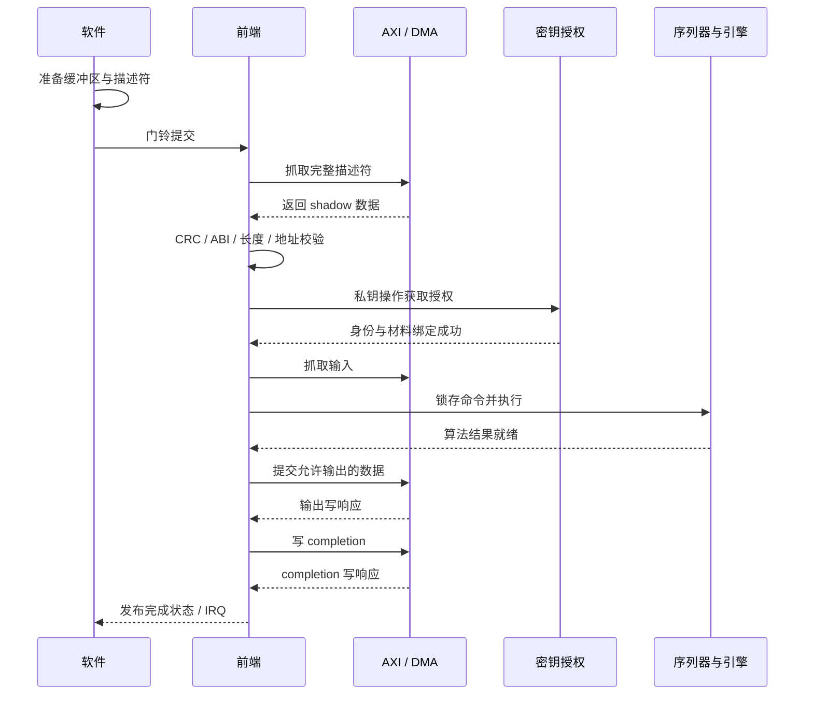

# 09 · 命令、描述符与端到端执行

[上一章](08-hardware-architecture.md) · [学习首页](../index.md) · [下一章](10-security.md)

本章描述[目标接口合同](../lld/03_fe_validate.md)与[FE 生命周期](../lld/03_fe.md)。下列驱动流程用于理解执行依赖，不是已经验收可用的产品驱动。

## 两级接口

软件通过 APB 读能力、配置地址窗口、设置描述符地址、写门铃；描述符和大块数据由 AXI 抓取与搬运。内部序列器把一条算法命令拆成哈希、采样、NTT、乘加、编码等原语。

| 层次 | 例子 | 谁负责解释 |
|---|---|---|
| 算法命令 | `KEM_DECAPS` | FE 和 KEM 序列控制 |
| 原语 | `NTT_FWD`、`PW_MAC`、SHAKE、unpack | 对应 engine |
| 存储事务 | 读某页某 word | SRAM/Key RAM/DMA |

执行模型目标为单上下文：最多一个执行中命令，允许一个 pending descriptor。两个 Keccak context 用于交替保存消息哈希与矩阵/采样状态，不是两条并行算法命令。

## Opcode 和参数集

来源为 [pqc_pkg.sv](../../rtl/pqc_pkg.sv)。参数集 ID 1..3 对应 KEM-512/768/1024，4..6 对应 DSA-44/65/87。

| 操作 | Opcode |
|---|---:|
| KEM_KEYGEN | 0x00 |
| KEM_ENCAPS | 0x01 |
| KEM_DECAPS | 0x02 |
| DSA_KEYGEN | 0x10 |
| DSA_SIGN | 0x11 |
| DSA_VERIFY | 0x12 |
| ZEROIZE | 0x20 |
| SELF_TEST | 0x21 |

这些是定义的命令集合。当前完整实现状态需查报告；capability 也应只广告真实可执行的能力，不能用常量定义代替执行证据。

## 128 B 描述符

[descriptor.py](../../pqc_accel_model/src/pqc_hw_model/descriptor.py) 采用 little-endian；表中地址、长度与容量均按字节语义解释，内部 word 地址另行转换。

| 偏移 | 大小 | 字段 |
|---|---:|---|
| 0x00 | 4 B | header：opcode[7:0]、pset[11:8]、flags[23:12]、ABI[31:24] |
| 0x04 | 4 B | command_id |
| 0x08 | 4 B | key_handle |
| 0x0c | 4 B | 保留，置零 |
| 0x10 / 0x18 | 各 8 B | src0_addr / src0_len |
| 0x20 / 0x28 | 各 8 B | src1_addr / src1_len |
| 0x30 | 8 B | context_addr |
| 0x38 / 0x3c | 各 4 B | context_len / entropy_policy |
| 0x40 / 0x48 | 各 8 B | dst0_addr / dst0_capacity |
| 0x50 / 0x58 | 各 8 B | dst1_addr / dst1_capacity |
| 0x60 | 8 B | completion_addr |
| 0x68 | 4 B | timeout_hint |
| 0x6c..0x7b | 16 B | 保留，置零 |
| 0x7c | 4 B | 前 124 B 的 zlib CRC32 值，little-endian |

ABI 当前为 `0x10`。例如 KEM-768 Encaps 的 opcode=1、pset=2、flags=0，因此 header=`0x10000201`，最前四字节是 `01 02 00 10`。CRC 用于发现描述符损坏，不提供对恶意修改者的认证：攻击者也能重新计算 CRC。

模型 decode 只做部分结构校验，硬件还必须检查 ABI、flags、算法与操作匹配、长度、地址和权限。尤其要先以完整位宽检查 `addr+length` 溢出，再考虑截取物理地址。

## 输入输出缓冲区映射

| 操作 | SRC0 | SRC1 | DST0 | DST1 |
|---|---|---|---|---|
| KEM KeyGen | 无 | 无 | ek | 4 B handle |
| KEM Encaps | ek | 无 | c | 32 B K，需安全输出授权 |
| KEM Decaps | c | 无 | 32 B K，需安全输出授权 | 无 |
| DSA KeyGen | 无 | 无 | pk | 4 B handle |
| DSA Sign | 消息，可空 | 无 | 签名 | 无 |
| DSA Verify | 消息，可空 | pk 紧接签名 | 无，结果在 completion | 无 |

Verify 的 SRC1 在三个参数集下分别为 3732/5261/7219 B。私钥不是普通 SRC1 buffer，不能把私钥地址偷偷填入未使用字段。context 只用于 Sign/Verify，长度 0..255 B。

当前详细设计规定 entropy_policy 取 0/1/2：Sign 对应 deterministic/hedged/production；KeyGen/Encaps 只允许 production=2。测试种子由可信测试入口提供，不能从普通描述符任意导入。模型 `CommandDescriptor` 默认 policy=0，所以“encode 成功”不代表一个生产 KEM 描述符通过硬件校验。

## 正常执行的先后关系

公钥操作不需要私钥 acquire；KeyGen 还需在发布句柄前完成专用托管确认。软件在有 cache 的系统中要按平台 DMA 一致性规则维护缓存和内存屏障；PQC 不自动解决 CPU cache 一致性。

## 为什么需要 token、epoch 和背压

**valid/ready**：只有二者同时成立的时钟沿才接受一次传输。ready=0 时，发送方应保持 valid、data 和身份字段。不能在未接受时推进字节游标，否则会丢数据。

**epoch**：每条命令有唯一身份。命令被取消后，旧 engine 可能迟到返回 done；接收方必须知道它属于旧命令，不能用它推进新命令。

**primitive token**：同一条命令也有多次哈希、范数或 NTT。设计使用 command epoch、attempt、primitive 序号及 engine 身份绑定请求与响应。没有发出的请求不能凭空完成，重复完成不能推进两次。

例如 Sign 的 `z_norm` 与 `ct0_norm` 都由 Codec 做检查，但结果必须分别保存。若只看“现在 FSM 在哪个状态”，迟到结果可能被错误记到另一个对象上。

## 原子提交与故障收尾

原子提交的重点是**完成标记作为有效性边界**：在全部结果写回及必要授权/托管确认前不能报告成功。多 beat 的 DMA 写本身不天然具有事务回滚，系统消费者应以成功 completion 判断数据是否可用。

取消时先禁止新副作用，再取消内部原语、阻止候选提交、处理已在总线上的事务并清除敏感状态。总线永久不响应时不能假装“已经排空并成功清零”。清除超时应进入规定故障/锁定状态。

检查题：最后一个输出字节已经送到 AXI W 通道，能立刻产生成功 IRQ 吗？**不能，还需要正确的写响应及 completion 退休条件。**
