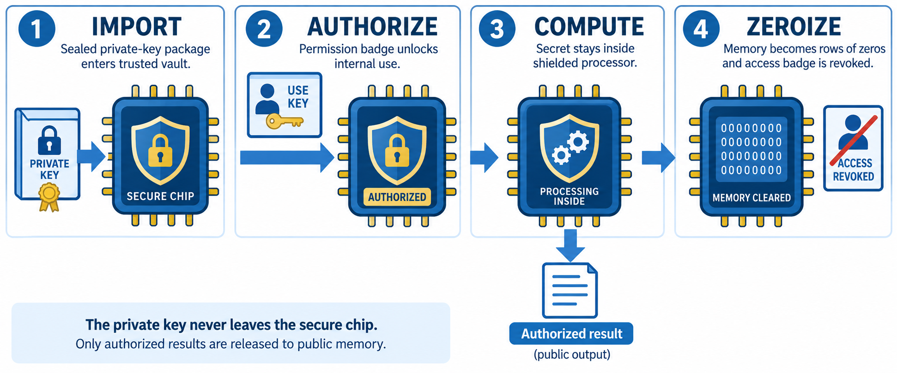
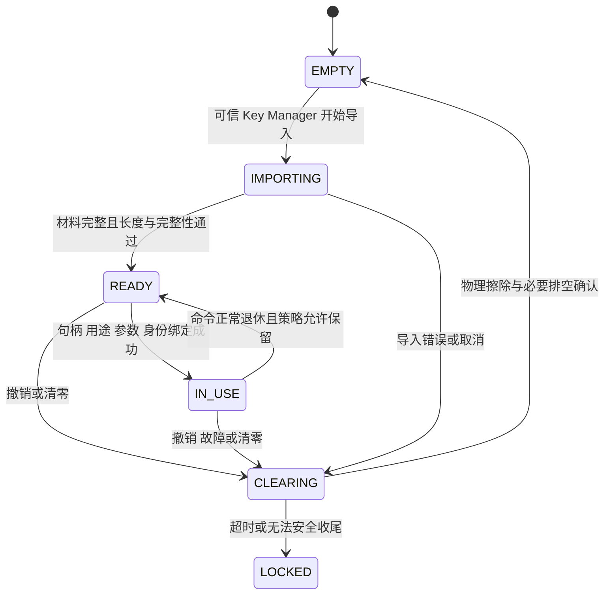

# 10 · 安全、密钥生命周期与故障处理

[上一章](09-command-flow.md) · [学习首页](../index.md) · [下一章](11-labs.md)

密码结果正确，只说明计算功能的一部分正确。硬件还可能通过运行时间、访存、功耗、电磁辐射或故障行为泄露秘密。本章解释项目的防护目标，并明确 Python 模型与当前 RTL 能证明的边界。

## 四类问题，四类措施

| 问题 | 例子 | 对应措施 | 不能替代什么 |
|---|---|---|---|
| 权限错误 | 错误 owner 读取私钥 | 句柄、用途、domain、材料绑定 | 不替代掩码防护 |
| 控制/访问泄漏 | 密文第一个失配处提前退出 | 全长扫描、统一判决、固定访问 | 不保证功耗不泄漏 |
| 数据相关泄漏 | 乘法器翻转随秘密变化 | 掩码与物理实现约束 | 不自动阻止越权读 |
| 故障与残留 | 错误控制流、RAM 残留 | ECC、完整性检查、独立清零 | 不替代算法输入验证 |

## 常数时间不是“每次 API 用秒表一样快”

项目关注的是在相同公开输入形状与外部服务条件下，秘密不改变允许观察的内部正常调度和访问行为。例如 KEM 比较遍历全部密文，不能在失配处停；范数检查遍历全部系数，不能暴露第一个越界位置。

ML-DSA 每次尝试按固定预算执行，但总尝试次数可变化，属于项目明确采用的接口边界。不能从“固定尝试调度”推导“总签名时延固定”。DMA 外部背压和随机源缺供也要单列，内部仲裁等待不能伪装成外部等待而从预算中扣掉。

Python `trace.public_shape()` 相同，只说明人工选择的事件字段相同；它没测依赖库内部的分支、地址、cache 或时间，更没有验证功耗。

## 掩码的基本概念

布尔两 share 可写作 `x=x0 XOR x1`，算术两 share 可写作 `x=(x0+x1) mod q`。其中一份经过随机化后不直接等于秘密，计算应在分离的 share 域中继续进行。

线性操作较容易分 share：对算术分享的 x 加 y，可分别加对应 share；乘以公开常数也可逐 share 处理。秘密×秘密涉及交叉项，不能只算 `x0*y0` 和 `x1*y1` 就认为完成了乘法。

硬件毛刺会让组合中间值短暂出现，连续周期还可能有转换泄漏。项目 Level 2 候选使用 HPC3+ 作为布尔 AND 的基础 gadget，要求新鲜随机量与寄存器边界；Keccak 的 χ 非线性层依赖这些 gadget。详见 [Level 2 方案](../hld/09_masking_level2.md) 与[执行合同](../hld/09_masking_execution.md)。

Poly 需要算术分享，Keccak/比较需要布尔分享，所以存在 A2B/B2A 转换。先重构明文再重新分拆不算受保护转换。完整算法不能在 Codec 前、共享秘密选择前或失败候选检查时随意合并 shares。

## 随机性既是安全资源，也是性能资源

算法种子、签名随机量、掩码随机量用途不同。随机服务应绑定 consumer、purpose、epoch、租约和配额，不能把一次已经消费的随机 token 再交给另一运算。

项目预算中的一轮受保护 Keccak 需要 4800 bit 新鲜随机量；64 bit/cycle 的输入至少需要 75 个供给周期。24 轮仅供给就需要 1800 周期；HLD 保守计算为每轮 75+4，共 1896 周期，不包括所有算法级转换与采样开销。

所以 `KECCAK_ROUNDS_PER_CYCLE=2` 不意味着 Level 2 只需 12 周期完成置换。随机量不足时应等待或按策略报错，不能自动切回无掩码路径。LFSR 或计数器也不能直接当新鲜密码随机源。

## 密钥的完整生命周期

图 4：IMPORT=可信导入，AUTHORIZE=授权，COMPUTE=内部计算，ZEROIZE=擦除与撤销。这里画的是**已有私钥导入后用于签名等操作**的工作副本生命周期；“public output”可理解为成功签名，不包括共享秘密的普通公开发布。新生成私钥的专用 Key Manager 托管是另一条受控流程，不由图中的“私钥不离开”概括。

这是解释用状态图，实际状态编码与接口见 [WorkKey LLD](../lld/03_workkey.md)。长期钥匙归外部 Key Manager；PQC 只持有授权工作副本。删除工作副本不应隐式销毁外部长期密钥。

句柄应包含能识别过期授权的信息。即使 slot 数字相同，新分配的 generation 也应令旧 handle 失效。材料、槽元数据与当前命令必须一致；只检查 slot 范围远远不够。

KeyGen 是特殊路径：新生成私钥写入工作态 RAM，只有本次新生成且未退休的材料允许专用托管。已有导入私钥不能通过伪装 KeyGen 被导出；普通 APB/DMA/调试不得提供通用私钥读回窗口。

## ECC、CRC 与认证的差别

SECDED 用来纠正单 bit 错误、检测双 bit 错误，其实际保障范围取决于码字与故障模型。它不提供密码学身份认证，也不能保证检测任意恶意多 bit 修改。

描述符 CRC 检查数据损坏；页标签检查对象归属与表示；句柄权限检查是否允许使用。三者解决不同问题，不能因为 CRC 正确就允许访问秘密。

## 清零需要覆盖哪些地方

清零不只清一块 RAM，还包括 ECC、有效位、tag、读暂存、Keccak 状态、采样 reservoir、Codec 缓冲、签名候选、随机缓存与密钥暂存。清 FIFO 指针不能擦掉底层数据。

取消/清除的优先级应高于普通写回和完成。同一时钟沿出现 zeroize 与结果有效时，应先撤销结果发布；不能先把敏感数据写出去，再在下一拍清掉内部副本。

独立 Fault 控制器要在主算法 FSM 出错时仍能发起安全收尾。各模块应真实擦除并分别确认完成，不能把“发过 clear 请求”等同于“所有清除已完成”。

## 目前能和不能声称的结论

本项目已存在 masked AND、masked Keccak round、随机服务等局部模型和 RTL，但统一报告仍将完整 Level 2 数据链、转换、采样与顶层集成列为未完成。设置 `SCA_LEVEL=2` 不能代替组合安全分析、真实 RTL 功能差分与物理侧信道验证。

检查题：Python 删除了私钥 bytes 的字典记录，是否完成硬件意义的物理零化？**没有，只移除了该处的引用。**
