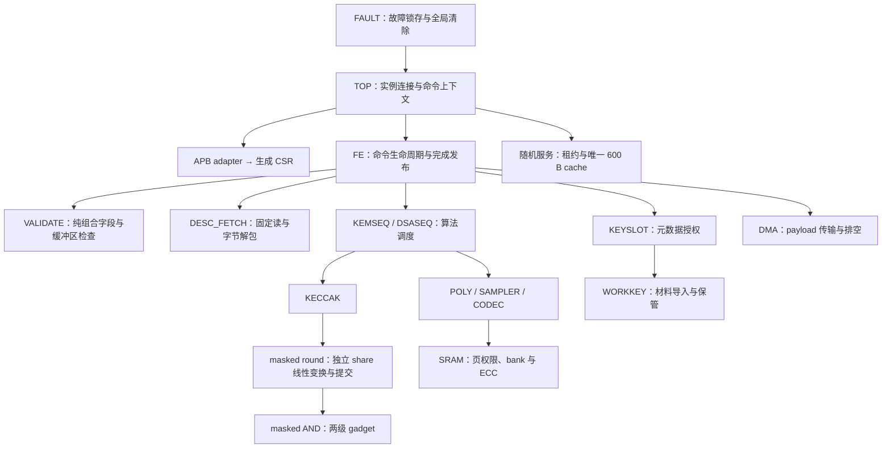

# PQC 模块职责与分解（draft）

保持已冻结的 13 个 HLD 模块及外部接口，在 LLD 内明确集成、命令控制、计算和
安全资源的边界。下图是职责关系，不代表 RTL 已全部实现，也不要求物理实例层级一致。

## 模块边界决策

| 所属架构 | LLD / RTL 边界 | 唯一职责与资源 |
|---|---|---|
| TOP | TOP / `pqc_top` | 接线、可信命令上下文、共享接口绑定；不实现密码原语 |
| TOP | APB / `pqc_apb_if`，生成 CSR | APB 协议与寄存器存储分离；生成物按 RDL 再生 |
| TOP | TOP.RANDOM / `pqc_random_service` | 唯一 600 B cache、配额、租约、consumer 清除汇聚；RTL/独立 UT 已实现，TOP 接入待完成 |
| TOP | TOP.READ_ARB / `pqc_axi_read_arb` | 单 outstanding 读事务锁定与响应路由；TOP 仅连线 |
| FE | FE / `pqc_cmd_frontend` | 唯一 128 B shadow、锁存能力配置、命令退休与完成事件 |
| FE | FE.VALIDATE / `pqc_desc_validate` | 组合语义检查和 typed command；无独立 descriptor 存储 |
| FE | FE.DESC_FETCH / `pqc_desc_fetch` | 单 beat hold、固定 AXI 读、解包、抓取错误与排空；FE 已连接实际完成/错误 |
| KECCAK | KECCAK.MASKED_ROUND / `pqc_keccak_masked_round` | 两 share 独立线性变换、chi gadget 握手、RC 和结果提交；不保存随机 cache |
| KECCAK | KECCAK.MASK_AND / `pqc_masked_and` | 两级寄存 gadget 已实现；随机位来自 RANDOM，不自建缓存 |
| KEYSLOT / WORKKEY | 保持两个 L1 模块 | 元数据授权与私钥材料严格分开 |
| SRAM / DMA | 保持两个 L1 模块 | 内部页权限/ECC 与外部地址/AXI 生命周期严格分开 |
| KEMSEQ / DSASEQ | 保持算法控制模块 | 调度原语、身份和结果；不复制计算引擎 |
| POLY / SAMPLER / CODEC | 暂保留模块内 FSM/数据通路 | 具体算法时序未闭环前不凭名称制造更多子模块 |
| FAULT | 保持独立控制模块 | 全局取消、清除事务及锁定；本地资源拥有者提供真实 ack |

## 接口约束与迁移顺序

1. 先冻结局部周期合同：RANDOM 见 `03_top.md`，DESC_FETCH 见 `03_fe_desc.md`。
   原 RANDOM 的 datapath/FSM ID 保留，只迁移 module_ref；TOP 增加实际上下文对象。
2. FE 保留 shadow，DESC_FETCH 保留单 beat hold；严禁分模块时重复分配整份 descriptor。
   RANDOM 的 600 B 预算也只计一次。新增边界不隐式插入流水寄存器或更改周期预算。
3. RTL 阶段把随机逻辑实现为独立文件，并对齐描述符错误/完成、取消和清除接口。
   共享 AXI 仲裁已独立为 READ_ARB，锁定 AR 提供至 RLAST；合同见
   `03_top_read_arb.md`，RTL 和独立 UT 已实现，TOP 集成仍随全量回归验收。
4. 再验证独立模块及 TOP 集成：背压期间身份/数据稳定、同沿取消、末响应排空、
   无局部 ack 冒充全局清除、无部分 descriptor 触发执行。

现有 TOP 1074 行，职责拆分以安全状态和存储所有权为依据，不以减少行数为验收标准。
当前已有 20 个 LLD 模块，不能将其等同于 20 个已完成模块；G2 保持 open。
用户明确要求完成整个 IP 的 RTL 和 UT 后统一汇报；合理性能优化允许延期，功能
正确性优先。实际新增/修复 RTL 与测试结果在统一报告中持续绑定。
