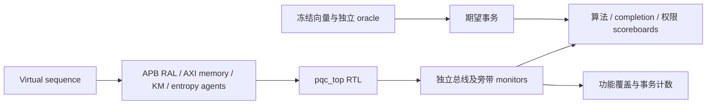

# PQC 完整计算与系统集成验证方案

<!-- VPLAN_META
schema_version: '2.0'
ip_name: pqc
ip_display_name: 可配置 ML-KEM + ML-DSA 后量子密码加速器
delivery_model: parameterized
lrs_baseline: PQC-20260916-WORKKEY
hld_baseline: PQC-HLD-1.1.0
lld_baseline: PQC-LLD-1.1.0
verification_level: full
document_version: 1.2.0
status: draft
verification_baseline: PQC-VP-1.2.0
END_VPLAN_META -->

## 范围与输入

本次交付包括数据通路集成、UVM 1.2 下完整 PQC 计算验证及本方案。DUT 为
`rtl/pqc_top.sv`，覆盖当前 LRS 的 84 条需求、六个参数集及全部八类命令。
本方案定义验收义务；实施状态、失败与原始证据统一见
[总报告](../../reports/report.md)，不在测试矩阵维护另一份 PASS 清单。

| 输入/交付 | Owner | 事实源/目标 | 本次范围 |
|---|---|---|---|
| 需求与参数空间 | 01/19 | `docs/lrs/`；requirements/parameter_space | existing，核验当前来源 |
| 架构与接口 | 03 | `docs/hld/`；architecture/external_interface/internal_interface | existing，缺项回到 owner |
| 完整数据通路与安全调度 | 05/07 | `docs/lld/`、`rtl/` | required，技术冻结尚未完成 |
| 寄存器 | 02 | `regs/pqc.rdl`、生成 CSR/Header/RAL | existing，禁止手改派生定义 |
| 验证方案及追踪 | 06/16 | 本目录、`model/verification.yaml`、`trace/` | required |
| UVM 环境、测试与回归 | 10–15 | `verification/`、`build/sim/`、`build/reports/` | required |

算法依据 [FIPS 203](https://csrc.nist.gov/pubs/fips/203/final) 和
[FIPS 204](https://csrc.nist.gov/pubs/fips/204/final)。向量 manifest 绑定规范版本、
勘误快照、oracle 版本及 SHA-256。官网存在潜在修订提示，不能把未审查勘误默认为
已采用，不能混用旧 Kyber/Dilithium 与标准 ML-KEM/ML-DSA 向量。

## 验证目标与方法

| 层次 | 对象 | 验收证据 |
|---|---|---|
| Module UT | 原语、存储、随机服务、调度握手、取消 | 真实 RTL 编译/执行，逐模块结果 |
| UVM smoke | APB/RAL、真实描述符→计算→输出→completion→IRQ | 独立 smoke JUnit，寄存器观测不能替代命令成功 |
| UVM full regression | 六参数集、全部计算操作、边界、负向、安全与恢复 | 总线/专用接口观察值与独立 oracle 逐字节比较 |
| 静态/形式 | 综合、CDC/RDC、授权、常数时间、掩码组合、清除 | 实际工具、假设、证明范围及未证明项 |
| 软件检查 | oracle/向量自检、常量和驱动 | 辅助证据，不能证明 DUT 算法功能 |

`pqc_accel_model` 只用于行为探索，不作为本次验收的 golden DUT；自洽或软件差分
不能代替 RTL 输出。独立 DV oracle 只产生期望值，不得参与 DUT 计算、填充实际
输出或驱动 completion。默认使用已核验的冻结 KAT，UVM 运行时不运行 Python/C/DPI 算法。参考算法与结果比较契约见 [checker_plan](checker_plan.md)。

## 环境、接口与组件

APB 主动 master、AXI 主动 slave memory、熵主动 source、Key Manager 双向 responder
及被动 IRQ/旁带 monitor 的职责见 [Agent 规划](agent_plan.md)。checker 输入来自
实际握手；sequence 的“打算发送”不能作为 DUT 已接受。寄存器定义只引用 RDL/RAL。
feature、testcase、assertion、coverage 分别在 [索引](index.md) 指向的分册定义。

## 完整计算场景

ML-KEM-512/768/1024 各运行 KeyGen、Encaps、Decaps；ML-DSA-44/65/87 各运行
KeyGen、Sign、Verify，共 18 个正常操作组合。每组合必须有输入接受、结果比较、
输出写响应及 completion 观察计数；计数为零失败。KeyGen 公钥通过 AXI 比较，
私钥仅在已授权专用托管接口比较；KM ACK 后才允许成功。缺少托管接口时用例阻塞，
不能通过内部 force/backdoor 补出结果。

覆盖 deterministic/hedged、合法/非法密文、签名/消息/context 篡改、非规范编码、
context 0/1/255/256、空消息、hash rate 边界及大于 SRAM 的流式消息。
分段、尾字节、反压及参数变化必须保持数学输出一致。
细节见 [算法测试矩阵](test_matrix_algorithm.md)，缺向量/oracle/class 均失败关闭。

## 时钟、复位、并发与故障

主域为 `clk/rst_n`，APB、AXI 与计算同域。对异步 lifecycle/tamper/zeroize 改变
相位，结合 CDC/RDC 静态结构检查；数字仿真不证明亚稳态可靠性。外部 KM 异步桥
属于 SoC 集成边界，不把不存在的内部时钟作为已覆盖域。

冷复位、warm reset、abort、撤销、掉电前清除分别验证，不能等同于 `rst_n`。
在描述符、输入搬运、原语、输出反压和 completion 等待期间逐点触发，覆盖清除
与结果/随机数/KM ACK 同拍。矩阵见 [安全测试](test_matrix_security.md)。
当前接口无法表达的动作保留为设计缺项，不能据此排除 requirement。

AXI R/B 错误、异常 RLAST、永久停顿、熵 health/tag/超时、ECC 单错/双错、状态/
计数器翻转经规范接口或 LLD hook 注入；测试权限不能开放生产私钥读取。
总线无公平性时检查超时锁定且不假报清除成功；有界排空证明须明确从端响应假设。
属性见 [assertion_plan](assertion_plan.md)。

## 参数空间与性能

命名配置只引用 CFG_TINY、CFG_BALANCED、CFG_THROUGHPUT。9 参数边界、feature
on/off、Level 0/1/2、最大算法/最小 SRAM 组合见 [配置计划](configuration_plan.md)。
新增配置须经 19 owning 流程；不把不存在的 canonical ID 写成已执行配置。

性能从描述符接受计到 completion B 响应和 IRQ，分别记录无反压与可复现反压，
区分计算、DMA 等待与清除。周期目标引用当前 LRS/HLD；400 MHz 仅为换算基准，
不宣称综合频率达标。Sign 记录 P50/P95/P99、样本数与单次尝试调度，可变总尝试
次数不作为固定总时延要求。不降低指标或排除内部等待；PPA 沿用 `ppa_signoff=none`。

实施阶段、退出条件和当前关键 tie-off 见 [落地顺序](implementation_plan.md)。

## 回归、重现与失败判定

1. 核验上游模型来源、G2 技术冻结、VP0，通过 G3 RTL/UT 和两阶段 VCS 检查。
2. 固定源码、依赖、配置、向量、工具版本和输入哈希，真实编译 UVM 1.2。
3. smoke seed=1，任一错误停止后续 full regression。
4. 执行全部可达 smoke/regression/extended；向量 seed=1，随机反压 seeds=1/17/257，
   extended 加 4099/65537。VCS 使用真实随机 seed 参数并记录日志；自定义
   `+UVM_SEED` 只有实际实现消费后才能作为随机种子证据。
5. 19-PV 参数执行→覆盖分析→closure RTM→质量门禁。不同 elaboration 覆盖库分列。

SV timeout 按用例预算，另加进程 watchdog。完整算法单命令暂定上限 100000000
cycles、进程 3600 s，仅用于防挂死，不替代性能阈值。错误必须产生 UVM_ERROR/FATAL。
通过要求：RNTST 与目标一致、唯一 selector、完整零错误 summary、比较数满足、队列
清空、无遗留事务、正常退出、输入哈希不变。缺完成或仅出现 PASS 字样不充分。

每次运行进入独立 `build/sim/<run-id>/`，原始日志、manifest、JUnit、覆盖库和
机器摘要仅在 `build/`。保留失败记录。Smoke/full regression 分别生成 JUnit；
完整回归 ID 集合须与可达 TESTCASE_META 一致。缺实现/未执行不得从清单删除。

## 追踪、验收、责任及未闭合条件

Markdown 为编辑入口，owning extractor 派生模型，再做 static trace precheck。
TC→FL→LRS，ASSERT/COV 显式引用 FL；执行后按 LRS→HLD→LLD→RTL 与
LRS→test→execution 生成 closure RTM。所有 P0 都要可执行证明义务；coverage 不能
单独使需求通过。维持功能 100%、line/toggle/branch/FSM 各≥95%、安全 FSM/error
path 100%。断言分别报告激活/成功/失败/vacuous，未激活不算证明。

DV owner 负责 oracle/checker/覆盖/执行证据；RTL owner 负责实现与 hook；架构及安全
owner 负责接口、掩码组合和假设。已有委托允许实际检查后的委托评审，不能代替检查。
VP0 与 G3/G4 分开，见 [门禁](99_quality_gate.md)。排除/waiver 须逐项有范围、理由、
责任与授权；当前没有新增 waiver。全秘密链、原语身份/生命周期、密钥托管和完整
固定尝试预算仍为必交未闭合条件。本稿及结构抽取成功不等于 UVM 或 IP 已通过。
