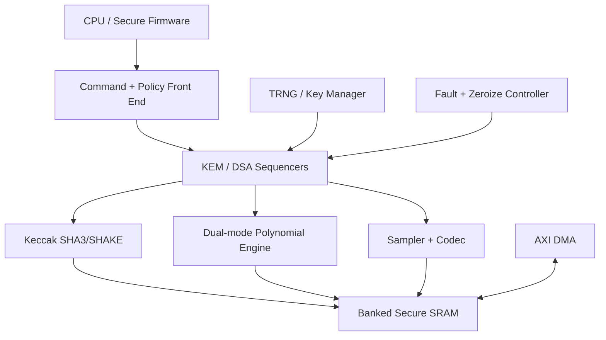
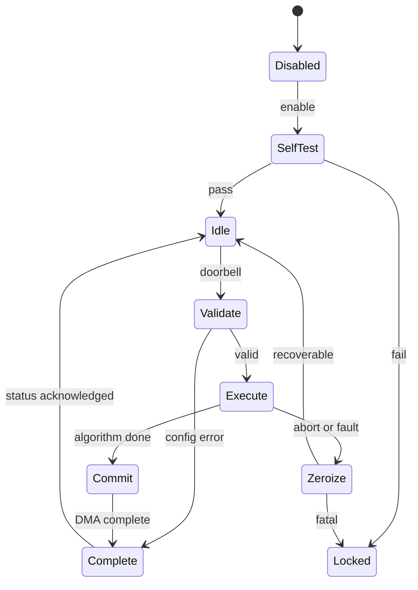

# 可配置 ML-KEM + ML-DSA PQC Crypto Accelerator 需求与架构规格

```yaml
document_type: ip-requirements-and-architecture
name: pqc_crypto_accelerator
version: 0.2.0
status: draft
basis:
  - NIST FIPS 203 ML-KEM
  - NIST FIPS 204 ML-DSA
  - NIST SP 800-227 KEM usage guidance
target: secure_soc_ip
```

## 1. 结论与产品定位

本 IP 定位为面向安全启动、固件认证、TLS/IPsec 密钥建立、设备身份和安全管理面的可配置后量子密码加速器，完整支持 ML-KEM 与 ML-DSA，而非仅提供 NTT 指令的算子核。

推荐架构是“统一控制面 + 共享密码计算底座 + 算法专用 sequencer”：共享 Keccak/SHAKE、可配置模算术/NTT、采样与编解码、本地安全 SRAM；分别设置 ML-KEM 和 ML-DSA 微程序/硬连线序列控制器。V1.0 应交付全部标准参数集和完整 KeyGen/Encaps/Decaps/Sign/Verify 操作。

核心设计原则：

- 算法合规优先于峰值吞吐；所有字节编码、域分离和错误路径必须与 FIPS 203/204 一致。
- 秘密中间值不离开安全边界；主机只看到命令、公开数据和被策略允许的结果。
- ML-KEM 解封装必须隐式拒绝且常数时间，不向软件泄露密文是否合法。
- ML-DSA 签名存在拒绝采样循环，接口和 watchdog 不得假定固定轮数；每轮应常数时间。
- 可综合参数决定面积档位；运行时参数只选择标准算法/参数集，禁止软件写入任意 q、根或安全敏感微码。

## 2. 标准范围与参数集

### 2.1 强制算法

| 算法 | 操作 | V1.0 |
|---|---|---|
| ML-KEM | KeyGen、Encaps、Decaps | 全部强制 |
| ML-DSA | KeyGen、Sign、Verify | 全部强制 |
| ML-DSA | pure ML-DSA、context string | 强制 |
| HashML-DSA | 标准允许的预哈希接口 | 建议支持，可综合裁剪 |

### 2.2 ML-KEM 参数

共同参数：`n=256`，`q=3329`，共享秘密 32 B。

| 参数集 | k | eta1/eta2 | du/dv | 公钥 B | 私钥 B | 密文 B |
|---|---:|---:|---:|---:|---:|---:|
| ML-KEM-512 | 2 | 3/2 | 10/4 | 800 | 1632 | 768 |
| ML-KEM-768 | 3 | 2/2 | 10/4 | 1184 | 2400 | 1088 |
| ML-KEM-1024 | 4 | 2/2 | 11/5 | 1568 | 3168 | 1568 |

### 2.3 ML-DSA 参数

共同参数：`n=256`，`q=8380417`。

| 参数集 | k/l | eta | tau | gamma1 | gamma2 | omega | 公钥 B | 私钥 B | 签名 B |
|---|---:|---:|---:|---:|---:|---:|---:|---:|---:|
| ML-DSA-44 | 4/4 | 2 | 39 | 2^17 | (q-1)/88 | 80 | 1312 | 2560 | 2420 |
| ML-DSA-65 | 6/5 | 4 | 49 | 2^19 | (q-1)/32 | 55 | 1952 | 4032 | 3309 |
| ML-DSA-87 | 8/7 | 2 | 60 | 2^19 | (q-1)/32 | 75 | 2592 | 4896 | 4627 |

实现必须以最终 FIPS 文本和已发布 errata 为生成常量与 KAT 的唯一规范来源；Kyber/Dilithium Round-3 代码只能作为参考，不得替代 FIPS 字节级行为。

## 3. 系统使用模型

### 3.1 主机模式

软件通过 APB4 寄存器配置命令和策略，通过 AXI4 master DMA 搬运消息、密钥、密文和签名。小数据可选 PIO FIFO。推荐命令描述符模式，允许安全固件构造一次操作后 doorbell 提交。

### 3.2 Key-slot 模式

**2026-09-16 密钥边界落实：**长期密钥所有权由外部 Key Manager 管理；PQC 内仅保留当前运算的工作态安全 Key RAM。私钥经专用 sideload/安全导入接口进入，不经普通 AXI DMA，默认不提供材料读回或导出。接口及当前实现边界见 [工作态 Key RAM 接口](docs/work_key_ram_interface.md)。


应提供至少 8 个逻辑 key slot，类型包括 ML-KEM secret key、ML-DSA secret key、public key。私钥可由安全生命周期控制器导入、内部生成或从 key manager 侧带通道派生。私钥 slot 默认不可读，只能被授权操作引用；清零、生命周期和用途绑定由硬件执行。

### 3.3 消息输入

- 支持任意长度消息流，长度使用 64 bit 表示。
- DMA 分段输入不得改变算法结果。
- ML-DSA context 长度支持 0–255 B。
- 消息与输出可 scatter-gather；V1.0 至少支持线性 buffer，SG 可作为增强项。
- 禁止软件直接注入内部 `mu` 绕过域分离，除非进入单独的受控测试模式。

## 4. 顶层功能需求

### 4.1 命令集合

| Opcode | 输入 | 输出 | 关键行为 |
|---|---|---|---|
| KEM_KEYGEN | seed/RNG、parameter set | ek、dk或slot handle | 支持确定性 KAT 与生产 RNG 两种路径 |
| KEM_ENCAPS | ek、randomness | ciphertext、shared secret | 生产模式随机数只来自批准的熵路径 |
| KEM_DECAPS | dk slot、ciphertext | shared secret | 隐式拒绝；对外只返回命令完成 |
| DSA_KEYGEN | seed/RNG、parameter set | pk、sk或slot handle | 私钥默认写入 slot |
| DSA_SIGN | sk slot、message、context | signature | 支持 deterministic 和 hedged 策略 |
| DSA_VERIFY | pk、message、context、signature | valid bit | 无秘密数据，仍需边界/格式防护 |
| ZEROIZE | slot/all ephemeral state | completion | 高优先级、安全清零 |
| SELF_TEST | test selector | pass/fail | 上电 KAT、按需自检 |

### 4.2 命令与状态语义

- 每个命令包含 opcode、parameter set、flags、输入/输出地址、长度、key handle、context 地址/长度和 completion tag。
- 非法参数、地址未对齐、buffer 过小、权限失败在访问秘密前终止。
- BUSY 期间配置锁定；软件不能修改当前命令的参数。
- 完成状态区分配置错误、DMA 错误、熵错误、自检错误、内部故障；不得区分 ML-KEM 密文有效/无效，也不得暴露 ML-DSA 每次拒绝原因。
- 支持中断和轮询；中断包含 DONE、ERROR、RNG_FAULT、TAMPER、SELF_TEST_FAIL。
- V1.0 单上下文执行；允许一个 pending descriptor。多队列并发留作 V2.0。

## 5. 推荐微架构



### 5.1 双模多项式引擎

引擎必须原生支持两套域：

- KEM 域：12–16 bit 数据路径，q=3329，Kyber/ML-KEM NTT 顺序与缩放。
- DSA 域：24–32 bit 数据路径，q=8380417，ML-DSA NTT 顺序与缩放。

建议以 32 bit 物理蝶形单元承载双模运算，通过可综合参数配置 1/2/4 lanes。每 lane 包含 modular add/sub、乘法、Montgomery/Barrett reduction 和 butterfly；常量 ROM 保存经生成与审计的 roots、逆根和约减常量。不得提供运行时任意模数配置。

必须支持：forward NTT、inverse NTT、pointwise multiply/accumulate、系数加减、条件约减、power2round/decompose、make/use hint、范数检查。ML-DSA 专用 rounding/hint 单元可旁路，以免拖慢 ML-KEM 主路径。

推荐基准配置为 2 lanes；4 lanes 是吞吐型，1 lane 是面积型。所有档位保持完全相同的软件 ABI 和结果。

### 5.2 Keccak/SHAKE 引擎

- 实现 Keccak-f[1600] 24 rounds，支持 SHA3-256、SHA3-512、SHAKE128、SHAKE256。
- 支持 absorb/squeeze 流、增量消息、域分离和无字节序歧义的 byte interface。
- 推荐 64 bit rate-side datapath，综合配置 1 或 2 rounds/cycle；不建议 V1.0 完全展开。
- 状态必须位于安全边界，命令结束或异常时清零。
- 允许矩阵展开和采样与 NTT 重叠，但同一 Keccak context 不允许被软件抢占。

### 5.3 采样与编解码

强制支持 rejection sampling、CBD、ExpandA/ExpandS/ExpandMask、SampleInBall、系数 pack/unpack、Compress/Decompress、ByteEncode/ByteDecode 和签名 hint 编解码。

解码器必须检查非规范编码、长度、边界与 hint 单调性/权重。对公开输入可以早退，但 ML-KEM Decaps 最终必须走统一隐式拒绝路径；涉及秘密的循环和访存不得由秘密值决定地址或外部可观察时序。

### 5.4 本地 SRAM

- 推荐 64 KiB，4 或 8 bank，至少两个计算端口加一个 DMA 端口的仲裁等效能力。
- 数据组织以 256 系数 polynomial 为基本页；同时支持 packed byte buffer。
- bank mapping 应避免 NTT butterfly 两端点冲突，并允许 Keccak/codec 与 NTT ping-pong。
- 支持 SECDED ECC；ECC 错误计入安全故障。秘密数据写入后禁止 debug 读取。
- 命令结束清除临时秘密；私钥长期驻留应进入独立 key RAM 或外部 key manager，而非普通工作 SRAM。

### 5.5 Sequencer

优先采用固定、只读微码 ROM 或硬连线 FSM。若使用微码：带版本、哈希/奇偶校验、合法分支目标检查，不可由运行时软件改写。

ML-DSA Sign sequencer 必须实现完整拒绝采样循环。配置最大尝试次数只用于检测 RNG/故障导致的活锁；达到上限返回通用内部错误并清零，不输出部分签名。默认上限应基于安全评审确定，不得为了固定低延时破坏正确性。

## 6. 性能与 PPA 指标

PPA 数字必须在工艺、频率、SRAM 宏和安全等级确定后冻结。V1.0 先规定可验收的架构指标：

- 计算与 DMA 可重叠；持续消息哈希带宽不低于主机可配置 DMA 带宽的 50%。
- 任一标准参数集不得依赖软件执行 NTT、采样、pack/unpack 或重加密比较。
- ML-KEM Decaps 包含硬件内重新加密和常数时间 ciphertext compare/select。
- ML-DSA Sign 一次尝试内不产生非必要 pipeline bubble；拒绝后复用已合法保留的消息摘要状态。
- 性能计数器记录总 cycles、Keccak cycles、NTT cycles、DMA stall 和公开的命令类型；生产模式禁止暴露签名尝试次数及秘密相关细粒度事件。

建议 G1 性能目标（2-lane、目标频率 400 MHz 的规划值，非既成事实）：ML-KEM-768 Encaps/Decaps 各小于 100 us；ML-DSA-65 Verify 小于 250 us；Sign 以统计分位数验收，P50 小于 300 us、P99 小于 1 ms。最终门限必须由 RTL cycle model 与综合结果回填。

## 7. 安全需求

### 7.1 常数时间与访问模式

- 秘钥、噪声、挑战、解封装比较结果不得影响外部可观察的分支、DMA 地址、错误码或总完成时间。
- KEM Decaps 无论密文是否合法都执行重加密、常数时间比较和 constant-time select。
- 禁止在 secret-dependent 条件下 clock gate 单个运算单元。
- cache 不参与秘密工作集；所有秘密计算使用确定性本地 SRAM。

### 7.2 侧信道防护等级

定义综合参数 `SCA_LEVEL`：

| 等级 | 能力 | 定位 |
|---|---|---|
| 0 | 常数时间、固定访问、清零 | 原型/非对抗环境 |
| 1 | 随机化、隐藏、噪声/时序去相关、总线隔离 | 推荐产品基线 |
| 2 | 一阶 masking 的 Keccak 与秘密多项式关键路径、刷新与安全 RNG | 高安全 SKU |

V1.0 产品化至少达到 Level 1。若宣称 Level 2，必须明确 masking scheme、share 数、fresh randomness 上界、组合逻辑 glitch 假设，并以 TVLA 和针对性 CPA/EMA 验证，不能只写“支持掩码”。

### 7.3 随机数

- 连接符合系统安全要求的 TRNG/DRBG；硬件接口提供 valid/ready、health status 和 domain tag。
- deterministic KAT seed 仅在生命周期允许的测试模式启用。
- ML-DSA 支持 deterministic 签名；产品默认建议 hedged signing，将外部新鲜随机量混入标准规定的位置。
- RNG 不足时停止且清零，不得降级为常数或重复随机数。

### 7.4 故障注入与零化

- 控制 FSM 使用稀疏编码或冗余校验；opcode、参数集、key type 和权限字段带完整性保护。
- 关键循环计数器、NTT stage、DMA 长度和 micro-PC 提供冗余/奇偶校验。
- KEM 重加密比较与 shared-secret select 应提供结果完整性保护；可选双算 compare。
- ML-DSA Verify 的最终 valid 判定采用双轨或重复比较，避免单点故障把 invalid 变为 valid。
- tamper、fatal ECC、self-test fail、生命周期变化触发立即停止、清零工作 SRAM/Keccak/寄存器并锁定。
- 提供同步 `zeroize_req`，在规定的最大周期数内完成；zeroize 不依赖主时序状态机正常运行。

### 7.5 密钥管理与权限

- key slot 元数据包含 owner/domain、algorithm、parameter set、usage mask、exportable、valid、version。
- 私钥不可经普通 DMA 导出；若业务必须导出，应由外部 key wrap 引擎完成，PQC IP 不输出明文私钥。
- debug 解锁不自动开放 key RAM；RMA/测试生命周期必须先销毁密钥。
- DMA 请求携带安全/特权属性；地址窗口由 IOMMU/安全防火墙和 IP 内部范围检查双重约束。

## 8. 接口需求

### 8.1 总线

- 控制接口：APB4 或 AXI4-Lite slave，32 bit，寄存器自然对齐。
- 数据接口：AXI4 master，建议 64/128 bit，INCR burst，4 KiB 边界合规，支持 outstanding 但同一 buffer 保序。
- 可选旁带：key-manager request/response、entropy request/response、lifecycle、tamper、zeroize、interrupt。

### 8.2 寄存器组

| Offset | 名称 | 说明 |
|---:|---|---|
| 0x000 | ID_VERSION | IP/ABI/微码版本 |
| 0x004 | CAPABILITY0 | 算法、参数集、lane、SCA 能力 |
| 0x008 | CAPABILITY1 | SRAM、DMA、key-slot 能力 |
| 0x010 | CTRL | enable、abort、zeroize、self-test |
| 0x014 | STATUS | idle/busy/done/error/locked |
| 0x018 | COMMAND | opcode、parameter set、flags、tag |
| 0x020–0x05C | SRC/DST descriptors | 地址、长度、权限属性 |
| 0x060 | KEY_HANDLE | slot 与预期类型 |
| 0x064 | CONTEXT_LEN | 0–255 |
| 0x068 | RESULT | verify result、completion tag |
| 0x070 | ERROR_CODE | 非敏感错误类别 |
| 0x080–0x08C | INTR_* | state/enable/test |
| 0x090–0x0AC | ALERT_* | recoverable/fatal status |
| 0x100–0x13C | PERF_* | 受策略限制的性能计数器 |
| 0x200–0x2FC | KEY_SLOT_CTRL | secure-only slot 管理窗口 |

地址与位域需由 PeakRDL/YAML SSOT 生成 RTL、头文件、文档和 UVM RAL。写 1 清除、shadowed register、锁定位的语义在 G1 冻结。

## 9. 可配置性边界

### 9.1 综合期参数

`NTT_LANES={1,2,4}`、`KECCAK_ROUNDS_PER_CYCLE={1,2}`、`LOCAL_SRAM_KIB={32,64,96}`、`DMA_DATA_WIDTH={64,128,256}`、`KEY_SLOT_NUM`、`SCA_LEVEL`、`ENABLE_HASH_ML_DSA`、`ENABLE_PIO`、各参数集裁剪位图。

### 9.2 运行时配置

仅允许选择已综合存在的标准参数集、operation、deterministic/hedged 策略、key handle 和 buffer。禁止任意 q/n/root/eta/gamma、任意微码、跳过校验或关闭隐式拒绝。

### 9.3 推荐 SKU

| SKU | 配置 | 场景 |
|---|---|---|
| Tiny | 1 lane、32 KiB、1 round/cycle、Level 1 | MCU/安全启动 |
| Balanced | 2 lanes、64 KiB、2 rounds/cycle、Level 1 | 通用 SoC，V1.0 推荐 |
| Secure | 2 lanes、64–96 KiB、Level 2 | 安全芯片/高对抗设备 |
| Throughput | 4 lanes、96 KiB、双缓冲 | 网关/服务器卸载 |

## 10. 异常、复位与低功耗

- 冷复位后先执行 KAT，成功前拒绝密码命令。
- warm reset 必须定义 key slot 保持策略；默认清除 ephemeral slot，persistent slot 由 key manager 决定。
- 软件 abort 仅在安全边界点生效，随后清零；不得留下可恢复的部分结果。
- 时钟门控只依据公开调度状态；秘密相关运算期间禁止数据相关门控。
- power-down 前完成或安全中止并清零；密钥保持域必须独立说明 retention、tamper 与 ECC 策略。
- DMA bus error、timeout、ECC UE、RNG health fail 均进入统一安全收尾流程。

## 11. 验证与验收

### 11.1 参考模型

- 使用 NIST ACVP/KAT 向量和至少两个独立、字节级兼容的参考实现交叉验证。
- 建立 bit-accurate Python/C 模型，覆盖每个 primitive 与完整命令。
- 锁定 FIPS 版本、errata 版本、常量生成器 commit 和 reference model commit。

### 11.2 功能验证

- 六个主操作 × 全部参数集 × 空/短/长消息 × context 0/1/255 B。
- 全部合法边界以及 truncated/oversized/non-canonical key、ciphertext、signature。
- DMA 未对齐、跨 4 KiB、backpressure、错误响应、reset/abort/tamper 交叉场景。
- ML-DSA 强制 0/1/多次拒绝路径；对拒绝循环采用受控内部随机流验证。
- ML-KEM invalid ciphertext bit flip、随机密文、错误长度，确认输出伪随机 shared secret 且无 validity oracle。
- key slot 类型、owner、usage、生命周期、清零和并发权限负向测试。

### 11.3 形式验证与安全验证

- NTT/INTT round-trip、模约减范围、codec round-trip、hint 性质采用形式/等价验证。
- 证明 secret-tainted 信号不控制外部错误码、DMA 地址和未授权可见状态。
- 对关键 FSM、zeroize、有界完成、无死锁、FIFO overflow/underflow 编写 SVA。
- gate-level 检查复位与清零；扫描插入后确认 key RAM/秘密寄存器不进入普通 scan chain。
- Level 1/2 分别制定 TVLA、功耗/电磁、时钟/电压故障注入计划。

### 11.4 覆盖率门槛

- 需求覆盖率 100%；功能覆盖率 100%（批准的不可达项除外）。
- RTL line/toggle/branch/FSM coverage 门限建议均不低于 95%，安全关键 FSM 与 error paths 100%。
- 所有 NIST KAT 必须通过；随机差分测试每参数集不少于 100k commands。

## 12. DFT、DFX 与可观测性

- 密钥与秘密中间态使用 secure scan exclusion 或加密 scan；生产生命周期不可旁路。
- SRAM MBIST 不得泄露 retained key，运行前后执行受控清零。
- debug 仅可观察公开 command state、粗粒度进度和错误类别。
- 可注入公开数据路径 ECC、DMA 与控制完整性错误；秘密相关 fault injection 端口仅在测试生命周期存在。
- trace 不记录 seed、randomness、secret coefficient、shared secret、签名 nonce 或 KEM validity。

## 13. 软件与交付件

必须交付：

- synthesizable SystemVerilog RTL、约束、CDC/RDC waiver 与 lint 报告；
- YAML/PeakRDL 寄存器 SSOT、自动生成 C/Rust headers 和 UVM RAL；
- 参数/常量生成器及不可变生成清单；
- bare-metal driver、Linux/TEE 适配层和同步 API；
- ACVP/KAT harness、C/Python reference model、UVM environment、formal properties；
- FuseSoC core、集成指南、安全手册、生命周期/密钥/zeroize 说明；
- PPA 报告（至少 Tiny/Balanced）、性能报告和 SCA/故障验证报告。

软件 API 建议：`pqc_open`、`pqc_keygen`、`pqc_kem_encaps`、`pqc_kem_decaps`、`pqc_dsa_sign_init/update/final`、`pqc_dsa_verify_init/update/final`、`pqc_key_destroy`、`pqc_get_capabilities`。API 返回值不得形成 decapsulation oracle。

## 14. 分阶段实现计划

| 阶段 | 内容 | 退出条件 |
|---|---|---|
| G0 | 标准冻结、模型、常量生成 | 全参数集软件 KAT 通过 |
| G1 | primitive RTL：Keccak、双模 NTT、codec/sampler | primitive 等价/形式验证通过 |
| G2 | ML-KEM 全流程 | KeyGen/Encaps/Decaps KAT、invalid CT 通过 |
| G3 | ML-DSA Verify/KeyGen | 全参数集 KAT 通过 |
| G4 | ML-DSA Sign + rejection loop | KAT、随机差分、长消息通过 |
| G5 | DMA/key slot/安全控制 | 权限、zeroize、fault tests 通过 |
| G6 | SCA/DFT/PPA 收敛 | 安全验收与目标 PPA 签核 |
| G7 | SoC 集成与 ACVP | 驱动、系统回归、认证接口闭环 |

实现顺序建议先 Keccak 和双模 NTT，再 ML-KEM，再 ML-DSA Verify，最后 ML-DSA Sign。Sign 的拒绝采样、安全随机数和侧信道复杂度最高，不应作为第一个 bring-up 路径。

## 15. G1 必须冻结的决策

1. 产品安全等级：SCA Level 1 还是 Level 2；这会显著改变 Keccak、NTT、SRAM和随机数带宽。
2. key manager/TRNG 接口协议与 FIPS 140-3 模块边界。
3. Balanced SKU 的 NTT lanes、Keccak rounds/cycle、SRAM 容量和目标工艺频率。
4. deterministic 与 hedged ML-DSA 的产品默认策略。
5. 私钥是否允许经受控路径导入；明文导出建议永久禁止。
6. ACVP 接口、错误码策略和生命周期状态机。
7. 是否将 HashML-DSA 纳入 V1.0，以及支持的预哈希算法集合。

## 16. V1.0 验收总则

V1.0 只有在以下条件同时满足时才可标记 complete：全部六个标准参数集的完整算法 KAT 通过；非法输入和隐式拒绝不存在 oracle；所有临时秘密可证明被清零；DMA/key slot 权限闭环；RTL/形式/软件差分覆盖达标；综合、STA、CDC/RDC、DFT 和目标安全等级测试完成。只完成 NTT 或单个算法流程不得登记为 PQC Crypto Accelerator V1.0。

## 17. 算法详细描述与硬件映射

### 17.1 数学对象与内部表示

两类算法均工作在多项式环 `R_q = Z_q[X]/(X^256 + 1)`，但参数不同：ML-KEM 使用 `q=3329`，ML-DSA 使用 `q=8380417`。一个 polynomial 固定包含 256 个系数。向量/矩阵元素均为 polynomial。

内部定义三类表示，并用 SRAM page metadata 明确标记，禁止 sequencer 混用：

| 表示 | 含义 | 允许操作 |
|---|---|---|
| COEFF_STD | 标准系数域，规范范围内 | encode/decode、round、norm check |
| COEFF_LAZY | 蝶形中间范围，允许有限倍 q | butterfly、累加、定期约减 |
| NTT_MONT | NTT/Montgomery 域 | pointwise multiply、MAC、inverse NTT |

所有 primitive 均规定输入/输出范围；不能以“最终再 `% q`”替代范围证明。KEM 系数数据路径建议 16 bit，DSA 建议 32 bit，统一物理 RAM word 可采用 32 bit。

### 17.2 ML-KEM KeyGen 数据流

输入是 64 B seed `d || z`（生产模式由 DRBG 生成；KAT 模式可注入）。执行顺序：

1. 通过规定的哈希展开 `d`，得到公开矩阵种子 `rho` 与秘密噪声种子 `sigma`。
2. `ExpandA(rho)` 使用 SHAKE128 按 `(i,j)` 域分离生成 `k×k` 多项式矩阵 `A_hat`；输出直接处于 NTT 表示，不必先落完整系数域矩阵。
3. CBD sampler 从 `sigma` 和单调 nonce 生成秘密向量 `s` 与误差向量 `e`。
4. 对 `s,e` 执行 NTT；计算 `t_hat = A_hat ∘ s_hat + e_hat`。
5. 按 FIPS 203 ByteEncode 生成封装公钥 `ek = ByteEncode(t_hat,12) || rho`。
6. 计算 `H(ek)`，构造解封装私钥 `dk = dk_PKE || ek || H(ek) || z`。

硬件要求：矩阵 `A_hat` 应逐 polynomial 生成、使用、释放，避免为最大参数集常驻 16 个 polynomial；`s_hat` 常驻本地 SRAM。`z`、`sigma`、`s/e` 和完整 `dk` 标记为 secret。

### 17.3 ML-KEM Encaps 数据流

输入 `ek` 和 32 B randomness `m`：

1. 严格解码并验证 `ek` 长度/规范性，计算 `H(ek)`。
2. 使用规定哈希从 `m || H(ek)` 派生共享秘密 `K` 与加密 randomness `r`。
3. 由 `rho` 流式生成转置矩阵 `A^T`；以 `r` 采样 `y,e1,e2`。
4. 计算 `u = InvNTT(A^T_hat ∘ y_hat) + e1`。
5. 计算 `v = InvNTT(t_hat^T ∘ y_hat) + e2 + DecompressMessage(m)`。
6. 使用参数集对应 `du/dv` 压缩并编码为 ciphertext `c`。
7. 输出 `c` 与 32 B shared secret `K`。

Encaps 不允许主机提供内部 `r`、噪声向量或矩阵；确定性测试仅允许注入顶层 randomness。

### 17.4 ML-KEM Decaps 与隐式拒绝

输入 `dk,c`：

1. 固定长度读取完整 ciphertext；长度错误在 API 层统一映射为失败结果，不进入越界解析。
2. 解码 `u,v`，计算 `w = v - InvNTT(s_hat^T ∘ NTT(u))`，恢复候选消息 `m'`。
3. 由 `m' || H(ek)` 重新派生 `K' || r'`。
4. 使用公钥完整重新加密得到 `c'`。
5. 对 `c` 与 `c'` 做全长度 constant-time compare，形成内部 mask `valid_mask`。
6. 计算 rejection secret `K_bar = J(z || c)`；用全位宽 mask 选择 `K'` 或 `K_bar`。
7. 对外始终返回 32 B shared secret 和普通 DONE，不返回 ciphertext validity。

禁止事项：比较首个不等字节即退出、在失配时跳过 Keccak、输出独立 invalid-ciphertext 错误、由失配控制 clock gating、使 DMA/中断时刻依赖失配位置。

### 17.5 ML-DSA KeyGen 数据流

输入 32 B seed `xi`：

1. SHAKE256 展开得到 `rho`、`rho_prime` 和 `K`。
2. `ExpandA(rho)` 生成 `k×l` 的 NTT 域矩阵。
3. `ExpandS(rho_prime)` 生成短秘密向量 `s1(l)` 与 `s2(k)`。
4. 计算 `t = InvNTT(A_hat ∘ NTT(s1)) + s2`。
5. `Power2Round(t)` 拆分为高位 `t1` 和低位 `t0`。
6. 公钥编码 `pk = rho || t1`；私钥编码包含 `rho,K,tr=H(pk),s1,s2,t0`。

`s1,s2,t0,K` 为 secret；`rho,t1,tr` 可公开。矩阵仍应流式生成，不建议落存完整最大矩阵。

### 17.6 ML-DSA Sign 数据流

签名输入包括 secret-key slot、消息 `M`、context `ctx` 以及可选新鲜随机量 `rnd`：

1. 解析 slot 内私钥并检查 parameter-set/type/usage；不允许由普通 DMA 提供明文私钥。
2. 计算消息代表值 `mu = H(tr || domain || len(ctx) || ctx || M)`；domain 字节严格按 FIPS pure/prehash 变体选择。
3. 从 `K`、`rnd` 和 `mu` 派生 `rho_double_prime`。deterministic 模式使用标准规定的确定性取值，hedged 模式混入 32 B 新鲜 randomness。
4. 进入 attempt loop，以 attempt counter 域分离采样掩码向量 `y`。
5. 计算 `w = InvNTT(A_hat ∘ NTT(y))`，分解为 `w1,w0`。
6. 计算 challenge seed `c_tilde = H(mu || Encode(w1))`，再由 SampleInBall 得到稀疏 challenge `c`。
7. 计算 `z = y + c·s1`；若 `z` 范数不满足界限，则本 attempt 拒绝。
8. 计算 `r0 = LowBits(w - c·s2)`；若范数不满足界限，则拒绝。
9. 计算修正量 `c·t0`，检查界限；生成 hint `h = MakeHint(-c·t0, w-c·s2+c·t0)`，若 hint 权重大于 `omega` 则拒绝。
10. 仅在全部条件通过后编码并提交 `signature = c_tilde || z || h`。

硬件必须先把候选签名写入不可见 staging buffer，全部检查通过后一次性 DMA commit。每次失败不得输出部分 `z/h`。attempt counter 溢出或达到安全上限时返回通用 `INTERNAL_RETRY_EXHAUSTED`，清除所有候选值。

### 17.7 ML-DSA Verify 数据流

1. 严格解析 `pk` 与签名，检查规范编码、`z` 范数、hint 数量/顺序和所有边界。
2. 计算 `mu = H(H(pk) || domain || len(ctx) || ctx || M)`。
3. 从 `c_tilde` 重建 challenge `c`；展开 `A`。
4. 计算 `w_approx = A·z - c·(t1·2^d)`，并用签名 hint 恢复高位 `w1'`。
5. 计算 `c_tilde' = H(mu || Encode(w1'))`。
6. constant-time 比较 `c_tilde'` 与输入，结合所有公开格式检查产生最终 valid。

Verify 可对明显长度错误早退，但同一合法长度类别建议保持近似固定时序，降低远程解析侧信道与故障分析面。

### 17.8 HashML-DSA 边界

若支持 HashML-DSA，预哈希必须由硬件内部或经受信任的 hash-engine sideband 产生，并绑定算法标识。普通软件不得声称 arbitrary digest 是已正确域分离的消息。V1.0 如无认证需求，可先只实现 pure ML-DSA，保留 opcode 与 capability bit。

## 18. Primitive 级硬件需求

### 18.1 NTT/INTT 单元

推荐 radix-2 Cooley–Tukey/Gentleman–Sande 配对，使 forward/inverse 共用 butterfly。每 lane 每周期完成一组 butterfly：两个 coefficient read、一个 twiddle read、模乘、加减、两个 coefficient write。

| 属性 | KEM mode | DSA mode |
|---|---|---|
| coefficient active width | 16 bit | 32 bit |
| modulus | 3329 | 8380417 |
| polynomial length | 256 | 256 |
| reduction | Montgomery + conditional/Barrett | Montgomery + conditional/Barrett |
| twiddle source | KEM constant ROM | DSA constant ROM |
| lazy range | 由形式证明冻结 | 由形式证明冻结 |

NTT controller 输出 `(stage, group, butterfly, twiddle_addr, bank_addr_a/b)`。地址生成器必须保证同周期读写 bank conflict 可被静态避免或确定性 stall；不得依赖 coefficient value 仲裁。

### 18.2 Pointwise MAC

支持 `dst = dst + a*b mod q`，矩阵-向量乘时逐 polynomial 累加。累加器的 lazy range 必须按最大 `k=8` 证明；超过范围前插入固定位置 reduction。DSA challenge 乘法是稀疏乘法，可配置专用 sparse multiplier，但 V1.0 可复用 NTT 路径以降低验证复杂度。

### 18.3 Keccak 调度

Keccak context 至少两个：一个服务消息增量哈希，一个服务矩阵/采样 XOF。若仅有一套 permutation datapath，则 context state 双份存储并在 block 边界切换。调度优先级建议：zeroize/fatal > 当前算法关键链 > message absorb > 预展开。

Keccak 接口内部使用字节流：`data[63:0]`、`keep[7:0]`、`valid/ready`、`start`、`last`、`function_id`、`domain_id`、`out_len`。padding/domain separation 由硬件产生，禁止 sequencer 手工拼最后一个字节。

### 18.4 Sampler

Sampler 前端从 SHAKE squeeze FIFO 取字节，后端按 mode 执行：

- KEM uniform/rejection sampling；
- KEM centered binomial distribution；
- DSA uniform matrix sampling；
- DSA eta sampling；
- DSA gamma1 mask sampling；
- DSA SampleInBall。

Sampler 必须统计“消费字节”和“产生系数”，但计数只用于内部 flow control。拒绝的随机候选不得写入 polynomial buffer。XOF squeeze 支持自动续块，不由软件重新提交。

### 18.5 Codec/round/hint 单元

Codec 支持任意 bit offset 的 little-endian bit packing，输入输出带长度上限。解码输出 `canonical_ok`，但始终消费配置长度。ML-KEM Compress/Decompress 的舍入按规范精确定义；ML-DSA Power2Round、HighBits、LowBits、MakeHint、UseHint 与 norm check 需独立 reference checker。

Norm check 应遍历全部系数并 OR-reduce violation，不允许在第一个违规系数处停止。

## 19. 本地存储与数据布局

### 19.1 推荐 64 KiB 地址空间

| 区域 | 典型容量 | 用途 |
|---|---:|---|
| P0/P1 ping-pong | 16 KiB | 当前矩阵 polynomial、NTT 交换 |
| Vector A | 12 KiB | s/y/z 等最大向量 |
| Vector B | 12 KiB | e/t/w 等中间向量 |
| Packed input | 8 KiB | key/ciphertext/signature staging |
| Packed output | 8 KiB | commit 前结果 |
| Scratch/metadata | 8 KiB | Keccak context、flags、ECC/页面标签 |

容量为逻辑规划，可由 bank/宏实际粒度调整。最大 ML-DSA 工作集应通过 lifetime analysis 复用页，不以同时保存完整 `A(k×l)` 为前提。

### 19.2 Bank 映射

推荐 8 bank × 32 bit。系数地址由 `{poly_page, coeff_index}` 生成，bank hash 至少混合 coefficient 低位与 stage 位，确保 NTT 各 stage 的 a/b 访问可双发。DMA packed buffer 与 coefficient buffer分区，避免 codec 与 NTT 对同一 bank 竞争。

每页 metadata：`valid`、`secret`、`representation`、`algorithm`、`parameter_set`、`owner_context`、`ecc_status`。sequencer 在 primitive dispatch 前执行 tag check；tag mismatch 触发 fatal internal error。

## 20. 软硬件接口详细规格

### 20.1 128-byte 命令描述符

| Byte | 字段 | 宽度 | 说明 |
|---:|---|---:|---|
| 0x00 | header | 32 | opcode[7:0]、param[11:8]、flags[23:12]、ABI[31:24] |
| 0x04 | command_id | 32 | 软件 tag，原样写回 completion |
| 0x08 | key_handle | 32 | slot id + generation，防止 stale handle |
| 0x0C | reserved | 32 | 必须为 0 |
| 0x10 | src0_addr | 64 | 主输入：消息/公钥/密文 |
| 0x18 | src0_len | 64 | 输入字节数 |
| 0x20 | src1_addr | 64 | 次输入：签名/密文/测试 seed |
| 0x28 | src1_len | 64 | 次输入长度 |
| 0x30 | context_addr | 64 | ML-DSA context |
| 0x38 | context_len | 32 | 0–255 |
| 0x3C | entropy_policy | 32 | deterministic/hedged/production，仅授权组合 |
| 0x40 | dst0_addr | 64 | 主输出 |
| 0x48 | dst0_capacity | 64 | 防止越界写 |
| 0x50 | dst1_addr | 64 | 次输出 |
| 0x58 | dst1_capacity | 64 | 次输出容量 |
| 0x60 | completion_addr | 64 | 32-byte completion record |
| 0x68 | timeout_hint | 32 | 仅调度提示，不可截断标准算法 |
| 0x6C | reserved | 16 B | 必须为 0，未来扩展 |
| 0x7C | descriptor_crc | 32 | 非密码级传输完整性检查 |

描述符必须自然对齐 128 B，DMA 在启动前原子性抓取到内部 shadow registers；抓取后软件修改内存不得影响当前命令。

### 20.2 Completion record

| 字段 | 说明 |
|---|---|
| command_id | 对应提交 tag |
| status | SUCCESS、VERIFY_INVALID、CONFIG_ERROR、DMA_ERROR、RNG_ERROR、FATAL |
| output0_len/output1_len | 实际公开输出长度 |
| verify_valid | 仅 DSA_VERIFY 有意义 |
| error_info | 非秘密诊断分类 |
| cycles | 可按安全策略屏蔽或量化 |

`KEM_DECAPS` 对所有长度正确的 ciphertext 均返回 SUCCESS；不得存在 `KEM_INVALID`。`DSA_VERIFY` 可以返回公开的 invalid 状态，因为验签结果本身就是 API 输出。

### 20.3 Doorbell 协议

1. 驱动填写 descriptor 和输出 buffer，执行内存写屏障。
2. 写 `DESC_ADDR_LO/HI`，再写 `DOORBELL=1`。
3. 硬件检查 idle、对齐、ABI、reserved、CRC、长度和 capability。
4. 硬件抓取 descriptor，状态转为 FETCH/VALIDATE/RUN/COMMIT。
5. 结果 staging 完成后先 DMA 输出，再写 completion record，最后置 DONE/发中断。
6. 驱动读 completion 后写 W1C 清中断；descriptor 可复用。

### 20.4 驱动 API 与语义

```c
int pqc_kem_keygen(ctx, kem_level, key_policy, pubkey_out, key_handle_out);
int pqc_kem_encaps(ctx, kem_level, pubkey, ciphertext_out, shared_secret_out);
int pqc_kem_decaps(ctx, key_handle, ciphertext, shared_secret_out);
int pqc_dsa_keygen(ctx, dsa_level, key_policy, pubkey_out, key_handle_out);
int pqc_dsa_sign(ctx, key_handle, msg_iov, context, sign_policy, signature_out);
int pqc_dsa_verify(ctx, pubkey, msg_iov, context, signature, bool *valid);
int pqc_key_destroy(ctx, key_handle);
```

API 使用算法名而非“security level 数字”作为长期 ABI；枚举需明确 `ML_KEM_512` 等名称。`kem_decaps` 的返回码只说明硬件/配置是否成功，shared secret 始终按规定产生。驱动必须在调用前校验输出容量，并在错误时清除软件侧敏感 buffer。

### 20.5 Key slot 接口

key handle 推荐编码 `{generation[15:0], owner[7:0], slot[7:0]}`。slot 被 destroy/reallocate 时 generation 递增，旧 handle 必须失败。操作开始后硬件锁住 slot，防止并发销毁；fatal/zeroize 可强制抢占。

导入私钥应走独立 secure mailbox 或 key-manager sideload，不走普通 descriptor。公钥可由 DMA 输入。内部生成私钥时，软件仅获得 handle 与公钥。

## 21. 控制状态机与调度

### 21.1 顶层状态机



状态编码需满足单 bit fault 不会从 Locked/Zeroize 跳到 Execute。`Commit` 前输出不可见。任何 fatal alert 都能从任意状态异步请求 zeroize，并同步进入安全路径。

### 21.2 资源调度

sequencer 每条内部指令描述 source/destination page、primitive、mode、公开 loop bound 和 dependency token。scoreboard 管理 `KECCAK`、`NTT`、`SAMPLER/CODEC`、`DMA` 四类资源。仅允许静态已审计的重叠：

- Keccak 生成下一 polynomial，同时 NTT 处理当前 polynomial；
- DMA 吸收下一消息块，同时 Keccak permutation 当前块；
- codec pack 上一个结果，同时 MAC 计算下一个结果。

禁止 speculation 产生未授权 DMA，禁止因 secret-dependent predicate 发射/取消 primitive。

### 21.3 ML-DSA attempt 控制

attempt loop 的 reject 条件先累积为内部 `reject_accum`，当前 attempt 的所有安全规定操作完成后统一分支。为了避免 attempt 数直接泄露，产品可选择：

- Baseline：每 attempt 常数时间，整体次数可变；符合标准且工程代价合理。
- Hardened：完成成功 attempt 后继续执行到随机/批量窗口边界，再提交；需安全分析，不作为 V1.0 强制项。

不建议强制固定最大 attempts 后取第一个成功者：这会增加大量 SRAM、选择逻辑和正确性/侧信道验证复杂度。

## 22. 性能建模与验收方法

建立解析 cycle model：

`T_operation = N_perm*T_keccak + N_ntt*T_ntt + N_mac*T_mac + N_codec*T_codec + T_dma - T_overlap + T_control`。

ML-DSA Sign 分别统计 per-attempt latency 和 attempt count 分布；系统 SLA 用 P50/P95/P99，不用不可保证的单一 worst-case。KEM 与 Verify 可规定确定性最大周期数。

每个 SKU 必须输出：每类 operation 的 cycle breakdown、本地 SRAM 峰值、DMA 字节数、Keccak utilization、NTT utilization、动态功耗、面积以及 Level 1/2 安全增量。性能测试不得打开会改变数据路径的非生产 debug shortcut。

## 23. RTL 模块划分建议

| 模块 | 职责 | 建议归类 |
|---|---|---|
| `pqc_top` | 总线、安全边界、集成 | IP |
| `pqc_cmd_frontend` | descriptor、寄存器、权限 | IP |
| `pqc_kem_seq` / `pqc_dsa_seq` | 标准流程控制 | IP |
| `pqc_poly_engine` | 双模 NTT/MAC/约减 | 核心 CBB，但与本 IP 同仓优先 |
| `pqc_keccak` | SHA3/SHAKE | 通用 crypto CBB |
| `pqc_sampler` | 标准采样模式 | PQC 专用 CBB |
| `pqc_codec` | pack/compress/round/hint | PQC 专用 CBB |
| `pqc_secure_sram_ctrl` | bank/ECC/tag/zeroize | IP 内部组件 |
| `pqc_key_slots` | key metadata/权限/清零 | IP 内部安全组件 |
| `pqc_dma` | 输入输出搬运、范围检查 | 复用可信 DMA CBB 或 IP 子模块 |
| `pqc_fault_ctrl` | alert、冗余检查、zeroize | 安全 CBB |

`poly_engine/sampler/codec` 不建议在第一版过度抽象成任意 lattice 算法引擎；只暴露 ML-KEM/ML-DSA 需要且被验证的 mode。顶层 IP 不向普通软件暴露 primitive opcode，避免形成可滥用的密码协处理器接口。

## 24. 新增 G1 设计检查表

- [ ] 六个参数集的每个算法步骤均映射到 primitive 和 SRAM page lifetime。
- [ ] FIPS 字节序、域分离、padding、nonce/counter 编码逐项冻结。
- [ ] KEM Decaps 的 compare/select、错误码和完成时延通过 oracle review。
- [ ] DSA Sign attempt loop、随机数策略、上限与输出 commit 原子性冻结。
- [ ] NTT 两模数的输入输出范围、lazy reduction 界限和 ROM 常量形式证明完成。
- [ ] descriptor ABI、key-handle generation 与 completion 写入顺序冻结。
- [ ] 最大工作集在选定 SRAM 容量下完成 lifetime/bank-conflict 分析。
- [ ] Level 1/2 防护边界与 TRNG 每操作/每周期随机数预算冻结。
- [ ] 软件参考模型、RTL 和验证环境共同使用同一参数/常量生成源。
- [ ] 标准版本及 NIST errata 进入配置管理，变更触发影响分析。
