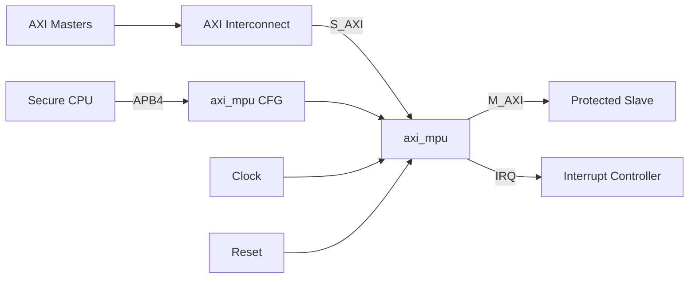

<!-- HLD_DOC_META
schema_version: 2.0

ip_name: axi_mpu
ip_display_name: AXI Memory Protection Unit

delivery_model: generator

lrs_baseline: LRS-AXI_MPU-V100
document_version: 1.0.0
status: draft

architecture_baseline: HLD-AXI_MPU-V100
END_HLD_DOC_META -->

# AXI Memory Protection Unit — HLD 概述

> 本文档是 HLD 文档的一部分，请参阅 [主索引文件](index.md)。

---

## 1. 设计输入与架构目标

### 1.1 输入 Baseline

| 输入 | Baseline / Version | 状态 |
|------|--------------------|------|
| LRS | LRS-AXI_MPU-V100 | Frozen |
| AXI4 Protocol Spec | IHI0022 | Approved |
| APB4 Protocol Spec | IHI0024 | Approved |
| 契约 | memory_protection_controller_contract.md | Draft Baseline |

### 1.2 Requirement Summary

| LRS Category | Requirement Count | Architecture Impact |
|--------------|-------------------|---------------------|
| FUNC | 33 | 权限模型、Region、burst、transaction、violation、lock |
| INTF | 5 | AXI 从/主接口、APB4、IRQ |
| CFG | 10 | Generator 参数化结构 |
| REG | 5 | 寄存器架构（全局/IRQ/violation/master_attr/region） |
| PERF | 3 | 吞吐、pipeline、outstanding |
| RESET | 2 | 单时钟域、异步复位 |
| LP | 1 | N/A（SoC 级管理） |
| SAFE | 1 | N/A（V1.0 不要求） |
| SEC | 2 | 攻击面防范、配置安全 |
| DFX | 2 | violation 可观测 |
| GEN | 4 | Generator 输入输出、确定性、结构裁剪 |
| CONS | 3 | 部署位置、配置总线、profile |

### 1.3 Architecture Goals

| ID | Architecture Goal | Requirement Source |
|----|-------------------|--------------------|
| HLD.GOAL.AXI_MPU.001 | Default-Deny 的权限判定闭环 | LRS.FUNC.AXI_MPU.DEFAULT_DENY.001 |
| HLD.GOAL.AXI_MPU.002 | 独立权限维度 AND 组合 | LRS.FUNC.AXI_MPU.DEFAULT_DENY.002 |
| HLD.GOAL.AXI_MPU.003 | Generator 结构裁剪 + Runtime 配置分离 | LRS.CFG.AXI_MPU.*, LRS.GEN.AXI_MPU.* |
| HLD.GOAL.AXI_MPU.004 | Burst 整事务保护 | LRS.FUNC.AXI_MPU.BURST.002 |
| HLD.GOAL.AXI_MPU.005 | 本地 DECERR + violation 记录 | LRS.FUNC.AXI_MPU.READ.002 / WRITE.002 / VIOLATION.* |
| HLD.GOAL.AXI_MPU.006 | AXI ordering 与多 outstanding 保持 | LRS.FUNC.AXI_MPU.ORDERING.001 |

### 1.4 Architecture Principles

1. **Requirement Traceable**：关键架构对象追踪到 LRS。
2. **Default Deny 内建**：保护路径默认拒绝，显式允许。
3. **独立权限维度**：Master/Security/Privilege/RWX 独立建模。
4. **确定性优先级**：Lowest Region Index Wins。
5. **Generator 决定结构，软件决定策略**。
6. **Error Path First-Class**：错误路径与正常路径同等设计。
7. **LLD Freedom**：HLD 冻结架构约束，不过度限制微架构。

## 2. System Context

| Item | Description |
|------|-------------|
| Parent Subsystem | Security Subsystem / Interconnect Protection |
| Upstream | AXI Master (via Interconnect) |
| Downstream | Protected Slave / SRAM / DDR window |
| Configuration Path | APB4 |
| Data Path | S_AXI → Protection Engine → M_AXI |
| Interrupt Path | IRQ (violation) |
| Clock Source | 单时钟 CLK |
| Reset Source | 异步复位 RST_N |

## 3. 复杂度评估

- 模块数量：8 个 L1 模块；
- 接口组：外部 4 组（S_AXI/M_AXI/APB4/IRQ）；
- 时钟域：1（CLK_SYS）；
- 寄存器组：GLOBAL/IRQ/VIOLATION/MASTER_ATTR/REGION；
- FSM：Read path（含 local responder）、Write path（含 Write Decision Queue）；
- CDC：无；
- 综合复杂度：medium（并行比较器阵列 + 优先级树）。

---

*文档版本: v1.0*
*创建日期: 2026-09-09*
*创建者: IP Development Suite - 03-hld-architect*
