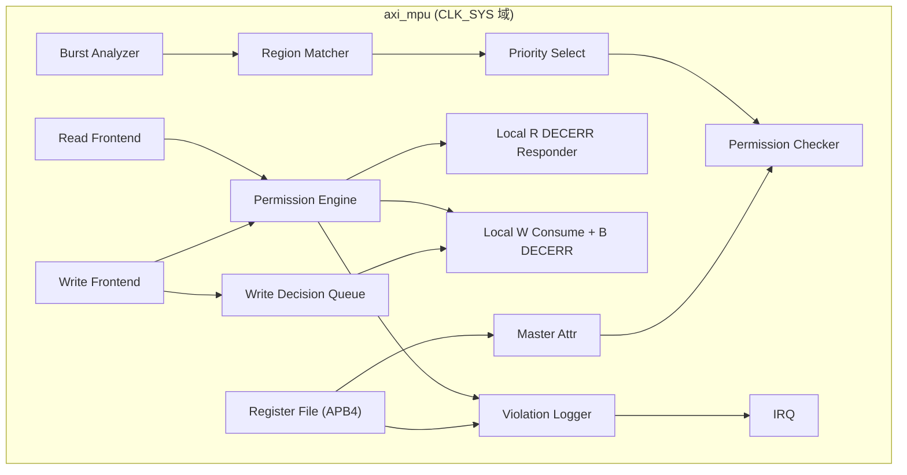

# AXI Memory Protection Unit — HLD 架构与模块分解

> 本文档是 HLD 文档的一部分，请参阅 [主索引文件](index.md)。

---

## 1. 系统架构

## 2. L1 模块分解

### 2.0 顶层模块

#### HLD.MOD.L1.AXI_MPU.TOP 顶层集成模块

<!-- HLD_MODULE_META
id: HLD.MOD.L1.AXI_MPU.TOP
name: axi_mpu
level: 1
parent_id: null
responsibility: 顶层集成：连接 Read/Write Frontend、Permission Engine、Violation Logger、Register File 与 Master Attr；承载 Generator 参数化；单时钟域集成
clock_domains:
  - CLK_SYS
reset_domains:
  - RST_SYS_N
power_domain: PD_ALWAYS_ON
interfaces:
  - HLD.IF.EXT.AXI_MPU.S_AXI
  - HLD.IF.EXT.AXI_MPU.M_AXI
  - HLD.IF.EXT.AXI_MPU.APB4
  - HLD.IF.EXT.AXI_MPU.IRQ
req_ref:
  - LRS.INTF.AXI_MPU.AXI_SLAVE.001
  - LRS.INTF.AXI_MPU.AXI_MASTER.001
  - LRS.INTF.AXI_MPU.APB_CFG.001
  - LRS.CFG.AXI_MPU.ADDR_WIDTH.001
  - LRS.CFG.AXI_MPU.DATA_WIDTH.001
  - LRS.CFG.AXI_MPU.ID_WIDTH.001
  - LRS.CFG.AXI_MPU.MASTER_NUM.001
  - LRS.CFG.AXI_MPU.REGION_NUM.001
  - LRS.CFG.AXI_MPU.OUTSTANDING.001
  - LRS.CFG.AXI_MPU.FEATURE.001
  - LRS.CFG.AXI_MPU.PIPELINE.001
  - LRS.RESET.AXI_MPU.CLOCK.001
  - LRS.RESET.AXI_MPU.RESET.001
  - LRS.PERF.AXI_MPU.OUTSTANDING.001
  - LRS.GEN.AXI_MPU.INPUT.001
  - LRS.GEN.AXI_MPU.OUTPUT.001
  - LRS.GEN.AXI_MPU.DETERMINISM.001
  - LRS.CONS.AXI_MPU.DEPLOY.001
applicability:
  expr: "true"
END_HLD_MODULE_META -->

##### 需求描述

1. 顶层承载全部 Generator 参数（`ADDR_WIDTH`/`DATA_WIDTH`/`ID_WIDTH`/
   `MASTER_NUM`/`REGION_NUM`/`READ_OUTSTANDING`/`WRITE_OUTSTANDING`/
   `HAS_EXECUTE`/`HAS_MASTER_ATTR`/`HAS_IRQ`/`HAS_VIOLATION_LOG`/`PIPELINE`/
   `WRAP_SUPPORT`）。
2. 单 `CLK_SYS` 域集成，AXI datapath 与 APB4 配置接口同域。
3. 权限引擎可共享或物理复制（Read/Write path）。

---

### 2.1 Read Frontend

#### HLD.MOD.L1.AXI_MPU.READ_FRONTEND Read Frontend

<!-- HLD_MODULE_META
id: HLD.MOD.L1.AXI_MPU.READ_FRONTEND
name: axi_mpu_read
level: 1
parent_id: HLD.MOD.L1.AXI_MPU.TOP
responsibility: AR 通道捕获、Request Context 构建、合法转发、非法本地 DECERR responder、Read outstanding 跟踪
clock_domains:
  - CLK_SYS
reset_domains:
  - RST_SYS_N
power_domain: PD_ALWAYS_ON
interfaces:
  - HLD.IF.EXT.AXI_MPU.S_AXI
  - HLD.IF.EXT.AXI_MPU.M_AXI
  - HLD.IF.INT.AXI_MPU.REQ_CTX
req_ref:
  - LRS.FUNC.AXI_MPU.REQ_CONTEXT.001
  - LRS.FUNC.AXI_MPU.READ.001
  - LRS.FUNC.AXI_MPU.READ.002
  - LRS.FUNC.AXI_MPU.OUTSTANDING.001
  - LRS.FUNC.AXI_MPU.ORDERING.001
  - LRS.FUNC.AXI_MPU.ERR_RESP.001
applicability:
  expr: "true"
END_HLD_MODULE_META -->

---

### 2.2 Write Frontend

#### HLD.MOD.L1.AXI_MPU.WRITE_FRONTEND Write Frontend

<!-- HLD_MODULE_META
id: HLD.MOD.L1.AXI_MPU.WRITE_FRONTEND
name: axi_mpu_write
level: 1
parent_id: HLD.MOD.L1.AXI_MPU.TOP
responsibility: AW/W 通道捕获、Request Context 构建、Write Decision Queue 维护、合法转发、非法 W consume + 本地 B DECERR
clock_domains:
  - CLK_SYS
reset_domains:
  - RST_SYS_N
power_domain: PD_ALWAYS_ON
interfaces:
  - HLD.IF.EXT.AXI_MPU.S_AXI
  - HLD.IF.EXT.AXI_MPU.M_AXI
  - HLD.IF.INT.AXI_MPU.REQ_CTX
  - HLD.IF.INT.AXI_MPU.WQ
req_ref:
  - LRS.FUNC.AXI_MPU.REQ_CONTEXT.001
  - LRS.FUNC.AXI_MPU.WRITE.001
  - LRS.FUNC.AXI_MPU.WRITE.002
  - LRS.FUNC.AXI_MPU.WRITE_QUEUE.001
  - LRS.FUNC.AXI_MPU.OUTSTANDING.001
  - LRS.FUNC.AXI_MPU.ORDERING.001
  - LRS.FUNC.AXI_MPU.ERR_RESP.001
applicability:
  expr: "true"
END_HLD_MODULE_META -->

---

### 2.3 Permission Engine

#### HLD.MOD.L1.AXI_MPU.PERM_ENGINE Permission Engine

<!-- HLD_MODULE_META
id: HLD.MOD.L1.AXI_MPU.PERM_ENGINE
name: axi_mpu_permission
level: 1
parent_id: HLD.MOD.L1.AXI_MPU.TOP
responsibility: Burst Analyzer + Region Matcher + Priority Select + Permission Checker 组合，产生 ALLOW/DENY 与 deny_reason；可配置 0/1-stage pipeline
clock_domains:
  - CLK_SYS
reset_domains:
  - RST_SYS_N
power_domain: PD_ALWAYS_ON
interfaces:
  - HLD.IF.INT.AXI_MPU.REQ_CTX
  - HLD.IF.INT.AXI_MPU.PERM
  - HLD.IF.INT.AXI_MPU.REGION_TABLE
  - HLD.IF.INT.AXI_MPU.MASTER_ATTR_IF
req_ref:
  - LRS.FUNC.AXI_MPU.DEFAULT_DENY.001
  - LRS.FUNC.AXI_MPU.DEFAULT_DENY.002
  - LRS.FUNC.AXI_MPU.REGION.001
  - LRS.FUNC.AXI_MPU.REGION.002
  - LRS.FUNC.AXI_MPU.REGION.003
  - LRS.FUNC.AXI_MPU.REGION.004
  - LRS.FUNC.AXI_MPU.BURST.001
  - LRS.FUNC.AXI_MPU.BURST.002
  - LRS.FUNC.AXI_MPU.PERM_MASTER.001
  - LRS.FUNC.AXI_MPU.PERM_SECURITY.001
  - LRS.FUNC.AXI_MPU.PERM_PRIVILEGE.001
  - LRS.FUNC.AXI_MPU.PERM_OP.001
  - LRS.FUNC.AXI_MPU.PERM_DECISION.001
  - LRS.FUNC.AXI_MPU.PERM_DECISION.002
  - LRS.FUNC.AXI_MPU.MASTER_SEC_ATTR.001
  - LRS.FUNC.AXI_MPU.MASTER_ID.001
  - LRS.PERF.AXI_MPU.THROUGHPUT.001
  - LRS.PERF.AXI_MPU.THROUGHPUT.002
  - LRS.CFG.AXI_MPU.PIPELINE.001
  - LRS.CFG.AXI_MPU.BURST.001
  - LRS.GEN.AXI_MPU.STRUCTURE.001
  - LRS.SEC.AXI_MPU.ATTACK.001
applicability:
  expr: "true"
END_HLD_MODULE_META -->

---

### 2.4 Violation Logger

#### HLD.MOD.L1.AXI_MPU.VIOLATION Violation Logger

<!-- HLD_MODULE_META
id: HLD.MOD.L1.AXI_MPU.VIOLATION
name: axi_mpu_violation
level: 1
parent_id: HLD.MOD.L1.AXI_MPU.TOP
responsibility: violation 捕获（FIRST_ERROR_STICKY）、violation counter、IRQ 生成
clock_domains:
  - CLK_SYS
reset_domains:
  - RST_SYS_N
power_domain: PD_ALWAYS_ON
interfaces:
  - HLD.IF.INT.AXI_MPU.PERM
  - HLD.IF.EXT.AXI_MPU.IRQ
req_ref:
  - LRS.FUNC.AXI_MPU.VIOLATION.001
  - LRS.FUNC.AXI_MPU.VIOLATION.002
  - LRS.FUNC.AXI_MPU.VIOLATION.003
  - LRS.FUNC.AXI_MPU.IRQ.001
  - LRS.INTF.AXI_MPU.IRQ.001
  - LRS.REG.AXI_MPU.VIOLATION.001
  - LRS.REG.AXI_MPU.IRQ.001
  - LRS.DFX.AXI_MPU.OBSERVABILITY.001
applicability:
  expr: "has_violation_log == true"
END_HLD_MODULE_META -->

---

### 2.5 Register File

#### HLD.MOD.L1.AXI_MPU.REG_FILE Register File

<!-- HLD_MODULE_META
id: HLD.MOD.L1.AXI_MPU.REG_FILE
name: axi_mpu_regs
level: 1
parent_id: HLD.MOD.L1.AXI_MPU.TOP
responsibility: APB4 从接口、全局/IRQ/violation/Region/Master Attr 寄存器、Region/Global Lock 保护、配置访问路径
clock_domains:
  - CLK_SYS
reset_domains:
  - RST_SYS_N
power_domain: PD_ALWAYS_ON
interfaces:
  - HLD.IF.EXT.AXI_MPU.APB4
  - HLD.IF.INT.AXI_MPU.REGION_TABLE
  - HLD.IF.INT.AXI_MPU.MASTER_ATTR_IF
req_ref:
  - LRS.INTF.AXI_MPU.APB_CFG.001
  - LRS.REG.AXI_MPU.GLOBAL.001
  - LRS.REG.AXI_MPU.IRQ.001
  - LRS.REG.AXI_MPU.VIOLATION.001
  - LRS.REG.AXI_MPU.MASTER_ATTR.001
  - LRS.REG.AXI_MPU.REGION.001
  - LRS.FUNC.AXI_MPU.REGION_LOCK.001
  - LRS.FUNC.AXI_MPU.GLOBAL_LOCK.001
  - LRS.FUNC.AXI_MPU.RESET.001
  - LRS.SEC.AXI_MPU.CONFIG_SEC.001
  - LRS.CONS.AXI_MPU.CONFIG_BUS.001
applicability:
  expr: "true"
END_HLD_MODULE_META -->

---

### 2.6 Master Attribute

#### HLD.MOD.L1.AXI_MPU.MASTER_ATTR Master Attribute

<!-- HLD_MODULE_META
id: HLD.MOD.L1.AXI_MPU.MASTER_ATTR
name: axi_mpu_master_attr
level: 1
parent_id: HLD.MOD.L1.AXI_MPU.TOP
responsibility: 维护每个 Master 的 SECURE_CAPABLE/NONSECURE_CAPABLE 属性，供 Permission Engine 的 master_security_valid 检查
clock_domains:
  - CLK_SYS
reset_domains:
  - RST_SYS_N
power_domain: PD_ALWAYS_ON
interfaces:
  - HLD.IF.INT.AXI_MPU.MASTER_ATTR_IF
req_ref:
  - LRS.FUNC.AXI_MPU.MASTER_SEC_ATTR.001
  - LRS.REG.AXI_MPU.MASTER_ATTR.001
applicability:
  expr: "has_master_attr == true"
END_HLD_MODULE_META -->

---

*文档版本: v1.0*
*创建日期: 2026-09-09*
*创建者: IP Development Suite - 03-hld-architect*
