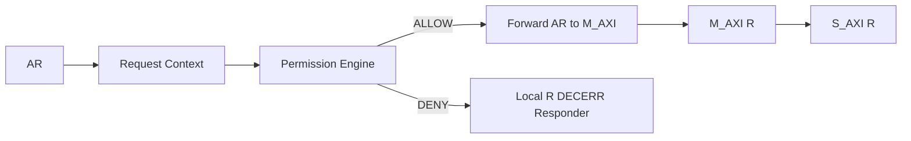
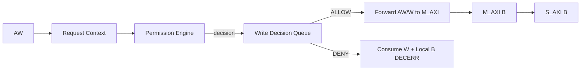

# AXI Memory Protection Unit — HLD 功能与数据流

> 本文档是 HLD 文档的一部分，请参阅 [主索引文件](index.md)。

---

## 1. 数据流

### 1.1 Read Path

#### HLD.FLOW.AXI_MPU.READ Read Path

<!-- HLD_FLOW_META
id: HLD.FLOW.AXI_MPU.READ
name: read_path
description: Read 事务流：AR 捕获 → Request Context → Permission Engine → ALLOW/DENY → 转发或本地 DECERR
req_ref:
  - LRS.FUNC.AXI_MPU.READ.001
  - LRS.FUNC.AXI_MPU.READ.002
END_HLD_FLOW_META -->

---

### 1.2 Write Path

#### HLD.FLOW.AXI_MPU.WRITE Write Path

<!-- HLD_FLOW_META
id: HLD.FLOW.AXI_MPU.WRITE
name: write_path
description: Write 事务流：AW 捕获 → Request Context → Permission Engine → WQ 记录决策 → ALLOW 转发 AW/W 或 DENY consume W + 本地 B DECERR
req_ref:
  - LRS.FUNC.AXI_MPU.WRITE.001
  - LRS.FUNC.AXI_MPU.WRITE.002
  - LRS.FUNC.AXI_MPU.WRITE_QUEUE.001
END_HLD_FLOW_META -->

---

## 2. 策略

### 2.1 权限判定策略

#### HLD.POLICY.AXI_MPU.PERM 权限判定策略

<!-- HLD_POLICY_META
id: HLD.POLICY.AXI_MPU.PERM
type: permission
policy: |
  selected_region = priority_encode(region_match)  // Lowest Index Wins
  if no region match: DENY
  else: ALLOW = master_allowed && master_security_valid && security_allowed
               && privilege_allowed && operation_allowed
req_ref:
  - LRS.FUNC.AXI_MPU.PERM_DECISION.001
  - LRS.FUNC.AXI_MPU.DEFAULT_DENY.001
END_HLD_POLICY_META -->

### 2.2 Burst 策略

#### HLD.POLICY.AXI_MPU.BURST Burst 整事务策略

<!-- HLD_POLICY_META
id: HLD.POLICY.AXI_MPU.BURST
type: burst
policy: |
  burst 有效地址范围 [burst_start, burst_end] 必须完全位于 selected Region 内；
  跨边界 → DENY WHOLE TRANSACTION，不允许部分 beat 进入下游。
req_ref:
  - LRS.FUNC.AXI_MPU.BURST.001
  - LRS.FUNC.AXI_MPU.BURST.002
END_HLD_POLICY_META -->

### 2.3 Violation 捕获策略

#### HLD.POLICY.AXI_MPU.VIOLATION Violation 捕获策略

<!-- HLD_POLICY_META
id: HLD.POLICY.AXI_MPU.VIOLATION
type: violation
policy: |
  FIRST_ERROR_STICKY：首错捕获后 VIOL_VALID=1，后续错误不覆盖首错，
  软件显式清除后重新捕获；VIOL_COUNT 每次 violation 递增且饱和。
req_ref:
  - LRS.FUNC.AXI_MPU.VIOLATION.002
  - LRS.FUNC.AXI_MPU.VIOLATION.003
END_HLD_POLICY_META -->

### 2.4 Lock 策略

#### HLD.POLICY.AXI_MPU.LOCK Lock 策略

<!-- HLD_POLICY_META
id: HLD.POLICY.AXI_MPU.LOCK
type: lock
policy: |
  REGION_LOCK 置位后对应 Region BASE/LIMIT/ATTR/MASTER_MASK 冻结；
  GLOBAL_LOCK 置位后所有保护配置冻结；锁仅 reset 清除；
  violation status / IRQ clear 等运行态寄存器在 GLOBAL_LOCK 下仍可访问。
req_ref:
  - LRS.FUNC.AXI_MPU.REGION_LOCK.001
  - LRS.FUNC.AXI_MPU.GLOBAL_LOCK.001
END_HLD_POLICY_META -->

---

## 3. Register Architecture（冻结）

> 依据核心原则 1b：HLD 冻结 **Register Architecture**（Group / 访问路径 / 更新模型 /
> 状态所有权 / 错误与中断模型 / 保护策略），字段级行为由 LLD，结构由 SystemRDL。

### 3.1 Register Group

| Group | 功能 | 访问 | 更新模型 |
|-------|------|------|----------|
| GLOBAL | 全局使能/状态/Lock | RW/RO | write-through；Lock 冻结 |
| IRQ | 中断使能/状态/清除 | RW/W1C | sticky + W1C |
| VIOLATION | 首错状态/地址/info/count | RO/W1C | FIRST_ERROR_STICKY |
| MASTER_ATTR | 每 Master SECURE/NONSECURE_CAPABLE | RW | write-through；Global Lock 冻结 |
| REGION | BASE/LIMIT/MASTER_MASK/PERMISSION/CONTROL | RW/RO | write-through；Region Lock 冻结 |

### 3.2 Configuration Activation Model

- **Region/Master Attr 配置**：write-through 即时生效（runtime activation）。
  保护引擎每拍采样当前配置值。
- **Global Lock / Region Lock**：write-through，置位后冻结对应写路径。
- **Violation 状态**：软件 W1C 清除；capture 由硬件写。

### 3.3 Interrupt Model

- `IRQ_ENABLE` 使能位 + `IRQ_STATUS` sticky 状态 + 软件 W1C 清除；
- `IRQ = IRQ_ENABLE & IRQ_STATUS`。

### 3.4 寄存器架构决策

#### HLD.DECISION.AXI_MPU.REG_ARCH 寄存器架构决策

<!-- HLD_DECISION_META
id: HLD.DECISION.AXI_MPU.REG_ARCH
level: architecture
status: accepted
options:
  - 独立权限位字段（SECURE/NONSECURE/PRIV/UNPRIV/R/W/X）
  - Master×Security 笛卡尔积权限表
decision: 独立权限位字段，各维度独立 AND 组合（符合 LRS 独立权限维度原则）
rationale: 避免指数级字段膨胀，保持软件模型可读，符合 LRS.FUNC.AXI_MPU.DEFAULT_DENY.002
req_ref:
  - LRS.FUNC.AXI_MPU.DEFAULT_DENY.002
  - LRS.REG.AXI_MPU.REGION.001
END_HLD_DECISION_META -->

### 3.5 内部接口

#### HLD.IF.INT.AXI_MPU.REGION_TABLE Region Table 内部接口

<!-- HLD_INTERFACE_META
id: HLD.IF.INT.AXI_MPU.REGION_TABLE
name: region_table_if
scope: internal
protocol: internal
role: config_bus
owner_module: HLD.MOD.L1.AXI_MPU.REG_FILE
clock_domain: CLK_SYS
reset_domain: RST_SYS_N
req_ref:
  - LRS.REG.AXI_MPU.REGION.001
applicability:
  expr: "true"
END_HLD_INTERFACE_META -->

#### HLD.IF.INT.AXI_MPU.MASTER_ATTR_IF Master Attr 内部接口

<!-- HLD_INTERFACE_META
id: HLD.IF.INT.AXI_MPU.MASTER_ATTR_IF
name: master_attr_if
scope: internal
protocol: internal
role: config_bus
owner_module: HLD.MOD.L1.AXI_MPU.REG_FILE
clock_domain: CLK_SYS
reset_domain: RST_SYS_N
req_ref:
  - LRS.REG.AXI_MPU.MASTER_ATTR.001
applicability:
  expr: "has_master_attr == true"
END_HLD_INTERFACE_META -->

#### HLD.IF.INT.AXI_MPU.REQ_CTX Request Context 内部接口

<!-- HLD_INTERFACE_META
id: HLD.IF.INT.AXI_MPU.REQ_CTX
name: req_ctx_if
scope: internal
protocol: internal
role: data
owner_module: HLD.MOD.L1.AXI_MPU.READ_FRONTEND
clock_domain: CLK_SYS
reset_domain: RST_SYS_N
req_ref:
  - LRS.FUNC.AXI_MPU.REQ_CONTEXT.001
applicability:
  expr: "true"
END_HLD_INTERFACE_META -->

#### HLD.IF.INT.AXI_MPU.PERM Permission Result 内部接口

<!-- HLD_INTERFACE_META
id: HLD.IF.INT.AXI_MPU.PERM
name: perm_result_if
scope: internal
protocol: internal
role: control
owner_module: HLD.MOD.L1.AXI_MPU.PERM_ENGINE
clock_domain: CLK_SYS
reset_domain: RST_SYS_N
req_ref:
  - LRS.FUNC.AXI_MPU.PERM_DECISION.001
applicability:
  expr: "true"
END_HLD_INTERFACE_META -->

#### HLD.IF.INT.AXI_MPU.WQ Write Decision Queue 内部接口

<!-- HLD_INTERFACE_META
id: HLD.IF.INT.AXI_MPU.WQ
name: write_queue_if
scope: internal
protocol: internal
role: control
owner_module: HLD.MOD.L1.AXI_MPU.WRITE_FRONTEND
clock_domain: CLK_SYS
reset_domain: RST_SYS_N
req_ref:
  - LRS.FUNC.AXI_MPU.WRITE_QUEUE.001
applicability:
  expr: "true"
END_HLD_INTERFACE_META -->

---

*文档版本: v1.0*
*创建日期: 2026-09-09*
*创建者: IP Development Suite - 03-hld-architect*
