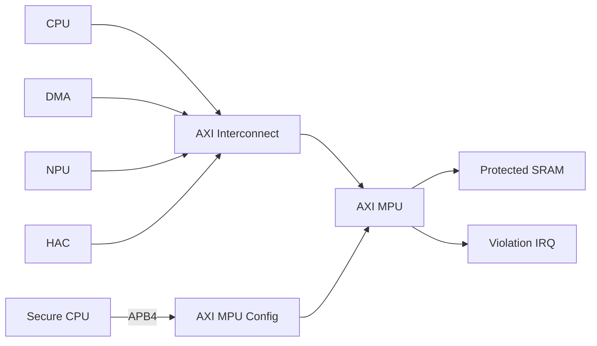

<!-- LRS_DOC_META
schema_version: 2.0

ip_name: axi_mpu
ip_display_name: AXI Memory Protection Unit

delivery_model: generator
register_model: required
ppa_signoff: required
ppa_signoff_reason: Generator IP 按参数空间交付，PPA（面积/时序/功耗）随 REGION_NUM/PIPELINE/频率变化显著；G5 发布前须以 28nm（PDK_READY）Sweep/Pareto 表征并给出推荐配置与 budget 结论（20-ppa-optimization，E2 证据等级）。
document_version: 1.0.0
status: draft

requirement_baseline: LRS-AXI_MPU-V100
END_LRS_DOC_META -->

# AXI Memory Protection Unit（AXI MPU）IP 概述 - 00 Overview

> 本文档是 LRS 文档的一部分，请参阅 [主索引文件](index.md)。

---

## 1. 应用背景 / Context

AXI Memory Protection Unit（AXI MPU）用于在 AXI Master 与目标 Slave / Interconnect
之间提供基于地址和访问上下文的访问控制。它根据 AXI Address、Read/Write 类型、
`AxPROT`（Secure/Non-secure、Privileged/Unprivileged、Instruction/Data）、Master
Identity 以及 Region 配置的访问权限判断访问是否合法。

- 合法访问：AXI MPU 将事务透明转发至下游；
- 非法访问：AXI MPU 不得将事务发送至受保护的下游 Slave，在本地完成 AXI
  transaction，返回 `DECERR` 错误响应，记录 violation 信息并可产生中断。

典型应用场景：

- Secure SRAM / ROM / Boot Memory / Key RAM / Safety RAM 保护；
- Security Subsystem 与 Critical Register Space 保护；
- DDR protected window 与 Shared Accelerator Memory 保护；
- 多 Master（CPU/DMA/NPU/HAC）共享受保护资源的访问仲裁。

系统位置（受保护 Slave 侧典型部署）：

本 IP 定位为 **Region-based、Default-Deny、Context-aware 的 AXI System Access
Control**，属于 **Access Protection**，而不是 **Address Translation /
Protocol Firewall**。

## 2. 功能简介 / Feature Overview

- AXI4 Full 主/从接口（Read/Write 双向保护）；
- 多地址 Region（`BASE + LIMIT` 模式，支持 Region overlap 与固定优先级）；
- Runtime Region 配置（APB4 配置接口）；
- 独立权限维度：Address / Master Identity / Security State / Privilege State /
  Operation Type；
- Master Security Attribution（`SECURE_CAPABLE` / `NONSECURE_CAPABLE`）；
- Read / Write / Execute 属性独立判定；
- Burst Boundary Protection（INCR / FIXED / WRAP，跨边界整事务拒绝）；
- 多 outstanding transaction（Read/Write 独立队列）；
- 非法访问本地 `DECERR` 响应；
- Violation Logging（FIRST_ERROR_STICKY 捕获策略）与 Violation Counter；
- Violation Interrupt（sticky + W1C）；
- Region Lock 与 Global Lock 配置保护；
- Default Deny 策略（Reset 后所有 Region disabled）；
- 可配置 pipeline（0-stage / 1-stage）；
- Generator 结构裁剪（Region 数、Master 数、地址/数据/ID 位宽、功能使能）。

## 3. 配置参数 / Parameters

| 参数 | 默认值 | 说明 |
|------|--------|------|
| `ADDR_WIDTH` | 48 | AXI 地址位宽 |
| `DATA_WIDTH` | 128 | AXI 数据位宽 |
| `ID_WIDTH` | 8 | AXI ID 位宽 |
| `MASTER_NUM` | 8 | Master 身份数量 |
| `MASTER_ID_WIDTH` | 4 | Master ID 位宽（`$clog2(MASTER_NUM)` 以上） |
| `REGION_NUM` | 16 | Protection Region 数量（不要求 2 的幂） |
| `READ_OUTSTANDING` | 8 | Read outstanding 深度 |
| `WRITE_OUTSTANDING` | 8 | Write outstanding 深度 |
| `HAS_EXECUTE` | 1 | 是否支持 Execute 保护 |
| `HAS_MASTER_ATTR` | 1 | 是否支持 Master Security Attribution |
| `HAS_IRQ` | 1 | 是否支持 Violation Interrupt |
| `HAS_VIOLATION_LOG` | 1 | 是否支持 Violation Logging |
| `PIPELINE` | 0 | Permission Engine pipeline 级数（0/1） |
| `WRAP_SUPPORT` | 1 | 是否支持 WRAP burst（裁剪时可为 0） |

## 4. 关键设计原则 / Key Principles

1. **Default Deny**：未匹配任何有效 Region 的访问默认拒绝；Reset 后所有可编程
   Region 默认 disabled。
2. **独立权限维度**：Address / Master Identity / Security / Privilege / R/W/X
   独立建模并 AND 组合，禁止编码为笛卡尔积式权限矩阵。
3. **Master Identity 与 Security 独立**：Master Identity 表示"谁在访问"，
   Security State 表示"当前事务的安全属性"，分别判定。
4. **Burst 整事务保护**：跨 Region 边界的 burst 默认 DENY WHOLE TRANSACTION，
   不允许部分 beat 进入下游。
5. **确定性 Region 优先级**：Lowest Region Index Wins，不得依赖综合实现。
6. **Generator 结构裁剪**：Generator 决定硬件结构与规模，Runtime 配置定义实际
   地址段与访问策略。

## 5. 不支持范围 / Out of Scope

- CPU MMU 页表转换 / Virtual→Physical Address Translation；
- TLB / Cache coherency；
- AXI protocol firewall / AXI timeout protection / deadlock recovery；
- ECC / IOMMU / SMMU / PASID / PCIe ATS / 完整虚拟化 translation。

---

*文档版本: v1.0*
*创建日期: 2026-09-09*
*创建者: IP Development Suite - 01-lrs-author*
