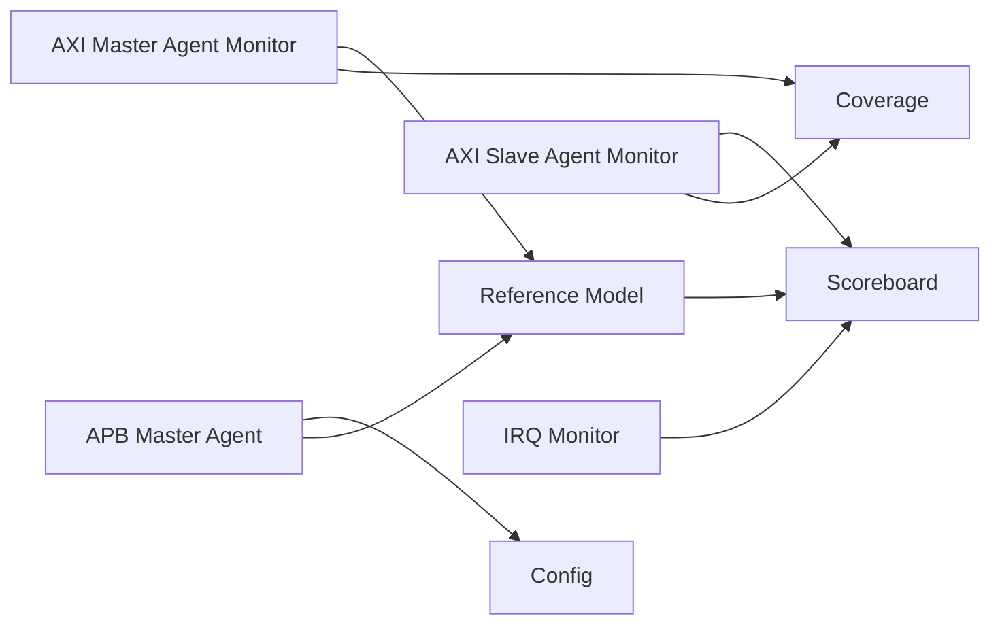

# AXI Memory Protection Unit — Agent Plan

> 本文档是验证方案的一部分。定义 Verification Agent 结构（不编写 SystemVerilog
> 类实现）。

---

## 16. Agent Summary

| Agent              | Protocol | Role   | Mode    |
| ------------------ | -------- | ------ | ------- |
| `axi_master_agent` | AXI4     | Master | Active  |
| `axi_slave_agent`  | AXI4     | Slave  | Active/Passive |
| `apb_master_agent` | APB4     | Master | Active  |
| `irq_monitor`      | -        | Monitor| Passive |

---

## 16.1 AXI Master Agent（驱动 S_AXI）

驱动 DUT 的 S_AXI 接口（AR/R/W/AW/B 五通道），模拟上游 AXI Master。

* Item：`axi_mpu_master_item`
* Sequencer：`axi_mpu_master_sequencer`
* Driver：`axi_mpu_master_driver`
* Monitor：`axi_mpu_master_monitor`

职责：

* 按 Item 生成 AR/AW/W 事务（含 burst、PROT、ID）；
* 收集 S_AXI 上 R/B 响应；
* 支持随机 backpressure（READY 拉低）；
* 支持 AW/W 解耦（W 可晚于/早于 AW）。

---

## 16.2 AXI Slave Agent（观察 M_AXI，可选响应）

观察 DUT 的 M_AXI 接口；被动模式下只监视（验证非法事务不出现于 M_AXI），
主动模式下作为受保护 Slave 响应合法事务。

* Item：`axi_mpu_slave_item`
* Sequencer：`axi_mpu_slave_sequencer`
* Driver（可选）：`axi_mpu_slave_driver`
* Monitor：`axi_mpu_slave_monitor`

职责：

* 收集 M_AXI 上事务；
* 按配置响应（OKAY/DECERR、随机 READY 反压）；
* 提供 M_AXI 事务流供 scoreboard 比对。

---

## 16.3 APB Master Agent（配置接口）

通过 APB4 配置 DUT 寄存器（Region/Attr/IRQ/Lock/Status）。

* Item：`apb_item`
* Sequencer：`apb_sequencer`
* Driver：`apb_driver`
* Monitor：`apb_monitor`

职责：

* 生成 APB 读写序列（配置 Region、使能 IRQ、读 violation）；
* 支持 frontdoor RAL 访问。

---

## 16.4 IRQ Monitor（被动）

* Monitor：`irq_monitor`

职责：

* 观察 `irq` 信号跳变；
* 生成 `irq_event` 供 coverage/checker 消费。

---

## 16.5 TLM Architecture

---

## 16.6 Register Model（RAL）

* RAL 源：`verification/ral/axi_mpu.xml`（PeakRDL 生成）；
* 使用 APB adapter 进行 frontdoor 访问；
* predictor：显式预测（write 时更新 mirror）；
* backdoor：用于 reset/初始化快速配置（可选）。
