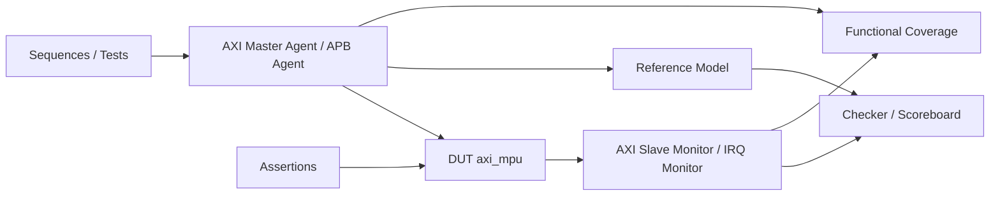

# AXI Memory Protection Unit 验证方案

# Verification Plan — `axi_mpu`

> **Document ID**: `VPLAN-AXI_MPU-V100`
> **IP Name**: `axi_mpu`
> **IP Display Name**: AXI Memory Protection Unit
> **Version**: `1.0.0`
> **Status**: `Draft`
> **Owner**: IP Development Suite - DV
> **Date**: 2026-09-09

<!-- VPLAN_META
schema_version: 2.0

ip_name: axi_mpu
ip_display_name: AXI Memory Protection Unit

delivery_model: generator

lrs_baseline: LRS-AXI_MPU-V100
hld_baseline: HLD-AXI_MPU-V100
lld_baseline: LLD-AXI_MPU-V100

verification_level: full

document_version: 1.0.0
status: draft

verification_baseline: VPLAN-AXI_MPU-V100
END_VPLAN_META -->

---

# 0. 文档定位 / Verification Plan Scope

## 0.1 文档目的

本文档定义 AXI Memory Protection Unit 的验证方案。

Verification Plan 回答：

> **HOW SHALL THE DESIGN BE VERIFIED?**

主要定义：

* Verification Feature；
* Requirement Verification Strategy；
* Testcase；
* Assertion；
* Functional Coverage；
* Configuration Coverage；
* Reference Model；
* Checker / Scoreboard；
* Verification Agent；
* Error / Fault Injection；
* Formal / Static Verification；
* Regression；
* Signoff；
* Requirement / Feature / Evidence Traceability。

---

## 0.2 职责边界

### Verification Plan 负责

* 验证范围；
* 验证方法；
* Verification Feature；
* Test Scenario；
* Testcase；
* Checker；
* Assertion；
* Coverage；
* Reference Model；
* Agent；
* Configuration Sampling；
* Error Injection；
* Formal Candidate；
* Regression；
* Signoff。

### Verification Plan 不负责

以下内容属于 LRS / HLD / LLD / RTL：

* DUT 架构划分；
* RTL module partition；
* FSM 设计；
* pipeline 设计；
* buffer 设计；
* arbitration 设计；
* CDC 实现；
* reset implementation；
* RTL signal logic；
* Generator topology design。

VPLAN 可以**引用**这些设计对象，但不得重新定义。

---

## 0.3 Verification Input Chain

```text
LRS
 │
 │ Requirements
 ▼
HLD
 │
 │ Architecture / Verification Hooks
 ▼
LLD
 │
 │ Microarchitecture / Verification Hooks
 ▼
Verification Plan
 │
 ├── Feature
 ├── Testcase
 ├── Assertion
 ├── Coverage
 ├── RM / Checker
 └── Configuration Set
```

---

# 1. Verification Overview

## 1.1 DUT Overview

| Item                 | Description                                |
| -------------------- | ------------------------------------------ |
| DUT                  | AXI Memory Protection Unit                 |
| RTL Top              | `axi_mpu`                                  |
| Delivery Model       | generator                                  |
| Main Function        | Region-based、Default-Deny、Context-aware AXI access control |
| Main Interfaces      | S_AXI (AXI4 Slave)、M_AXI (AXI4 Master)、APB4 Slave (CFG)、IRQ |
| Configuration Method | APB4（Runtime Region/权限）+ Generator 参数（结构） |
| Clock Domains        | 单时钟域 CLK_SYS（`LRS.RESET.AXI_MPU.CLOCK.001`） |
| Reset Domains        | 单异步复位 RST_N（`LRS.RESET.AXI_MPU.RESET.001`） |

---

## 1.2 Verification Objectives

验证目标包括：

1. 验证所有 P0 / must Requirement（56 条）；
2. 验证主要正常功能路径（Region 匹配、权限 AND 判定、合法转发）；
3. 验证边界条件（Region BASE/LIMIT、burst 边界、MASTER_MASK 边界）；
4. 验证异常和恢复路径（非法访问本地 DECERR、W consume、Violation 记录）；
5. 验证 Reset 行为（reset 后全 disabled、Default Deny、lock 清除）；
6. 验证并发 / race（多 outstanding、AW/W 解耦、同时 violation）；
7. 验证 CDC / asynchronous behavior（单时钟域，N/A 单域）；
8. 验证 Safety / Error Mechanism（本地 DECERR、无 deadlock/hang）；
9. 验证性能 Requirement（≥1 address transaction/cycle，多 outstanding 不降级）；
10. 验证 Parameter / Generator Configuration Space（CFG_MAIN / CFG_MINIMAL）；
11. 建立 Requirement → Feature → Proof → Evidence 的完整追踪。

---

## 1.3 Verification Methods

本项目可使用：

| Method                | Purpose                        |
| --------------------- | ------------------------------ |
| Simulation            | 功能与场景验证                        |
| Assertion             | 协议/时序/不变量                      |
| Formal                | 状态空间、不变量、死锁等                   |
| Static                | Lint / CDC / RDC               |
| Register Verification | CSR correctness                |
| Fault Injection       | Safety / error                 |
| Performance Test      | Throughput / latency           |
| Equivalence           | Generator / parameter variants |
| Review                | 不可动态验证项                        |

---

## 1.4 Verification Environment



---

# 2. Verification Scope

## 2.1 Interface Scope

| Interface | Protocol | Role   | Verification Agent | Active/Passive |
| --------- | -------- | ------ | ------------------ | -------------- |
| S_AXI     | AXI4     | Slave  | `axi_master_agent` | Active         |
| M_AXI     | AXI4     | Master | `axi_slave_agent`  | Active/Passive |
| CFG       | APB4     | Slave  | `apb_master_agent` | Active         |
| IRQ       | -        | Output | `irq_monitor`      | Passive        |

---

## 2.2 Clock & Reset Scope

| Domain     | Clock   | Reset   | Verification Concern               |
| ---------- | ------- | ------- | ---------------------------------- |
| CLK_SYS    | `clk`   | `rst_n` | reset / async reset / power-on     |

需要考虑：

* power-on reset；
* reset during idle；
* reset during transaction；
* repeated reset；
* reset release ordering。

---

## 2.3 Register Scope

验证（引用 `regs/axi_mpu.rdl`，不复制字段定义）：

* reset value；
* RW；
* RO；
* W1C（IRQ_STATUS.viol_sticky、VIOL_STATUS.valid、VIOL_COUNT.count）；
* lock（REGION_CONTROL.lock、GLOBAL_LOCK.lock）；
* reserved / illegal address；
* SW/HW collision；
* configuration activation；
* Global Lock 语义（1→0 仅 reset）；
* Region Lock 语义（置位后 BASE/LIMIT/ATTR/MASTER_MASK 冻结）。

---

## 2.4 Functional Scope

包括：

* normal flow（合法 Read/Write 透明转发）；
* boundary（Region BASE/LIMIT 边界 ±1）；
* maximum/minimum（burst 全长、outstanding 满）；
* simultaneous event（多 violation 同时发生）；
* backpressure（ARREADY/RREADY/AWREADY/WREADY/BREADY 反压）；
* resource conflict（Write Decision Queue 满、outstanding 满）；
* error（非法访问、非法 Master ID、forged Secure）；
* timeout / recovery（非法 transaction 必须完成本地响应，无 hang）；
* reset；
* configuration variation（CFG_MAIN / CFG_MINIMAL）。

---

## 2.5 Out of Scope

| Item            | Reason     |
| --------------- | ---------- |
| AXI protocol firewall | Non-Goal（LRS §Non-Goals） |
| AXI timeout protection | Non-Goal |
| AXI deadlock recovery  | Non-Goal |
| ECC                    | Non-Goal |
| IOMMU / SMMU           | Non-Goal |
| CDC（多时钟域）           | 单时钟域 IP，CDC 静态确认后 N/A |

---

# 3. Verification Feature Model

Feature 是 VPLAN 的核心验证签核单元。

关系：

```text
LRS
 ↓
Feature
 ↓
TC / ASSERT / COV / FORMAL
```

一个 Feature 可以覆盖多个 LRS。Feature 定义见 `feature_list.md`。

---

# 4. Requirement Verification Strategy

## 4.1 Requirement Disposition

每条 P0 Requirement 必须具有明确 Verification Disposition。完整映射见
`feature_list.md` 的 `FEATURE_META.req_ref` 与 `test_matrix.md`。

| Requirement | Feature | Proof Method           | Status  |
| ----------- | ------- | ---------------------- | ------- |
| `LRS.FUNC.AXI_MPU.DEFAULT_DENY.001` | `FL.AXI_MPU.DEFAULT_DENY` | simulation + assertion | Planned |
| `LRS.FUNC.AXI_MPU.READ.001/.002`    | `FL.AXI_MPU.READ_PATH`   | simulation + assertion | Planned |
| `LRS.FUNC.AXI_MPU.WRITE.001/.002`   | `FL.AXI_MPU.WRITE_PATH`  | simulation + assertion | Planned |
| `LRS.FUNC.AXI_MPU.BURST.002`        | `FL.AXI_MPU.BURST`       | simulation + assertion | Planned |
| `LRS.FUNC.AXI_MPU.ERR_RESP.001`     | `FL.AXI_MPU.ERR_RESP`    | simulation + assertion | Planned |
| `LRS.FUNC.AXI_MPU.VIOLATION.001/.002`| `FL.AXI_MPU.VIOLATION`  | simulation            | Planned |
| `LRS.FUNC.AXI_MPU.REGION_LOCK.001`  | `FL.AXI_MPU.LOCK`        | simulation + assertion | Planned |
| `LRS.FUNC.AXI_MPU.GLOBAL_LOCK.001`  | `FL.AXI_MPU.LOCK`        | assertion             | Planned |
| `LRS.FUNC.AXI_MPU.MASTER_SEC_ATTR.001` | `FL.AXI_MPU.MASTER_SEC` | simulation + formal | Planned |
| `LRS.SEC.AXI_MPU.ATTACK.001`        | `FL.AXI_MPU.SECURITY`    | formal + simulation  | Planned |

允许的 disposition：

```text
simulation
formal
assertion
static
review
equivalence
fault_injection
performance
```

---

## 4.2 Proof Rule

必须满足：

> Requirement 不能仅依靠 Coverage 宣称 PASS。

Coverage 只能回答：**场景是否被触达。**
Checker / Assertion / Formal / Review 才回答：**行为是否正确。**

---

# 5. Testcase Plan

## 5.1 Testcase ID

```text
TC.<IP>.<FEATURE>.<INDEX>
```

完整 Testcase 定义见 `test_matrix.md`。

### Smoke（快速确定性）

| ID | 名称 | 目的 |
|----|------|------|
| `TC.AXI_MPU.SMOKE.001` | reset + 基本 APB 访问 + 一条合法读/写 | 编译/reset/基本访问/基本事务 |

### Regression

| ID | 名称 | 覆盖 |
|----|------|------|
| `TC.AXI_MPU.DEFAULT_DENY.001` | 未匹配访问拒绝 | Default Deny |
| `TC.AXI_MPU.REGION.001` | Region 边界匹配 | BASE/LIMIT/优先级 |
| `TC.AXI_MPU.MASTER.001` | Master 权限 | MASTER_MASK/非法 ID |
| `TC.AXI_MPU.SECURITY.001` | Security 权限 | Secure/Non-secure |
| `TC.AXI_MPU.PRIVILEGE.001` | Privilege 权限 | Priv/Unpriv |
| `TC.AXI_MPU.OP.001` | R/W/X 权限 | READ/WRITE/EXECUTE/NX |
| `TC.AXI_MPU.BURST.001` | Burst 边界 | INCR/FIXED/WRAP 跨边界 |
| `TC.AXI_MPU.ERR_RESP.001` | 本地 DECERR | Read/Write 非法响应 |
| `TC.AXI_MPU.VIOLATION.001` | Violation 捕获 | FIRST_ERROR_STICKY/COUNT/IRQ |
| `TC.AXI_MPU.LOCK.001` | Region/Global Lock | 锁后改写拒绝 |
| `TC.AXI_MPU.RESET.001` | Reset 行为 | reset 后默认 deny |
| `TC.AXI_MPU.OUTSTANDING.001` | 多 outstanding | 乱序/多 ID/反压 |
| `TC.AXI_MPU.WRITE_QUEUE.001` | AW/W 解耦 | 多 outstanding write |
| `TC.AXI_MPU.RANDOM.001` | 随机混合流量 | 压力/组合 |

---

## 5.2 Testcase Rule

Testcase 不重复 Requirement。Testcase 描述：**通过什么场景和刺激证明 Feature。**

---

# 6. Configuration Verification

## 6.1 Configuration Space

配置来源于 `model/parameter_space.yaml`（`PARAM.AXI_MPU.*`，14 参数）。
VPLAN 不重新定义合法空间。

## 6.2 Configuration Set

| ID | strategy | 说明 |
|----|----------|------|
| `CFGSET.AXI_MPU.DEFAULT` | default | CFG_MAIN 默认参数 |
| `CFGSET.AXI_MPU.MINIMAL` | boundary | CFG_MINIMAL 裁剪参数 |

## 6.3 Mandatory Configuration Classes

| Configuration | Purpose           |
| ------------- | ----------------- |
| DEFAULT       | CFG_MAIN（默认配置，mandatory） |
| MIN           | CFG_MINIMAL（最小参数） |

---

# 7. Checker & Scoreboard Plan

## 7.1 Checker Architecture

```text
Input Transaction
     │
     ▼
Reference Model
     │
Expected
     │
     ▼
Scoreboard
     ▲
Actual
     │
Output Monitor
```

## 7.2 Comparison Model

支持：`in-order`、`per-ID`、`per-transaction`。

## 7.3 Scoreboard Plan

| Checker          | Input        | Expected Source | Comparison |
| ---------------- | ------------ | --------------- | ---------- |
| Data Checker     | output txn   | RM              | 响应/DECERR |
| Ordering Checker | req/rsp      | tracker         | ID/order   |
| Error Checker    | error output | RM              | DECERR     |
| Status Checker   | register     | expected state  | Violation/IRQ |

详细策略见 `checker_plan.md`。

---

# 8. Reference Model Plan

## 8.1 RM Scope

Reference Model 覆盖：

* Region match（BASE/LIMIT/enable）；
* Region Priority（lowest index wins）；
* 权限判定（master/security/privilege/op AND）；
* Burst boundary（INCR/FIXED/WRAP 跨边界 → DENY whole）；
* Write Decision Queue 行为（AW/W 关联）；
* Local DECERR 语义；
* Violation FIRST_ERROR_STICKY / COUNT / IRQ。

## 8.2 RM Abstraction

选择：`transaction-level`。

## 8.3 RM Independence

RM 应避免直接复制 RTL algorithm（独立实现 Region/权限组合逻辑）。

## 8.4 RM Source of Truth

> UVM / DV Reference Model 为 functional checking oracle。

---

# 9. Assertion Plan

## 9.1 Assertion Principle

Assertion 主要用于证明：

* protocol（AXI 握手、AXI ordering）；
* handshake；
* temporal rule；
* state invariant；
* ordering invariant；
* deadlock/liveness property。

## 9.2 Assertion Definition

完整 Assertion 定义见 `checker_plan.md`（`ASSERTION_META`）。

关键不变量：

```text
Denied AR shall never reach M_AXI_AR.
Denied AW shall never reach M_AXI_AW.
Denied W data shall never modify downstream state.
Every accepted denied transaction shall eventually receive local error response.
Locked region configuration shall remain stable until reset.
GLOBAL_LOCK cannot transition 1 -> 0 except reset.
No unmatched access may be allowed under DEFAULT_DENY.
```

---

# 10. Coverage Plan

## 10.1 Functional Coverage

功能覆盖对象见 `coverage_plan.md`（`COVERAGE_META`）。

覆盖维度：

* Region match 类别（无匹配/单匹配/多匹配/优先级/BASE/LIMIT/boundary ±1/非法）；
* Master（allowed/denied/invalid ID）；
* Security（Secure/Non-secure/forged/Master Attr violation）；
* Privilege（Priv/Unpriv）；
* Operation（Read/Write/Execute/NX）；
* Burst（inside/cross BASE/cross LIMIT/INCR/FIXED/WRAP）；
*